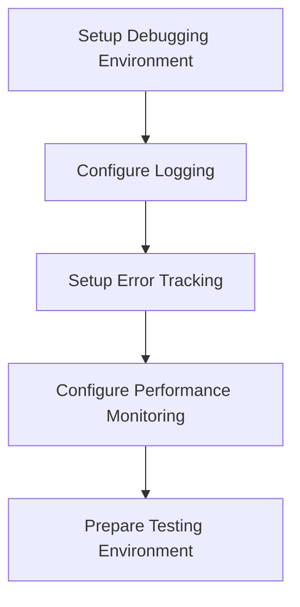
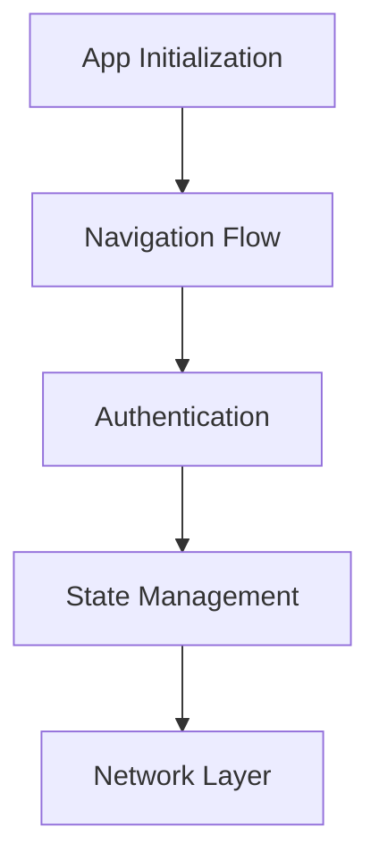
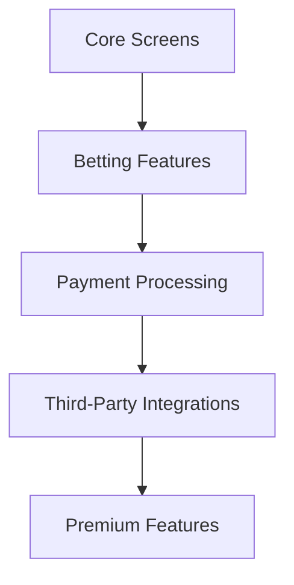
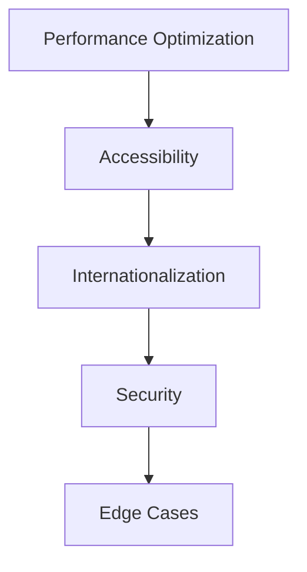
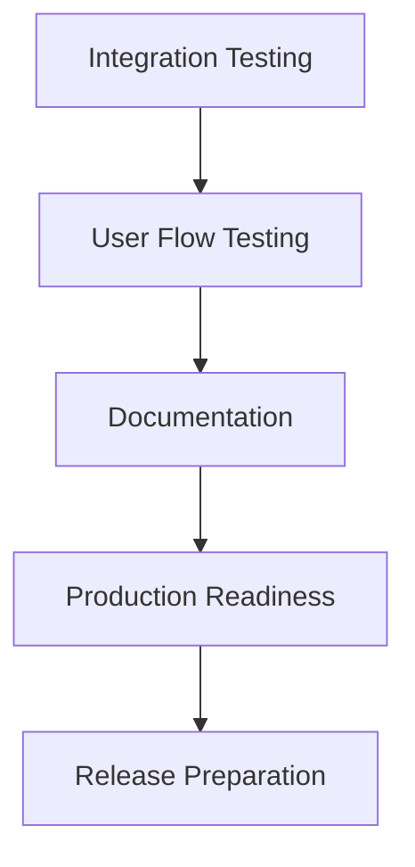

# Comprehensive Debugging Plan for AI Sports Edge App

## Overview

This document outlines a systematic approach to debug the AI Sports Edge app before production launch. The plan is organized into phases that address different aspects of the application, following a methodical workflow to ensure all components are thoroughly tested and optimized.

## Phase 1: Environment and Infrastructure Setup

### 1.1 Setup Debugging Environment
- Create dedicated debugging configuration in VSCode
- Configure source maps for accurate debugging
- Setup React DevTools and React Native Debugger
- Ensure proper TypeScript configuration for debugging

### 1.2 Configure Comprehensive Logging
- Enhance the existing logging service to capture more detailed information
- Implement log levels (DEBUG, INFO, WARN, ERROR, FATAL)
- Add contextual information to logs (user ID, session ID, device info)
- Setup log persistence for offline analysis

### 1.3 Setup Error Tracking
- Complete the fix for circular dependency between loggingService and errorTrackingService
- Configure proper error boundaries throughout the application
- Implement crash reporting with stack traces
- Setup alerts for critical errors

### 1.4 Configure Performance Monitoring
- Setup React performance monitoring
- Configure network request tracking
- Implement UI rendering performance metrics
- Setup memory usage monitoring

### 1.5 Prepare Testing Environment
- Configure Jest for component testing
- Setup E2E testing with Detox
- Prepare test data and mocks

## Phase 2: Core Application Debugging

### 2.1 App Initialization Debugging
- Debug service initialization in App.tsx
- Verify proper loading sequence
- Check for race conditions in initialization
- Validate context providers setup

### 2.2 Navigation Flow Debugging
- Verify navigation stack configuration
- Debug screen transitions and animations
- Check for memory leaks during navigation
- Validate deep linking functionality

### 2.3 Authentication Flow Debugging
- Debug login/logout process
- Verify token management and refresh
- Check session persistence
- Validate security measures

### 2.4 State Management Debugging
- Debug context providers
- Verify state updates and re-renders
- Check for unnecessary re-renders
- Validate data consistency across the app

### 2.5 Network Layer Debugging
- Debug API requests and responses
- Verify error handling for network failures
- Check caching mechanisms
- Validate offline behavior

## Phase 3: Feature-Specific Debugging

### 3.1 Core Screens Debugging
- HomeScreen
  - Verify data loading and display
  - Check performance with large datasets
  - Validate user interactions
- ProfileScreen
  - Debug user data loading and display
  - Verify settings persistence
  - Check account management functions
- GamesScreen
  - Debug game data loading and filtering
  - Verify sorting and search functionality
  - Check performance with many games
- BettingDashboard
  - Verify odds calculations
  - Debug bet placement flow
  - Check historical data display
- Settings screens
  - Verify settings persistence
  - Debug language switching
  - Validate theme changes

### 3.2 Betting Features Debugging
- Odds display and updates
  - Verify real-time updates
  - Check formatting and display
  - Debug odds comparison
- Betting slip functionality
  - Verify bet calculations
  - Debug multi-bet handling
  - Check persistence across sessions
- Parlay integration
  - Debug parlay creation
  - Verify odds calculations
  - Check validation rules
- Historical trends
  - Verify data accuracy
  - Debug chart rendering
  - Check filtering and sorting

### 3.3 Payment Processing Debugging
- Stripe integration
  - Debug payment flow
  - Verify transaction security
  - Check error handling
- Subscription management
  - Debug subscription creation
  - Verify renewal process
  - Check cancellation flow
- Purchase history
  - Verify transaction recording
  - Debug receipt generation
  - Check filtering and sorting
- Tax calculations
  - Verify tax rate application
  - Debug regional tax rules
  - Check tax reporting

### 3.4 Third-Party Integrations Debugging
- Firebase
  - Debug authentication flow
  - Verify database operations
  - Check analytics tracking
  - Validate cloud functions
- FanDuel
  - Debug API integration
  - Verify data synchronization
  - Check error handling
- Geolocation services
  - Debug location detection
  - Verify region-specific content
  - Check compliance with regulations
- Analytics providers
  - Verify event tracking
  - Debug custom events
  - Check data accuracy

### 3.5 Premium Features Debugging
- Subscription-gated content
  - Verify access control
  - Debug premium content loading
  - Check upgrade prompts
- Advanced analytics
  - Debug data processing
  - Verify visualization rendering
  - Check filtering and customization
- Personalized recommendations
  - Debug recommendation algorithm
  - Verify relevance of suggestions
  - Check performance with large datasets
- Referral system
  - Debug referral code generation
  - Verify tracking and attribution
  - Check reward distribution

## Phase 4: Cross-Cutting Concerns

### 4.1 Performance Optimization
- Identify and fix render bottlenecks
  - Use React DevTools Profiler
  - Check for excessive re-renders
  - Optimize component memoization
- Optimize large lists and complex components
  - Implement virtualization for long lists
  - Use lazy loading for heavy components
  - Optimize images and assets
- Reduce bundle size
  - Analyze bundle with source-map-explorer
  - Implement code splitting
  - Remove unused dependencies
- Improve startup time
  - Optimize initialization sequence
  - Defer non-critical operations
  - Implement splash screen optimizations

### 4.2 Accessibility Debugging
- Verify screen reader compatibility
  - Test with VoiceOver and TalkBack
  - Check semantic markup
  - Verify focus management
- Check color contrast
  - Validate against WCAG standards
  - Test in different lighting conditions
  - Verify text readability
- Validate keyboard navigation
  - Test tab order
  - Verify focus indicators
  - Check keyboard shortcuts
- Test dynamic font sizing
  - Verify layout with different font scales
  - Check for text truncation
  - Validate minimum touch targets

### 4.3 Internationalization Debugging
- Verify translations
  - Check for missing translations
  - Validate context-appropriate translations
  - Test with pseudo-localization
- Check RTL layout support
  - Verify layout in RTL languages
  - Test component alignment
  - Check icon and image flipping
- Validate date/time/number formatting
  - Test with different locales
  - Verify currency formatting
  - Check calendar systems
- Test language switching
  - Verify dynamic language changes
  - Check persistence of language preference
  - Test fallback mechanisms

### 4.4 Security Audit
- Check for sensitive data exposure
  - Audit API responses
  - Verify secure storage usage
  - Check log sanitization
- Verify secure storage usage
  - Test encryption of sensitive data
  - Validate token storage
  - Check for data leakage
- Validate input sanitization
  - Test against injection attacks
  - Verify form validation
  - Check URL parameter handling
- Test authentication edge cases
  - Verify session timeout handling
  - Test invalid token scenarios
  - Check multi-device login behavior

### 4.5 Edge Case Handling
- Test offline scenarios
  - Verify offline data access
  - Check synchronization on reconnect
  - Test graceful degradation
- Verify error recovery
  - Test app recovery after crashes
  - Verify state restoration
  - Check error boundary effectiveness
- Check low memory handling
  - Test with memory constraints
  - Verify resource cleanup
  - Check for memory leaks
- Validate background/foreground transitions
  - Test app suspension and resumption
  - Verify data refresh on return
  - Check notification handling

## Phase 5: Final Verification and Documentation

### 5.1 Integration Testing
- Verify all components work together
  - Test component interactions
  - Check data flow between screens
  - Validate state management across the app
- Test end-to-end user flows
  - Verify complete user journeys
  - Check for broken flows
  - Test with real-world scenarios
- Validate data consistency across screens
  - Verify shared data representation
  - Check for synchronization issues
  - Test concurrent updates
- Check for integration issues between features
  - Verify feature interactions
  - Test boundary conditions
  - Check for conflicting behaviors

### 5.2 User Flow Testing
- Test common user journeys
  - Verify onboarding flow
  - Test betting workflow
  - Check subscription process
- Verify error handling from user perspective
  - Test error messages clarity
  - Check recovery options
  - Validate user guidance
- Check for usability issues
  - Test with different user personas
  - Verify intuitive navigation
  - Check for confusion points
- Validate feedback mechanisms
  - Test loading indicators
  - Verify success/error messages
  - Check progress indicators

### 5.3 Documentation
- Document known issues and workarounds
  - Create issue database
  - Document temporary fixes
  - Prioritize remaining issues
- Create debugging guides for common problems
  - Document troubleshooting steps
  - Create debugging checklists
  - Provide sample debugging code
- Document system architecture
  - Create component diagrams
  - Document data flow
  - Describe service interactions
- Prepare troubleshooting guides
  - Document common error scenarios
  - Create step-by-step resolution guides
  - Provide diagnostic tools

### 5.4 Production Readiness Checklist
- Verify all critical bugs are fixed
  - Review bug database
  - Confirm fixes for high-priority issues
  - Validate edge case handling
- Check performance meets requirements
  - Verify startup time
  - Test UI responsiveness
  - Validate network performance
- Validate security measures
  - Verify authentication security
  - Check data protection
  - Test against common vulnerabilities
- Ensure monitoring is in place
  - Verify error tracking configuration
  - Check analytics implementation
  - Test alerting mechanisms

### 5.5 Release Preparation
- Prepare release notes
  - Document new features
  - List fixed issues
  - Highlight known limitations
- Setup staged rollout plan
  - Define rollout phases
  - Create user segment targeting
  - Plan monitoring during rollout
- Configure feature flags
  - Implement toggles for risky features
  - Setup remote configuration
  - Test feature disabling
- Prepare rollback procedures
  - Document rollback steps
  - Test version reversion
  - Create emergency response plan

## Implementation Approach

For each component or feature being debugged:

1. **Analyze**: Review the code for potential issues
   - Examine the component structure
   - Review state management
   - Check for anti-patterns
   - Identify potential bottlenecks

2. **Instrument**: Add logging and debugging code
   - Insert strategic log points
   - Add performance measurements
   - Implement error tracking
   - Create debugging hooks

3. **Test**: Exercise the component with various inputs
   - Test with normal inputs
   - Try edge case values
   - Simulate error conditions
   - Test performance under load

4. **Fix**: Implement solutions for identified issues
   - Refactor problematic code
   - Optimize performance bottlenecks
   - Enhance error handling
   - Improve state management

5. **Verify**: Confirm the fix resolves the issue
   - Retest the component
   - Verify no regressions
   - Check performance improvements
   - Validate error handling

6. **Document**: Record the issue and solution
   - Document the root cause
   - Describe the implemented solution
   - Note any trade-offs made
   - Update debugging guides

## Debugging Tools and Techniques

- **Breakpoints**: Set strategic breakpoints to inspect state
  - Conditional breakpoints for specific scenarios
  - Logpoints for non-intrusive logging
  - Watch expressions for value tracking
  - Exception breakpoints for error catching

- **Logging**: Use enhanced logging for flow tracking
  - Structured logging with context
  - Log levels for filtering
  - Performance timing logs
  - Error details with stack traces

- **React DevTools**: Inspect component hierarchy and props
  - Component tree navigation
  - Props and state inspection
  - Performance profiling
  - Interaction tracking

- **Network Monitoring**: Track API calls and responses
  - Request/response inspection
  - Timing analysis
  - Error tracking
  - Payload examination

- **Performance Profiling**: Identify bottlenecks
  - CPU profiling
  - Memory usage tracking
  - Render timing
  - JavaScript execution analysis

- **Memory Snapshots**: Find memory leaks
  - Heap snapshots
  - Allocation tracking
  - Detached DOM elements detection
  - Reference chain analysis

- **Error Boundaries**: Catch and handle errors gracefully
  - Component-level error catching
  - Fallback UI rendering
  - Error reporting
  - Recovery mechanisms

## Documentation and Tracking

- Maintain a debugging log with issues found and fixed
  - Issue description
  - Root cause analysis
  - Solution implemented
  - Verification steps

- Document patterns and anti-patterns discovered
  - Common error patterns
  - Performance anti-patterns
  - Recommended solutions
  - Best practices

- Create a knowledge base for common issues
  - Searchable issue database
  - Categorized problems
  - Solution templates
  - Troubleshooting guides

- Track debugging progress against the plan
  - Phase completion tracking
  - Issue resolution metrics
  - Performance improvement measurements
  - Quality indicators