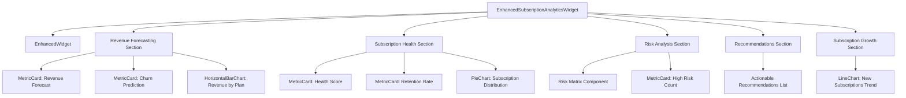

# Enhanced Subscription Analytics Widget Implementation Plan

## Overview

This document outlines the implementation plan for the Enhanced Subscription Analytics widget for the Unified Admin Dashboard. The widget will focus on subscription analytics with revenue forecasting, churn prediction, health scoring, and actionable recommendations.

## Requirements

The Enhanced Subscription Analytics widget will include:

1. **Revenue forecasting and churn prediction**
2. **Subscription health scoring**
3. **Actionable recommendations**
4. **Risk analysis matrix**
5. **Subscription Growth chart** (showing trend of new subscriptions over time)

## Component Structure



## Implementation Steps

### 1. Create the Widget Component File

Create a new file at `src/components/dashboard/widgets/EnhancedSubscriptionAnalyticsWidget.tsx` that will contain the main widget component.

### 2. Implement Mock Data

Create mock data for development that includes:

```typescript
// Mock data structure
interface SubscriptionAnalyticsData {
  revenueForecasting: {
    currentMonthRevenue: number;
    revenueTrend: { direction: TrendDirection; value: string };
    churnRate: number;
    churnRateTrend: { direction: TrendDirection; value: string };
    revenueByPlan: { name: string; value: number }[];
  };
  subscriptionHealth: {
    healthScore: number;
    healthScoreTrend: { direction: TrendDirection; value: string };
    retentionRate: number;
    retentionRateTrend: { direction: TrendDirection; value: string };
    subscriptionDistribution: { name: string; value: number }[];
  };
  riskAnalysis: {
    highRiskCount: number;
    highRiskCountTrend: { direction: TrendDirection; value: string };
    riskMatrix: {
      churnLikelihood: 'low' | 'medium' | 'high';
      impact: 'low' | 'medium' | 'high';
      count: number;
    }[];
  };
  subscriptionGrowth: {
    newSubscriptions: { date: string; count: number }[];
    totalGrowthRate: number;
    growthRateTrend: { direction: TrendDirection; value: string };
  };
  recommendations: {
    id: string;
    priority: 'low' | 'medium' | 'high';
    message: string;
    action: string;
  }[];
}

// Example mock data
const mockData: SubscriptionAnalyticsData = {
  revenueForecasting: {
    currentMonthRevenue: 125750,
    revenueTrend: { direction: 'up', value: '+5.3%' },
    churnRate: 3.2,
    churnRateTrend: { direction: 'down', value: '-0.5%' },
    revenueByPlan: [
      { name: 'Premium Annual', value: 68250 },
      { name: 'Premium Monthly', value: 42500 },
      { name: 'Basic Annual', value: 9500 },
      { name: 'Basic Monthly', value: 5500 },
    ],
  },
  subscriptionHealth: {
    healthScore: 87,
    healthScoreTrend: { direction: 'up', value: '+2.1' },
    retentionRate: 92.5,
    retentionRateTrend: { direction: 'up', value: '+1.2%' },
    subscriptionDistribution: [
      { name: 'Premium Annual', value: 450 },
      { name: 'Premium Monthly', value: 850 },
      { name: 'Basic Annual', value: 190 },
      { name: 'Basic Monthly', value: 275 },
    ],
  },
  riskAnalysis: {
    highRiskCount: 87,
    highRiskCountTrend: { direction: 'down', value: '-12' },
    riskMatrix: [
      { churnLikelihood: 'high', impact: 'high', count: 32 },
      { churnLikelihood: 'high', impact: 'medium', count: 45 },
      { churnLikelihood: 'high', impact: 'low', count: 10 },
      { churnLikelihood: 'medium', impact: 'high', count: 28 },
      { churnLikelihood: 'medium', impact: 'medium', count: 120 },
      { churnLikelihood: 'medium', impact: 'low', count: 95 },
      { churnLikelihood: 'low', impact: 'high', count: 15 },
      { churnLikelihood: 'low', impact: 'medium', count: 210 },
      { churnLikelihood: 'low', impact: 'low', count: 1210 },
    ],
  },
  subscriptionGrowth: {
    newSubscriptions: [
      { date: '2025-04-23', count: 42 },
      { date: '2025-04-24', count: 38 },
      { date: '2025-04-25', count: 45 },
      { date: '2025-04-26', count: 39 },
      { date: '2025-04-27', count: 35 },
      { date: '2025-04-28', count: 52 },
      { date: '2025-04-29', count: 48 },
      { date: '2025-04-30', count: 51 },
      { date: '2025-05-01', count: 55 },
      { date: '2025-05-02', count: 49 },
      { date: '2025-05-03', count: 42 },
      { date: '2025-05-04', count: 40 },
      { date: '2025-05-05', count: 45 },
      { date: '2025-05-06', count: 53 },
      { date: '2025-05-07', count: 58 },
      { date: '2025-05-08', count: 62 },
      { date: '2025-05-09', count: 65 },
      { date: '2025-05-10', count: 59 },
      { date: '2025-05-11', count: 54 },
      { date: '2025-05-12', count: 57 },
      { date: '2025-05-13', count: 63 },
      { date: '2025-05-14', count: 68 },
      { date: '2025-05-15', count: 72 },
      { date: '2025-05-16', count: 75 },
      { date: '2025-05-17', count: 70 },
      { date: '2025-05-18', count: 65 },
      { date: '2025-05-19', count: 68 },
      { date: '2025-05-20', count: 74 },
      { date: '2025-05-21', count: 79 },
      { date: '2025-05-22', count: 82 },
      { date: '2025-05-23', count: 85 },
    ],
    totalGrowthRate: 8.5,
    growthRateTrend: { direction: 'up', value: '+2.3%' },
  },
  recommendations: [
    {
      id: 'rec-001',
      priority: 'high',
      message: 'Contact 32 high-risk premium subscribers at risk of churning',
      action: 'Generate contact list',
    },
    {
      id: 'rec-002',
      priority: 'medium',
      message: 'Offer discounted annual plan to 45 monthly subscribers with high churn risk',
      action: 'Create campaign',
    },
    {
      id: 'rec-003',
      priority: 'medium',
      message: 'Review pricing strategy for Basic Monthly plan with declining conversion',
      action: 'View analysis',
    },
    {
      id: 'rec-004',
      priority: 'low',
      message: 'Consider loyalty rewards for 210 medium-risk subscribers',
      action: 'Plan rewards',
    },
  ],
};
```

### 3. Implement Data Hook

Create a custom hook `useSubscriptionAnalyticsData` that will:

```typescript
const useSubscriptionAnalyticsData = () => {
  const [isLoading, setIsLoading] = React.useState(false);
  const [error, setError] = React.useState<Error | null>(null);
  const [data, setData] = React.useState(mockData);

  const refetch = () => {
    setIsLoading(true);
    // Simulate API call
    setTimeout(() => {
      setData(mockData);
      setIsLoading(false);
    }, 1000);
  };

  return { data, isLoading, error, refetch };
};
```

### 4. Implement Widget Sections

#### Revenue Forecasting Section

```tsx
<div className="revenue-forecasting-section">
  <h4 className="text-lg font-medium mb-3">Revenue Forecasting</h4>
  <div className="grid grid-cols-1 md:grid-cols-3 gap-4">
    <MetricCard
      title="Projected Revenue"
      value={`$${data?.revenueForecasting.currentMonthRevenue.toLocaleString()}`}
      trend={data?.revenueForecasting.revenueTrend}
      status={data?.revenueForecasting.revenueTrend.direction === 'up' ? 'success' : 'warning'}
    />
    <MetricCard
      title="Churn Rate"
      value={`${data?.revenueForecasting.churnRate}%`}
      trend={data?.revenueForecasting.churnRateTrend}
      status={data?.revenueForecasting.churnRateTrend.direction === 'down' ? 'success' : 'error'}
    />
  </div>
  <div className="mt-4">
    <h5 className="text-md font-medium mb-2">Revenue by Plan</h5>
    <HorizontalBarChart data={data?.revenueForecasting.revenueByPlan} />
  </div>
</div>
```

#### Subscription Health Section

```tsx
<div className="subscription-health-section mt-6">
  <h4 className="text-lg font-medium mb-3">Subscription Health</h4>
  <div className="grid grid-cols-1 md:grid-cols-2 gap-4">
    <MetricCard
      title="Health Score"
      value={data?.subscriptionHealth.healthScore}
      target="85+"
      trend={data?.subscriptionHealth.healthScoreTrend}
      status={data?.subscriptionHealth.healthScore >= 85 ? 'success' : 'warning'}
    />
    <MetricCard
      title="Retention Rate"
      value={`${data?.subscriptionHealth.retentionRate}%`}
      target="90%+"
      trend={data?.subscriptionHealth.retentionRateTrend}
      status={data?.subscriptionHealth.retentionRate >= 90 ? 'success' : 'warning'}
    />
  </div>
  <div className="mt-4 grid grid-cols-1 md:grid-cols-2 gap-6">
    <div>
      <h5 className="text-md font-medium mb-2">Subscription Distribution</h5>
      <PieChart data={data?.subscriptionHealth.subscriptionDistribution} />
    </div>
  </div>
</div>
```

#### Risk Analysis Section

Create a new component for the risk matrix:

```tsx
// RiskMatrix.tsx
import React from 'react';

export interface RiskMatrixItem {
  churnLikelihood: 'low' | 'medium' | 'high';
  impact: 'low' | 'medium' | 'high';
  count: number;
}

export interface RiskMatrixProps {
  data: RiskMatrixItem[];
  className?: string;
}

export function RiskMatrix({ data, className = '' }: RiskMatrixProps) {
  // Create a map for easy lookup
  const matrixMap = new Map<string, number>();
  data.forEach(item => {
    matrixMap.set(`${item.churnLikelihood}-${item.impact}`, item.count);
  });

  // Get count for a specific cell
  const getCount = (likelihood: string, impact: string): number => {
    return matrixMap.get(`${likelihood}-${impact}`) || 0;
  };

  // Get color class based on likelihood and impact
  const getCellColorClass = (likelihood: string, impact: string): string => {
    if (likelihood === 'high' && impact === 'high')
      return 'bg-red-100 dark:bg-red-900/20 text-red-800 dark:text-red-200';
    if (likelihood === 'high' || impact === 'high')
      return 'bg-orange-100 dark:bg-orange-900/20 text-orange-800 dark:text-orange-200';
    if (likelihood === 'medium' && impact === 'medium')
      return 'bg-yellow-100 dark:bg-yellow-900/20 text-yellow-800 dark:text-yellow-200';
    return 'bg-green-100 dark:bg-green-900/20 text-green-800 dark:text-green-200';
  };

  return (
    <div className={`risk-matrix ${className}`}>
      <div className="grid grid-cols-4 gap-1">
        {/* Header row */}
        <div className="p-2 font-medium text-center"></div>
        <div className="p-2 font-medium text-center">Low Impact</div>
        <div className="p-2 font-medium text-center">Medium Impact</div>
        <div className="p-2 font-medium text-center">High Impact</div>

        {/* High likelihood row */}
        <div className="p-2 font-medium text-right">High Likelihood</div>
        <div className={`p-3 text-center rounded ${getCellColorClass('high', 'low')}`}>
          {getCount('high', 'low')}
        </div>
        <div className={`p-3 text-center rounded ${getCellColorClass('high', 'medium')}`}>
          {getCount('high', 'medium')}
        </div>
        <div className={`p-3 text-center rounded ${getCellColorClass('high', 'high')}`}>
          {getCount('high', 'high')}
        </div>

        {/* Medium likelihood row */}
        <div className="p-2 font-medium text-right">Medium Likelihood</div>
        <div className={`p-3 text-center rounded ${getCellColorClass('medium', 'low')}`}>
          {getCount('medium', 'low')}
        </div>
        <div className={`p-3 text-center rounded ${getCellColorClass('medium', 'medium')}`}>
          {getCount('medium', 'medium')}
        </div>
        <div className={`p-3 text-center rounded ${getCellColorClass('medium', 'high')}`}>
          {getCount('medium', 'high')}
        </div>

        {/* Low likelihood row */}
        <div className="p-2 font-medium text-right">Low Likelihood</div>
        <div className={`p-3 text-center rounded ${getCellColorClass('low', 'low')}`}>
          {getCount('low', 'low')}
        </div>
        <div className={`p-3 text-center rounded ${getCellColorClass('low', 'medium')}`}>
          {getCount('low', 'medium')}
        </div>
        <div className={`p-3 text-center rounded ${getCellColorClass('low', 'high')}`}>
          {getCount('low', 'high')}
        </div>
      </div>
    </div>
  );
}
```

Use the RiskMatrix component in the widget:

```tsx
<div className="risk-analysis-section mt-6">
  <h4 className="text-lg font-medium mb-3">Risk Analysis</h4>
  <div className="grid grid-cols-1 md:grid-cols-3 gap-4">
    <MetricCard
      title="High Risk Subscribers"
      value={data?.riskAnalysis.highRiskCount}
      trend={data?.riskAnalysis.highRiskCountTrend}
      status={data?.riskAnalysis.highRiskCountTrend.direction === 'down' ? 'success' : 'error'}
    />
  </div>
  <div className="mt-4">
    <h5 className="text-md font-medium mb-2">Subscriber Risk Matrix</h5>
    <RiskMatrix data={data?.riskAnalysis.riskMatrix} />
  </div>
</div>
```

#### Recommendations Section

Create a component for the recommendations list:

```tsx
// RecommendationsList.tsx
import React from 'react';

export interface Recommendation {
  id: string;
  priority: 'low' | 'medium' | 'high';
  message: string;
  action: string;
}

export interface RecommendationsListProps {
  recommendations: Recommendation[];
  onActionClick: (id: string, action: string) => void;
  className?: string;
}

export function RecommendationsList({
  recommendations,
  onActionClick,
  className = '',
}: RecommendationsListProps) {
  // Get priority color class
  const getPriorityColorClass = (priority: string): string => {
    switch (priority) {
      case 'high':
        return 'border-red-500 bg-red-50 dark:bg-red-900/20';
      case 'medium':
        return 'border-yellow-500 bg-yellow-50 dark:bg-yellow-900/20';
      case 'low':
        return 'border-blue-500 bg-blue-50 dark:bg-blue-900/20';
      default:
        return 'border-gray-500 bg-gray-50 dark:bg-gray-900/20';
    }
  };

  return (
    <div className={`recommendations-list ${className}`}>
      {recommendations.map(recommendation => (
        <div
          key={recommendation.id}
          className={`recommendation-item p-3 mb-2 rounded-lg border-l-4 ${getPriorityColorClass(
            recommendation.priority
          )}`}
        >
          <div className="flex justify-between">
            <div className="recommendation-details">
              <p className="recommendation-message font-medium">{recommendation.message}</p>
            </div>
            <div className="recommendation-actions">
              <button
                onClick={() => onActionClick(recommendation.id, recommendation.action)}
                className="text-sm px-2 py-1 bg-blue-500 text-white rounded hover:bg-blue-600"
              >
                {recommendation.action}
              </button>
            </div>
          </div>
        </div>
      ))}
    </div>
  );
}
```

Use the RecommendationsList component in the widget:

```tsx
<div className="recommendations-section mt-6">
  <h4 className="text-lg font-medium mb-3">Recommended Actions</h4>
  <RecommendationsList
    recommendations={data?.recommendations}
    onActionClick={(id, action) => {
      console.log(`Action ${action} clicked for recommendation ${id}`);
      // This would be replaced with actual action handling
    }}
  />
</div>
```

### 5. Implement Main Widget Component

```tsx
import React from 'react';
import { EnhancedWidget } from './EnhancedWidget';
import { MetricCard } from '../metrics/MetricCard';
import { HorizontalBarChart } from '../charts/HorizontalBarChart';
import { PieChart } from '../charts/PieChart';
import { RiskMatrix } from './RiskMatrix';
import { RecommendationsList } from './RecommendationsList';
import { TrendDirection } from '../metrics/MetricCard';

// Mock data and interfaces defined here...

// Custom hook for data fetching
const useSubscriptionAnalyticsData = () => {
  // Implementation as described above...
};

export function EnhancedSubscriptionAnalyticsWidget() {
  const { data, isLoading, error, refetch } = useSubscriptionAnalyticsData();

  const handleRecommendationAction = (id: string, action: string) => {
    console.log(`Action ${action} clicked for recommendation ${id}`);
    // This would be replaced with actual action handling
  };

  return (
    <EnhancedWidget
      title="💰 Subscription Analytics"
      subtitle="Last 30 days"
      size="large"
      isLoading={isLoading}
      error={error}
      onRefresh={refetch}
      footer={
        <a href="/analytics/subscriptions" className="text-blue-500 hover:underline text-sm">
          View detailed subscription analytics
        </a>
      }
    >
      <div className="space-y-6">
        {/* Revenue Forecasting Section */}
        {/* Implementation as described above */}

        {/* Subscription Health Section */}
        {/* Implementation as described above */}

        {/* Risk Analysis Section */}
        {/* Implementation as described above */}

        {/* Recommendations Section */}
        {/* Implementation as described above */}
      </div>
    </EnhancedWidget>
  );
}
```

### 6. Update AdminDashboard Component

Update the `AdminDashboard.tsx` file to replace the placeholder with the new EnhancedSubscriptionAnalyticsWidget component:

```tsx
import React from 'react';
import { BetSlipPerformanceWidget } from './widgets/BetSlipPerformanceWidget';
import { EnhancedSubscriptionAnalyticsWidget } from './widgets/EnhancedSubscriptionAnalyticsWidget';

export interface AdminDashboardProps {
  className?: string;
}

export function AdminDashboard({ className = '' }: AdminDashboardProps) {
  return (
    <div className={`admin-dashboard ${className}`}>
      <header className="dashboard-header mb-6">
        <h1 className="text-2xl font-bold text-gray-900 dark:text-white">Admin Dashboard</h1>
        <p className="text-gray-500 dark:text-gray-400">Monitor system performance and analytics</p>
      </header>

      <div className="dashboard-grid grid grid-cols-1 md:grid-cols-4 gap-6">
        {/* Phase 1: Core Monitoring Enhancement */}
        <BetSlipPerformanceWidget />
        <EnhancedSubscriptionAnalyticsWidget />

        {/* Placeholder for System Health Monitoring */}
        <div className="col-span-1 md:col-span-2 bg-gray-100 dark:bg-gray-800 rounded-lg p-6 h-96 flex items-center justify-center">
          <p className="text-gray-500 dark:text-gray-400">
            System Health Monitoring Widget (Coming Soon)
          </p>
        </div>

        {/* Phase 2 & 3 Placeholders */}
        <div className="col-span-1 md:col-span-4 bg-gray-100 dark:bg-gray-800 rounded-lg p-6 h-48 flex items-center justify-center">
          <p className="text-gray-500 dark:text-gray-400">Phase 2 & 3 Features Coming Soon</p>
        </div>
      </div>
    </div>
  );
}
```

## Interaction Details

As per your feedback, we'll keep interactions simple with just tooltips on hover. We'll use the existing Tooltip component for this purpose:

```tsx
<Tooltip content="Projected revenue for the current month">
  <MetricCard
    title="Projected Revenue"
    value={`$${data?.revenueForecasting.currentMonthRevenue.toLocaleString()}`}
    trend={data?.revenueForecasting.revenueTrend}
    status={data?.revenueForecasting.revenueTrend.direction === 'up' ? 'success' : 'warning'}
  />
</Tooltip>
```

## Color Scheme

We'll use the existing color scheme from the BetSlipPerformanceWidget for consistency:

- Success: Green (#10B981)
- Warning: Yellow (#F59E0B)
- Error: Red (#EF4444)
- Neutral: Blue (#3B82F6)

For the risk matrix, we'll use a gradient of colors based on risk level:

- High risk + High impact: Red
- Medium risk or impact: Yellow/Orange
- Low risk + Low impact: Green

## Next Steps

1. Implement the EnhancedSubscriptionAnalyticsWidget component
2. Create the RiskMatrix component
3. Create the RecommendationsList component
4. Update the AdminDashboard component
5. Test the widget with mock data
6. Integrate with real API data when available
