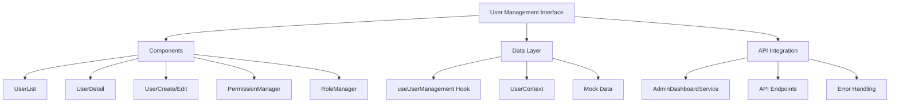
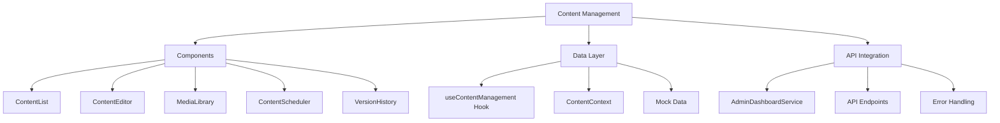
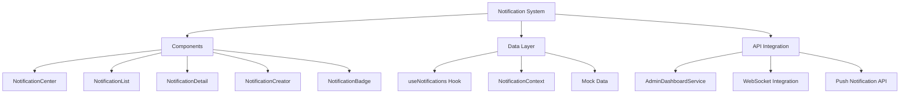
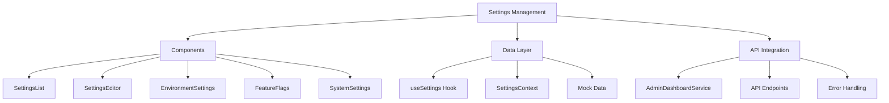

# Detailed Implementation Plan for Unified Admin Dashboard Phase 2

Based on my analysis of the current project state, I'll outline a comprehensive plan for implementing the remaining components of Phase 2 of the Unified Admin Dashboard. We've already successfully completed the dashboard analytics widgets, and now we need to focus on:

1. User Management Interface
2. Content Management Components
3. Notification System
4. Settings Management Interface

## 1. User Management Interface Implementation

I see we've already started with the type definitions for user management. Let's build on this foundation.

### Architecture Overview

### Implementation Steps

1. **Data Layer**

   - Create `useUserManagement` hook for data fetching with SWR
   - Implement mock data for development and testing
   - Add user management methods to AdminDashboardService

2. **Components**

   - Create `UserList` component with filtering, sorting, and pagination
   - Implement `UserDetail` component for viewing user details
   - Build `UserCreate/Edit` component for user management
   - Develop `PermissionManager` component for managing user permissions
   - Create `RoleManager` component for role-based access control

3. **Pages**

   - Create `/admin/users` page for user listing
   - Implement `/admin/users/[id]` page for user details
   - Build `/admin/users/create` page for creating new users
   - Develop `/admin/roles` page for role management

4. **Integration**
   - Connect with existing authentication system
   - Implement role-based access control
   - Add audit logging for user management actions

## 2. Content Management Components

### Architecture Overview

### Implementation Steps

1. **Data Layer**

   - Create content management types in `src/types/contentManagement.ts`
   - Implement `useContentManagement` hook for data fetching
   - Add mock data for development and testing
   - Add content management methods to AdminDashboardService

2. **Components**

   - Create `ContentList` component with filtering and search
   - Implement `ContentEditor` component with rich text editing
   - Build `MediaLibrary` component for managing images and media
   - Develop `ContentScheduler` for scheduling content publication
   - Create `VersionHistory` component for tracking content changes

3. **Pages**

   - Create `/admin/content` page for content listing
   - Implement `/admin/content/[id]` page for content editing
   - Build `/admin/content/create` page for creating new content
   - Develop `/admin/media` page for media management

4. **Integration**
   - Connect with existing content storage system
   - Implement content workflow (draft, review, publish)
   - Add preview functionality for content

## 3. Notification System

### Architecture Overview

### Implementation Steps

1. **Data Layer**

   - Create notification types in `src/types/notifications.ts`
   - Implement `useNotifications` hook for data fetching
   - Add mock data for development and testing
   - Add notification methods to AdminDashboardService

2. **Components**

   - Create `NotificationCenter` component for managing notifications
   - Implement `NotificationList` component for displaying notifications
   - Build `NotificationDetail` component for viewing notification details
   - Develop `NotificationCreator` for creating and sending notifications
   - Create `NotificationBadge` component for displaying notification counts

3. **Real-time Integration**

   - Implement WebSocket connection for real-time notifications
   - Add support for push notifications
   - Create notification templates for different types of notifications

4. **Integration**
   - Connect with existing OneSignal notification system
   - Implement notification preferences
   - Add notification analytics

## 4. Settings Management Interface

### Architecture Overview

### Implementation Steps

1. **Data Layer**

   - Create settings types in `src/types/settings.ts`
   - Implement `useSettings` hook for data fetching
   - Add mock data for development and testing
   - Add settings management methods to AdminDashboardService

2. **Components**

   - Create `SettingsList` component for displaying settings categories
   - Implement `SettingsEditor` component for editing settings
   - Build `EnvironmentSettings` for managing environment variables
   - Develop `FeatureFlags` component for managing feature flags
   - Create `SystemSettings` component for system-wide settings

3. **Pages**

   - Create `/admin/settings` page for settings management
   - Implement `/admin/settings/[category]` page for category-specific settings
   - Build `/admin/feature-flags` page for feature flag management

4. **Integration**
   - Implement settings validation
   - Add audit logging for settings changes
   - Create backup/restore functionality for settings

## Implementation Timeline

1. **Week 1 (May 24-30, 2025)**

   - Implement User Management Interface
   - Begin Notification System implementation

2. **Week 2 (May 31-June 6, 2025)**

   - Complete Notification System
   - Begin Content Management Components

3. **Week 3 (June 7-13, 2025)**
   - Complete Content Management Components
   - Implement Settings Management Interface
   - Integration testing and bug fixes

## Technical Considerations

1. **Consistent Design Pattern**

   - Follow the same pattern used for dashboard analytics widgets
   - Use SWR for data fetching with caching
   - Implement mock data for development and testing
   - Follow atomic design principles

2. **Performance Optimization**

   - Implement virtualization for long lists
   - Use pagination for large datasets
   - Optimize component rendering

3. **Security Considerations**

   - Implement role-based access control
   - Add audit logging for sensitive operations
   - Validate all user inputs

4. **Testing Strategy**
   - Unit tests for individual components
   - Integration tests for component interactions
   - End-to-end tests for critical workflows
