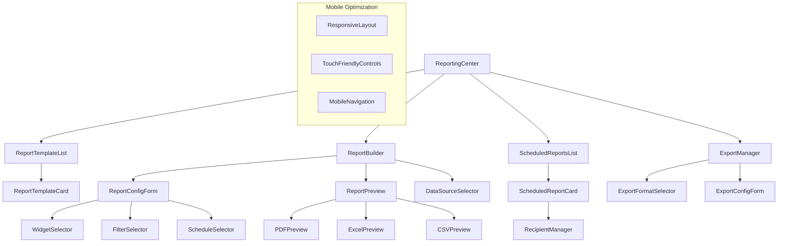
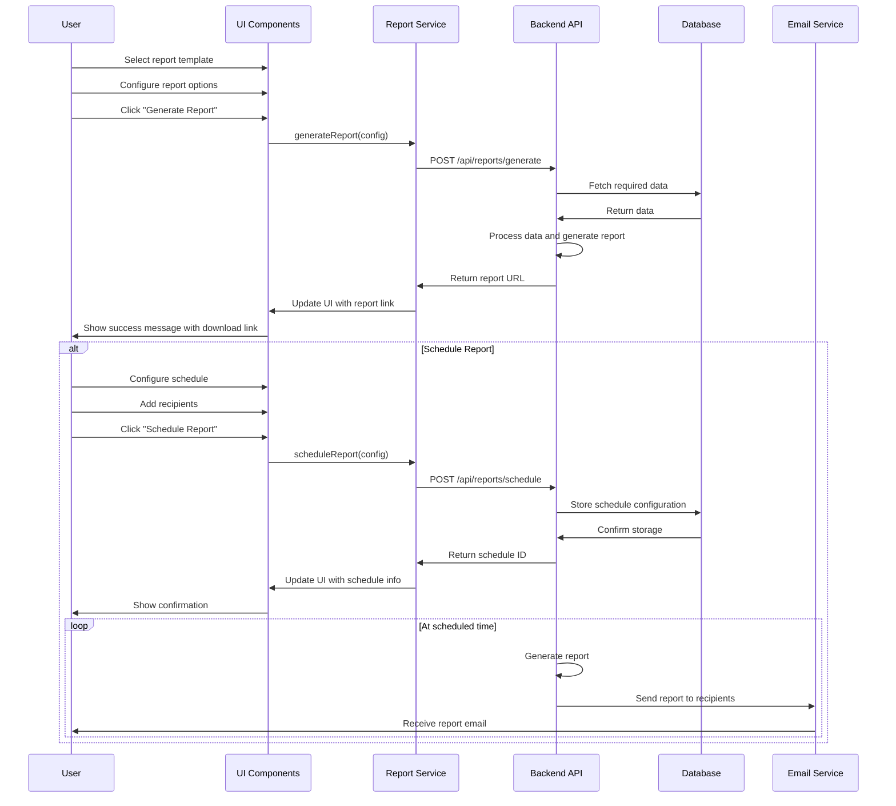
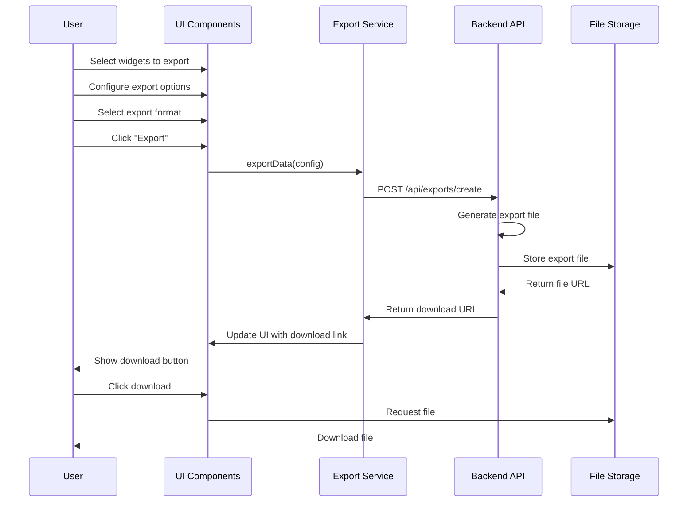

# Unified Admin Dashboard - Phase 3: Reporting & Automation

## Table of Contents

1. [Component Architecture](#1-component-architecture)
   - [1.1 Core Components](#11-core-components)
   - [1.2 Component Interfaces](#12-component-interfaces)
   - [1.3 Mobile-Optimized Components](#13-mobile-optimized-components)
2. [Data Flow](#2-data-flow)
   - [2.1 Report Generation Flow](#21-report-generation-flow)
   - [2.2 Export Flow](#22-export-flow)
3. [API Design](#3-api-design)
   - [3.1 New API Endpoints](#31-new-api-endpoints)
   - [3.2 API Response Types](#32-api-response-types)
4. [Mobile Optimization Strategy](#4-mobile-optimization-strategy)
   - [4.1 Responsive Design Approach](#41-responsive-design-approach)
   - [4.2 Mobile-Specific Components](#42-mobile-specific-components)
5. [Integration with Existing Components](#5-integration-with-existing-components)
   - [5.1 Widget Integration](#51-widget-integration)
   - [5.2 Service Integration](#52-service-integration)
6. [Implementation Plan](#6-implementation-plan)
   - [6.1 Phase Breakdown](#61-phase-breakdown)
   - [6.2 Dependencies and Priorities](#62-dependencies-and-priorities)
7. [Technical Considerations](#7-technical-considerations)

## 1. Component Architecture

### 1.1 Core Components



### 1.2 Component Interfaces

#### ReportingCenter

```typescript
interface ReportingCenterProps {
  activeTab?: 'templates' | 'builder' | 'scheduled' | 'exports';
  onTabChange?: (tab: string) => void;
}
```

#### ReportTemplateList

```typescript
interface ReportTemplateListProps {
  templates: ReportTemplate[];
  onSelect: (template: ReportTemplate) => void;
  onEdit: (template: ReportTemplate) => void;
  onDelete: (templateId: string) => void;
  onCreateNew: () => void;
}

interface ReportTemplate {
  id: string;
  name: string;
  description: string;
  type: 'betSlip' | 'subscription' | 'system' | 'conversion' | 'custom';
  widgets: string[]; // IDs of widgets to include
  filters: ReportFilter[];
  schedule?: ReportSchedule;
  lastGenerated?: string; // ISO date string
  createdBy: string;
  createdAt: string;
  updatedAt: string;
}

interface ReportFilter {
  field: string;
  operator: 'equals' | 'contains' | 'greaterThan' | 'lessThan' | 'between';
  value: any;
}
```

#### ReportBuilder

```typescript
interface ReportBuilderProps {
  initialTemplate?: ReportTemplate;
  onSave: (template: ReportTemplate) => void;
  onCancel: () => void;
  onPreview: (template: ReportTemplate) => void;
  availableWidgets: WidgetDefinition[];
  availableDataSources: DataSource[];
}

interface WidgetDefinition {
  id: string;
  name: string;
  type: 'metric' | 'chart' | 'table' | 'list';
  dataSource: string;
  previewImage: string;
}

interface DataSource {
  id: string;
  name: string;
  description: string;
  fields: DataSourceField[];
}

interface DataSourceField {
  name: string;
  type: 'string' | 'number' | 'date' | 'boolean';
  filterable: boolean;
  sortable: boolean;
}
```

#### ScheduledReportsList

```typescript
interface ScheduledReportsListProps {
  reports: ScheduledReport[];
  onEdit: (report: ScheduledReport) => void;
  onDelete: (reportId: string) => void;
  onPause: (reportId: string) => void;
  onResume: (reportId: string) => void;
  onRunNow: (reportId: string) => void;
}

interface ScheduledReport {
  id: string;
  templateId: string;
  templateName: string;
  schedule: ReportSchedule;
  recipients: Recipient[];
  status: 'active' | 'paused' | 'failed';
  lastRun?: string;
  nextRun?: string;
  createdBy: string;
}

interface ReportSchedule {
  frequency: 'daily' | 'weekly' | 'monthly' | 'custom';
  dayOfWeek?: number; // 0-6, Sunday to Saturday
  dayOfMonth?: number; // 1-31
  time: string; // HH:MM in 24-hour format
  timezone: string;
}

interface Recipient {
  id: string;
  type: 'email' | 'slack' | 'teams';
  destination: string;
  name?: string;
}
```

#### ExportManager

```typescript
interface ExportManagerProps {
  availableFormats: ExportFormat[];
  onExport: (config: ExportConfig) => void;
  recentExports: ExportHistory[];
}

interface ExportFormat {
  id: string;
  name: string;
  extension: string;
  icon: string;
}

interface ExportConfig {
  format: string;
  widgets: string[];
  filters: ReportFilter[];
  includeRawData: boolean;
  includeBranding: boolean;
}

interface ExportHistory {
  id: string;
  format: string;
  timestamp: string;
  fileSize: number;
  downloadUrl: string;
  expiresAt: string;
}
```

### 1.3 Mobile-Optimized Components

```typescript
interface ResponsiveLayoutProps {
  breakpoints: {
    xs: number;
    sm: number;
    md: number;
    lg: number;
    xl: number;
  };
  children: React.ReactNode;
}

interface TouchFriendlyControlsProps {
  size?: 'small' | 'medium' | 'large';
  spacing?: 'compact' | 'normal' | 'spacious';
  children: React.ReactNode;
}

interface MobileNavigationProps {
  items: {
    id: string;
    label: string;
    icon: string;
    href: string;
  }[];
  activeItem: string;
  onItemClick: (itemId: string) => void;
}
```

## 2. Data Flow

### 2.1 Report Generation Flow



### 2.2 Export Flow



## 3. API Design

### 3.1 New API Endpoints

#### Reports API

```typescript
// AdminDashboardService extension for reports
class ReportingService extends AdminDashboardService {
  // Get available report templates
  static async getReportTemplates(): Promise<ReportTemplate[]> {
    return this.request('/api/reports/templates');
  }

  // Get a specific report template
  static async getReportTemplate(id: string): Promise<ReportTemplate> {
    return this.request(`/api/reports/templates/${id}`);
  }

  // Create a new report template
  static async createReportTemplate(template: Omit<ReportTemplate, 'id'>): Promise<ReportTemplate> {
    return this.request('/api/reports/templates', {
      method: 'POST',
      body: JSON.stringify(template),
    });
  }

  // Update an existing report template
  static async updateReportTemplate(template: ReportTemplate): Promise<ReportTemplate> {
    return this.request(`/api/reports/templates/${template.id}`, {
      method: 'PUT',
      body: JSON.stringify(template),
    });
  }

  // Delete a report template
  static async deleteReportTemplate(id: string): Promise<boolean> {
    return this.request(`/api/reports/templates/${id}`, {
      method: 'DELETE',
    });
  }

  // Generate a report from a template
  static async generateReport(
    templateId: string,
    options?: ReportGenerationOptions
  ): Promise<ReportResult> {
    return this.request('/api/reports/generate', {
      method: 'POST',
      body: JSON.stringify({ templateId, options }),
    });
  }

  // Get scheduled reports
  static async getScheduledReports(): Promise<ScheduledReport[]> {
    return this.request('/api/reports/scheduled');
  }

  // Schedule a report
  static async scheduleReport(config: ScheduleReportConfig): Promise<ScheduledReport> {
    return this.request('/api/reports/schedule', {
      method: 'POST',
      body: JSON.stringify(config),
    });
  }

  // Update a scheduled report
  static async updateScheduledReport(report: ScheduledReport): Promise<ScheduledReport> {
    return this.request(`/api/reports/scheduled/${report.id}`, {
      method: 'PUT',
      body: JSON.stringify(report),
    });
  }

  // Delete a scheduled report
  static async deleteScheduledReport(id: string): Promise<boolean> {
    return this.request(`/api/reports/scheduled/${id}`, {
      method: 'DELETE',
    });
  }

  // Pause a scheduled report
  static async pauseScheduledReport(id: string): Promise<boolean> {
    return this.request(`/api/reports/scheduled/${id}/pause`, {
      method: 'POST',
    });
  }

  // Resume a scheduled report
  static async resumeScheduledReport(id: string): Promise<boolean> {
    return this.request(`/api/reports/scheduled/${id}/resume`, {
      method: 'POST',
    });
  }

  // Run a scheduled report immediately
  static async runScheduledReport(id: string): Promise<ReportResult> {
    return this.request(`/api/reports/scheduled/${id}/run`, {
      method: 'POST',
    });
  }
}
```

#### Exports API

```typescript
// AdminDashboardService extension for exports
class ExportService extends AdminDashboardService {
  // Get available export formats
  static async getExportFormats(): Promise<ExportFormat[]> {
    return this.request('/api/exports/formats');
  }

  // Export data
  static async exportData(config: ExportConfig): Promise<ExportResult> {
    return this.request('/api/exports/create', {
      method: 'POST',
      body: JSON.stringify(config),
    });
  }

  // Get export history
  static async getExportHistory(): Promise<ExportHistory[]> {
    return this.request('/api/exports/history');
  }

  // Delete an export
  static async deleteExport(id: string): Promise<boolean> {
    return this.request(`/api/exports/${id}`, {
      method: 'DELETE',
    });
  }
}
```

### 3.2 API Response Types

```typescript
interface ReportGenerationOptions {
  filters?: ReportFilter[];
  format?: string;
  includeRawData?: boolean;
}

interface ReportResult {
  id: string;
  url: string;
  format: string;
  expiresAt: string;
  fileSize: number;
}

interface ScheduleReportConfig {
  templateId: string;
  schedule: ReportSchedule;
  recipients: Recipient[];
  options?: ReportGenerationOptions;
}

interface ExportResult {
  id: string;
  url: string;
  format: string;
  expiresAt: string;
  fileSize: number;
}
```

## 4. Mobile Optimization Strategy

### 4.1 Responsive Design Approach

1. **Mobile-First Design**

   - Design all components for mobile first, then enhance for larger screens
   - Use CSS Grid and Flexbox for responsive layouts
   - Implement breakpoints for different device sizes

2. **Touch-Friendly Controls**

   - Increase touch target sizes (minimum 44x44px)
   - Add appropriate spacing between interactive elements
   - Implement swipe gestures for common actions

3. **Optimized Navigation**

   - Create a mobile-specific navigation menu
   - Use bottom navigation for primary actions
   - Implement collapsible sections for complex forms

4. **Performance Optimizations**
   - Lazy load components and data
   - Optimize images and assets for mobile
   - Implement virtualized lists for long data sets

### 4.2 Mobile-Specific Components

1. **MobileReportViewer**

   - Optimized for viewing reports on small screens
   - Pinch-to-zoom functionality
   - Swipe navigation between report pages

2. **MobileExportSelector**

   - Simplified export options for mobile
   - Quick export presets
   - Progress indicators for export generation

3. **MobileScheduleManager**
   - Simplified scheduling interface
   - Mobile-optimized date and time pickers
   - Quick recipient selection

## 5. Integration with Existing Components

### 5.1 Widget Integration

The reporting system will integrate with existing dashboard widgets:

1. **BetSlipPerformanceWidget**

   - Add "Export" button to widget header
   - Implement report template generation from widget configuration
   - Create predefined report templates for bet slip performance

2. **EnhancedSubscriptionAnalyticsWidget**

   - Add "Export" button to widget header
   - Implement report template generation from widget configuration
   - Create predefined report templates for subscription analytics

3. **SystemHealthMonitoringWidget**

   - Add "Export" button to widget header
   - Implement report template generation from widget configuration
   - Create predefined report templates for system health monitoring

4. **ConversionFunnelWidget**
   - Add "Export" button to widget header
   - Implement report template generation from widget configuration
   - Create predefined report templates for conversion funnel analysis

### 5.2 Service Integration

1. **AdminDashboardService**

   - Extend with ReportingService and ExportService
   - Implement shared authentication and error handling
   - Reuse existing data fetching mechanisms

2. **WebSocketConnection**
   - Add real-time updates for report generation status
   - Implement notifications for scheduled report completion
   - Add real-time updates for export status

## 6. Implementation Plan

### 6.1 Phase Breakdown

#### Week 1: Core Reporting Framework

1. **Day 1-2: Setup and Base Components**

   - Create ReportingCenter component
   - Implement ReportTemplateList and ReportTemplateCard
   - Set up API service extensions

2. **Day 3-4: Report Builder**

   - Implement ReportBuilder component
   - Create DataSourceSelector and WidgetSelector
   - Implement FilterSelector

3. **Day 5: Report Preview**
   - Create ReportPreview component
   - Implement preview rendering for different formats
   - Add report generation functionality

#### Week 2: Export and Mobile Optimization

1. **Day 1-2: Export Functionality**

   - Implement ExportManager component
   - Create ExportFormatSelector and ExportConfigForm
   - Add export history tracking

2. **Day 3-5: Mobile Optimization**
   - Implement ResponsiveLayout component
   - Create TouchFriendlyControls
   - Implement MobileNavigation
   - Test and optimize for various device sizes

#### Week 3: Scheduled Reports and Integration

1. **Day 1-2: Scheduled Reports**

   - Implement ScheduledReportsList and ScheduledReportCard
   - Create ScheduleSelector component
   - Implement RecipientManager

2. **Day 3-4: Widget Integration**

   - Add export functionality to existing widgets
   - Create predefined report templates
   - Implement widget-specific export options

3. **Day 5: Testing and Refinement**
   - Comprehensive testing across devices
   - Performance optimization
   - Bug fixes and refinements

### 6.2 Dependencies and Priorities

1. **Critical Path Components:**

   - ReportingCenter (high priority)
   - ReportBuilder (high priority)
   - ExportManager (high priority)
   - ResponsiveLayout (high priority)

2. **Secondary Components:**

   - ScheduledReportsList (medium priority)
   - ReportPreview (medium priority)
   - MobileNavigation (medium priority)

3. **Nice-to-Have Components:**
   - Advanced filtering options (low priority)
   - Custom branding for reports (low priority)
   - Advanced scheduling options (low priority)

## 7. Technical Considerations

1. **Performance**

   - Implement lazy loading for report components
   - Use virtualized lists for large data sets
   - Optimize report generation for large data volumes

2. **Security**

   - Ensure proper authentication for all report and export endpoints
   - Implement rate limiting for report generation
   - Add expiration for generated reports and exports

3. **Scalability**

   - Design report generation to be processed asynchronously
   - Implement queuing for scheduled reports
   - Use cloud storage for report files

4. **Accessibility**

   - Ensure all components meet WCAG 2.1 AA standards
   - Implement keyboard navigation
   - Add screen reader support

5. **Cross-Browser Compatibility**
   - Test on Chrome, Firefox, Safari, and Edge
   - Ensure mobile compatibility with iOS and Android browsers
