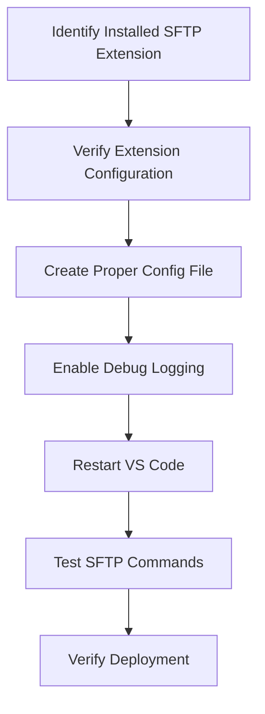

# Plan to Fix SFTP Deployment Issues in VS Code

## Current Situation Analysis

1. **Extension Status**: Recently downloaded Natizyskunk's SFTP extension
2. **Configuration Location**: Configuration file at `vscode-sftp-deploy/.vscode/sftp.json`
3. **Issue**: The "Upload Folder" command is missing from the context menu
4. **Goal**: Enable reliable SFTP-based uploads to `/public_html/aisportsedge.app/`

## Root Causes & Solutions

The issues are likely caused by:
1. Configuration file in the wrong location
2. Incorrect configuration format for the Natizyskunk extension
3. Missing debug logging to identify specific issues
4. VS Code might need to be restarted after configuration changes

## Detailed Implementation Plan



### Phase 1: Identify & Verify Extension

1. **Confirm Extension Details**
   - Check the exact extension ID and version
   - Verify it's properly installed and activated
   - Review the extension's documentation for correct configuration format

2. **Examine Current Configuration**
   - Check if the configuration is in the correct location
   - Verify the configuration format matches what the extension expects

### Phase 2: Create Proper Configuration

1. **Create `.vscode/sftp.json` in Project Root**
   - This is the standard location where the extension looks for configuration
   - Use the correct format for Natizyskunk's extension

2. **Configure with Proper Settings**
   ```json
   {
     "name": "AI Sports Edge",
     "host": "aisportsedge.app",
     "protocol": "sftp",
     "port": 22,
     "username": "deploy",
     "password": "hTQ3LQ]#P(b,",
     "remotePath": "/home/q15133yvmhnq/public_html/aisportsedge.app",
     "uploadOnSave": false,
     "ignore": [".vscode", ".git", ".DS_Store", "node_modules"],
     "context": "./build"
   }
   ```

3. **Key Configuration Changes**
   - Set `context` to `./build` to specify the local folder to upload
   - Ensure `remotePath` points to the correct destination
   - Set `uploadOnSave` to `false` to prevent automatic uploads

### Phase 3: Enable Debug Logging

1. **Add Debug Settings to VS Code**
   - Add to VS Code settings.json:
   ```json
   "sftp.debug": true
   ```

2. **Check Output Panel**
   - Open Output panel (View > Output)
   - Select "SFTP" from the dropdown
   - Monitor for error messages during operations

### Phase 4: Test & Verify

1. **Restart VS Code**
   - Completely close and reopen VS Code
   - This ensures all configuration changes are applied

2. **Test SFTP Commands**
   - Press Cmd+Shift+P to open command palette
   - Search for "SFTP: Upload"
   - Try both "SFTP: Upload Active File" and "SFTP: Upload Folder"

3. **Verify Deployment**
   - Check if files are properly uploaded to the server
   - Verify the website works correctly after deployment

## Fallback Options

If the above steps don't resolve the issue:

1. **Alternative Command Usage**
   - Use command palette (Cmd+Shift+P) instead of context menu
   - Try "SFTP: Upload Folder" from the command palette

2. **Alternative Extension**
   - Consider installing a different SFTP extension if Natizyskunk's doesn't work
   - Options include "SFTP" by liximomo (older but stable) or "Remote - SSH" by Microsoft

3. **CLI-Based Deployment**
   - Use the existing script-based deployment as a fallback
   - Modify the scripts to use environment variables for credentials