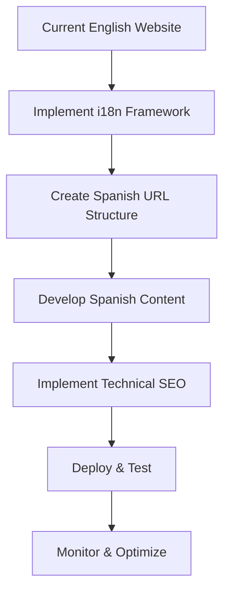
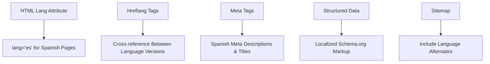

# Spanish SEO Implementation Plan for AI Sports Edge

## Executive Summary

This document outlines a comprehensive plan for implementing Spanish SEO for the AI Sports Edge web application. The goal is to create a fully optimized Spanish version of the site targeting American users who speak Spanish, with a focus on proper SEO implementation to ensure search engines can recognize and index the Spanish content effectively.

## Table of Contents

1. [Overall Strategy](#1-overall-strategy)
2. [URL Structure Strategy](#2-url-structure-strategy)
3. [Internationalization (i18n) Implementation](#3-internationalization-i18n-implementation)
4. [Content Strategy](#4-content-strategy)
5. [UI Elements Translation](#5-ui-elements-translation)
6. [Technical SEO Implementation](#6-technical-seo-implementation)
7. [Implementation Plan](#7-implementation-plan)
8. [Detailed Technical Implementation](#8-detailed-technical-implementation)
9. [Monitoring and Optimization](#9-monitoring-and-optimization)
10. [Resource Requirements](#10-resource-requirements)
11. [Success Metrics](#11-success-metrics)

## 1. Overall Strategy



The implementation will follow a phased approach:
- Set up the internationalization framework
- Create the Spanish URL structure
- Develop and translate content for priority pages
- Implement technical SEO elements
- Deploy and test the Spanish version
- Monitor performance and optimize based on data

## 2. URL Structure Strategy

For optimal Spanish SEO, we'll implement a subdirectory approach using `/es/` prefix for all Spanish pages. This approach is preferred over subdomains as it maintains domain authority and is easier to implement and maintain.

```
English: https://aisportsedge.app/
Spanish: https://aisportsedge.app/es/

English: https://aisportsedge.app/features
Spanish: https://aisportsedge.app/es/features
```

Benefits of this approach:
- Maintains domain authority across all language versions
- Easier to implement and maintain
- Better for SEO as search engines consider subdirectories as part of the same website
- Simpler user experience for switching between languages

## 3. Internationalization (i18n) Implementation

We'll implement a robust internationalization framework to manage multiple language versions:

```mermaid
graph TD
    A[React App] --> B[i18next Library]
    B --> C[Language Detection]
    C --> D[Content Rendering]
    D --> E1[English Content]
    D --> E2[Spanish Content]
    F[URL Management] --> G[/es/ Routes]
    H[Language Switcher] --> I[User Language Preference]
```

### Technology Stack:
- **i18next**: Core internationalization framework
- **react-i18next**: React bindings for i18next
- **i18next-browser-languagedetector**: Detect user language preference
- **i18next-http-backend**: Load language resources from server

### Translation File Structure:

```
/public
  /locales
    /en
      common.json
      home.json
      features.json
      pricing.json
      login.json
    /es
      common.json
      home.json
      features.json
      pricing.json
      login.json
```

## 4. Content Strategy

For the priority pages (Home, Features, Pricing, Login):

1. **Professional Translation**: Ensure high-quality, culturally appropriate Spanish translations
   - Hire professional translators with knowledge of sports betting terminology
   - Ensure translations maintain the brand voice and tone
   - Review translations for cultural appropriateness

2. **Spanish Keyword Research**: Identify Spanish keywords relevant to sports betting
   - Research Spanish keywords used by American Spanish speakers
   - Analyze competitor Spanish sites for keyword insights
   - Prioritize keywords with high search volume and relevance

3. **Localized Content**: Adapt content to resonate with Spanish-speaking American users
   - Adjust examples and references to be culturally relevant
   - Use region-specific terminology for sports betting
   - Consider cultural nuances in messaging and value propositions

4. **Content Adaptation Process**:
   - Extract content from English pages
   - Conduct keyword research for Spanish equivalents
   - Professionally translate content
   - Optimize for Spanish SEO
   - Review for cultural appropriateness
   - Implement in Spanish page components

## 5. UI Elements Translation

All user interface elements must be fully translated to provide a complete Spanish experience:

1. **Navigation Elements**:
   - Main navigation menu
   - Footer links
   - Breadcrumbs
   - Pagination controls

2. **Interactive Elements**:
   - Buttons (especially CTAs like "Download App", "Learn More")
   - Form labels, placeholders, and validation messages
   - Error messages and notifications
   - Modal dialogs and popups

3. **Special Attention to Calls-to-Action**:
   - Neon odds buttons
   - Bet now buttons
   - Subscription prompts
   - Download buttons

4. **Forms and Input Fields**:
   - Login/registration forms
   - Search functionality
   - Contact forms
   - Payment forms

5. **Dynamic Content**:
   - Notifications
   - Tooltips
   - Loading states
   - Success/error messages

### Implementation Approach:

- Store all UI text in translation files
- Use translation keys instead of hardcoded text
- Ensure date formats, number formats, and currencies are properly localized
- Test all interactive elements in Spanish to ensure proper functionality

## 6. Technical SEO Implementation



### Key Technical Elements:

1. **HTML Lang Attribute**: 
   - Set `lang="es"` for Spanish pages
   - Ensure proper document language declaration

2. **Hreflang Tags**: 
   - Implement proper hreflang annotations to indicate language relationships
   - Include in `<head>` section of all pages
   - Example:
     ```html
     <link rel="alternate" hreflang="en" href="https://aisportsedge.app/" />
     <link rel="alternate" hreflang="es" href="https://aisportsedge.app/es/" />
     <link rel="alternate" hreflang="x-default" href="https://aisportsedge.app/" />
     ```

3. **Meta Tags**: 
   - Create Spanish versions of all meta tags
   - Optimize titles, descriptions, and keywords for Spanish search
   - Ensure proper character encoding for Spanish characters

4. **Structured Data**: 
   - Update Schema.org markup with Spanish content
   - Ensure all structured data is properly translated
   - Test with Google's Structured Data Testing Tool

5. **Canonical URLs**: 
   - Ensure proper canonical URL implementation across language versions
   - Prevent duplicate content issues

6. **XML Sitemap**: 
   - Include language alternates in the sitemap
   - Example:
     ```xml
     <url>
       <loc>https://aisportsedge.app/</loc>
       <xhtml:link rel="alternate" hreflang="en" href="https://aisportsedge.app/"/>
       <xhtml:link rel="alternate" hreflang="es" href="https://aisportsedge.app/es/"/>
     </url>
     ```

## 7. Implementation Plan

### Phase 1: Setup & Infrastructure (Week 1)

1. **Install i18n Framework**:
   - Add i18next and related packages
   ```bash
   npm install i18next react-i18next i18next-browser-languagedetector i18next-http-backend
   ```
   - Configure language detection and switching
   - Set up translation file structure

2. **URL Structure Implementation**:
   - Modify React Router configuration to support `/es/` routes
   - Create language detection and redirection logic
   - Implement language switcher component

### Phase 2: Content & Translation (Weeks 2-3)

1. **Content Translation**:
   - Translate priority pages (Home, Features, Pricing, Login)
   - Conduct Spanish keyword research
   - Adapt content for cultural relevance

2. **UI Elements Translation**:
   - Translate all navigation elements
   - Translate all buttons and CTAs
   - Translate forms and input fields
   - Translate error messages and notifications

3. **SEO Elements Translation**:
   - Translate meta tags, titles, and descriptions
   - Create Spanish structured data
   - Implement hreflang annotations

### Phase 3: Technical Implementation (Week 4)

1. **Spanish Page Components**:
   - Create Spanish versions of priority page components
   - Implement language-specific routing
   - Set up language switcher UI

2. **SEO Technical Setup**:
   - Configure Helmet for Spanish meta tags
   - Implement hreflang tags
   - Update sitemap with language alternates

### Phase 4: Testing & Deployment (Week 5)

1. **Testing**:
   - Test language switching functionality
   - Verify SEO elements in Spanish pages
   - Test responsive design in Spanish pages
   - Test all UI elements in Spanish

2. **Deployment**:
   - Deploy Spanish version to staging environment
   - Conduct final testing
   - Deploy to production

## 8. Detailed Technical Implementation

### 8.1 i18next Configuration

```javascript
// i18n.js
import i18n from 'i18next';
import { initReactI18next } from 'react-i18next';
import LanguageDetector from 'i18next-browser-languagedetector';
import Backend from 'i18next-http-backend';

i18n
  .use(Backend)
  .use(LanguageDetector)
  .use(initReactI18next)
  .init({
    fallbackLng: 'en',
    supportedLngs: ['en', 'es'],
    interpolation: {
      escapeValue: false,
    },
    detection: {
      order: ['path', 'navigator'],
      lookupFromPathIndex: 0,
    },
    backend: {
      loadPath: '/locales/{{lng}}/{{ns}}.json',
    },
    ns: ['common', 'home', 'features', 'pricing', 'login'],
    defaultNS: 'common',
  });

export default i18n;
```

### 8.2 App Entry Point with i18n

```javascript
// index.js
import React from 'react';
import { createRoot } from 'react-dom/client';
import { BrowserRouter as Router } from 'react-router-dom';
import { HelmetProvider } from 'react-helmet-async';
import './i18n'; // Import i18n configuration
import App from './App';
import './styles/global.css';
import './styles/fix-overlay.css';
import './styles/notification-banner.css';

const container = document.getElementById('root');
const root = createRoot(container);

root.render(
  <React.StrictMode>
    <HelmetProvider>
      <Router>
        <App />
      </Router>
    </HelmetProvider>
  </React.StrictMode>
);
```

### 8.3 Router Configuration

```javascript
// App.js with language routing
import React, { useEffect } from 'react';
import { Routes, Route, Navigate, useLocation } from 'react-router-dom';
import { useTranslation } from 'react-i18next';
import { BettingAffiliateProvider } from './contexts/BettingAffiliateContext';
import Header from './components/Header';
import Footer from './components/Footer';
import LanguageSwitcher from './components/LanguageSwitcher';
import ProtectedRoute from './components/ProtectedRoute';
import HomePage from './pages/HomePage';
import FeaturesPage from './pages/FeaturesPage';
import PricingPage from './pages/PricingPage';
import LoginPage from './pages/LoginPage';
import NotFoundPage from './pages/NotFoundPage';
// ... other imports

const App = () => {
  const location = useLocation();
  const { i18n } = useTranslation();
  const isLoginPage = location.pathname === '/login' || location.pathname === '/es/login';
  
  // Set language based on URL
  useEffect(() => {
    const path = location.pathname;
    if (path.startsWith('/es/')) {
      i18n.changeLanguage('es');
    } else {
      i18n.changeLanguage('en');
    }
  }, [location.pathname, i18n]);
  
  // Add page-specific class to body based on current route
  useEffect(() => {
    // Remove all page-specific classes
    document.body.classList.remove(
      'home-page',
      'features-page',
      'pricing-page',
      'login-page'
      // ... other classes
    );
    
    // Add class based on current path
    const path = location.pathname.replace(/^\/es/, ''); // Remove language prefix
    
    if (path === '/' || path === '') {
      document.body.classList.add('home-page');
    } else if (path === '/features') {
      document.body.classList.add('features-page');
    } else if (path === '/pricing') {
      document.body.classList.add('pricing-page');
    } else if (path === '/login') {
      document.body.classList.add('login-page');
    }
    // ... other path checks
    
    // Clean up any overlays or modals when navigating between pages
    // ... (existing cleanup code)
  }, [location.pathname]);
  
  return (
    <BettingAffiliateProvider>
      <div className="app">
        {/* Only show Header and Footer if not on login page */}
        {!isLoginPage && <Header />}
        {!isLoginPage && <LanguageSwitcher />}
        
        <main className={`main-content ${isLoginPage ? 'login-main' : ''}`}>
          <Routes>
            {/* English routes */}
            <Route path="/" element={
              <ProtectedRoute>
                <HomePage />
              </ProtectedRoute>
            } />
            <Route path="/features" element={
              <ProtectedRoute>
                <FeaturesPage />
              </ProtectedRoute>
            } />
            <Route path="/pricing" element={
              <ProtectedRoute>
                <PricingPage />
              </ProtectedRoute>
            } />
            <Route path="/login" element={<LoginPage />} />
            
            {/* Spanish routes */}
            <Route path="/es/" element={
              <ProtectedRoute>
                <HomePage />
              </ProtectedRoute>
            } />
            <Route path="/es/features" element={
              <ProtectedRoute>
                <FeaturesPage />
              </ProtectedRoute>
            } />
            <Route path="/es/pricing" element={
              <ProtectedRoute>
                <PricingPage />
              </ProtectedRoute>
            } />
            <Route path="/es/login" element={<LoginPage />} />
            
            {/* Redirects */}
            <Route path="/es" element={<Navigate to="/es/" replace />} />
            
            {/* Not found route */}
            <Route path="*" element={<NotFoundPage />} />
          </Routes>
        </main>
        
        {!isLoginPage && <Footer />}
      </div>
    </BettingAffiliateProvider>
  );
};

export default App;
```

### 8.4 Language Switcher Component

```jsx
// components/LanguageSwitcher.js
import React from 'react';
import { useTranslation } from 'react-i18next';
import { useLocation, Link } from 'react-router-dom';
import '../styles/language-switcher.css';

const LanguageSwitcher = () => {
  const { i18n } = useTranslation();
  const location = useLocation();
  const currentLang = i18n.language;
  
  const getAlternateUrl = () => {
    const path = location.pathname;
    
    if (currentLang === 'es') {
      // If we're on a Spanish page, link to English
      return path.replace(/^\/es/, '') || '/';
    } else {
      // If we're on an English page, link to Spanish
      return `/es${path}`;
    }
  };
  
  return (
    <div className="language-switcher">
      <Link to={getAlternateUrl()} className="language-switch-link">
        {currentLang === 'es' ? 'English' : 'Español'}
      </Link>
    </div>
  );
};

export default LanguageSwitcher;
```

### 8.5 Example of a Translated Page Component

```jsx
// pages/HomePage.js
import React, { useState } from 'react';
import { Link } from 'react-router-dom';
import { Helmet } from 'react-helmet-async';
import { useTranslation } from 'react-i18next';
import '../styles/home.css';
import BetNowButton from '../components/BetNowButton';
import BetNowPopup from '../components/BetNowPopup';
import { useBettingAffiliate } from '../contexts/BettingAffiliateContext';

const HomePage = () => {
  const [showPopup, setShowPopup] = useState(false);
  const { showBetButton } = useBettingAffiliate();
  const { t, i18n } = useTranslation(['home', 'common']);
  const isSpanish = i18n.language === 'es';
  
  // Base URL for canonical and alternate links
  const baseUrl = 'https://aisportsedge.app';
  
  return (
    <>
      <Helmet>
        <html lang={isSpanish ? 'es' : 'en'} />
        <title>{t('home:meta.title')}</title>
        <meta name="description" content={t('home:meta.description')} />
        <meta name="keywords" content={t('home:meta.keywords')} />
        
        {/* Canonical URL */}
        <link rel="canonical" href={isSpanish ? `${baseUrl}/es/` : baseUrl} />
        
        {/* Hreflang annotations */}
        <link rel="alternate" hreflang="en" href={baseUrl} />
        <link rel="alternate" hreflang="es" href={`${baseUrl}/es/`} />
        <link rel="alternate" hreflang="x-default" href={baseUrl} />
        
        {/* Open Graph tags */}
        <meta property="og:title" content={t('home:meta.ogTitle')} />
        <meta property="og:description" content={t('home:meta.ogDescription')} />
        <meta property="og:url" content={isSpanish ? `${baseUrl}/es/` : baseUrl} />
        <meta property="og:type" content="website" />
      </Helmet>
      
      <section className="hero">
        <div className="container">
          <div className="hero-content">
            <div className="hero-text">
              <h1>{t('home:hero.title')}</h1>
              <p className="hero-subtitle">
                {t('home:hero.subtitle')}
              </p>
              <div className="hero-buttons">
                <Link to={isSpanish ? "/es/download" : "/download"} className="button primary-button">
                  {t('common:buttons.downloadApp')}
                </Link>
                <Link to={isSpanish ? "/es/features" : "/features"} className="button secondary-button">
                  {t('common:buttons.learnMore')}
                </Link>
                {showBetButton('home') && (
                  <BetNowButton
                    size="large"
                    position="inline"
                    contentType="home"
                  />
                )}
              </div>
            </div>
            <div className="hero-image">
              
            </div>
          </div>
        </div>
      </section>
      
      {/* Features Overview Section */}
      <section className="features-overview">
        <div className="container">
          <h2 className="section-title">{t('home:features.title')}</h2>
          <div className="features-grid">
            {/* Feature 1 */}
            <div className="feature-card">
              <div className="feature-icon">
                <svg xmlns="http://www.w3.org/2000/svg" width="40" height="40" viewBox="0 0 24 24" fill="none" stroke="currentColor" strokeWidth="2" strokeLinecap="round" strokeLinejoin="round">
                  <path d="M2 3h6a4 4 0 0 1 4 4v14a3 3 0 0 0-3-3H2z"></path>
                  <path d="M22 3h-6a4 4 0 0 0-4 4v14a3 3 0 0 1 3-3h7z"></path>
                </svg>
              </div>
              <h3>{t('home:features.feature1.title')}</h3>
              <p>{t('home:features.feature1.description')}</p>
            </div>
            
            {/* Feature 2 */}
            <div className="feature-card">
              <div className="feature-icon">
                <svg xmlns="http://www.w3.org/2000/svg" width="40" height="40" viewBox="0 0 24 24" fill="none" stroke="currentColor" strokeWidth="2" strokeLinecap="round" strokeLinejoin="round">
                  <polyline points="22 12 18 12 15 21 9 3 6 12 2 12"></polyline>
                </svg>
              </div>
              <h3>{t('home:features.feature2.title')}</h3>
              <p>{t('home:features.feature2.description')}</p>
            </div>
            
            {/* Feature 3 */}
            <div className="feature-card">
              <div className="feature-icon">
                <svg xmlns="http://www.w3.org/2000/svg" width="40" height="40" viewBox="0 0 24 24" fill="none" stroke="currentColor" strokeWidth="2" strokeLinecap="round" strokeLinejoin="round">
                  <rect x="2" y="2" width="20" height="20" rx="5" ry="5"></rect>
                  <path d="M16 11.37A4 4 0 1 1 12.63 8 4 4 0 0 1 16 11.37z"></path>
                  <line x1="17.5" y1="6.5" x2="17.51" y2="6.5"></line>
                </svg>
              </div>
              <h3>{t('home:features.feature3.title')}</h3>
              <p>{t('home:features.feature3.description')}</p>
            </div>
            
            {/* Feature 4 */}
            <div className="feature-card">
              <div className="feature-icon">
                <svg xmlns="http://www.w3.org/2000/svg" width="40" height="40" viewBox="0 0 24 24" fill="none" stroke="currentColor" strokeWidth="2" strokeLinecap="round" strokeLinejoin="round">
                  <path d="M17 21v-2a4 4 0 0 0-4-4H5a4 4 0 0 0-4 4v2"></path>
                  <circle cx="9" cy="7" r="4"></circle>
                  <path d="M23 21v-2a4 4 0 0 0-3-3.87"></path>
                  <path d="M16 3.13a4 4 0 0 1 0 7.75"></path>
                </svg>
              </div>
              <h3>{t('home:features.feature4.title')}</h3>
              <p>{t('home:features.feature4.description')}</p>
            </div>
          </div>
          <div className="features-cta">
            <Link to={isSpanish ? "/es/features" : "/features"} className="button">
              {t('home:features.exploreButton')}
            </Link>
          </div>
        </div>
      </section>
      
      {/* How It Works Section */}
      <section className="how-it-works">
        <div className="container">
          <h2 className="section-title">{t('home:howItWorks.title')}</h2>
          <div className="steps">
            <div className="step">
              <div className="step-number">1</div>
              <h3>{t('home:howItWorks.step1.title')}</h3>
              <p>{t('home:howItWorks.step1.description')}</p>
            </div>
            <div className="step">
              <div className="step-number">2</div>
              <h3>{t('home:howItWorks.step2.title')}</h3>
              <p>{t('home:howItWorks.step2.description')}</p>
            </div>
            <div className="step">
              <div className="step-number">3</div>
              <h3>{t('home:howItWorks.step3.title')}</h3>
              <p>{t('home:howItWorks.step3.description')}</p>
            </div>
            <div className="step">
              <div className="step-number">4</div>
              <h3>{t('home:howItWorks.step4.title')}</h3>
              <p>{t('home:howItWorks.step4.description')}</p>
            </div>
          </div>
        </div>
      </section>
      
      {/* CTA Section */}
      <section className="cta-section">
        <div className="container">
          <div className="cta-content">
            <h2>{t('home:cta.title')}</h2>
            <p>{t('home:cta.description')}</p>
            <div className="cta-buttons">
              <Link to={isSpanish ? "/es/download" : "/download"} className="button primary-button">
                {t('home:cta.downloadButton')}
              </Link>
              {showBetButton('home') && (
                <BetNowButton
                  size="large"
                  position="inline"
                  contentType="home"
                />
              )}
            </div>
            <button
              className="show-popup-link"
              onClick={() => setShowPopup(true)}
            >
              {t('home:cta.specialOfferButton')}
            </button>
          </div>
        </div>
      </section>
      
      {/* Bet Now Popup */}
      <BetNowPopup
        show={showPopup}
        onClose={() => setShowPopup(false)}
        message={t('home:betNowPopup.message')}
      />
    </>
  );
};

export default HomePage;
```

### 8.6 Example Translation Files

#### English (en/home.json)
```json
{
  "meta": {
    "title": "AI Sports Edge - AI-Powered Sports Betting Predictions",
    "description": "Get accurate sports betting predictions powered by AI. Improve your betting strategy with advanced analytics and real-time insights.",
    "keywords": "sports betting, AI predictions, betting analytics, sports edge",
    "ogTitle": "AI Sports Edge - AI-Powered Sports Betting Predictions",
    "ogDescription": "Get accurate sports betting predictions powered by AI. Improve your betting strategy with advanced analytics and real-time insights."
  },
  "hero": {
    "title": "AI-Powered Sports Betting Predictions",
    "subtitle": "Get accurate predictions, analytics, and insights for smarter betting decisions.",
    "imageAlt": "AI Sports Edge App"
  },
  "features": {
    "title": "Why Choose AI Sports Edge?",
    "feature1": {
      "title": "AI Predictions",
      "description": "Advanced machine learning algorithms analyze vast amounts of data to provide accurate betting predictions."
    },
    "feature2": {
      "title": "Real-Time Analytics",
      "description": "Get up-to-the-minute stats, odds, and analysis to make informed betting decisions."
    },
    "feature3": {
      "title": "Multi-Sport Coverage",
      "description": "From NFL to Formula 1, we cover all major sports with specialized prediction models for each."
    },
    "feature4": {
      "title": "Community Insights",
      "description": "Connect with other bettors, share strategies, and learn from the community's collective wisdom."
    },
    "exploreButton": "Explore All Features"
  },
  "howItWorks": {
    "title": "How It Works",
    "step1": {
      "title": "Download the App",
      "description": "Get AI Sports Edge on your iOS or Android device."
    },
    "step2": {
      "title": "Select Your Sports",
      "description": "Choose the sports you're interested in betting on."
    },
    "step3": {
      "title": "Get Predictions",
      "description": "Receive AI-powered predictions and analytics."
    },
    "step4": {
      "title": "Make Smarter Bets",
      "description": "Use our insights to improve your betting strategy."
    }
  },
  "cta": {
    "title": "Ready to Transform Your Betting Strategy?",
    "description": "Join thousands of users who are making smarter betting decisions with AI Sports Edge.",
    "downloadButton": "Download Now",
    "specialOfferButton": "See our special betting offer"
  },
  "betNowPopup": {
    "message": "Ready to place your bets? Use our exclusive FanDuel affiliate link for a special bonus!"
  }
}
```

#### Spanish (es/home.json)
```json
{
  "meta": {
    "title": "AI Sports Edge - Predicciones de Apuestas Deportivas Impulsadas por IA",
    "description": "Obtenga predicciones precisas de apuestas deportivas impulsadas por IA. Mejore su estrategia de apuestas con análisis avanzados e información en tiempo real.",
    "keywords": "apuestas deportivas, predicciones de IA, análisis de apuestas, ventaja deportiva",
    "ogTitle": "AI Sports Edge - Predicciones de Apuestas Deportivas Impulsadas por IA",
    "ogDescription": "Obtenga predicciones precisas de apuestas deportivas impulsadas por IA. Mejore su estrategia de apuestas con análisis avanzados e información en tiempo real."
  },
  "hero": {
    "title": "Predicciones de Apuestas Deportivas Impulsadas por IA",
    "subtitle": "Obtenga predicciones precisas, análisis e información para decisiones de apuestas más inteligentes.",
    "imageAlt": "Aplicación AI Sports Edge"
  },
  "features": {
    "title": "¿Por Qué Elegir AI Sports Edge?",
    "feature1": {
      "title": "Predicciones de IA",
      "description": "Algoritmos avanzados de aprendizaje automático analizan grandes cantidades de datos para proporcionar predicciones precisas de apuestas."
    },
    "feature2": {
      "title": "Análisis en Tiempo Real",
      "description": "Obtenga estadísticas, probabilidades y análisis actualizados al minuto para tomar decisiones informadas de apuestas."
    },
    "feature3": {
      "title": "Cobertura Multi-Deporte",
      "description": "Desde la NFL hasta la Fórmula 1, cubrimos todos los deportes principales con modelos de predicción especializados para cada uno."
    },
    "feature4": {
      "title": "Información de la Comunidad",
      "description": "Conéctese con otros apostadores, comparta estrategias y aprenda de la sabiduría colectiva de la comunidad."
    },
    "exploreButton": "Explorar Todas las Características"
  },
  "howItWorks": {
    "title": "Cómo Funciona",
    "step1": {
      "title": "Descargue la Aplicación",
      "description": "Obtenga AI Sports Edge en su dispositivo iOS o Android."
    },
    "step2": {
      "title": "Seleccione Sus Deportes",
      "description": "Elija los deportes en los que está interesado en apostar."
    },
    "step3": {
      "title": "Obtenga Predicciones",
      "description": "Reciba predicciones y análisis impulsados por IA."
    },
    "step4": {
      "title": "Haga Apuestas Más Inteligentes",
      "description": "Utilice nuestra información para mejorar su estrategia de apuestas."
    }
  },
  "cta": {
    "title": "¿Listo para Transformar Su Estrategia de Apuestas?",
    "description": "Únase a miles de usuarios que están tomando decisiones de apuestas más inteligentes con AI Sports Edge.",
    "downloadButton": "Descargar Ahora",
    "specialOfferButton": "Ver nuestra oferta especial de apuestas"
  },
  "betNowPopup": {
    "message": "¿Listo para hacer sus apuestas? ¡Utilice nuestro enlace exclusivo de afiliado de FanDuel para obtener un bono especial!"
  }
}
```

#### English (en/common.json)
```json
{
  "buttons": {
    "downloadApp": "Download App",
    "learnMore": "Learn More",
    "login": "Login",
    "signup": "Sign Up",
    "betNow": "Bet Now",
    "getStarted": "Get Started"
  },
  "navigation": {
    "home": "Home",
    "features": "Features",
    "pricing": "Pricing",
    "about": "About",
    "download": "Download",
    "odds": "Odds",
    "predictions": "Predictions",
    "login": "Login"
  },
  "footer": {
    "copyright": "© 2025 AI Sports Edge. All rights reserved.",
    "terms": "Terms of Service",
    "privacy": "Privacy Policy",
    "contact": "Contact Us"
  },
  "errors": {
    "required": "This field is required",
    "invalidEmail": "Please enter a valid email address",
    "passwordLength": "Password must be at least 8 characters",
    "passwordMatch": "Passwords do not match",
    "loginFailed": "Login failed. Please check your credentials."
  }
}
```

#### Spanish (es/common.json)
```json
{
  "buttons": {
    "downloadApp": "Descargar Aplicación",
    "learnMore": "Más Información",
    "login": "Iniciar Sesión",
    "signup": "Registrarse",
    "betNow": "Apostar Ahora",
    "getStarted": "Comenzar"
  },
  "navigation": {
    "home": "Inicio",
    "features": "Características",
    "pricing": "Precios",
    "about": "Acerca de",
    "download": "Descargar",
    "odds": "Probabilidades",
    "predictions": "Predicciones",
    "login": "Iniciar Sesión"
  },
  "footer": {
    "copyright": "© 2025 AI Sports Edge. Todos los derechos reservados.",
    "terms": "Términos de Servicio",
    "privacy": "Política de Privacidad",
    "contact": "Contáctenos"
  },
  "errors": {
    "required": "Este campo es obligatorio",
    "invalidEmail": "Por favor, introduzca una dirección de correo electrónico válida",
    "passwordLength": "La contraseña debe tener al menos 8 caracteres",
    "passwordMatch": "Las contraseñas no coinciden",
    "loginFailed": "Error de inicio de sesión. Por favor, compruebe sus credenciales."
  }
}
```

### 8.7 Updating the HTML Template

```html
<!-- web/index.html -->
<!DOCTYPE html>
<html lang="en">
<head>
  <meta charset="UTF-8">
  <meta name="viewport" content="width=device-width, initial-scale=1.0">
  <meta name="theme-color" content="#007bff">
  <meta name="description" content="AI Sports Edge - AI-Powered Sports Betting Predictions and Analytics">
  
  <!-- Open Graph / Facebook -->
  <meta property="og:type" content="website">
  <meta property="og:url" content="https://aisportsedge.app/">
  <meta property="og:title" content="AI Sports Edge - AI-Powered Sports Betting Predictions">
  <meta property="og:description" content="Get accurate sports betting predictions powered by AI. Improve your betting strategy with advanced analytics and real-time insights.">
  <meta property="og:image" content="https://aisportsedge.app/og-image.jpg">
  
  <!-- Twitter -->
  <meta property="twitter:card" content="summary_large_image">
  <meta property="twitter:url" content="https://aisportsedge.app/">
  <meta property="twitter:title" content="AI Sports Edge - AI-Powered Sports Betting Predictions">
  <meta property="twitter:description" content="Get accurate sports betting predictions powered by AI. Improve your betting strategy with advanced analytics and real-time insights.">
  <meta property="twitter:image" content="https://aisportsedge.app/og-image.jpg">
  
  <title>AI Sports Edge - AI-Powered Sports Betting Predictions</title>
  
  <!-- Favicon -->
  <link rel="icon" href="https://expo.dev/static/images/favicon-76x76.png">
  <link rel="apple-touch-icon" href="https://expo.dev/static/images/favicon-76x76.png">
  
  <!-- Fonts -->
  <link rel="preconnect" href="https://fonts.googleapis.com">
  <link rel="preconnect" href="https://fonts.gstatic.com" crossorigin>
  <link href="https://fonts.googleapis.com/css2?family=Inter:wght@400;500;600;700&display=swap" rel="stylesheet">
  
  <!-- Font Awesome Icons -->
  <link rel="stylesheet" href="https://cdnjs.cloudflare.com/ajax/libs/font-awesome/6.5.1/css/all.min.css" integrity="sha512-DTOQO9RWCH3ppGqcWaEA1BIZOC6xxalwEsw9c2QQeAIftl+Vegovlnee1c9QX4TctnWMn13TZye+giMm8e2LwA==" crossorigin="anonymous" referrerpolicy="no-referrer" />
  
  <!-- Structured Data -->
  <script type="application/ld+json">
    {
      "@context": "https://schema.org",
      "@type": "SoftwareApplication",
      "name": "AI Sports Edge",
      "applicationCategory": "SportsApplication",
      "operatingSystem": "iOS, Android",
      "offers": {
        "@type": "Offer",
        "price": "19.99",
        "priceCurrency": "USD"
      },
      "description": "AI-powered sports betting predictions and analytics"
    }
  </script>
</head>
<body>
  <div id="root"></div>
  <noscript>You need to enable JavaScript to run this app.</noscript>
  <script src="/index.js"></script>
</body>
</html>
```

### 8.8 Updating Firebase Configuration for Spanish Routes

```json
// firebase.json
{
  "functions": {
    "source": "functions"
  },
  "hosting": [
    {
      "target": "default",
      "public": "public",
      "ignore": [
        "firebase.json",
        "**/.*",
        "**/node_modules/**",
        "README.md"
      ],
      "rewrites": [
        {
          "source": "**",
          "destination": "/index.html"
        }
      ],
      "headers": [
        {
          "source": "**/*.@(jpg|jpeg|gif|png|svg|webp)",
          "headers": [
            {
              "key": "Cache-Control",
              "value": "max-age=86400"
            }
          ]
        },
        {
          "source": "**/*.@(js|css)",
          "headers": [
            {
              "key": "Cache-Control",
              "value": "max-age=3600"
            }
          ]
        },
        {
          "source": "/es/**",
          "headers": [
            {
              "key": "Content-Language",
              "value": "es"
            }
          ]
        }
      ]
    }
  ]
}
```

### 8.9 Creating a Sitemap with Language Alternates

```xml
<?xml version="1.0" encoding="UTF-8"?>
<urlset xmlns="http://www.sitemaps.org/schemas/sitemap/0.9"
        xmlns:xhtml="http://www.w3.org/1999/xhtml">
  <!-- Home Page -->
  <url>
    <loc>https://aisportsedge.app/</loc>
    <xhtml:link rel="alternate" hreflang="en" href="https://aisportsedge.app/"/>
    <xhtml:link rel="alternate" hreflang="es" href="https://aisportsedge.app/es/"/>
    <xhtml:link rel="alternate" hreflang="x-default" href="https://aisportsedge.app/"/>
    <changefreq>weekly</changefreq>
    <priority>1.0</priority>
  </url>
  <url>
    <loc>https://aisportsedge.app/es/</loc>
    <xhtml:link rel="alternate" hreflang="en" href="https://aisportsedge.app/"/>
    <xhtml:link rel="alternate" hreflang="es" href="https://aisportsedge.app/es/"/>
    <changefreq>weekly</changefreq>
    <priority>1.0</priority>
  </url>
  
  <!-- Features Page -->
  <url>
    <loc>https://aisportsedge.app/features</loc>
    <xhtml:link rel="alternate" hreflang="en" href="https://aisportsedge.app/features"/>
    <xhtml:link rel="alternate" hreflang="es" href="https://aisportsedge.app/es/features"/>
    <changefreq>monthly</changefreq>
    <priority>0.8</priority>
  </url>
  <url>
    <loc>https://aisportsedge.app/es/features</loc>
    <xhtml:link rel="alternate" hreflang="en" href="https://aisportsedge.app/features"/>
    <xhtml:link rel="alternate" hreflang="es" href="https://aisportsedge.app/es/features"/>
    <changefreq>monthly</changefreq>
    <priority>0.8</priority>
  </url>
  
  <!-- Pricing Page -->
  <url>
    <loc>https://aisportsedge.app/pricing</loc>
    <xhtml:link rel="alternate" hreflang="en" href="https://aisportsedge.app/pricing"/>
    <xhtml:link rel="alternate" hreflang="es" href="https://aisportsedge.app/es/pricing"/>
    <changefreq>monthly</changefreq>
    <priority>0.8</priority>
  </url>
  <url>
    <loc>https://aisportsedge.app/es/pricing</loc>
    <xhtml:link rel="alternate" hreflang="en" href="https://aisportsedge.app/pricing"/>
    <xhtml:link rel="alternate" hreflang="es" href="https://aisportsedge.app/es/pricing"/>
    <changefreq>monthly</changefreq>
    <priority>0.8</priority>
  </url>
  
  <!-- Login Page -->
  <url>
    <loc>https://aisportsedge.app/login</loc>
    <xhtml:link rel="alternate" hreflang="en" href="https://aisportsedge.app/login"/>
    <xhtml:link rel="alternate" hreflang="es" href="https://aisportsedge.app/es/login"/>
    <changefreq>monthly</changefreq>
    <priority>0.7</priority>
  </url>
  <url>
    <loc>https://aisportsedge.app/es/login</loc>
    <xhtml:link rel="alternate" hreflang="en" href="https://aisportsedge.app/login"/>
    <xhtml:link rel="alternate" hreflang="es" href="https://aisportsedge.app/es/login"/>
    <changefreq>monthly</changefreq>
    <priority>0.7</priority>
  </url>
</urlset>
```

## 9. Monitoring and Optimization

After implementation, we'll need to:

1. **Monitor Performance**:
   - Track Spanish page rankings in search engines
   - Monitor organic traffic to Spanish pages
   - Analyze user behavior on Spanish pages

2. **Ongoing Optimization**:
   - Refine Spanish keywords based on performance
   - Expand Spanish content to additional pages
   - Update content based on user engagement metrics

### Tools for Monitoring:

- Google Search Console: Track impressions, clicks, and rankings for Spanish pages
- Google Analytics: Monitor traffic, user behavior, and conversion rates
- Heatmap tools: Analyze user interaction with Spanish pages

## 10. Resource Requirements

1. **Development Resources**:
   - Frontend developer with React experience
   - SEO specialist with Spanish market knowledge
   - Professional Spanish translator (preferably with sports betting knowledge)

2. **Tools and Services**:
   - Translation services
   - Spanish keyword research tools (e.g., Ahrefs, SEMrush)
   - SEO testing tools for Spanish content

3. **Estimated Time Investment**:
   - Development: 2-3 weeks
   - Content translation: 1-2 weeks
   - Testing and optimization: 1 week

## 11. Success Metrics

We'll measure success through:

1. **Search Engine Visibility**:
   - Rankings for Spanish keywords
   - Google Search Console impressions and clicks for Spanish pages
   - Indexation rate of Spanish pages

2. **User Engagement**:
   - Traffic to Spanish pages
   - Conversion rates on Spanish pages
   - Bounce rates compared to English pages
   - Time on site for Spanish-speaking users

3. **Business Impact**:
   - New user acquisition from Spanish-speaking audience
   - Conversion rates from Spanish-speaking users
   - Revenue attribution from Spanish content

### Key Performance Indicators (KPIs):

- **Organic Traffic**: Increase in Spanish-speaking visitors from search engines
- **Conversion Rate**: Percentage of Spanish-speaking visitors who complete desired actions
- **Engagement Metrics**: Time on site, pages per session, and bounce rate for Spanish content
- **Revenue**: Direct revenue attributed to Spanish-speaking users
- **ROI**: Return on investment for Spanish SEO implementation

## Conclusion

This comprehensive plan provides a roadmap for implementing Spanish SEO for the AI Sports Edge web application. By following this plan, you'll create a fully optimized Spanish version of your site that will effectively reach and engage American users who speak Spanish.

The implementation focuses on proper technical SEO, high-quality content translation, and a seamless user experience across both language versions. By prioritizing the Home, Features, Pricing, and Login pages, you'll establish a strong foundation that can be expanded to other pages in the future.