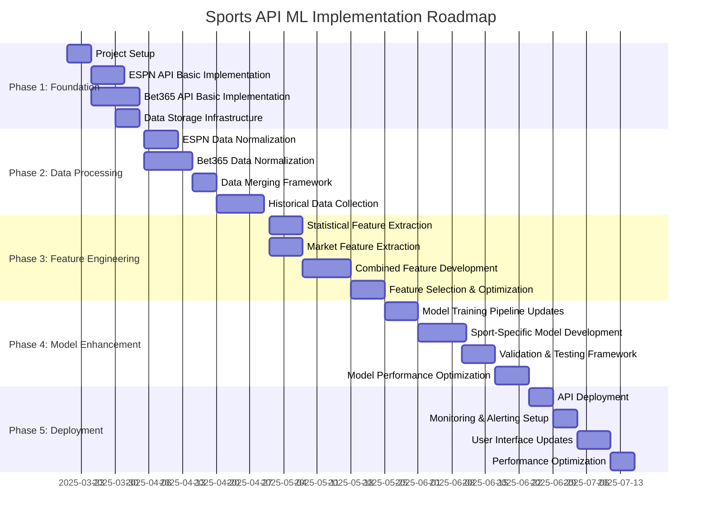
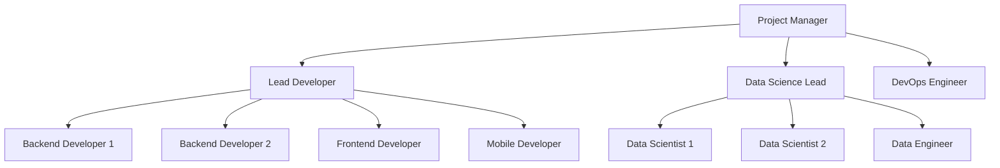

# Sports API ML Implementation Roadmap

## Overview

This roadmap outlines the detailed implementation steps and timeline for integrating the ESPN hidden API and Bet365 API scraper into our ML Sports Edge prediction system. The roadmap is organized into phases with specific tasks, owners, and deadlines to ensure a smooth and successful implementation.

## Implementation Phases

## Detailed Implementation Plan

### Phase 1: Foundation (March 20 - April 4, 2025)

#### Project Setup (March 20-24)

| Task | Description | Owner | Deadline |
|------|-------------|-------|----------|
| Create project repositories | Set up Git repositories for ESPN and Bet365 integrations | Lead Developer | March 20 |
| Configure development environments | Set up development, testing, and staging environments | DevOps Engineer | March 21 |
| Define coding standards | Establish coding standards and documentation requirements | Lead Developer | March 22 |
| Set up CI/CD pipeline | Configure automated testing and deployment pipeline | DevOps Engineer | March 24 |

#### ESPN API Basic Implementation (March 25-31)

| Task | Description | Owner | Deadline |
|------|-------------|-------|----------|
| Map API endpoints | Identify and document all relevant ESPN API endpoints | Data Engineer | March 25 |
| Create API client | Implement basic API client for ESPN endpoints | Backend Developer | March 27 |
| Implement error handling | Add robust error handling and retry logic | Backend Developer | March 29 |
| Add logging and monitoring | Implement logging and basic monitoring | Backend Developer | March 31 |

#### Bet365 API Basic Implementation (March 25 - April 3)

| Task | Description | Owner | Deadline |
|------|-------------|-------|----------|
| Configure environment variables | Set up necessary headers and cookies | Data Engineer | March 25 |
| Implement basic scraper | Create core scraper functionality | Backend Developer | March 28 |
| Add parsing logic | Implement response parsing for different sports | Backend Developer | March 31 |
| Implement rate limiting | Add responsible scraping practices | Backend Developer | April 2 |
| Add error recovery | Implement error handling and recovery mechanisms | Backend Developer | April 3 |

#### Data Storage Infrastructure (March 30 - April 4)

| Task | Description | Owner | Deadline |
|------|-------------|-------|----------|
| Design database schema | Create schema for sports data storage | Data Engineer | March 30 |
| Implement data storage layer | Create data access layer for storing API data | Backend Developer | April 2 |
| Set up data versioning | Implement versioning for historical data tracking | Data Engineer | April 4 |

### Phase 2: Data Processing (April 5 - April 30, 2025)

#### ESPN Data Normalization (April 5-11)

| Task | Description | Owner | Deadline |
|------|-------------|-------|----------|
| Create base normalizer | Implement common normalization logic | Data Engineer | April 5 |
| Implement sport-specific normalizers | Create normalizers for each supported sport | Data Engineer | April 8 |
| Add data validation | Implement validation for normalized data | Data Engineer | April 10 |
| Create data quality metrics | Implement metrics for data quality monitoring | Data Engineer | April 11 |

#### Bet365 Data Normalization (April 5-14)

| Task | Description | Owner | Deadline |
|------|-------------|-------|----------|
| Create base normalizer | Implement common normalization logic | Data Engineer | April 5 |
| Implement sport-specific normalizers | Create normalizers for each supported sport | Data Engineer | April 9 |
| Add odds format conversion | Implement conversion between odds formats | Data Engineer | April 12 |
| Create market movement tracking | Implement tracking of odds changes over time | Data Engineer | April 14 |

#### Data Merging Framework (April 15-19)

| Task | Description | Owner | Deadline |
|------|-------------|-------|----------|
| Design merging strategy | Define how to merge data from multiple sources | Data Scientist | April 15 |
| Implement entity matching | Create logic to match entities across sources | Data Engineer | April 17 |
| Add conflict resolution | Implement logic for resolving data conflicts | Data Engineer | April 19 |

#### Historical Data Collection (April 20-29)

| Task | Description | Owner | Deadline |
|------|-------------|-------|----------|
| Design historical data schema | Create schema for historical data storage | Data Engineer | April 20 |
| Implement ESPN historical collector | Create tool for collecting historical ESPN data | Backend Developer | April 23 |
| Implement Bet365 historical collector | Create tool for collecting historical Bet365 data | Backend Developer | April 26 |
| Create data backfill process | Implement process for backfilling historical data | Data Engineer | April 29 |

### Phase 3: Feature Engineering (May 1 - May 24, 2025)

#### Statistical Feature Extraction (May 1-7)

| Task | Description | Owner | Deadline |
|------|-------------|-------|----------|
| Implement team performance features | Create features based on team statistics | Data Scientist | May 1 |
| Add player-specific features | Implement features based on player statistics | Data Scientist | May 3 |
| Create historical trend features | Implement features based on historical trends | Data Scientist | May 5 |
| Add matchup-specific features | Create features based on historical matchups | Data Scientist | May 7 |

#### Market Feature Extraction (May 1-7)

| Task | Description | Owner | Deadline |
|------|-------------|-------|----------|
| Implement odds-based features | Create features based on betting odds | Data Scientist | May 1 |
| Add line movement features | Implement features based on odds movements | Data Scientist | May 3 |
| Create market sentiment indicators | Implement features for market sentiment | Data Scientist | May 5 |
| Add implied probability features | Create features based on implied probabilities | Data Scientist | May 7 |

#### Combined Feature Development (May 8-17)

| Task | Description | Owner | Deadline |
|------|-------------|-------|----------|
| Design combined feature strategy | Define approach for combining feature types | Data Scientist | May 8 |
| Implement statistical-market features | Create features using both data sources | Data Scientist | May 11 |
| Add discrepancy indicators | Implement features for statistical-market gaps | Data Scientist | May 14 |
| Create value identification features | Implement features for identifying value bets | Data Scientist | May 17 |

#### Feature Selection & Optimization (May 18-24)

| Task | Description | Owner | Deadline |
|------|-------------|-------|----------|
| Implement feature importance analysis | Create tools for measuring feature importance | Data Scientist | May 18 |
| Add feature selection logic | Implement automated feature selection | Data Scientist | May 20 |
| Create sport-specific feature sets | Define optimal feature sets for each sport | Data Scientist | May 22 |
| Optimize feature computation | Improve performance of feature calculation | Data Engineer | May 24 |

### Phase 4: Model Enhancement (May 25 - June 23, 2025)

#### Model Training Pipeline Updates (May 25-31)

| Task | Description | Owner | Deadline |
|------|-------------|-------|----------|
| Update data preparation | Modify pipeline to use new features | Data Scientist | May 25 |
| Enhance model architecture | Update model architecture for new features | Data Scientist | May 27 |
| Implement hyperparameter tuning | Add automated hyperparameter optimization | Data Scientist | May 29 |
| Create model versioning | Implement versioning for trained models | Data Engineer | May 31 |

#### Sport-Specific Model Development (June 1-10)

| Task | Description | Owner | Deadline |
|------|-------------|-------|----------|
| Implement NBA models | Create specialized models for NBA | Data Scientist | June 1 |
| Add MLB models | Implement specialized models for MLB | Data Scientist | June 3 |
| Create NFL models | Implement specialized models for NFL | Data Scientist | June 5 |
| Add soccer models | Implement specialized models for soccer | Data Scientist | June 7 |
| Create specialized models | Implement models for other sports | Data Scientist | June 10 |

#### Validation & Testing Framework (June 10-16)

| Task | Description | Owner | Deadline |
|------|-------------|-------|----------|
| Implement backtesting framework | Create tools for historical backtesting | Data Scientist | June 10 |
| Add cross-validation | Implement cross-validation for model evaluation | Data Scientist | June 12 |
| Create A/B testing framework | Implement framework for comparing models | Data Engineer | June 14 |
| Add performance metrics | Implement comprehensive performance metrics | Data Scientist | June 16 |

#### Model Performance Optimization (June 17-23)

| Task | Description | Owner | Deadline |
|------|-------------|-------|----------|
| Analyze model performance | Identify performance bottlenecks | Data Scientist | June 17 |
| Optimize model size | Reduce model size for faster inference | Data Scientist | June 19 |
| Implement model ensembling | Create ensemble methods for improved accuracy | Data Scientist | June 21 |
| Add model caching | Implement caching for model predictions | Backend Developer | June 23 |

### Phase 5: Deployment (June 24 - July 15, 2025)

#### API Deployment (June 24-28)

| Task | Description | Owner | Deadline |
|------|-------------|-------|----------|
| Design API endpoints | Define prediction API endpoints | Backend Developer | June 24 |
| Implement prediction API | Create API for serving predictions | Backend Developer | June 26 |
| Add authentication | Implement API authentication and rate limiting | Backend Developer | June 28 |

#### Monitoring & Alerting Setup (June 29 - July 3)

| Task | Description | Owner | Deadline |
|------|-------------|-------|----------|
| Implement performance monitoring | Add monitoring for API performance | DevOps Engineer | June 29 |
| Add data quality monitoring | Implement monitoring for data quality | Data Engineer | July 1 |
| Create model drift detection | Add monitoring for model drift | Data Scientist | July 3 |

#### User Interface Updates (July 4-10)

| Task | Description | Owner | Deadline |
|------|-------------|-------|----------|
| Design UI enhancements | Create designs for new prediction features | UI Designer | July 4 |
| Implement web UI updates | Update web interface for new predictions | Frontend Developer | July 7 |
| Add mobile UI updates | Update mobile interface for new predictions | Mobile Developer | July 10 |

#### Performance Optimization (July 11-15)

| Task | Description | Owner | Deadline |
|------|-------------|-------|----------|
| Analyze system performance | Identify performance bottlenecks | DevOps Engineer | July 11 |
| Optimize API performance | Improve API response times | Backend Developer | July 13 |
| Add caching layer | Implement caching for frequent requests | Backend Developer | July 15 |

## Resource Allocation

### Team Structure

### Resource Requirements

| Role | Allocation | Primary Responsibilities |
|------|------------|--------------------------|
| Project Manager | 50% | Project coordination, stakeholder communication, risk management |
| Lead Developer | 100% | Technical architecture, code reviews, development oversight |
| Data Science Lead | 100% | ML architecture, model design, feature engineering oversight |
| Backend Developer 1 | 100% | ESPN API integration, data processing implementation |
| Backend Developer 2 | 100% | Bet365 API integration, prediction API implementation |
| Data Scientist 1 | 100% | Feature engineering, model training, evaluation |
| Data Scientist 2 | 50% | Specialized models, performance optimization |
| Data Engineer | 100% | Data pipeline, storage, normalization |
| DevOps Engineer | 50% | CI/CD, monitoring, infrastructure |
| Frontend Developer | 50% | Web UI updates for new predictions |
| Mobile Developer | 50% | Mobile UI updates for new predictions |

## Dependencies and Critical Path

### Critical Path

1. ESPN API Basic Implementation → ESPN Data Normalization → Statistical Feature Extraction
2. Bet365 API Basic Implementation → Bet365 Data Normalization → Market Feature Extraction
3. Statistical Feature Extraction + Market Feature Extraction → Combined Feature Development
4. Combined Feature Development → Model Training Pipeline Updates → Sport-Specific Model Development
5. Sport-Specific Model Development → Validation & Testing → Model Performance Optimization
6. Model Performance Optimization → API Deployment → User Interface Updates

### External Dependencies

| Dependency | Impact | Mitigation |
|------------|--------|------------|
| ESPN API availability | Critical for data collection | Implement caching and fallback mechanisms |
| Bet365 website structure | Critical for scraper functionality | Monitor for changes and update scraper promptly |
| Sports schedules | Affects data collection timing | Implement adaptive scheduling based on sports calendars |
| Third-party libraries | Affects development timeline | Evaluate and select stable libraries with active maintenance |

## Risk Management

| Risk | Probability | Impact | Mitigation Strategy | Owner |
|------|------------|--------|---------------------|-------|
| ESPN API structure changes | Medium | High | Implement robust error handling, monitoring for changes | Backend Developer 1 |
| Bet365 blocking scraper | Medium | High | Use responsible scraping practices, proxy rotation | Backend Developer 2 |
| Data quality issues | Medium | Medium | Implement thorough validation, data quality monitoring | Data Engineer |
| Integration complexity | Medium | Medium | Use phased approach, regular integration testing | Lead Developer |
| Performance bottlenecks | Low | High | Early performance testing, optimization | DevOps Engineer |
| Model accuracy below targets | Medium | High | Extensive feature engineering, ensemble methods | Data Science Lead |
| Resource constraints | Medium | Medium | Clear prioritization, focused implementation | Project Manager |

## Success Metrics

### Technical Metrics

| Metric | Target | Measurement Method |
|--------|--------|-------------------|
| Prediction accuracy | 5-8% improvement | Backtesting against historical outcomes |
| API response time | <200ms average | Performance monitoring |
| Data freshness | <5 minute delay | Data pipeline monitoring |
| System uptime | 99.9% | Infrastructure monitoring |
| Model training time | <4 hours | Pipeline performance metrics |

### Business Metrics

| Metric | Target | Measurement Method |
|--------|--------|-------------------|
| User engagement | 30% increase | Analytics tracking |
| Subscription conversion | 15% increase | Conversion funnel analysis |
| User retention | 20% improvement | Cohort analysis |
| Revenue growth | 60-83% increase | Financial reporting |
| User satisfaction | 25% improvement | User surveys and feedback |

## Rollout Strategy

### Phased Deployment

1. **Alpha Phase** (Week 1-2)
   - Deploy to internal testing environment
   - Limited feature set with core functionality
   - Internal testing and validation

2. **Beta Phase** (Week 3-4)
   - Limited user group (5-10% of users)
   - Full feature set with monitoring
   - Collect user feedback and performance metrics

3. **Gradual Rollout** (Week 5-6)
   - Expand to 25%, then 50%, then 100% of users
   - Monitor performance and user feedback at each stage
   - Address issues before expanding to more users

4. **Full Deployment** (Week 7+)
   - Available to all users
   - Continued monitoring and optimization
   - Regular updates based on performance and feedback

### Rollback Plan

1. **Triggers for Rollback**
   - Prediction accuracy drops below current system
   - System performance degrades significantly
   - Critical bugs affecting user experience

2. **Rollback Process**
   - Revert to previous stable version
   - Communicate with users about the issue
   - Analyze root cause and implement fixes

3. **Recovery Plan**
   - Address issues in staging environment
   - Conduct thorough testing before redeploying
   - Implement additional monitoring for affected areas

## Communication Plan

### Stakeholder Communication

| Stakeholder | Communication Method | Frequency | Owner |
|-------------|----------------------|-----------|-------|
| Executive Team | Status report | Bi-weekly | Project Manager |
| Development Team | Stand-up meetings | Daily | Lead Developer |
| Data Science Team | Technical reviews | Weekly | Data Science Lead |
| Marketing Team | Feature updates | Monthly | Project Manager |
| Customer Support | Training sessions | Before releases | Project Manager |

### Reporting Structure

1. **Daily Updates**
   - Development progress
   - Blockers and issues
   - Next day priorities

2. **Weekly Reports**
   - Sprint progress
   - Key metrics and KPIs
   - Risks and mitigation plans

3. **Monthly Reviews**
   - Overall project status
   - Performance against timeline
   - Resource allocation adjustments

## Conclusion

This implementation roadmap provides a comprehensive plan for integrating the ESPN hidden API and Bet365 API scraper into our ML Sports Edge prediction system. By following this structured approach with clear tasks, owners, and deadlines, we can ensure a successful implementation that significantly enhances our prediction capabilities and delivers substantial business value.

The phased implementation allows for incremental progress and risk management, while the detailed resource allocation and communication plan ensure that all stakeholders are aligned and informed throughout the process. Regular monitoring of success metrics will enable us to track progress and make adjustments as needed to achieve our technical and business goals.