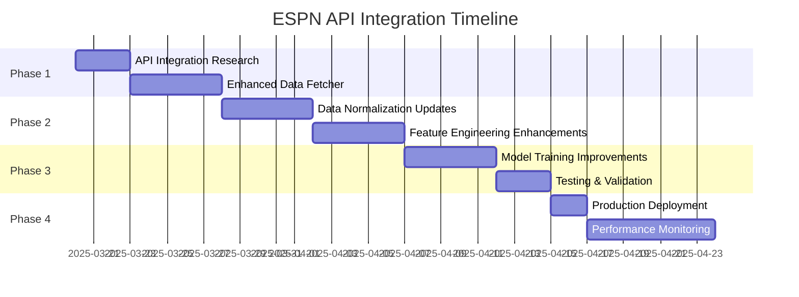

# ESPN Hidden API Integration Plan for ML Sports Edge

## Overview

This document outlines the implementation plan for integrating ESPN's hidden API endpoints into our ML Sports Edge prediction system. The ESPN API provides rich, comprehensive data across multiple sports without requiring authentication, making it an ideal primary data source for our ML models.

## Benefits of ESPN API Integration

1. **Comprehensive Data**: ESPN provides detailed statistics, player metrics, and game information
2. **Wide Sports Coverage**: Includes all major sports and many niche sports
3. **No Authentication Required**: More reliable access compared to authenticated APIs
4. **Consistent Data Structure**: Similar format across different sports
5. **Real-time Updates**: Frequent data updates for live games

## Implementation Phases



## Phase 1: API Integration Research and Enhanced Data Fetcher

### 1.1 API Endpoint Mapping

Map all relevant ESPN API endpoints for each sport:

| Sport | Primary Endpoints | Secondary Endpoints |
|-------|------------------|---------------------|
| NBA | `/basketball/nba/scoreboard` | `/basketball/nba/teams/{id}`, `/basketball/nba/news` |
| WNBA | `/basketball/wnba/scoreboard` | `/basketball/wnba/teams/{id}`, `/basketball/wnba/news` |
| MLB | `/baseball/mlb/scoreboard` | `/baseball/mlb/teams/{id}`, `/baseball/mlb/news` |
| NHL | `/hockey/nhl/scoreboard` | `/hockey/nhl/teams/{id}`, `/hockey/nhl/news` |
| NFL | `/football/nfl/scoreboard` | `/football/nfl/teams/{id}`, `/football/nfl/news` |
| NCAA Basketball | `/basketball/mens-college-basketball/scoreboard` | `/basketball/mens-college-basketball/teams/{id}` |
| NCAA Football | `/football/college-football/scoreboard` | `/football/college-football/teams/{id}` |
| Formula 1 | `/racing/f1/scoreboard` | `/racing/f1/teams/{id}`, `/racing/f1/news` |
| Soccer | `/soccer/{league}/scoreboard` | `/soccer/{league}/teams/{id}`, `/soccer/{league}/news` |

### 1.2 Enhanced Data Fetcher Implementation

Update the `fetch-enhanced.js` module to include comprehensive ESPN API data collection:

```javascript
// ESPN API configuration
const ESPN_API_CONFIG = {
  BASE_URL: 'https://site.api.espn.com/apis/site/v2/sports',
  ENDPOINTS: {
    SCOREBOARD: '{sport}/{league}/scoreboard',
    TEAM: '{sport}/{league}/teams/{teamId}',
    NEWS: '{sport}/{league}/news',
    STANDINGS: '{sport}/{league}/standings',
    ATHLETES: '{sport}/{league}/athletes/{athleteId}',
    GAME_SUMMARY: '{sport}/{league}/summary?event={gameId}'
  },
  SPORTS_MAPPING: {
    NBA: { sport: 'basketball', league: 'nba' },
    WNBA: { sport: 'basketball', league: 'wnba' },
    MLB: { sport: 'baseball', league: 'mlb' },
    NHL: { sport: 'hockey', league: 'nhl' },
    NFL: { sport: 'football', league: 'nfl' },
    NCAA_MENS: { sport: 'basketball', league: 'mens-college-basketball' },
    NCAA_WOMENS: { sport: 'basketball', league: 'womens-college-basketball' },
    NCAA_FOOTBALL: { sport: 'football', league: 'college-football' },
    FORMULA1: { sport: 'racing', league: 'f1' },
    SOCCER_EPL: { sport: 'soccer', league: 'eng.1' },
    SOCCER_MLS: { sport: 'soccer', league: 'usa.1' }
  }
};

/**
 * Fetch data from ESPN API
 * @param {string} sport - Sport key
 * @param {string} endpoint - Endpoint key
 * @param {Object} params - URL parameters
 * @returns {Promise<Object>} - ESPN data
 */
async function fetchESPNData(sport, endpoint, params = {}) {
  try {
    const sportMapping = ESPN_API_CONFIG.SPORTS_MAPPING[sport];
    if (!sportMapping) {
      console.log(`No ESPN API mapping for ${sport}`);
      return null;
    }

    let endpointUrl = ESPN_API_CONFIG.ENDPOINTS[endpoint]
      .replace('{sport}', sportMapping.sport)
      .replace('{league}', sportMapping.league);
    
    // Replace parameters in the URL
    Object.entries(params).forEach(([key, value]) => {
      endpointUrl = endpointUrl.replace(`{${key}}`, value);
    });
    
    const url = `${ESPN_API_CONFIG.BASE_URL}/${endpointUrl}`;
    
    console.log(`Fetching ESPN data for ${sport} (${endpoint})...`);
    const response = await fetchWithRateLimit(url, {}, 'ESPN_API');
    
    // Save data to file
    const filename = `${sport.toLowerCase()}_espn_${endpoint.toLowerCase()}_${new Date().toISOString().split('T')[0]}.json`;
    saveToFile(filename, response);
    
    return response;
  } catch (error) {
    console.error(`Error fetching ESPN data for ${sport} (${endpoint}):`, error.message);
    return null;
  }
}
```

### 1.3 Historical Data Collection

Implement a process to collect and store historical data from ESPN:

```javascript
/**
 * Fetch historical game data from ESPN
 * @param {string} sport - Sport key
 * @param {string} startDate - Start date (YYYYMMDD)
 * @param {string} endDate - End date (YYYYMMDD)
 * @returns {Promise<Array>} - Historical games
 */
async function fetchHistoricalESPNData(sport, startDate, endDate) {
  const sportMapping = ESPN_API_CONFIG.SPORTS_MAPPING[sport];
  if (!sportMapping) {
    console.log(`No ESPN API mapping for ${sport}`);
    return [];
  }
  
  const games = [];
  let currentDate = new Date(startDate.substring(0, 4), 
                            parseInt(startDate.substring(4, 6)) - 1, 
                            startDate.substring(6, 8));
  const endDateObj = new Date(endDate.substring(0, 4), 
                             parseInt(endDate.substring(4, 6)) - 1, 
                             endDate.substring(6, 8));
  
  while (currentDate <= endDateObj) {
    const dateStr = currentDate.toISOString().split('T')[0].replace(/-/g, '');
    const url = `${ESPN_API_CONFIG.BASE_URL}/${sportMapping.sport}/${sportMapping.league}/scoreboard?dates=${dateStr}`;
    
    try {
      console.log(`Fetching historical data for ${sport} on ${dateStr}...`);
      const data = await fetchWithRateLimit(url, {}, 'ESPN_API');
      
      if (data && data.events) {
        games.push(...data.events);
      }
      
      // Save data to file
      const filename = `${sport.toLowerCase()}_espn_historical_${dateStr}.json`;
      saveToFile(filename, data);
      
      // Respect rate limits
      await new Promise(resolve => setTimeout(resolve, 1000));
    } catch (error) {
      console.error(`Error fetching historical data for ${sport} on ${dateStr}:`, error.message);
    }
    
    // Move to next day
    currentDate.setDate(currentDate.getDate() + 1);
  }
  
  return games;
}
```

## Phase 2: Data Normalization and Feature Engineering

### 2.1 Enhanced Data Normalization

Update the `normalize.js` module to handle ESPN data format:

```javascript
/**
 * Normalize ESPN team sports data
 * @param {Object} espnData - ESPN API data
 * @param {string} sport - Sport key
 * @returns {Array} - Normalized games
 */
function normalizeESPNTeamSportData(espnData, sport) {
  if (!espnData || !espnData.events) {
    return [];
  }
  
  return espnData.events.map(event => {
    const date = new Date(event.date);
    const competitors = event.competitions[0]?.competitors || [];
    const homeTeam = competitors.find(team => team.homeAway === 'home')?.team || {};
    const awayTeam = competitors.find(team => team.homeAway === 'away')?.team || {};
    
    // Get odds if available
    const odds = event.competitions[0]?.odds?.[0] || null;
    
    // Get status
    const status = {
      state: event.status?.type?.state || 'pre',
      detail: event.status?.type?.description || ''
    };
    
    // Get venue
    const venue = {
      name: event.competitions[0]?.venue?.fullName || '',
      city: event.competitions[0]?.venue?.address?.city || '',
      state: event.competitions[0]?.venue?.address?.state || '',
      country: event.competitions[0]?.venue?.address?.country || ''
    };
    
    // Get scores
    const homeScore = parseInt(competitors.find(team => team.homeAway === 'home')?.score) || null;
    const awayScore = parseInt(competitors.find(team => team.homeAway === 'away')?.score) || null;
    
    // Get team stats if available
    const homeStats = competitors.find(team => team.homeAway === 'home')?.statistics || [];
    const awayStats = competitors.find(team => team.homeAway === 'away')?.statistics || [];
    
    return {
      id: event.id,
      sport,
      date: date.toISOString(),
      timestamp: date.getTime(),
      homeTeam: {
        id: homeTeam.id,
        name: homeTeam.displayName || 'TBD',
        abbreviation: homeTeam.abbreviation,
        logo: homeTeam.logo,
        record: homeTeam.record,
        score: homeScore,
        stats: homeStats
      },
      awayTeam: {
        id: awayTeam.id,
        name: awayTeam.displayName || 'TBD',
        abbreviation: awayTeam.abbreviation,
        logo: awayTeam.logo,
        record: awayTeam.record,
        score: awayScore,
        stats: awayStats
      },
      status,
      venue,
      odds: {
        spread: odds?.spread || null,
        overUnder: odds?.overUnder || null,
        homeMoneyline: odds?.homeMoneyline || null,
        awayMoneyline: odds?.awayMoneyline || null
      },
      dataSource: {
        espn: true
      }
    };
  });
}
```

### 2.2 Sport-Specific Normalizers

Create specialized normalizers for each sport to handle unique statistics:

```javascript
/**
 * Normalize ESPN NBA data
 * @param {Object} espnData - ESPN API data
 * @returns {Array} - Normalized NBA games
 */
function normalizeESPNNBAData(espnData) {
  const games = normalizeESPNTeamSportData(espnData, 'NBA');
  
  // Add NBA-specific data
  return games.map(game => {
    // Extract NBA-specific stats
    const homeStats = game.homeTeam.stats;
    const awayStats = game.awayTeam.stats;
    
    // Add advanced metrics
    return {
      ...game,
      nbaStats: {
        home: {
          fieldGoalPct: getStatValue(homeStats, 'fieldGoalPct'),
          threePointPct: getStatValue(homeStats, 'threePointPct'),
          rebounds: getStatValue(homeStats, 'rebounds'),
          assists: getStatValue(homeStats, 'assists'),
          steals: getStatValue(homeStats, 'steals'),
          blocks: getStatValue(homeStats, 'blocks'),
          turnovers: getStatValue(homeStats, 'turnovers')
        },
        away: {
          fieldGoalPct: getStatValue(awayStats, 'fieldGoalPct'),
          threePointPct: getStatValue(awayStats, 'threePointPct'),
          rebounds: getStatValue(awayStats, 'rebounds'),
          assists: getStatValue(awayStats, 'assists'),
          steals: getStatValue(awayStats, 'steals'),
          blocks: getStatValue(awayStats, 'blocks'),
          turnovers: getStatValue(awayStats, 'turnovers')
        }
      }
    };
  });
}
```

### 2.3 Enhanced Feature Engineering

Update the `features.js` module to extract additional features from ESPN data:

```javascript
/**
 * Extract additional features from ESPN data
 * @param {Object} game - Normalized game data
 * @param {Array} teamHistory - Team's historical games
 * @returns {Object} - Enhanced features
 */
function extractESPNFeatures(game, teamHistory) {
  // Base features
  const features = {
    // Existing features...
  };
  
  // Add ESPN-specific features
  if (game.dataSource.espn) {
    // Team record features
    if (game.homeTeam.record) {
      const [homeWins, homeLosses] = game.homeTeam.record.split('-').map(Number);
      features.homeTeamWinPct = homeWins / (homeWins + homeLosses);
    }
    
    if (game.awayTeam.record) {
      const [awayWins, awayLosses] = game.awayTeam.record.split('-').map(Number);
      features.awayTeamWinPct = awayWins / (awayWins + awayLosses);
    }
    
    // Sport-specific features
    if (game.sport === 'NBA' && game.nbaStats) {
      features.homeTeamFieldGoalPct = game.nbaStats.home.fieldGoalPct;
      features.awayTeamFieldGoalPct = game.nbaStats.away.fieldGoalPct;
      features.homeTeamThreePointPct = game.nbaStats.home.threePointPct;
      features.awayTeamThreePointPct = game.nbaStats.away.threePointPct;
      features.homeTeamReboundsDiff = game.nbaStats.home.rebounds - game.nbaStats.away.rebounds;
      features.homeTeamAssistsDiff = game.nbaStats.home.assists - game.nbaStats.away.assists;
      features.homeTeamTurnoversDiff = game.nbaStats.home.turnovers - game.nbaStats.away.turnovers;
    }
    
    // Add more sport-specific features...
  }
  
  return features;
}
```

## Phase 3: Model Training Improvements

### 3.1 Enhanced Training Data

Update the training pipeline to incorporate ESPN data:

```javascript
/**
 * Prepare training data with ESPN features
 * @param {Array} games - Normalized games
 * @param {Array} historicalGames - Historical games
 * @returns {Object} - Training data
 */
function prepareESPNTrainingData(games, historicalGames) {
  // Filter games with ESPN data
  const espnGames = games.filter(game => game.dataSource.espn);
  
  // Extract features and labels
  const features = espnGames.map(game => {
    // Extract base features
    const baseFeatures = extractBaseFeatures(game, historicalGames);
    
    // Extract ESPN-specific features
    const espnFeatures = extractESPNFeatures(game, historicalGames);
    
    // Combine features
    return {
      ...baseFeatures,
      ...espnFeatures
    };
  });
  
  // Extract labels
  const spreadLabels = espnGames.map(game => {
    // Determine if home team covered the spread
    const spread = game.odds.spread;
    if (spread === null || game.homeTeam.score === null || game.awayTeam.score === null) {
      return null;
    }
    
    const homeScore = game.homeTeam.score;
    const awayScore = game.awayTeam.score;
    const homeCovered = (homeScore - awayScore) > spread;
    
    return homeCovered ? 1 : 0;
  });
  
  // Filter out games without labels
  const validIndices = spreadLabels.map((label, index) => label !== null ? index : -1).filter(index => index !== -1);
  
  return {
    features: validIndices.map(index => features[index]),
    labels: {
      spread: validIndices.map(index => spreadLabels[index])
      // Add more label types...
    }
  };
}
```

### 3.2 Model Hyperparameter Tuning

Implement hyperparameter tuning for models with ESPN data:

```javascript
/**
 * Tune model hyperparameters
 * @param {Array} trainFeatures - Training features
 * @param {Array} trainLabels - Training labels
 * @returns {Object} - Optimal hyperparameters
 */
async function tuneHyperparameters(trainFeatures, trainLabels) {
  // Define hyperparameter search space
  const hyperparameterSpace = {
    randomForest: {
      nEstimators: [50, 100, 200],
      maxDepth: [10, 15, 20],
      minSamplesLeaf: [1, 2, 4]
    },
    neuralNetwork: {
      learningRate: [0.001, 0.01, 0.1],
      hiddenLayers: [
        [32, 16],
        [64, 32, 16],
        [128, 64, 32]
      ],
      dropout: [0.1, 0.2, 0.3]
    }
  };
  
  // Implement grid search or random search
  // ...
  
  return optimalHyperparameters;
}
```

## Phase 4: Production Deployment and Monitoring

### 4.1 API Endpoint Updates

Update the prediction API endpoints to use ESPN data:

```javascript
/**
 * Get game predictions with ESPN data
 * @param {Object} req - Express request object
 * @param {Object} res - Express response object
 */
async function getGamePredictions(req, res) {
  try {
    // Get query parameters
    const { sport = 'NBA', date, limit } = req.query;
    
    // Validate sport
    const validSports = ['NBA', 'WNBA', 'MLB', 'NHL', 'NCAA_MENS', 'NCAA_WOMENS', 'FORMULA1'];
    if (!validSports.includes(sport.toUpperCase())) {
      return res.status(400).json({
        error: {
          message: `Invalid sport: ${sport}. Valid sports are: ${validSports.join(', ')}`,
          status: 400
        }
      });
    }
    
    // Check cache
    const cacheKey = `game_predictions_${sport.toLowerCase()}_${date || 'today'}`;
    const cachedPredictions = predictionCache.get(cacheKey);
    if (cachedPredictions) {
      return res.json({
        success: true,
        data: cachedPredictions,
        source: 'cache'
      });
    }
    
    // Fetch ESPN data for upcoming games
    const espnData = await fetchESPNData(sport, 'SCOREBOARD');
    
    // Normalize data
    let games;
    if (sport === 'NBA') {
      games = normalizeESPNNBAData(espnData);
    } else if (sport === 'FORMULA1') {
      games = normalizeESPNFormula1Data(espnData);
    } else {
      games = normalizeESPNTeamSportData(espnData, sport);
    }
    
    // Make predictions for each game
    const predictions = await Promise.all(games.map(async game => {
      // Extract features
      const features = extractESPNFeatures(game, []);
      
      // Make predictions
      const spreadPrediction = await predictWithModel(sport, 'spread', features);
      const moneylinePrediction = await predictWithModel(sport, 'moneyline', features);
      const totalPrediction = await predictWithModel(sport, 'total', features);
      
      // Add predictions to game
      return {
        ...game,
        predictions: {
          spread: spreadPrediction,
          moneyline: moneylinePrediction,
          total: totalPrediction
        }
      };
    }));
    
    // Apply limit if provided
    const limitedPredictions = limit ? predictions.slice(0, parseInt(limit)) : predictions;
    
    // Cache predictions
    predictionCache.set(cacheKey, limitedPredictions);
    
    res.json({
      success: true,
      count: limitedPredictions.length,
      data: limitedPredictions,
      source: 'model'
    });
  } catch (error) {
    console.error('Error getting game predictions:', error);
    res.status(500).json({
      error: {
        message: 'Error fetching game predictions',
        status: 500
      }
    });
  }
}
```

### 4.2 Performance Monitoring

Implement monitoring for ESPN API integration:

```javascript
/**
 * Monitor ESPN API performance
 * @returns {Object} - Performance metrics
 */
function monitorESPNAPIPerformance() {
  return {
    requestCount: espnRequestCount,
    successRate: espnSuccessCount / espnRequestCount,
    averageResponseTime: espnTotalResponseTime / espnRequestCount,
    errorRate: espnErrorCount / espnRequestCount,
    lastError: lastESPNError
  };
}
```

## Implementation Checklist

- [ ] **Phase 1: API Integration**
  - [ ] Map all ESPN API endpoints
  - [ ] Implement enhanced data fetcher
  - [ ] Set up historical data collection

- [ ] **Phase 2: Data Processing**
  - [ ] Update data normalization for ESPN format
  - [ ] Create sport-specific normalizers
  - [ ] Enhance feature engineering

- [ ] **Phase 3: Model Improvements**
  - [ ] Update training data preparation
  - [ ] Implement hyperparameter tuning
  - [ ] Train models with ESPN data

- [ ] **Phase 4: Deployment**
  - [ ] Update prediction API endpoints
  - [ ] Set up performance monitoring
  - [ ] Deploy to production

## Conclusion

Integrating ESPN's hidden API will significantly enhance our ML Sports Edge prediction system by providing richer, more comprehensive data across multiple sports. The implementation plan outlined above provides a structured approach to incorporating ESPN data into our existing ML pipeline, from data collection to model training and deployment.

By leveraging ESPN's data alongside our existing sources, we can create more accurate predictions and expand our coverage to additional sports, ultimately providing more value to our users.