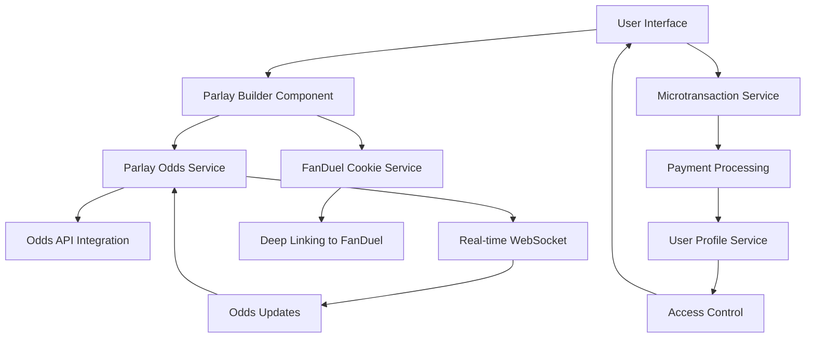
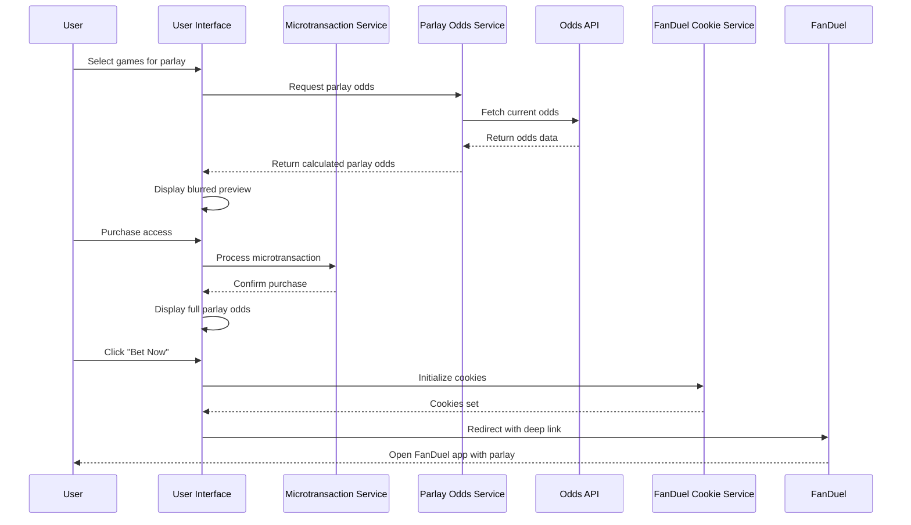
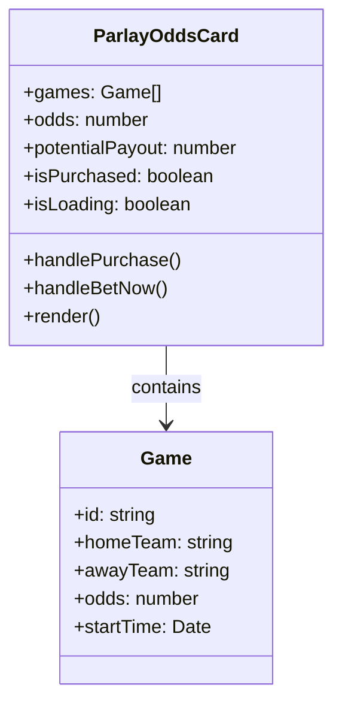
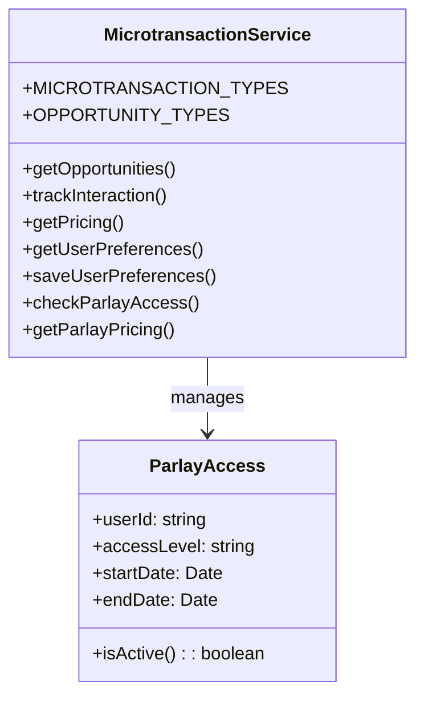

# Live Parlay Odds Microtransaction Implementation Plan

## Overview

This document outlines the implementation plan for a new microtransaction feature: Live Parlay Odds. This feature will allow users to purchase access to real-time parlay odds, which combine multiple bets into a single wager with higher potential payouts. This premium feature will enhance our betting offerings and provide additional revenue through microtransactions.

## Business Value

- **Revenue Generation**: New microtransaction opportunity priced at $2.99
- **User Engagement**: Increases time spent on the platform by providing valuable betting information
- **Competitive Advantage**: Few sports betting apps offer live parlay odds as a standalone feature
- **Affiliate Conversion**: Higher conversion rates to FanDuel for parlay bets, which typically have higher margins for sportsbooks

## Feature Requirements

### Functional Requirements

1. **Live Parlay Odds Display**
   - Show real-time parlay odds for combinations of games
   - Update odds automatically as underlying game odds change
   - Support 2-team, 3-team, and 4-team parlays
   - Display potential payout for standard bet amounts ($10, $50, $100)

2. **Microtransaction Purchase Flow**
   - Allow users to purchase access to live parlay odds for $2.99
   - Provide a preview of blurred parlay odds before purchase
   - Implement one-click purchase for returning customers
   - Support purchase of daily, weekly, or monthly access

3. **FanDuel Integration**
   - Implement "Bet Now" button that deep links to FanDuel parlay builder
   - Pass selected games and bet amounts to FanDuel via URL parameters
   - Ensure cookies are set for tracking conversions
   - Support direct parlay creation in FanDuel app

4. **User Experience**
   - Implement a dedicated "Parlay Center" section in the app
   - Allow users to select games to include in parlays
   - Provide visual indicators for good value parlays
   - Show historical performance of similar parlays

### Technical Requirements

1. **Data Integration**
   - Connect to odds API to get real-time odds for individual games
   - Implement parlay odds calculation algorithm
   - Set up WebSocket connection for live odds updates
   - Cache odds data to reduce API calls

2. **Microtransaction Service Updates**
   - Add new microtransaction type: `LIVE_PARLAY_ODDS`
   - Implement pricing tiers (daily: $2.99, weekly: $9.99, monthly: $24.99)
   - Track purchases and access rights in user profile
   - Implement expiration logic for time-limited access

3. **FanDuel Cookie Integration**
   - Update cookie service to include parlay-specific data
   - Generate deep links to FanDuel parlay builder
   - Track parlay-specific conversions
   - Implement A/B testing for different parlay presentations

4. **UI Components**
   - Create `ParlayOddsCard` component for displaying parlay options
   - Implement `ParlayBuilder` component for selecting games
   - Create `ParlayMicrotransactionModal` for purchase flow
   - Develop `ParlayHistoryChart` to show historical performance

## Implementation Plan

### Phase 1: Core Infrastructure (Week 1)

1. **Update Microtransaction Service**
   - Add `LIVE_PARLAY_ODDS` to `MICROTRANSACTION_TYPES`
   - Implement pricing logic for different access durations
   - Add methods to check if user has active parlay access
   - Update tracking to include parlay-specific events

2. **Parlay Odds Calculation Service**
   - Create new service for calculating parlay odds
   - Implement algorithms for different sportsbooks' parlay calculations
   - Set up caching mechanism for odds data
   - Create testing framework for odds calculation accuracy

3. **Database Schema Updates**
   - Add parlay purchase records to user profile
   - Create schema for saved parlays
   - Implement expiration logic for time-limited access
   - Set up analytics tracking for parlay interactions

### Phase 2: UI Components (Week 2)

1. **Parlay Builder Component**
   - Create UI for selecting games to include in parlay
   - Implement drag-and-drop interface for adding/removing games
   - Show individual game odds and combined parlay odds
   - Add visual indicators for good value parlays

2. **Parlay Odds Card**
   - Design card component to display parlay odds
   - Implement blurred preview for non-purchased access
   - Show potential payouts for different bet amounts
   - Add "Bet Now" button with FanDuel deep linking

3. **Microtransaction Purchase Modal**
   - Create modal for purchasing parlay odds access
   - Implement different duration options (daily, weekly, monthly)
   - Show benefits of each option
   - Integrate with Stripe for payment processing

4. **Parlay Center Screen**
   - Design dedicated section for parlay functionality
   - Implement navigation and layout
   - Create tabs for different sports and leagues
   - Add section for saved and historical parlays

### Phase 3: Integration and Testing (Week 3)

1. **FanDuel Integration**
   - Update cookie service for parlay-specific tracking
   - Implement deep linking to FanDuel parlay builder
   - Test conversion tracking across different devices
   - Optimize URL parameters for maximum conversion

2. **Live Data Integration**
   - Connect to WebSocket for real-time odds updates
   - Implement background refresh for parlay odds
   - Add visual indicators for odds movements
   - Optimize for minimal battery and data usage

3. **User Testing**
   - Conduct usability testing with beta users
   - Gather feedback on pricing and value perception
   - Test purchase flow and conversion rates
   - Optimize based on initial user feedback

4. **Analytics Integration**
   - Set up tracking for parlay-specific events
   - Create dashboard for monitoring parlay performance
   - Implement A/B testing framework for different presentations
   - Define KPIs for measuring feature success

### Phase 4: Launch and Optimization (Week 4)

1. **Soft Launch**
   - Release to 10% of users
   - Monitor performance and user feedback
   - Fix any critical issues
   - Adjust pricing if necessary

2. **Full Launch**
   - Roll out to all users
   - Promote feature through in-app notifications
   - Highlight in email newsletter
   - Offer limited-time promotional pricing

3. **Post-Launch Optimization**
   - Analyze purchase and conversion data
   - Optimize pricing and presentation
   - Implement improvements based on user feedback
   - Expand to additional sports and bet types

4. **Marketing and Growth**
   - Create targeted campaigns for high-value users
   - Implement referral bonuses for parlay purchases
   - Develop content marketing around successful parlays
   - Partner with FanDuel for co-marketing opportunities

## Technical Architecture

## Data Flow

## Component Design

### ParlayOddsCard Component

### Microtransaction Service Updates

## Risk Assessment

| Risk | Impact | Likelihood | Mitigation |
|------|--------|------------|------------|
| Odds API reliability issues | High | Medium | Implement fallback providers and caching |
| Low conversion rate | Medium | Medium | A/B test different pricing and presentations |
| User confusion about value | Medium | High | Clear messaging and free trial period |
| FanDuel deep linking issues | High | Low | Thorough testing across devices and fallback options |
| Calculation errors in parlay odds | High | Low | Extensive testing and validation against known values |
| Performance issues with real-time updates | Medium | Medium | Optimize update frequency and implement batching |

## Success Metrics

1. **Revenue Metrics**
   - Total revenue from parlay odds microtransactions
   - Conversion rate from preview to purchase
   - Average revenue per user
   - Retention rate for weekly and monthly subscriptions

2. **Engagement Metrics**
   - Time spent in parlay builder
   - Number of parlays created per user
   - Frequency of parlay odds checks
   - Saved parlays per user

3. **Conversion Metrics**
   - Click-through rate to FanDuel
   - Conversion rate to completed bets
   - Average bet amount
   - Return rate from FanDuel to app

4. **User Satisfaction Metrics**
   - Feature satisfaction rating
   - Value perception rating
   - Net Promoter Score impact
   - Feature-specific feedback

## Next Steps

1. Update the microtransaction service to include the new parlay odds type
2. Create the parlay odds calculation service
3. Design the UI components for the parlay builder
4. Implement the FanDuel deep linking integration
5. Set up the analytics tracking for the new feature

## Conclusion

The Live Parlay Odds microtransaction feature represents a significant opportunity to enhance our betting offerings while generating additional revenue. By providing valuable, real-time parlay odds information, we can increase user engagement and drive higher conversion rates to our affiliate partners. The phased implementation approach allows for careful testing and optimization at each stage, ensuring a high-quality user experience and strong business performance.