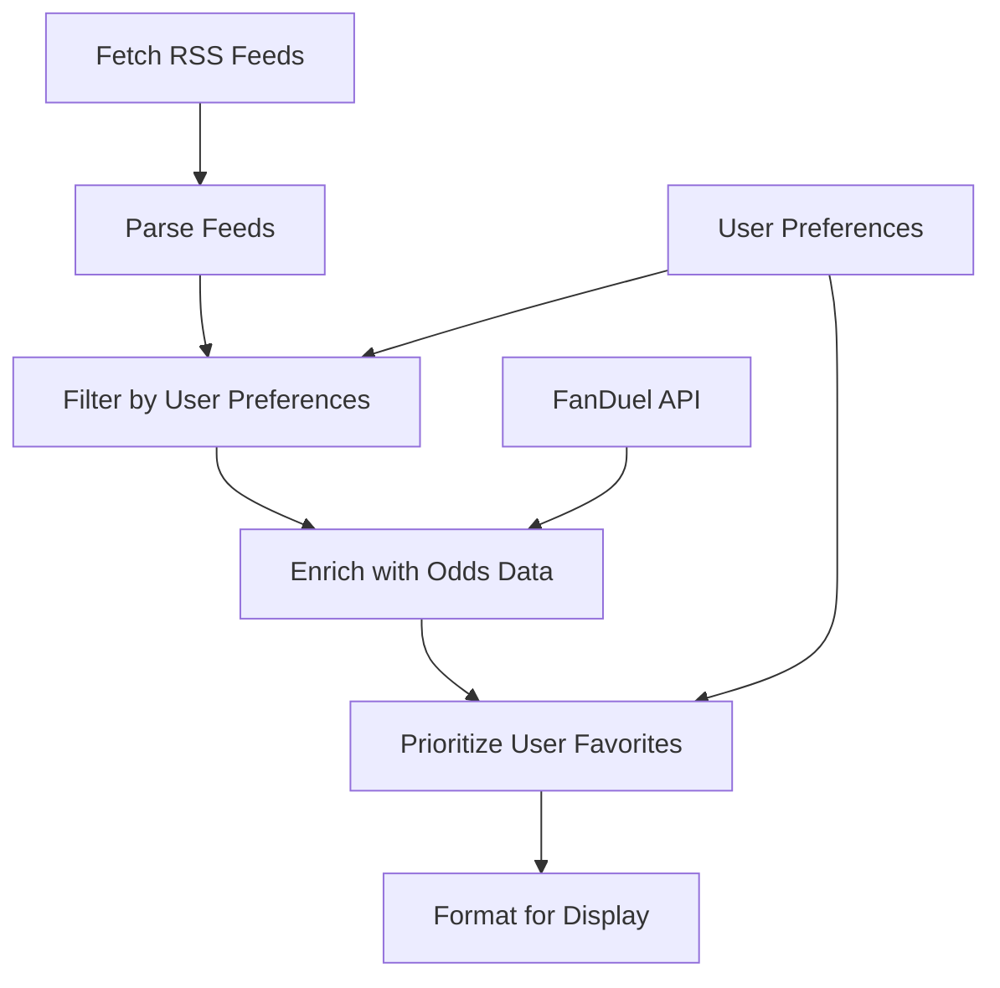

# RSS Feed Betting Integration Plan

This document outlines the plan for enhancing the RSS feed integration with betting features, focusing on user preferences for odds and statistics, and FanDuel affiliate integration.

## 1. User Preferences Enhancement

### A. Expand User Preferences Model
```javascript
// Enhanced user preferences structure
const ENHANCED_PREFERENCES = {
  rssFeeds: {
    // Existing RSS feed preferences
    enabledSources: ['NBA', 'NFL', 'MLB', 'NHL', 'F1', 'UFC', 'SOCCER', 'TENNIS'],
    maxItems: 10,
    refreshIntervalMinutes: 30,
    keywordFilters: {
      include: [],
      exclude: []
    }
  },
  favorites: {
    teams: [], // Array of favorite team IDs
    players: [], // Array of favorite player IDs
    leagues: [], // Array of favorite league IDs
    matchups: [] // Array of favorite matchup combinations (e.g., "Lakers-Celtics")
  },
  betting: {
    showOdds: true,
    oddsFormat: 'american', // american, decimal, fractional
    defaultStake: 10,
    affiliateId: 'default' // FanDuel affiliate ID
  },
  ui: {
    // Existing UI preferences
    newsTicker: {
      enabled: true,
      scrollSpeed: 'medium',
      pauseOnHover: true
    }
  }
};
```

### B. Create Favorites Selection UI
- Add a "Favorites" tab to the preferences modal
- Allow users to search and select favorite teams, players, and leagues
- Store these preferences for personalized content filtering

## 2. Odds and Statistics Integration

### A. Enhance RSS Feed Processing


### B. Odds Data Enrichment Service
- Create a new service to fetch and cache odds data from FanDuel API
- Match odds data with news items based on teams, players, and events
- Prioritize items with odds data for user's favorites

```javascript
// Pseudo-code for odds enrichment
async function enrichNewsItemsWithOdds(newsItems, userFavorites) {
  // Get latest odds data
  const oddsData = await getOddsData();
  
  // Enrich each news item with relevant odds
  const enrichedItems = newsItems.map(item => {
    const matchingOdds = findMatchingOdds(item, oddsData);
    if (matchingOdds) {
      return {
        ...item,
        odds: matchingOdds,
        hasBettingOpportunity: true
      };
    }
    return item;
  });
  
  // Prioritize items related to user favorites
  return sortByUserPreferences(enrichedItems, userFavorites);
}
```

## 3. Betting Button Integration

### A. News Ticker Item Enhancement
- Add "Bet Now" button to news items with odds information
- Style the button to be visible but non-intrusive
- Connect all buttons to FanDuel affiliate links

```jsx
// Enhanced news item rendering
{sportsEvents.map((event) => (
  <div key={event.id} className="news-item">
    <span className="news-date">{event.date}</span>
    <span className="news-teams">{event.teams}</span>
    <span className="news-time">{event.time}</span>
    <span className="news-sport"> | {event.sport}</span>
    
    {/* Display odds if available */}
    {event.odds && (
      <span className="news-odds">{formatOdds(event.odds, preferences.betting.oddsFormat)}</span>
    )}
    
    {/* Bet Now button for items with betting opportunities */}
    {event.hasBettingOpportunity && (
      <a 
        href={generateFanDuelAffiliateLink(event, preferences.betting.affiliateId)}
        className="bet-now-button"
        target="_blank"
        rel="noopener noreferrer"
      >
        Bet Now
      </a>
    )}
    
    {/* Render image if available */}
    {event.image && (
      
    )}
  </div>
))}
```

### B. FanDuel Affiliate Link Generator
- Create a utility to generate FanDuel affiliate links
- Include user's affiliate ID in all links
- Track clicks and conversions for analytics

```javascript
/**
 * Generate FanDuel affiliate link for a news item
 * @param {Object} event - News event with teams, sport, and odds info
 * @param {string} affiliateId - User's FanDuel affiliate ID
 * @returns {string} FanDuel affiliate link
 */
function generateFanDuelAffiliateLink(event, affiliateId) {
  // Base FanDuel URL
  const baseUrl = 'https://www.fanduel.com/';
  
  // Construct path based on sport and event
  let path = '';
  switch (event.sport) {
    case 'NBA':
      path = 'nba/games';
      break;
    case 'NFL':
      path = 'nfl/games';
      break;
    // Add cases for other sports
    default:
      path = 'sports';
  }
  
  // Add event-specific parameters if available
  const params = new URLSearchParams();
  if (event.eventId) {
    params.append('eventId', event.eventId);
  }
  
  // Always add affiliate ID
  params.append('aid', affiliateId || 'default');
  
  // Track the source
  params.append('src', 'newsticker');
  
  return `${baseUrl}${path}?${params.toString()}`;
}
```

## 4. CSS Styling for Betting Elements

### A. Bet Now Button Styling
```css
/* Bet Now button styling */
.bet-now-button {
  background-color: #1AA333; /* FanDuel green */
  color: white;
  border-radius: 4px;
  padding: 4px 8px;
  font-size: 12px;
  font-weight: bold;
  margin-left: 10px;
  text-decoration: none;
  transition: background-color 0.2s ease;
}

.bet-now-button:hover {
  background-color: #158C2B;
}

/* Odds display styling */
.news-odds {
  color: #F5A623; /* Gold color for odds */
  font-weight: bold;
  margin-left: 10px;
}
```

## 5. Implementation Timeline

1. **Phase 1: User Preferences Enhancement** (2 days)
   - Update user preferences model
   - Create UI for selecting favorite teams, players, and leagues

2. **Phase 2: Odds Data Integration** (3 days)
   - Create odds data fetching and caching service
   - Implement matching algorithm for news items and odds
   - Add prioritization based on user favorites

3. **Phase 3: Betting Button Integration** (2 days)
   - Update news ticker item rendering
   - Implement FanDuel affiliate link generator
   - Add tracking for clicks and conversions

4. **Phase 4: Testing and Optimization** (2 days)
   - Test across different devices and browsers
   - Optimize performance
   - Ensure accessibility compliance

## 6. Technical Considerations

- **Caching Strategy**: Implement aggressive caching for odds data to minimize API calls
- **Fallback Mechanism**: Display generic betting links if specific odds are unavailable
- **Performance**: Ensure the additional betting features don't impact page load time
- **Compliance**: Ensure all betting-related features comply with relevant regulations

## 7. Key Requirements

- User preferences should prioritize displaying odds and statistics for user's favorite player, team, matchup, etc.
- The button to purchase the information (odds) should be frequent, though non-intrusive throughout the site
- Every button needs to be connected to FanDuel affiliate link