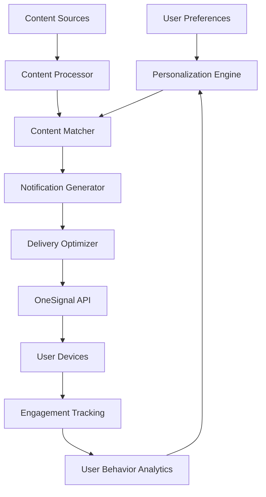

# Notification Personalization System Overview

This document provides a comprehensive overview of the notification personalization system for AI Sports Edge. It serves as an index to the detailed documentation for each component of the system.

## Introduction

The notification personalization system enhances the user experience by delivering highly relevant, timely notifications based on user preferences, behavior, and interests. By personalizing notifications, we can increase user engagement, improve retention, and provide more value to our users.

## System Architecture

The notification personalization system consists of several key components:

1. **User Preferences**: Stores user preferences for notification types, frequency, quiet hours, and content interests.
2. **Personalization Engine**: Uses user preferences and behavior analytics to personalize notification content and delivery.
3. **Content Sources**: Provides content for notifications, including RSS feeds, predictions, betting opportunities, and game reminders.
4. **Content Processor**: Processes content to extract relevant metadata, such as teams, players, and betting opportunities.
5. **Content Matcher**: Matches content with user interests based on preferences and behavior.
6. **Notification Generator**: Creates personalized notification content based on templates and user preferences.
7. **Delivery Optimizer**: Optimizes notification delivery based on time, frequency, and priority.
8. **OneSignal API**: Delivers notifications to user devices.
9. **Engagement Tracking**: Tracks user engagement with notifications to improve future personalization.

## Documentation Index

### 1. [Notification Personalization Plan](notification-personalization-plan.md)

This document outlines the overall plan for implementing the notification personalization system, including:

- Current state analysis
- Personalization enhancement plan
- Implementation phases
- Technical considerations
- Success metrics

### 2. [Personalized Notification Service Implementation](personalized-notification-service-implementation.md)

This document provides detailed implementation details for the personalized notification service, including:

- File structure
- Notification templates
- Personalized notification service
- Database schema updates
- Implementation phases

### 3. [RSS Feed Notification Integration](rss-feed-notification-integration.md)

This document outlines the integration between the RSS feed system and the personalized notification service, including:

- RSS feed processor enhancement
- Content matching system
- Notification trigger
- RSS feed notification cloud function
- Metadata extraction functions
- User interface updates

### 4. [Notification Personalization Testing Strategy](notification-personalization-testing-strategy.md)

This document outlines the testing strategy for the personalized notification system, including:

- Testing objectives
- Testing approach (unit, integration, end-to-end, performance, user acceptance)
- Test data
- Test environment setup
- Test execution plan

### 5. [RSS Feed Analytics Integration](rss-feed-analytics-integration.md)

This document outlines the analytics integration for the RSS feed system, including:

- Analytics service
- Feed tracking
- Item tracking
- Betting tracking
- User preferences tracking
- Analytics dashboard

## Key Features

### 1. Enhanced User Notification Preferences

Users can customize their notification experience with the following preferences:

- **Notification Types**: Enable/disable different types of notifications (predictions, value bets, game reminders, model performance, RSS alerts).
- **Frequency Controls**: Set the frequency of notifications (low, normal, high).
- **Quiet Hours**: Specify hours during which notifications should not be sent.
- **Maximum Notifications**: Set a maximum number of notifications per day.
- **Priority Only**: Only receive high-priority notifications.
- **Content Preferences**: Choose what content to include in notifications (odds, stats, news).
- **Channel Preferences**: Select which channels to receive notifications on (push, email, in-app).
- **RSS Feed Alerts**: Configure RSS feed notification preferences (favorite teams only, favorite players only, keyword alerts).

### 2. Notification Content Personalization

Notifications are personalized based on user preferences and interests:

- **Favorite Team Highlighting**: Notifications highlight the user's favorite teams.
- **Odds Format**: Odds are displayed in the user's preferred format (American, decimal, fractional).
- **Dynamic Content**: Notification content is dynamically generated based on user preferences.
- **Template System**: A template system allows for consistent, personalized notification content.

### 3. Notification Delivery Optimization

Notification delivery is optimized to respect user preferences and maximize engagement:

- **Time-Based Delivery**: Notifications respect quiet hours and are sent at appropriate times.
- **Frequency Management**: The system limits the number of notifications to prevent notification fatigue.
- **Notification Prioritization**: Notifications are prioritized based on user interests and behavior.
- **Channel Selection**: Notifications are sent through the user's preferred channels.

### 4. RSS Feed Integration

The RSS feed system is integrated with the notification system to provide timely, relevant news updates:

- **Team and Player Extraction**: The system extracts teams and players mentioned in RSS feed items.
- **Betting Opportunity Detection**: The system identifies betting opportunities in RSS feed items.
- **Injury Information Extraction**: The system extracts injury information from RSS feed items.
- **Game Information Extraction**: The system extracts game information from RSS feed items.
- **Relevance Scoring**: RSS feed items are scored based on relevance to the user.

### 5. Analytics and Optimization

The system includes analytics and optimization features to improve the notification experience:

- **Engagement Tracking**: The system tracks user engagement with notifications.
- **User Behavior Analytics**: User behavior is analyzed to improve personalization.
- **Automatic Optimization**: The system automatically optimizes notification content and delivery based on user behavior.
- **Analytics Dashboard**: An analytics dashboard provides insights into notification performance.

## Implementation Roadmap

### Phase 1: Enhanced User Preferences (Weeks 1-2)
- Update user preference schema
- Create notification preferences UI
- Implement quiet hours and frequency controls

### Phase 2: Content Personalization (Weeks 3-4)
- Implement notification templates
- Create dynamic content generation
- Add personalization based on user favorites

### Phase 3: Delivery Optimization (Weeks 5-6)
- Implement time-based delivery
- Add frequency management
- Create notification prioritization system

### Phase 4: RSS Feed Integration (Weeks 7-8)
- Enhance RSS feed system to trigger notifications
- Implement keyword-based alerts
- Add team and player-specific notifications

### Phase 5: Analytics and Optimization (Weeks 9-10)
- Implement notification engagement tracking
- Create analytics dashboard
- Add automatic optimization based on user behavior

## Technical Considerations

### Database Schema Updates

The following database schema updates are required:

1. **User Preferences**: Update the user preferences schema to include notification preferences.
2. **Notification Logs**: Create a new collection to log notifications sent to users.
3. **Notification Engagements**: Create a new collection to track user engagement with notifications.
4. **User Analytics**: Update the user schema to include analytics data for notification engagement.
5. **RSS Items**: Update the RSS items schema to include extracted metadata.

### Performance Considerations

To ensure good performance, the following considerations should be addressed:

1. **Batch Processing**: Process notifications in batches to reduce database operations.
2. **Caching**: Cache frequently accessed user preferences and templates.
3. **Cloud Functions**: Use cloud functions for background processing of notifications.
4. **Indexing**: Create appropriate indexes for database queries.
5. **Rate Limiting**: Implement rate limiting for notification delivery.

### Security Considerations

To ensure security, the following considerations should be addressed:

1. **Authentication**: Ensure proper authentication for notification preferences.
2. **Validation**: Validate user input for notification settings.
3. **Rate Limiting**: Implement rate limiting for notification APIs.
4. **Data Privacy**: Ensure that notification content respects user privacy.
5. **Access Control**: Implement proper access control for notification logs and analytics.

## Success Metrics

The success of the notification personalization system will be measured by the following metrics:

1. **Notification Engagement Rate**: Percentage of notifications that are opened or clicked.
2. **Notification Opt-Out Rate**: Percentage of users who disable notifications.
3. **User Retention**: Retention rate for users who receive personalized notifications.
4. **User Satisfaction**: User satisfaction with notification content and frequency.
5. **Betting Conversion Rate**: Conversion rate for betting opportunities in notifications.

## Conclusion

The notification personalization system will significantly enhance the user experience by delivering highly relevant, timely notifications based on user preferences, behavior, and interests. By implementing this system, we can increase user engagement, improve retention, and provide more value to our users.