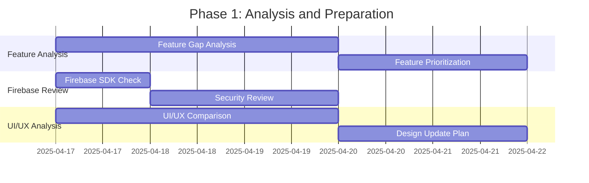
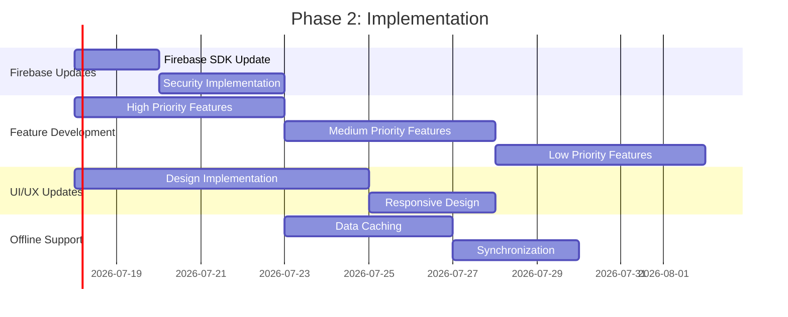
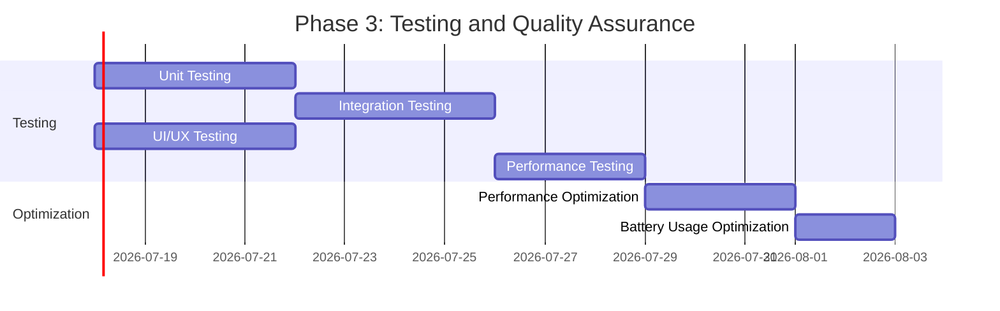
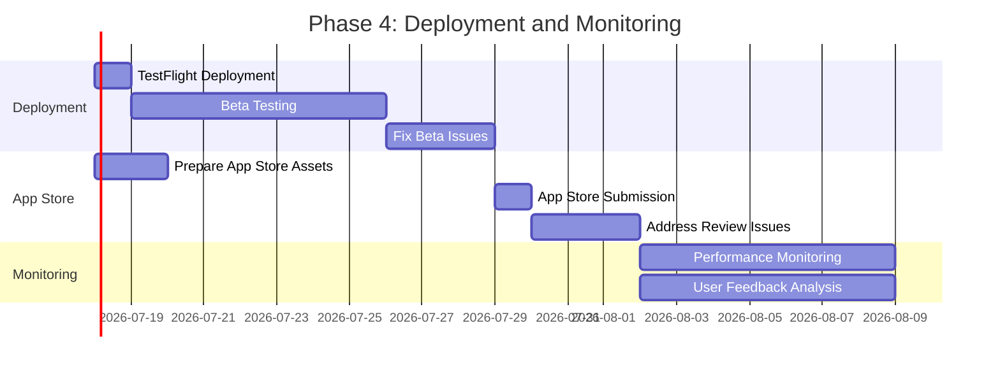

# iOS Mobile App Update Plan for AI Sports Edge

## Overview

This document outlines the comprehensive plan for updating the AI Sports Edge iOS mobile app to match the web app functionality, with a focus on Firebase compatibility and feature parity.

## Current State Analysis

### Web Application
- Uses Firebase for authentication, data storage, and real-time updates
- Recently improved Firebase security by moving hardcoded credentials to environment variables
- Fixed GoDaddy hosting compatibility issues
- Uses a modern webpack configuration for building

### iOS Application
- Native iOS app (Swift)
- Uses Firebase for backend services
- Firebase configuration is stored in `firebase-config/GoogleService-Info.plist`
- Currently may not have the same feature set as the web app

### Firebase Configuration
- Firebase credentials are properly configured in environment variables for the web app
- iOS app uses the standard Firebase configuration approach with `GoogleService-Info.plist`

## Detailed Plan for iOS App Update

### Phase 1: Analysis and Preparation

1. **Conduct Feature Gap Analysis**
   - Compare web app features with iOS app features
   - Document missing features in iOS app
   - Prioritize features based on importance and complexity

2. **Review Firebase Implementation**
   - Ensure Firebase SDK is up-to-date in iOS app
   - Verify Firebase configuration is correct
   - Check for any security improvements needed in iOS Firebase implementation

3. **Analyze UI/UX Consistency**
   - Compare web app UI/UX with iOS app
   - Identify design inconsistencies
   - Create a design update plan

### Phase 2: Implementation

1. **Update Firebase Integration**
   - Update Firebase SDK if needed
   - Implement any security improvements
   - Ensure proper error handling and logging

2. **Implement Missing Features**
   - Develop missing features based on prioritization
   - Ensure cross-platform consistency in functionality
   - Implement proper error handling and edge cases

3. **Update UI/UX**
   - Update iOS app UI to match web app design
   - Ensure consistent branding and user experience
   - Implement responsive design for different iOS devices

4. **Implement Offline Support**
   - Ensure proper data caching
   - Implement offline-first approach
   - Add synchronization mechanisms

### Phase 3: Testing and Quality Assurance

1. **Unit Testing**
   - Write unit tests for new features
   - Update existing tests if needed
   - Ensure test coverage meets standards

2. **Integration Testing**
   - Test Firebase integration
   - Test cross-platform data consistency
   - Test offline functionality

3. **UI/UX Testing**
   - Test on different iOS devices and versions
   - Conduct usability testing
   - Verify design consistency with web app

4. **Performance Testing**
   - Test app performance under different conditions
   - Optimize slow operations
   - Ensure efficient battery usage

### Phase 4: Deployment and Monitoring

1. **Beta Testing**
   - Deploy to TestFlight
   - Gather feedback from beta testers
   - Fix issues based on feedback

2. **App Store Submission**
   - Prepare App Store assets
   - Submit for App Store review
   - Address any App Store review issues

3. **Post-Launch Monitoring**
   - Monitor app performance
   - Track user feedback
   - Plan for future updates

## Technical Considerations

### Firebase Integration
- Ensure proper initialization of Firebase in the iOS app
- Implement secure authentication flows
- Set up proper Firestore security rules
- Configure Firebase Analytics for tracking

### Cross-Platform Consistency
- Ensure data models are consistent between web and iOS
- Implement shared validation logic where possible
- Use consistent naming conventions

### Performance Optimization
- Implement lazy loading for Firebase services
- Optimize image loading and caching
- Minimize network requests

### Security Considerations
- Implement proper authentication and authorization checks
- Secure sensitive data storage
- Follow iOS security best practices

## Resource Requirements

### Development Team
- iOS Developer(s) with Swift experience
- Firebase specialist
- UI/UX designer with iOS expertise
- QA engineer with mobile testing experience

### Tools and Infrastructure
- Xcode and iOS development environment
- Firebase console access
- TestFlight for beta testing
- Continuous Integration/Continuous Deployment (CI/CD) pipeline

## Risk Assessment and Mitigation

| Risk | Impact | Probability | Mitigation |
|------|--------|-------------|------------|
| Firebase API changes | High | Low | Stay updated with Firebase release notes, implement version-specific code if needed |
| iOS version compatibility issues | Medium | Medium | Test on multiple iOS versions, implement fallbacks for newer iOS features |
| Performance issues on older devices | Medium | Medium | Implement performance monitoring, optimize resource-intensive operations |
| App Store rejection | High | Low | Follow App Store guidelines strictly, address potential issues before submission |
| Data synchronization issues | High | Medium | Implement robust error handling and conflict resolution |

## Implementation Details

### Firebase Security Implementation for iOS

1. **Secure Storage of API Keys**
   - Use proper key storage mechanisms in iOS (Keychain)
   - Implement obfuscation techniques for sensitive values
   - Consider using Firebase App Check to validate authentic app instances

2. **Authentication Security**
   - Implement secure token storage
   - Add biometric authentication option where appropriate
   - Implement proper session management

3. **Data Security**
   - Implement proper Firestore security rules
   - Encrypt sensitive data at rest
   - Implement secure offline storage

4. **Network Security**
   - Use SSL pinning to prevent MITM attacks
   - Implement proper certificate validation
   - Add network request signing where appropriate

### Feature Implementation Priority

#### High Priority
- User authentication and profile management
- Core sports prediction functionality
- Betting insights and analytics
- Real-time updates for game scores and odds

#### Medium Priority
- Offline mode and data caching
- Push notifications
- Social sharing features
- User preferences and settings

#### Low Priority
- Advanced analytics and visualizations
- Community features
- Integration with third-party services
- Localization for additional languages

## Conclusion

This plan provides a comprehensive roadmap for updating the AI Sports Edge iOS app to match the web app functionality. By following this structured approach, we can ensure a successful implementation with minimal risks and high-quality results.