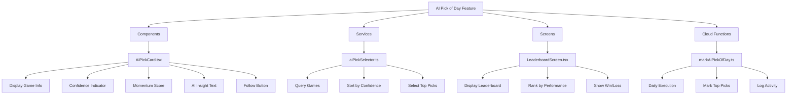

# AI Pick of the Day + Leaderboard Implementation Plan

## Overview

Based on your requirements, I'll implement the AI Pick of the Day feature bundle for the AI Sports Edge app. This feature will showcase the highest confidence AI predictions, display them with insightful context, and track their performance on a leaderboard.

## Components to Implement



## Implementation Details

### 1. AIPickCard.tsx Component

This component will display:
- Team matchup (teamA vs teamB)
- Confidence indicator (color-coded bar)
- Momentum score
- AI insight text
- Follow button (optional)

```typescript
interface AIPickCardProps {
  gameId: string;
  teamA: string;
  teamB: string;
  confidence: number;
  momentumScore: number;
  aiInsightText: string;
  onFollow?: (gameId: string) => void;
}

// Component will include:
// - Color-coded confidence bar (green >80%, yellow 60-80%, red <60%)
// - Insight text with icon (💡 or 📈)
// - Subtle background styling
// - Follow button with star icon
```

### 2. aiPickSelector.ts Service

This service will:
- Query today's games from Firestore
- Sort games by confidence score
- Select top picks (with confidence > 65%)
- Mark the top pick as the AI Pick of the Day
- Return formatted data for AIPickCard components

```typescript
interface AIPickData {
  gameId: string;
  teamA: string;
  teamB: string;
  confidence: number;
  momentumScore: number;
  aiInsightText: string;
  isAIPickOfDay?: boolean;
}

// Functions:
// - getTodaysGames(): Promise<Game[]>
// - getTopPicks(games: Game[], limit: number = 3): AIPickData[]
// - markPickOfDay(gameId: string): Promise<void>
```

### 3. LeaderboardScreen.tsx

This screen will display:
- Ranking of AI picks by performance
- Win/loss record for the past 7 days
- Confidence average
- Performance by sport

```typescript
interface LeaderboardEntry {
  rank: number;
  gameId: string;
  teamA: string;
  teamB: string;
  confidence: number;
  result: 'win' | 'loss' | 'push' | 'pending';
  sport: string;
  createdAt: Timestamp;
}

// Screen will include:
// - Tabs for different time periods (7 days, 30 days, all time)
// - Filters for sports categories
// - Visual indicators for wins (✅) and losses (❌)
// - Sorting options (by confidence, by result)
```

### 4. markAIPickOfDay.ts Cloud Function

This Firebase Cloud Function will:
- Run daily at 9AM ET
- Call the aiPickSelector logic
- Mark top prediction(s) as isAIPickOfDay = true
- Save timestamp to Firestore for logging

```typescript
// Cloud function triggered by Pub/Sub
export const markAIPickOfDay = functions.pubsub
  .schedule('0 9 * * *') // Run at 9 AM ET every day
  .timeZone('America/New_York')
  .onRun(async (context) => {
    // Implementation will:
    // - Get today's games
    // - Select top picks
    // - Mark as Pick of the Day
    // - Log activity
  });
```

## Implementation Approach

I'll implement these components in the following order:

1. **AIPickCard.tsx Component**
   - Create the visual component with all required elements
   - Implement styling for confidence levels and insights
   - Add follow functionality

2. **aiPickSelector.ts Service**
   - Implement Firestore queries for game data
   - Create logic to select top picks by confidence
   - Add functions to mark picks of the day

3. **LeaderboardScreen.tsx**
   - Create the leaderboard UI with ranking system
   - Implement filters and sorting options
   - Connect to Firestore for prediction data

4. **markAIPickOfDay.ts Cloud Function**
   - Set up the scheduled Cloud Function
   - Implement the selection logic
   - Add logging and error handling

## Integration with Existing Code

The implementation will integrate with:
- Existing Firebase configuration
- Authentication system for following picks
- Navigation system for the leaderboard screen
- Styling system for consistent UI

## Next Steps

1. Switch to Code mode to begin implementation
2. Start with the AIPickCard component
3. Implement the service and screen
4. Deploy the Cloud Function
5. Test the complete feature bundle