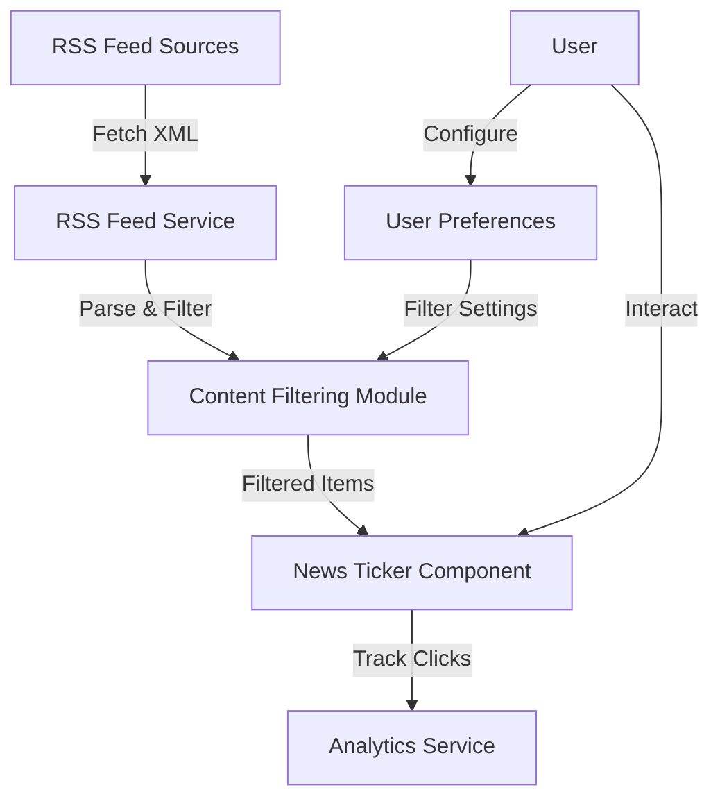

# RSS Feed Integration Implementation Plan

## Overview

This document outlines the comprehensive implementation plan for integrating RSS feeds into the AI Sports Edge app, including content filtering and user preferences features.

## Requirements

1. **Content filtering**: Implement keyword-based filtering to ensure only the most relevant sports odds appear for the user.
2. **User preferences**: Allow users to customize which sports news categories they want to see in the news ticker.
3. **Integration with login page**: Display a scrolling news ticker on the login/sign-in page.
4. **Analytics**: Track user interactions with news items for analytics purposes.

## Architecture

The RSS feed integration will consist of the following components:



## Implementation Plan

### Phase 1: Core RSS Feed Service

1. Create the RSS feed service for fetching and processing feeds
2. Implement XML parsing and feed normalization
3. Set up caching to reduce API calls
4. Create basic API endpoints for retrieving feeds

### Phase 2: Content Filtering

1. Implement the content filtering module with the following features:
   - Keyword-based filtering for sports categories
   - Betting content identification
   - Relevance scoring algorithm
   - Team-specific filtering

2. Integrate the content filtering module with the RSS feed service

### Phase 3: User Preferences

1. Create the user preferences data model in Firestore
2. Implement the user preferences service for saving and loading preferences
3. Create the user preferences UI component
4. Integrate user preferences with the content filtering module

### Phase 4: News Ticker Component

1. Create the news ticker component with the following features:
   - Auto-scrolling with configurable speed
   - Pause on hover
   - Loading, error, and empty states
   - Responsive design
   - Click tracking for analytics

2. Integrate the news ticker component with the login page

### Phase 5: Analytics Integration

1. Implement click tracking for news items
2. Set up analytics events for user interactions
3. Create analytics dashboard for monitoring news item performance

## Detailed Implementation

### 1. RSS Feed Service

```javascript
// api/rssFeeds/fetchRssFeeds.js

const axios = require('axios');
const xml2js = require('xml2js');
const { db } = require('../../config/firebase');
const { doc, setDoc, getDoc, serverTimestamp } = require('firebase/firestore');

// Cache for RSS feeds
const feedCache = {
  items: {},
  timestamp: null
};

/**
 * Fetch and process RSS feeds
 * @param {Array} feedUrls - Array of RSS feed URLs
 * @param {Object} userPreferences - User preferences for filtering
 * @returns {Promise<Array>} Processed feed items
 */
async function fetchAndProcessFeeds(feedUrls, userPreferences = {}) {
  // Check cache first (15 minute cache)
  const now = Date.now();
  if (
    feedCache.timestamp &&
    now - feedCache.timestamp < 15 * 60 * 1000 &&
    Object.keys(feedCache.items).length > 0
  ) {
    console.log('Using cached RSS feeds');
    return filterFeedItems(feedCache.items, userPreferences);
  }
  
  console.log(`Fetching RSS feeds at ${new Date().toISOString()}`);
  
  // Fetch all feeds in parallel
  const feedPromises = feedUrls.map(url => fetchFeed(url));
  const feedResults = await Promise.allSettled(feedPromises);
  
  // Process successful feeds
  const allItems = [];
  const newCache = {};
  
  feedResults.forEach((result, index) => {
    if (result.status === 'fulfilled' && result.value) {
      const url = feedUrls[index];
      const items = result.value;
      
      // Add to cache
      newCache[url] = items;
      
      // Add to all items
      allItems.push(...items);
    }
  });
  
  // Update cache
  feedCache.items = newCache;
  feedCache.timestamp = now;
  
  // Filter and return items
  return filterFeedItems(allItems, userPreferences);
}

/**
 * Fetch a single RSS feed
 * @param {string} url - RSS feed URL
 * @returns {Promise<Array>} Feed items
 */
async function fetchFeed(url) {
  try {
    const response = await axios.get(url, {
      timeout: 60000, // 60 second timeout
      headers: {
        'User-Agent': 'AI Sports Edge RSS Reader'
      }
    });
    
    if (response.status !== 200) {
      throw new Error(`Status code ${response.status}`);
    }
    
    const parser = new xml2js.Parser({
      explicitArray: false,
      trim: true
    });
    
    const result = await parser.parseStringPromise(response.data);
    
    // Extract feed items
    let items = [];
    let source = '';
    
    if (result.rss && result.rss.channel) {
      source = result.rss.channel.title || url;
      items = result.rss.channel.item || [];
    } else if (result.feed) {
      source = result.feed.title || url;
      items = result.feed.entry || [];
    }
    
    // Normalize items
    return normalizeItems(items, source, url);
  } catch (error) {
    console.error(`Error parsing RSS feed: ${error}`);
    return [];
  }
}

/**
 * Normalize feed items to a consistent format
 * @param {Array} items - Feed items
 * @param {string} source - Feed source name
 * @param {string} feedUrl - Feed URL
 * @returns {Array} Normalized items
 */
function normalizeItems(items, source, feedUrl) {
  if (!Array.isArray(items)) {
    items = [items];
  }
  
  return items.map(item => {
    // Handle different RSS formats
    const title = item.title || '';
    const description = item.description || item.summary || '';
    const link = item.link?.href || item.link || '';
    const pubDate = item.pubDate || item.published || item.updated || '';
    const guid = item.guid || item.id || link;
    
    return {
      title,
      description,
      link,
      pubDate,
      guid,
      source,
      feedUrl
    };
  }).filter(item => item.title && item.link);
}

/**
 * Filter feed items based on user preferences
 * @param {Array} items - Feed items
 * @param {Object} userPreferences - User preferences
 * @returns {Array} Filtered items
 */
function filterFeedItems(items, userPreferences) {
  // If no items or empty array, return empty array
  if (!items || (Array.isArray(items) && items.length === 0)) {
    return [];
  }
  
  // If items is an object (cache), convert to array
  if (!Array.isArray(items)) {
    items = Object.values(items).flat();
  }
  
  // Apply content filtering
  const { filterByRelevance, isBettingContent } = require('./contentFiltering');
  
  // Mark betting content
  let processedItems = items.map(item => ({
    ...item,
    isBettingContent: isBettingContent(item)
  }));
  
  // Apply relevance filtering if user preferences are provided
  if (userPreferences && Object.keys(userPreferences).length > 0) {
    processedItems = filterByRelevance(processedItems, userPreferences);
  }
  
  // Limit the number of items
  const maxItems = userPreferences?.maxNewsItems || 20;
  return processedItems.slice(0, maxItems);
}

/**
 * Track news item click
 * @param {Object} item - News item
 * @param {string} userId - User ID (optional)
 * @returns {Promise<void>}
 */
async function trackNewsItemClick(item, userId = null) {
  try {
    const clickData = {
      itemTitle: item.title,
      itemLink: item.link,
      itemSource: item.source,
      isBettingContent: item.isBettingContent || false,
      userId: userId,
      timestamp: serverTimestamp()
    };
    
    // Generate a unique ID for the click
    const clickId = `${Date.now()}-${Math.random().toString(36).substr(2, 9)}`;
    
    // Save to Firestore
    await setDoc(doc(db, 'newsItemClicks', clickId), clickData);
  } catch (error) {
    console.error('Error tracking news item click:', error);
  }
}

module.exports = {
  fetchAndProcessFeeds,
  trackNewsItemClick
};
```

### 2. Content Filtering Module

```javascript
// api/rssFeeds/contentFiltering.js

/**
 * Content filtering module for RSS feeds
 * This module provides functions for filtering RSS feed items based on keywords and relevance
 */

// Keywords for different sports categories
const SPORTS_KEYWORDS = {
  football: ['nfl', 'football', 'quarterback', 'touchdown', 'field goal', 'super bowl'],
  basketball: ['nba', 'basketball', 'dunk', 'three-pointer', 'court', 'finals'],
  baseball: ['mlb', 'baseball', 'home run', 'pitcher', 'inning', 'world series'],
  hockey: ['nhl', 'hockey', 'goal', 'puck', 'ice', 'stanley cup'],
  soccer: ['soccer', 'football', 'goal', 'pitch', 'fifa', 'world cup'],
  mma: ['ufc', 'mma', 'fighter', 'knockout', 'submission', 'octagon'],
  formula1: ['f1', 'formula 1', 'racing', 'driver', 'circuit', 'grand prix']
};

// Keywords for betting content
const BETTING_KEYWORDS = [
  'odds', 'betting', 'wager', 'bet', 'gamble', 'sportsbook', 'bookmaker',
  'spread', 'line', 'moneyline', 'parlay', 'prop', 'over/under',
  'underdog', 'favorite', 'prediction', 'pick', 'forecast', 'handicap', 'vegas'
];

/**
 * Filter feed items based on relevance score
 * @param {Array} items - Array of RSS feed items
 * @param {Object} userPreferences - User preferences for filtering
 * @param {Number} threshold - Minimum relevance score (0-100)
 * @returns {Array} Filtered and sorted feed items
 */
function filterByRelevance(items, userPreferences, threshold = 30) {
  if (!items || !items.length) return [];
  
  // Calculate relevance score for each item
  const scoredItems = items.map(item => {
    const score = calculateRelevanceScore(item, userPreferences);
    return { ...item, relevanceScore: score };
  });
  
  // Filter items by threshold
  const filteredItems = scoredItems.filter(item => item.relevanceScore >= threshold);
  
  // Sort by relevance score (descending)
  return filteredItems.sort((a, b) => b.relevanceScore - a.relevanceScore);
}

/**
 * Calculate relevance score for an item based on user preferences
 * @param {Object} item - RSS feed item
 * @param {Object} userPreferences - User preferences
 * @returns {Number} Relevance score (0-100)
 */
function calculateRelevanceScore(item, userPreferences) {
  let score = 0;
  const { title, description, categories } = item;
  const content = `${title} ${description}`.toLowerCase();
  
  // Check for preferred sports
  if (userPreferences.sports && userPreferences.sports.length) {
    userPreferences.sports.forEach(sport => {
      if (SPORTS_KEYWORDS[sport]) {
        SPORTS_KEYWORDS[sport].forEach(keyword => {
          if (content.includes(keyword.toLowerCase())) {
            score += 15;
          }
        });
      }
    });
  }
  
  // Check for betting content if user prefers it
  if (userPreferences.bettingContentOnly) {
    let hasBettingKeyword = false;
    BETTING_KEYWORDS.forEach(keyword => {
      if (content.includes(keyword.toLowerCase())) {
        hasBettingKeyword = true;
        score += 20;
      }
    });
    
    // If betting content is required but none found, significantly reduce score
    if (!hasBettingKeyword) {
      score -= 50;
    }
  }
  
  // Check for favorite teams
  if (userPreferences.favoriteTeams && userPreferences.favoriteTeams.length) {
    userPreferences.favoriteTeams.forEach(team => {
      if (content.includes(team.toLowerCase())) {
        score += 25;
      }
    });
  }
  
  // Check for recency (if available)
  if (item.pubDate) {
    const now = new Date();
    const pubDate = new Date(item.pubDate);
    const hoursDiff = (now - pubDate) / (1000 * 60 * 60);
    
    // Newer content gets higher score
    if (hoursDiff < 6) {
      score += 15;
    } else if (hoursDiff < 24) {
      score += 10;
    } else if (hoursDiff < 48) {
      score += 5;
    }
  }
  
  // Ensure score is within 0-100 range
  return Math.max(0, Math.min(100, score));
}

/**
 * Check if an item contains betting-related content
 * @param {Object} item - RSS feed item
 * @returns {Boolean} True if item contains betting content
 */
function isBettingContent(item) {
  const { title, description } = item;
  const content = `${title} ${description}`.toLowerCase();
  
  return BETTING_KEYWORDS.some(keyword => content.includes(keyword.toLowerCase()));
}

module.exports = {
  filterByRelevance,
  calculateRelevanceScore,
  isBettingContent,
  SPORTS_KEYWORDS,
  BETTING_KEYWORDS
};
```

### 3. User Preferences Service

```javascript
// services/userPreferencesService.js

import { db, auth } from '../config/firebase';
import { doc, getDoc, setDoc, updateDoc, serverTimestamp } from 'firebase/firestore';

/**
 * Service for managing user preferences
 */
class UserPreferencesService {
  /**
   * Get user preferences
   * @returns {Promise<Object>} User preferences
   */
  async getUserPreferences() {
    try {
      const userId = auth.currentUser?.uid;
      
      if (!userId) {
        return this.getDefaultPreferences();
      }
      
      const userPrefsDoc = await getDoc(doc(db, 'userPreferences', userId));
      
      if (userPrefsDoc.exists()) {
        return userPrefsDoc.data();
      } else {
        // Create default preferences if none exist
        const defaultPrefs = this.getDefaultPreferences();
        await this.saveUserPreferences(defaultPrefs);
        return defaultPrefs;
      }
    } catch (error) {
      console.error('Error getting user preferences:', error);
      return this.getDefaultPreferences();
    }
  }
  
  /**
   * Save user preferences
   * @param {Object} preferences - User preferences to save
   * @returns {Promise<void>}
   */
  async saveUserPreferences(preferences) {
    try {
      const userId = auth.currentUser?.uid;
      
      if (!userId) {
        throw new Error('User not authenticated');
      }
      
      const userPrefsRef = doc(db, 'userPreferences', userId);
      const userPrefsDoc = await getDoc(userPrefsRef);
      
      if (userPrefsDoc.exists()) {
        // Update existing preferences
        await updateDoc(userPrefsRef, {
          ...preferences,
          updatedAt: serverTimestamp()
        });
      } else {
        // Create new preferences
        await setDoc(userPrefsRef, {
          ...preferences,
          createdAt: serverTimestamp(),
          updatedAt: serverTimestamp()
        });
      }
    } catch (error) {
      console.error('Error saving user preferences:', error);
      throw error;
    }
  }
  
  /**
   * Get default preferences
   * @returns {Object} Default preferences
   */
  getDefaultPreferences() {
    return {
      sports: ['football', 'basketball', 'baseball', 'hockey'],
      bettingContentOnly: false,
      favoriteTeams: [],
      maxNewsItems: 20
    };
  }
}

export default new UserPreferencesService();
```

### 4. API Endpoints

```javascript
// api/rssFeeds/index.js

const express = require('express');
const { fetchAndProcessFeeds, trackNewsItemClick } = require('./fetchRssFeeds');
const router = express.Router();

// Default RSS feed URLs
const DEFAULT_FEEDS = [
  'https://www.espn.com/espn/rss/news',
  'https://www.cbssports.com/rss/headlines',
  'https://bleacherreport.com/articles/feed',
  'https://sports.yahoo.com/rss/',
  'https://theathletic.com/news/feed'
];

// Sport-specific feeds
const SPORT_FEEDS = {
  football: [
    'https://www.espn.com/espn/rss/nfl/news',
    'https://www.cbssports.com/rss/headlines/nfl',
    'https://sports.yahoo.com/nfl/rss/'
  ],
  basketball: [
    'https://www.espn.com/espn/rss/nba/news',
    'https://www.cbssports.com/rss/headlines/nba',
    'https://sports.yahoo.com/nba/rss/'
  ],
  baseball: [
    'https://www.espn.com/espn/rss/mlb/news',
    'https://www.cbssports.com/rss/headlines/mlb',
    'https://sports.yahoo.com/mlb/rss/'
  ],
  hockey: [
    'https://www.espn.com/espn/rss/nhl/news',
    'https://www.cbssports.com/rss/headlines/nhl',
    'https://sports.yahoo.com/nhl/rss/'
  ],
  mma: [
    'https://www.espn.com/espn/rss/mma/news',
    'https://www.cbssports.com/rss/headlines/mma',
    'https://sports.yahoo.com/mma/rss/'
  ],
  formula1: [
    'https://www.espn.com/espn/rss/f1/news',
    'https://sports.yahoo.com/formula-1/rss/'
  ]
};

// GET endpoint for RSS feeds
router.get('/', async (req, res) => {
  try {
    const feeds = await fetchAndProcessFeeds(DEFAULT_FEEDS);
    res.json({ items: feeds });
  } catch (error) {
    console.error('Error fetching RSS feeds:', error);
    res.status(500).json({ error: 'Failed to fetch RSS feeds' });
  }
});

// POST endpoint for RSS feeds with user preferences
router.post('/', async (req, res) => {
  try {
    const { userPreferences } = req.body;
    let feedUrls = [...DEFAULT_FEEDS];
    
    // Add sport-specific feeds based on user preferences
    if (userPreferences && userPreferences.sports && userPreferences.sports.length > 0) {
      userPreferences.sports.forEach(sport => {
        if (SPORT_FEEDS[sport]) {
          feedUrls = [...feedUrls, ...SPORT_FEEDS[sport]];
        }
      });
    }
    
    // Remove duplicates
    feedUrls = [...new Set(feedUrls)];
    
    const feeds = await fetchAndProcessFeeds(feedUrls, userPreferences);
    res.json({ items: feeds });
  } catch (error) {
    console.error('Error fetching RSS feeds:', error);
    res.status(500).json({ error: 'Failed to fetch RSS feeds' });
  }
});

// POST endpoint for tracking news item clicks
router.post('/track-click', async (req, res) => {
  try {
    const { item, userId } = req.body;
    
    if (!item) {
      return res.status(400).json({ error: 'Item is required' });
    }
    
    await trackNewsItemClick(item, userId);
    res.json({ success: true });
  } catch (error) {
    console.error('Error tracking news item click:', error);
    res.status(500).json({ error: 'Failed to track news item click' });
  }
});

module.exports = router;
```

### 5. News Ticker Component

```jsx
// components/NewsTicker.jsx

import React, { useState, useEffect, useRef } from 'react';
import UserPreferences from './UserPreferences';
import userPreferencesService from '../services/userPreferencesService';
import '../styles/news-ticker.css';

const NewsTicker = ({ maxItems = 10, showSource = true, autoScroll = true, scrollSpeed = 50, pauseOnHover = true, userPreferences = null }) => {
  const [newsItems, setNewsItems] = useState([]);
  const [loading, setLoading] = useState(true);
  const [error, setError] = useState(null);
  const [showPreferences, setShowPreferences] = useState(false);
  const [preferences, setPreferences] = useState(userPreferences);
  const tickerRef = useRef(null);
  
  // Load user preferences and news on mount
  useEffect(() => {
    const loadPreferencesAndNews = async () => {
      try {
        // If userPreferences prop is provided, use it
        if (userPreferences) {
          setPreferences(userPreferences);
          fetchNews(userPreferences);
        } else {
          // Otherwise, load from service
          const prefs = await userPreferencesService.getUserPreferences();
          setPreferences(prefs);
          fetchNews(prefs);
        }
      } catch (error) {
        console.error('Error loading preferences:', error);
        fetchNews();
      }
    };
    
    loadPreferencesAndNews();
  }, [userPreferences]);
  
  // Fetch news from the API
  const fetchNews = async (prefs = preferences) => {
    setLoading(true);
    setError(null);
    
    try {
      const response = await fetch('/api/rss-feeds', {
        method: 'POST',
        headers: {
          'Content-Type': 'application/json'
        },
        body: JSON.stringify({ userPreferences: prefs })
      });
      
      if (!response.ok) {
        throw new Error('Failed to fetch news');
      }
      
      const data = await response.json();
      setNewsItems(data.items.slice(0, maxItems));
    } catch (err) {
      console.error('Error fetching news:', err);
      setError('Failed to load news. Please try again later.');
    } finally {
      setLoading(false);
    }
  };
  
  // Handle auto-scrolling
  useEffect(() => {
    if (!autoScroll || loading || error || !newsItems.length) return;
    
    let scrollInterval;
    let isPaused = false;
    
    const startScrolling = () => {
      scrollInterval = setInterval(() => {
        if (tickerRef.current && !isPaused) {
          tickerRef.current.scrollLeft += 1;
          
          // Reset scroll position when reaching the end
          if (
            tickerRef.current.scrollLeft >=
            tickerRef.current.scrollWidth - tickerRef.current.clientWidth
          ) {
            tickerRef.current.scrollLeft = 0;
          }
        }
      }, scrollSpeed);
    };
    
    startScrolling();
    
    // Pause scrolling on hover if enabled
    if (pauseOnHover && tickerRef.current) {
      const ticker = tickerRef.current;
      
      const handleMouseEnter = () => {
        isPaused = true;
      };
      
      const handleMouseLeave = () => {
        isPaused = false;
      };
      
      ticker.addEventListener('mouseenter', handleMouseEnter);
      ticker.addEventListener('mouseleave', handleMouseLeave);
      
      return () => {
        clearInterval(scrollInterval);
        ticker.removeEventListener('mouseenter', handleMouseEnter);
        ticker.removeEventListener('mouseleave', handleMouseLeave);
      };
    }
    
    return () => clearInterval(scrollInterval);
  }, [autoScroll, loading, error, newsItems, scrollSpeed, pauseOnHover]);
  
  // Handle preference save
  const handlePreferenceSave = (newPreferences) => {
    setPreferences(newPreferences);
    fetchNews(newPreferences);
  };
  
  // Track news item click
  const trackNewsItemClick = async (item) => {
    try {
      await fetch('/api/rss-feeds/track-click', {
        method: 'POST',
        headers: {
          'Content-Type': 'application/json'
        },
        body: JSON.stringify({
          item,
          userId: null // Will be filled in by the server if user is logged in
        })
      });
    } catch (error) {
      console.error('Error tracking news item click:', error);
    }
  };
  
  // Render loading state
  if (loading) {
    return (
      <div className="news-ticker-container">
        <div className="news-ticker-loading">
          <div className="spinner"></div>
          <p>Loading news...</p>
        </div>
      </div>
    );
  }
  
  // Render error state
  if (error) {
    return (
      <div className="news-ticker-container">
        <div className="news-ticker-error">
          <p>{error}</p>
        </div>
      </div>
    );
  }
  
  // Render empty state
  if (!newsItems.length) {
    return (
      <div className="news-ticker-container">
        <div className="news-ticker-empty">
          <p>No news items available.</p>
        </div>
      </div>
    );
  }
  
  return (
    <div className="news-ticker-container">
      <div className="news-ticker-header">
        <h3>Sports News</h3>
        <button
          className="preferences-button"
          onClick={() => setShowPreferences(true)}
          aria-label="News preferences"
        >
          <i className="fa fa-cog"></i>
        </button>
      </div>
      
      <div className="news-ticker" ref={tickerRef}>
        <div className="news-ticker-items">
          {newsItems.map((item, index) => (
            <a
              key={`${item.guid || item.link}-${index}`}
              href={item.link}
              target="_blank"
              rel="noopener noreferrer"
              className={`news-ticker-item ${item.isBettingContent ? 'betting-content' : ''}`}
              onClick={() => trackNewsItemClick(item)}
            >
              {showSource && item.source && (
                <span className="news-source">{item.source}</span>
              )}
              <span className="news-title">{item.title}</span>
            </a>
          ))}
        </div>
      </div>
      
      {showPreferences && (
        <div className="preferences-modal">
          <UserPreferences
            onClose={() => setShowPreferences(false)}
            onSave={handlePreferenceSave}
          />
        </div>
      )}
    </div>
  );
};

export default NewsTicker;
```

### 6. User Preferences Component

```jsx
// components/UserPreferences.jsx

import React, { useState, useEffect } from 'react';
import userPreferencesService from '../services/userPreferencesService';
import '../styles/user-preferences.css';

const UserPreferences = ({ onClose, onSave }) => {
  const [loading, setLoading] = useState(true);
  const [preferences, setPreferences] = useState({
    sports: [],
    bettingContentOnly: false,
    favoriteTeams: [],
    maxNewsItems: 20
  });
  
  const sportOptions = [
    { id: 'football', name: 'Football (NFL)' },
    { id: 'basketball', name: 'Basketball (NBA)' },
    { id: 'baseball', name: 'Baseball (MLB)' },
    { id: 'hockey', name: 'Hockey (NHL)' },
    { id: 'soccer', name: 'Soccer' },
    { id: 'mma', name: 'MMA/UFC' },
    { id: 'formula1', name: 'Formula 1' }
  ];
  
  // Load user preferences on mount
  useEffect(() => {
    const loadPreferences = async () => {
      try {
        const userPrefs = await userPreferencesService.getUserPreferences();
        setPreferences(userPrefs);
      } catch (error) {
        console.error('Error loading user preferences:', error);
      } finally {
        setLoading(false);
      }
    };
    
    loadPreferences();
  }, []);
  
  // Handle sport selection
  const handleSportToggle = (sportId) => {
    setPreferences(prev => {
      const sports = [...prev.sports];
      
      if (sports.includes(sportId)) {
        return { ...prev, sports: sports.filter(id => id !== sportId) };
      } else {
        return { ...prev, sports: [...sports, sportId] };
      }
    });
  };
  
  // Handle betting content toggle
  const handleBettingToggle = () => {
    setPreferences(prev => ({
      ...prev,
      bettingContentOnly: !prev.bettingContentOnly
    }));
  };
  
  // Handle max items change
  const handleMaxItemsChange = (e) => {
    const value = parseInt(e.target.value, 10);
    setPreferences(prev => ({
      ...prev,
      maxNewsItems: value
    }));
  };
  
  // Handle favorite team input
  const handleTeamInput = (e) => {
    if (e.key === 'Enter' && e.target.value.trim()) {
      const team = e.target.value.trim();
      
      if (!preferences.favoriteTeams.includes(team)) {
        setPreferences(prev => ({
          ...prev,
          favoriteTeams: [...prev.favoriteTeams, team]
        }));
      }
      
      e.target.value = '';
    }
  };
  
  // Remove a favorite team
  const removeTeam = (team) => {
    setPreferences(prev => ({
      ...prev,
      favoriteTeams: prev.favoriteTeams.filter(t => t !== team)
    }));
  };
  
  // Save preferences
  const savePreferences = async () => {
    try {
      setLoading(true);
      await userPreferencesService.saveUserPreferences(preferences);
      
      if (onSave) {
        onSave(preferences);
      }
      
      if (onClose) {
        onClose();
      }
    } catch (error) {
      console.error('Error saving user preferences:', error);
    } finally {
      setLoading(false);
    }
  };
  
  if (loading) {
    return (
      <div className="user-preferences-loading">
        <div className="spinner"></div>
        <p>Loading preferences...</p>
      </div>
    );
  }
  
  return (
    <div className="user-preferences-container">
      <h2>News Feed Preferences</h2>
      
      <div className="preferences-section">
        <h3>Sports Categories</h3>
        <p>Select the sports you're interested in:</p>
        
        <div className="sports-options">
          {sportOptions.map(sport => (
            <label key={sport.id} className="sport-option">
              <input
                type="checkbox"
                checked={preferences.sports.includes(sport.id)}
                onChange={() => handleSportToggle(sport.id)}
              />
              {sport.name}
            </label>
          ))}
        </div>
      </div>
      
      <div className="preferences-section">
        <h3>Content Type</h3>
        
        <label className="betting-option">
          <input
            type="checkbox"
            checked={preferences.bettingContentOnly}
            onChange={handleBettingToggle}
          />
          Show betting-related content only
        </label>
      </div>
      
      <div className="preferences-section">
        <h3>Favorite Teams</h3>
        <p>Add your favorite teams to prioritize related news:</p>
        
        <div className="teams-input">
          <input
            type="text"
            placeholder="Type team name and press Enter"
            onKeyDown={handleTeamInput}
          />
        </div>
        
        <div className="teams-list">
          {preferences.favoriteTeams.map(team => (
            <div key={team} className="team-tag">
              {team}
              <button onClick={() => removeTeam(team)}>×</button>
            </div>
          ))}
        </div>
      </div>
      
      <div className="preferences-section">
        <h3>Display Settings</h3>
        
        <div className="max-items-setting">
          <label>
            Maximum news items to display:
            <select
              value={preferences.maxNewsItems}
              onChange={handleMaxItemsChange}
            >
              <option value="5">5</option>
              <option value="10">10</option>
              <option value="20">20</option>
              <option value="30">30</option>
              <option value="50">50</option>
            </select>
          </label>
        </div>
      </div>
      
      <div className="preferences-actions">
        <button
          className="cancel-button"
          onClick={onClose}
        >
          Cancel
        </button>
        <button
          className="save-button"
          onClick={savePreferences}
        >
          Save Preferences
        </button>
      </div>
    </div>
  );
};

export default UserPreferences;
```

## Testing Plan

### 1. Unit Tests

1. Test the content filtering module
   - Test relevance scoring algorithm
   - Test betting content identification
   - Test filtering based on user preferences

2. Test the RSS feed service
   - Test feed fetching and parsing
   - Test caching mechanism
   - Test error handling

3. Test the user preferences service
   - Test saving and loading preferences
   - Test default preferences

### 2. Integration Tests

1. Test the API endpoints
   - Test GET endpoint for RSS feeds
   - Test POST endpoint with user preferences
   - Test click tracking endpoint

2. Test the news ticker component
   - Test rendering with different props
   - Test auto-scrolling behavior
   - Test pause on hover
   - Test click tracking

3. Test the user preferences component
   - Test rendering and form controls
   - Test saving preferences
   - Test loading preferences

### 3. End-to-End Tests

1. Test the complete flow
   - Test news ticker on login page
   - Test opening preferences modal
   - Test changing preferences
   - Test that preferences affect the news ticker
   - Test clicking on news items

## Deployment Plan

### 1. Development Deployment

1. Deploy the backend components
   - Deploy the RSS feed service
   - Deploy the content filtering module
   - Deploy the API endpoints

2. Deploy the frontend components
   - Deploy the news ticker component
   - Deploy the user preferences component
   - Deploy the updated login page

3. Test in development environment
   - Test all functionality
   - Fix any issues found

### 2. Production Deployment

1. Deploy to production
   - Deploy backend components
   - Deploy frontend components

2. Monitor production deployment
   - Monitor API performance
   - Monitor error rates
   - Monitor user engagement

## Timeline

1. Phase 1: Core RSS Feed Service - 1 week
2. Phase 2: Content Filtering - 1 week
3. Phase 3: User Preferences - 1 week
4. Phase 4: News Ticker Component - 1 week
5. Phase 5: Analytics Integration - 1 week
6. Testing and Deployment - 1 week

Total: 6 weeks

## Future Enhancements

1. Add more RSS feed sources
2. Implement machine learning for better content relevance scoring
3. Add support for more sports categories
4. Implement natural language processing for better keyword extraction
5. Add analytics dashboard for monitoring news item performance
6. Add push notifications for breaking news
7. Implement social sharing functionality
8. Add ability to save/bookmark news items