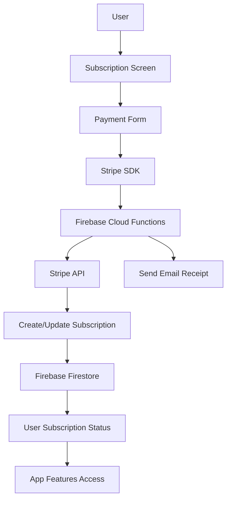

# Stripe Integration Plan for AI Sports Edge

## 1. Required Packages

We'll need to install the following packages:

```bash
npm install @stripe/stripe-react-native
npm install @react-native-firebase/functions  # For serverless functions to handle Stripe API calls
```

## 2. Architecture Overview



## 3. Implementation Steps

### 3.1 Backend Setup (Firebase Cloud Functions)

1. Create Firebase Cloud Functions to handle Stripe API calls:
   - `createCustomer` - Create a Stripe customer when a user signs up
   - `createSubscription` - Create a subscription for a user
   - `cancelSubscription` - Cancel a user's subscription
   - `updatePaymentMethod` - Update a user's payment method
   - `sendReceiptEmail` - Send an email receipt for successful payments

2. Set up Firestore collections:
   - `users/{userId}/subscriptions` - Store subscription information
   - `users/{userId}/paymentMethods` - Store payment method information

### 3.2 Frontend Implementation

#### 3.2.1 Services

Create a new service file `services/subscriptionService.ts`:

```typescript
// Functions to interact with Stripe and manage subscriptions
export interface Subscription {
  id: string;
  status: 'active' | 'canceled' | 'past_due' | 'trialing';
  currentPeriodEnd: Date;
  plan: {
    id: string;
    name: string;
    amount: number;
    interval: 'month' | 'year' | 'week' | 'day';
  };
}

export interface PaymentMethod {
  id: string;
  brand: string;
  last4: string;
  expiryMonth: number;
  expiryYear: number;
}

// Get user's subscription
export const getUserSubscription = async (userId: string): Promise<Subscription | null> => {
  // Implementation
}

// Create a subscription
export const createSubscription = async (
  userId: string, 
  paymentMethodId: string, 
  planId: string
): Promise<Subscription> => {
  // Implementation
}

// Cancel a subscription
export const cancelSubscription = async (
  userId: string, 
  subscriptionId: string
): Promise<boolean> => {
  // Implementation
}

// Update payment method
export const updatePaymentMethod = async (
  userId: string, 
  paymentMethodId: string
): Promise<PaymentMethod> => {
  // Implementation
}
```

#### 3.2.2 Screens

Create the following screens:

1. `screens/SubscriptionScreen.tsx` - Display subscription options
2. `screens/PaymentScreen.tsx` - Handle payment information collection
3. `screens/SubscriptionManagementScreen.tsx` - Manage existing subscriptions
4. `screens/RefundPolicyScreen.tsx` - Display cancellation and refund policy

#### 3.2.3 Components

Create the following components:

1. `components/SubscriptionPlan.tsx` - Display a subscription plan option
2. `components/PaymentForm.tsx` - Form for collecting payment information
3. `components/SubscriptionDetails.tsx` - Display subscription details
4. `components/PaymentMethodCard.tsx` - Display a payment method

#### 3.2.4 Navigation Updates

Update the navigation to include the new screens:

```typescript
// Add to RootStackParamList in AppNavigator.tsx
type RootStackParamList = {
  Onboarding: undefined;
  Login: undefined;
  Main: undefined;
  Subscription: undefined;
  Payment: { planId: string };
  SubscriptionManagement: undefined;
  RefundPolicy: undefined;
};
```

Add the screens to the Stack Navigator:

```typescript
<Stack.Screen 
  name="Subscription" 
  component={SubscriptionScreen} 
  options={{ headerShown: true, title: "Choose a Plan" }}
/>
<Stack.Screen 
  name="Payment" 
  component={PaymentScreen} 
  options={{ headerShown: true, title: "Payment Information" }}
/>
<Stack.Screen 
  name="SubscriptionManagement" 
  component={SubscriptionManagementScreen} 
  options={{ headerShown: true, title: "Manage Subscription" }}
/>
<Stack.Screen 
  name="RefundPolicy" 
  component={RefundPolicyScreen} 
  options={{ headerShown: true, title: "Refund Policy" }}
/>
```

### 3.3 Subscription Plans

Implement the following subscription plans based on the monetization breakdown:

1. **AI Subscription (Premium Picks)** - $9.99/month
   - Access to all AI-generated bets
   - Detailed analytics and insights
   - Historical performance data

2. **Weekend Pass** - $4.99
   - 3-day access to premium AI picks
   - Perfect for weekend sports events

3. **Pay-Per-Prediction** - $2.99 per prediction
   - Individual AI bet insights
   - No subscription required

### 3.4 Email Receipts

Implement email receipts for successful payments:
- Use Firebase Cloud Functions to send emails via a service like SendGrid or Mailgun
- Include transaction details, subscription information, and receipt number
- Add a link to view the receipt online

### 3.5 Cancellation & Refund Policy

Create a comprehensive cancellation and refund policy page:
- Clearly explain the refund policy for each subscription type
- Provide step-by-step instructions for cancellation
- Include contact information for support

## 4. Testing Plan

1. **Unit Testing**
   - Test subscription service functions
   - Test payment form validation

2. **Integration Testing**
   - Test the complete subscription flow
   - Test cancellation flow
   - Test payment method updates

3. **Production Testing**
   - Use Stripe test mode to verify the entire payment flow
   - Test email receipt delivery
   - Verify subscription status updates in Firestore

## 5. Implementation Timeline

1. **Week 1: Backend Setup**
   - Set up Stripe account and API keys
   - Implement Firebase Cloud Functions
   - Create Firestore schema

2. **Week 2: Frontend Basics**
   - Create subscription service
   - Implement subscription and payment screens
   - Set up navigation

3. **Week 3: Payment Processing**
   - Integrate Stripe SDK
   - Implement payment form
   - Set up email receipts

4. **Week 4: Subscription Management**
   - Implement subscription management screen
   - Create cancellation and refund policy page
   - Add subscription status checks to premium features

5. **Week 5: Testing and Refinement**
   - Comprehensive testing
   - UI/UX refinements
   - Performance optimization

## 6. Security Considerations

1. Never process payments directly on the client
2. Use Firebase Cloud Functions to interact with Stripe API
3. Implement proper authentication and authorization
4. Secure API keys and sensitive information
5. Follow PCI compliance guidelines