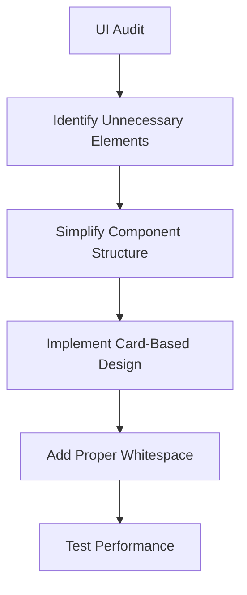
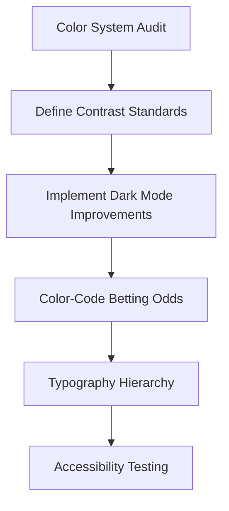
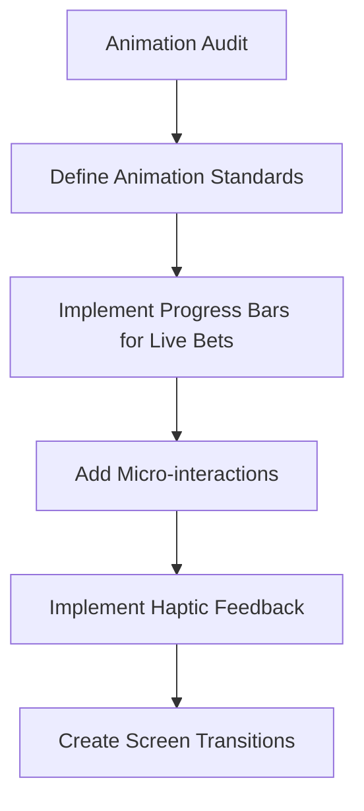
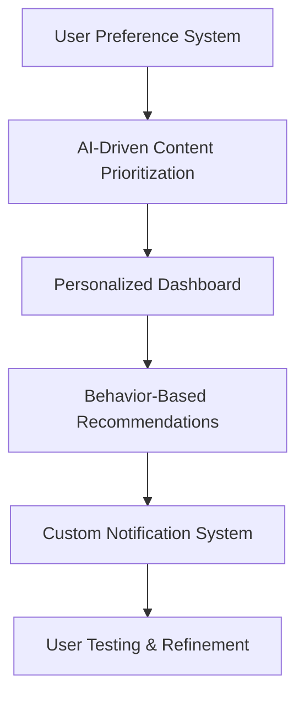

# UI/UX Design Principles Implementation Plan

This document outlines the implementation plan for enhancing the AI Sports Edge app according to the following UI/UX design principles:

1. **Fast & Minimalist** - Avoid clutter, highlight key betting info
2. **High-Contrast & Readable** - Dark mode + color-coded odds
3. **Engaging & Interactive** - Animations & progress bars for live bets
4. **Personalized & Dynamic** - AI-driven recommendations & user preferences

## 1. Fast & Minimalist

### Current State Analysis
The app currently has multiple screens with various components that may create visual clutter, particularly in the betting odds screens, UFC fighter displays, and prop bet cards.

### Implementation Plan

#### 1.1 UI Audit
- Review all screens to identify unnecessary elements
- Map user journeys to understand critical vs. non-critical information
- Identify information that can be hidden behind expandable sections

#### 1.2 Visual Hierarchy Improvements
- Redesign card components to emphasize the most important betting information
- Create a consistent visual hierarchy across all screens
- Use typography to create clear information hierarchy

#### 1.3 Whitespace Optimization
- Increase padding around key elements
- Reduce the density of information on primary screens
- Create breathing room between sections

#### 1.4 Performance Optimization
- Implement lazy loading for images and non-critical content
- Optimize API calls with proper caching strategies
- Implement skeleton screens for loading states

## 2. High-Contrast & Readable

### Current State Analysis
The app has some color coding but needs improvements for dark mode and accessibility, particularly in the GameCard, PropBetCard, and UFC fighter displays.

### Implementation Plan

#### 2.1 Color System Redesign
- Create a comprehensive color system with accessibility in mind
- Define primary, secondary, and accent colors with proper contrast ratios
- Create semantic colors for betting odds (green for favorable, red for unfavorable)

#### 2.2 Dark Mode Enhancement
- Improve dark mode implementation across all screens
- Ensure proper contrast in both light and dark modes
- Create smooth transitions between modes

#### 2.3 Typography Improvements
- Establish a clear typography hierarchy
- Increase font sizes for better readability
- Ensure proper line height and letter spacing

#### 2.4 Accessibility Enhancements
- Implement proper color contrast ratios (WCAG AA compliance)
- Add alternative text for all images
- Ensure proper focus states for interactive elements

## 3. Engaging & Interactive

### Current State Analysis
The app has some animations but could benefit from more interactive elements, especially for live betting, UFC fights, and prop bet interactions.

### Implementation Plan

#### 3.1 Animation System
- Create a consistent animation system
- Define animation timing and easing curves
- Implement subtle animations for state changes

#### 3.2 Live Betting Enhancements
- Add progress bars for live bets
- Implement real-time updates with visual indicators
- Create animated odds changes

#### 3.3 Micro-interactions
- Add haptic feedback for important actions
- Implement subtle animations for button presses
- Create animated transitions between screens

#### 3.4 Interactive Elements
- Improve scrolling experiences with momentum and bounce
- Add pull-to-refresh with visual feedback
- Implement swipe gestures for common actions

## 4. Personalized & Dynamic

### Current State Analysis
The app has some AI-driven recommendations but could enhance personalization, particularly in the odds screen, UFC fighter recommendations, and prop bet suggestions.

### Implementation Plan

#### 4.1 User Preference System
- Create a comprehensive user preference system
- Allow users to select favorite sports, teams, and bet types
- Implement settings for notification preferences

#### 4.2 AI-Driven Content Prioritization
- Use machine learning to prioritize content based on user behavior
- Implement a recommendation engine for bets
- Create personalized insights based on betting history

#### 4.3 Personalized Dashboard
- Design a customizable dashboard
- Allow users to pin favorite teams, fighters, and bet types
- Create personalized notifications for important events

#### 4.4 Dynamic Content
- Implement content that changes based on user interaction patterns
- Create adaptive interfaces that learn from user behavior
- Develop personalized onboarding experiences

## Implementation Roadmap

### Phase 1: Design System Update (Weeks 1-2)
- Create a comprehensive design system document
- Update color palette and typography
- Implement dark mode improvements
- Create reusable UI components with the new design principles

### Phase 2: Core Experience Enhancement (Weeks 3-5)
- Simplify the main betting screens
- Implement animations and progress bars
- Add micro-interactions
- Optimize performance

### Phase 3: Personalization Features (Weeks 6-8)
- Implement user preference system
- Create AI-driven content prioritization
- Develop personalized dashboard
- Add custom notification system

### Phase 4: Testing & Refinement (Weeks 9-10)
- Conduct usability testing
- Gather user feedback
- Make iterative improvements
- Measure performance metrics

## Component-Specific Improvements

### GameCard Component
- Simplify the layout to highlight the most important betting information
- Add subtle animations for odds changes
- Implement color coding for favorable vs. unfavorable odds
- Add progress bars for live games

### PropBetCard Component
- Redesign to emphasize the player name and prop type
- Add visual indicators for confidence levels
- Implement expandable sections for detailed reasoning
- Add animations for state changes

### UFC Fighter Display
- Create a more visually appealing fighter card
- Add animations for favoriting fighters
- Implement progress bars for fighter stats
- Use high-contrast colors for important information

## Success Metrics

- **Engagement**: Increase in time spent on app
- **Conversion**: Higher rate of bet placements
- **Retention**: Improved user retention rates
- **Satisfaction**: Higher user satisfaction scores in surveys
- **Performance**: Faster load times and smoother animations