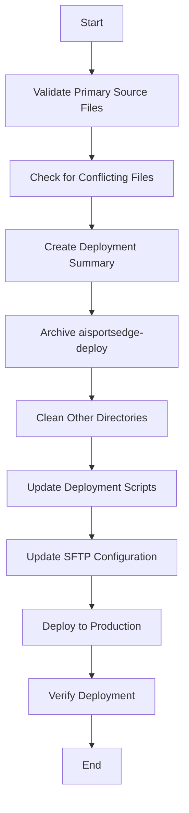

# Deployment Structure Cleanup and Validation Plan

## Overview

This plan outlines the steps to clean and validate the deployment structure for AI Sports Edge, ensuring that `vscode-sftp-deploy/.vscode/` becomes the single source of truth for web deployment files, while preserving other directories needed for different processes.

## Detailed Steps

### 1. Validate Primary Source Files

Confirm that `vscode-sftp-deploy/.vscode/` contains all required files with proper configurations:

- **index.html**: Main entry point for the website
- **login.html**: Login page
- **signup.html**: Signup page
- **.htaccess**: Apache configuration with:
  - HTML extension removal
  - /deploy redirect
  - Security headers
  - Browser caching rules
  - Directory listing disabled
- **sftp.json**: SFTP configuration pointing to `/home/q15133yvmhnq/public_html`

### 2. Check for Conflicting Files

Identify and document any conflicting or duplicate files in other directories:

- **aisportsedge-deploy/**: Contains multiple versions of key files (index.html, login.html, signup.html)
- **build/**, **deploy/**, **dist/**: May contain web files that could conflict with the primary source

### 3. Create Deployment Summary

Create a comprehensive deployment summary markdown file (`deployment-summary.md`) that includes:

- Current deployment path: `/home/q15133yvmhnq/public_html`
- Primary source directory: `vscode-sftp-deploy/.vscode/`
- List of files used for deployment
- Last upload timestamp
- Deployment verification steps

### 4. Archive aisportsedge-deploy

Create an archive of the `aisportsedge-deploy/` directory to preserve it without deletion:

- Create a timestamped zip file of the directory
- Move the zip file to a backups directory
- Keep the original directory intact as requested

### 5. Clean Other Directories

Ensure `build/`, `deploy/`, and `dist/` directories don't contain conflicting web files:

- Identify any HTML files that might conflict with the primary source
- Document these files but do not delete them
- Create a strategy to prevent future conflicts

### 6. Update Deployment Scripts

Identify and update any deployment scripts that reference the old directories:

- Search for scripts that reference `aisportsedge-deploy/`, `build/`, `deploy/`, or `dist/` for web file deployment
- Update these scripts to reference `vscode-sftp-deploy/.vscode/` as the source directory
- Document all script changes in the deployment summary
- Test updated scripts to ensure they work correctly

### 7. Update SFTP Configuration

Verify and update the SFTP configuration in `vscode-sftp-deploy/.vscode/sftp.json`:

- Confirm the correct remote path: `/home/q15133yvmhnq/public_html`
- Ensure proper authentication credentials
- Set appropriate upload settings (e.g., `uploadOnSave`)

### 8. Deploy to Production

Use the VS Code SFTP extension to deploy the files from the primary source:

- Deploy index.html, login.html, signup.html, and .htaccess
- Verify file permissions (typically 644 for files)

### 9. Verify Deployment

Confirm the deployment was successful:

- Test clean URLs: https://aisportsedge.app/login (should serve login.html)
- Test redirects: https://aisportsedge.app/deploy (should redirect to root)
- Verify security headers are applied
- Check that HTML extensions are hidden

## Implementation Considerations

1. **Backup Strategy**: Always create backups before making changes
2. **Documentation**: Keep the deployment summary up-to-date
3. **Future Deployments**: Establish a clear process for future updates
4. **Conflict Prevention**: Implement measures to prevent future file conflicts

## Deliverables

1. Validated primary source files in `vscode-sftp-deploy/.vscode/`
2. Archive of `aisportsedge-deploy/` directory
3. Documentation of any conflicting files in other directories
4. Updated deployment scripts
5. Comprehensive deployment summary markdown file
6. Successfully deployed and verified website