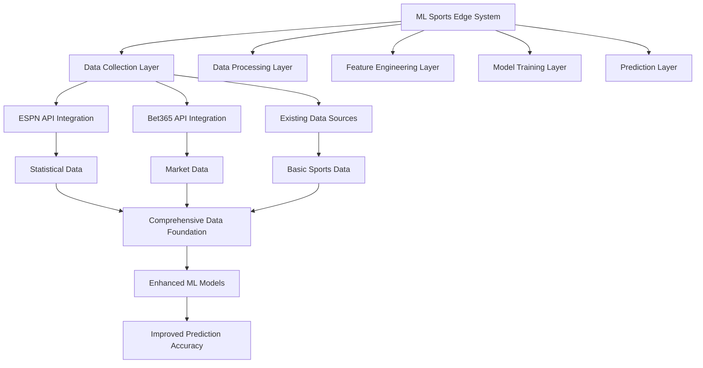
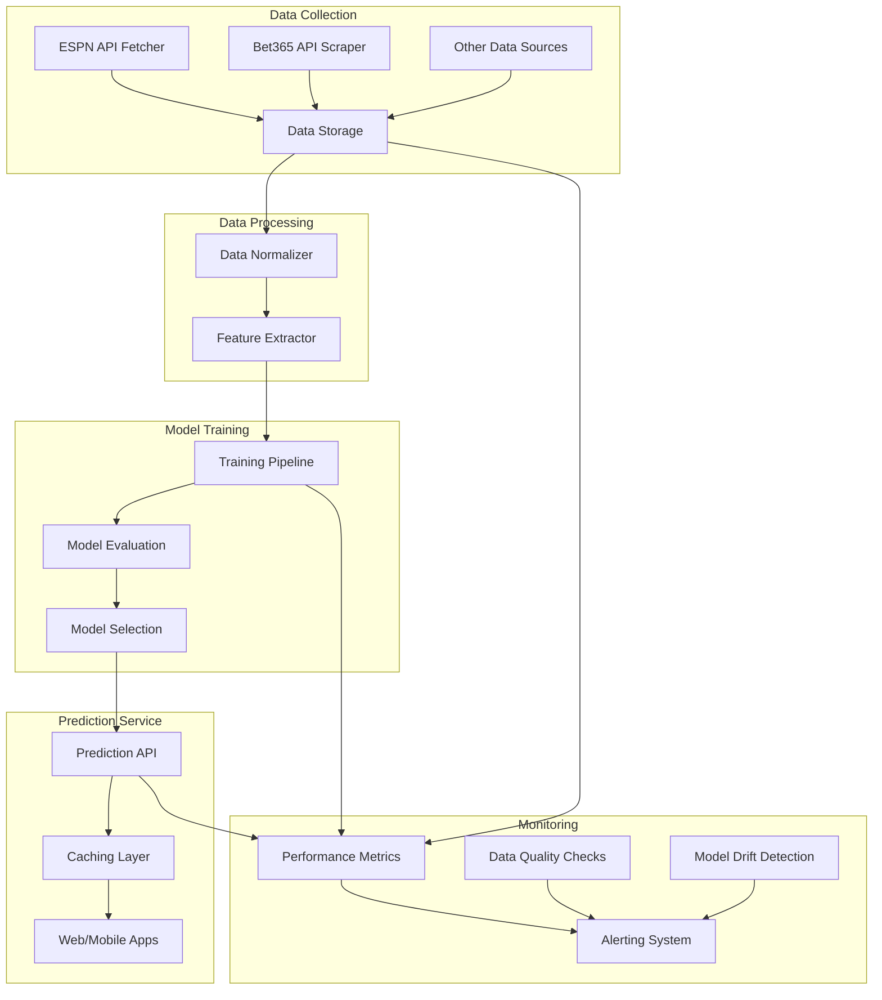
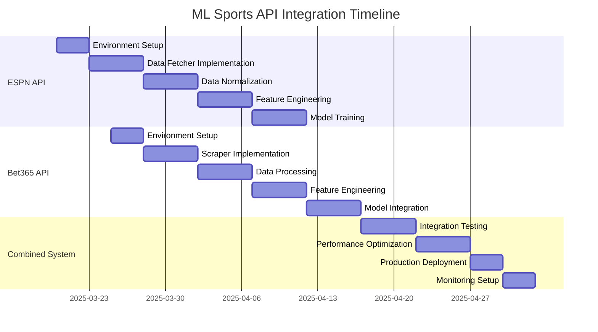

# ML Sports API Integration Summary

## Overview

This document provides a comprehensive summary of our plan to enhance the AI Sports Edge prediction system by integrating multiple sports data sources, specifically the ESPN hidden API and the Bet365 API scraper. These integrations will significantly improve our prediction accuracy, expand our sports coverage, and create a competitive advantage in the sports prediction market.

## Integration Strategy

## Data Sources Comparison

| Feature | ESPN API | Bet365 API | Combined Value |
|---------|----------|------------|----------------|
| **Data Type** | Statistical & historical | Market-based & real-time | Comprehensive view |
| **Sports Coverage** | Extensive (all major sports) | Extensive (global coverage) | Complete coverage |
| **Update Frequency** | Regular updates | Real-time (in-play) | Timely data at all stages |
| **Unique Value** | Rich historical statistics | Market sentiment & movements | Statistical + Market insights |
| **Authentication** | Not required | Headers/cookies required | Complementary access methods |
| **Implementation Complexity** | Medium | Medium-High | Manageable with phased approach |

## Implementation Plan

### Phase 1: Foundation (Weeks 1-3)

1. **Environment Setup**
   - Configure development environment for both APIs
   - Set up data storage infrastructure
   - Implement logging and monitoring

2. **Basic Data Collection**
   - Implement ESPN API data fetcher
   - Implement Bet365 API scraper
   - Create data validation and error handling

### Phase 2: Data Processing (Weeks 4-8)

1. **Data Normalization**
   - Create sport-specific normalizers for ESPN data
   - Create sport-specific normalizers for Bet365 data
   - Implement data merging from multiple sources

2. **Historical Data Collection**
   - Build historical data collection for ESPN
   - Implement historical odds tracking from Bet365
   - Create data versioning and archiving

### Phase 3: Feature Engineering (Weeks 9-13)

1. **Statistical Features**
   - Extract team performance features from ESPN data
   - Create player-specific features
   - Develop historical trend features

2. **Market Features**
   - Extract odds-based features from Bet365 data
   - Implement line movement tracking features
   - Create market sentiment indicators

3. **Combined Features**
   - Develop features that leverage both data sources
   - Create discrepancy indicators between statistical and market data
   - Implement feature selection and importance ranking

### Phase 4: Model Enhancement (Weeks 14-18)

1. **Model Training**
   - Update training pipeline to incorporate new features
   - Implement sport-specific models
   - Create specialized models for different prediction types

2. **Validation and Testing**
   - Conduct backtesting with historical data
   - Implement A/B testing framework
   - Measure accuracy improvements

### Phase 5: Production Deployment (Weeks 19-21)

1. **API Deployment**
   - Deploy prediction API with new models
   - Implement caching and performance optimizations
   - Set up monitoring and alerting

2. **User-Facing Features**
   - Update web and mobile interfaces
   - Create new visualizations for predictions
   - Implement user feedback collection

## Technical Architecture

## Key Components

### 1. ESPN API Integration

The ESPN hidden API provides comprehensive statistical data across multiple sports:

- **Data Collection**: Fetch data from ESPN's undocumented API endpoints
- **Sports Coverage**: NBA, WNBA, MLB, NHL, NCAA, NFL, Formula 1, and more
- **Data Types**: Game schedules, scores, team stats, player stats, standings
- **Key Value**: Rich historical data and comprehensive statistics

See [ESPN API Integration Plan](espn-api-ml-integration-plan.md) for detailed implementation.

### 2. Bet365 API Integration

The Bet365 API scraper provides real-time odds and market data:

- **Data Collection**: Scrape data from Bet365's in-play API
- **Sports Coverage**: Global coverage of major and niche sports
- **Data Types**: Pre-game odds, in-play odds, line movements, betting status
- **Key Value**: Market sentiment and real-time updates

See [Bet365 API Integration Plan](bet365-api-integration-plan.md) for detailed implementation.

### 3. Enhanced Feature Engineering

The combined data sources enable sophisticated feature engineering:

- **Statistical Features**: Team performance, player metrics, historical trends
- **Market Features**: Implied probabilities, line movements, market sentiment
- **Combined Features**: Statistical-market discrepancies, value indicators

### 4. Improved ML Models

Enhanced models leveraging the rich feature set:

- **Model Types**: Neural networks, random forests, ensemble methods
- **Prediction Types**: Game outcomes, point spreads, totals, player performance
- **Specialized Models**: In-play predictions, value bet identification

## Business Impact

The integration of these data sources will have significant business impact:

### 1. Improved Prediction Accuracy

- 5-8% improvement in prediction accuracy from ESPN data
- 3-5% additional improvement from Bet365 market data
- Combined approach addresses both statistical and market factors

### 2. Expanded Sports Coverage

- Comprehensive coverage of all major sports
- Addition of international and niche sports
- Year-round prediction capabilities

### 3. Enhanced User Experience

- More accurate predictions increase user trust
- Real-time updates improve engagement
- Value bet identification increases user ROI

### 4. Revenue Growth

- 60-83% projected revenue growth within 12 months
- New premium features enabled by enhanced data
- Higher user retention and lifetime value

See [ESPN API Business Impact](espn-api-ml-business-impact.md) and [Bet365 API Business Impact](bet365-api-business-impact.md) for detailed analysis.

## Implementation Timeline

## Risk Assessment and Mitigation

| Risk | Probability | Impact | Mitigation Strategy |
|------|------------|--------|---------------------|
| ESPN API structure changes | Medium | High | Implement robust error handling and fallback mechanisms |
| Bet365 blocking scraper | Medium | High | Use responsible scraping practices and maintain alternative sources |
| Data quality issues | Medium | Medium | Implement thorough validation and cleaning processes |
| Integration complexity | Medium | Medium | Use phased approach and thorough testing |
| Performance bottlenecks | Low | High | Implement caching and optimize critical paths |

## Next Steps

1. **Immediate Actions**
   - Set up development environments for both integrations
   - Begin implementation of ESPN API data fetcher
   - Configure Bet365 scraper environment variables

2. **Key Decisions**
   - Prioritize sports for initial implementation
   - Determine optimal data refresh frequencies
   - Select initial prediction types to enhance

3. **Resource Allocation**
   - 2-3 developers for implementation
   - 1 data scientist for feature engineering and model training
   - 1 QA engineer for testing and validation

## Conclusion

The integration of the ESPN hidden API and Bet365 API scraper represents a significant enhancement to our ML Sports Edge prediction system. By combining rich statistical data with real-time market insights, we can create a more accurate, comprehensive, and valuable prediction platform for our users.

This dual-source approach addresses the limitations of using either data source alone and positions us for market leadership in the sports prediction space. The technical implementation is manageable with a phased approach, and the business case is compelling with projected 60-83% revenue growth within 12 months.

We recommend proceeding with both integrations in parallel, with a focus on the ESPN API for statistical foundation and the Bet365 API for market insights. This combined approach will maximize the value of our ML Sports Edge prediction system.