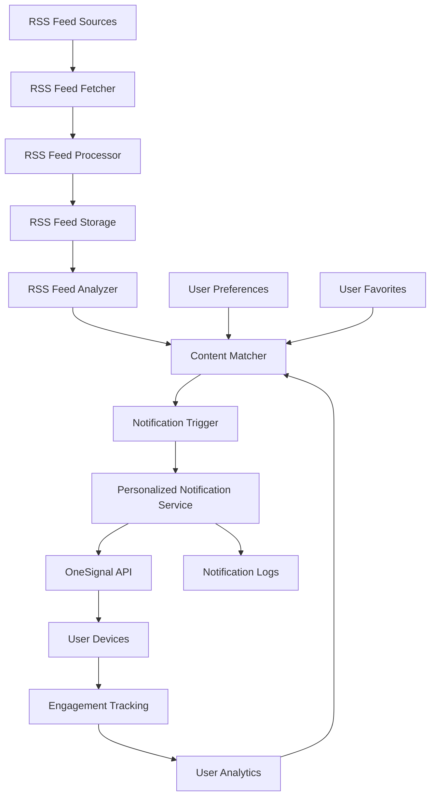

# RSS Feed Notification Integration

This document outlines the integration between the RSS feed system and the personalized notification service in AI Sports Edge. This integration will enable the app to send highly relevant notifications to users based on RSS feed content that matches their interests.

## Overview

The RSS feed notification integration will:

1. Monitor incoming RSS feed items for relevant content
2. Match content with user preferences and interests
3. Send personalized notifications to users about content they care about
4. Track engagement to improve future notifications

## Architecture



## Implementation Details

### 1. RSS Feed Processor Enhancement

The RSS feed processor will be enhanced to extract additional metadata from feed items:

```javascript
/**
 * Process RSS feed items to extract metadata
 * @param {Array} items - Raw RSS feed items
 * @returns {Array} Processed items with metadata
 */
function processRssItems(items) {
  return items.map(item => {
    // Extract teams mentioned in the item
    const teams = extractTeams(item);
    
    // Extract players mentioned in the item
    const players = extractPlayers(item);
    
    // Extract betting opportunities
    const bettingOpportunities = extractBettingOpportunities(item);
    
    // Extract injury information
    const injuries = extractInjuries(item);
    
    // Extract game information
    const gameInfo = extractGameInfo(item);
    
    // Calculate relevance score
    const relevanceScore = calculateRelevanceScore(item, {
      teams,
      players,
      bettingOpportunities,
      injuries,
      gameInfo
    });
    
    // Return enhanced item
    return {
      ...item,
      teams,
      players,
      bettingOpportunities,
      injuries,
      gameInfo,
      relevanceScore
    };
  });
}
```

### 2. Content Matching System

The content matching system will determine which users should receive notifications for specific RSS feed items:

```javascript
/**
 * Match RSS feed items with user preferences
 * @param {Array} items - Processed RSS feed items
 * @returns {Object} Mapping of user IDs to relevant items
 */
async function matchContentWithUsers(items) {
  // Get all users with RSS notifications enabled
  const usersSnapshot = await admin.firestore()
    .collection('users')
    .where('preferences.notifications.rssAlerts.enabled', '==', true)
    .get();
  
  if (usersSnapshot.empty) {
    console.log('No users have RSS notifications enabled');
    return {};
  }
  
  const users = usersSnapshot.docs.map(doc => ({
    id: doc.id,
    ...doc.data()
  }));
  
  // Match items with users
  const userMatches = {};
  
  users.forEach(user => {
    const matchedItems = items.filter(item => {
      // Get user preferences
      const rssPrefs = user.preferences.notifications.rssAlerts;
      
      // Check if user only wants notifications for favorite teams
      if (rssPrefs.favoriteTeamsOnly && item.teams && item.teams.length > 0) {
        const hasRelevantTeam = user.favorites.teams.some(team => 
          item.teams.includes(team)
        );
        if (!hasRelevantTeam) return false;
      }
      
      // Check if user only wants notifications for favorite players
      if (rssPrefs.favoritePlayersOnly && item.players && item.players.length > 0) {
        const hasRelevantPlayer = user.favorites.players.some(player => 
          item.players.includes(player)
        );
        if (!hasRelevantPlayer) return false;
      }
      
      // Check for keyword alerts
      if (rssPrefs.keywordAlerts && rssPrefs.keywordAlerts.length > 0) {
        const itemText = [
          item.title || '',
          item.description || '',
          (item.teams || []).join(' ')
        ].join(' ').toLowerCase();
        
        const hasKeyword = rssPrefs.keywordAlerts.some(keyword => 
          itemText.includes(keyword.toLowerCase())
        );
        
        if (!hasKeyword) return false;
      }
      
      // Check if item has minimum relevance score
      const minRelevanceScore = 0.5; // Threshold for notification
      if (item.relevanceScore < minRelevanceScore) return false;
      
      return true;
    });
    
    if (matchedItems.length > 0) {
      userMatches[user.id] = matchedItems;
    }
  });
  
  return userMatches;
}
```

### 3. Notification Trigger

The notification trigger will send personalized notifications based on matched content:

```javascript
/**
 * Trigger notifications for matched RSS feed items
 * @param {Object} userMatches - Mapping of user IDs to relevant items
 * @returns {Promise} Promise that resolves when notifications are sent
 */
async function triggerRssNotifications(userMatches) {
  const promises = [];
  
  // Process each user
  Object.entries(userMatches).forEach(([userId, items]) => {
    // Sort items by relevance score (highest first)
    const sortedItems = [...items].sort((a, b) => b.relevanceScore - a.relevanceScore);
    
    // Take top 3 most relevant items to avoid notification fatigue
    const topItems = sortedItems.slice(0, 3);
    
    // Send notification for each item
    topItems.forEach(item => {
      promises.push(
        personalizedNotificationService.sendPersonalizedNotification({
          userId,
          type: 'news',
          data: {
            title: item.title,
            description: item.description,
            teams: item.teams,
            players: item.players,
            sport: item.sport,
            url: item.link,
            pubDate: item.pubDate,
            source: item.source,
            relevanceScore: item.relevanceScore,
            bettingOpportunities: item.bettingOpportunities,
            injuries: item.injuries,
            gameInfo: item.gameInfo
          }
        })
      );
    });
  });
  
  return Promise.all(promises);
}
```

### 4. RSS Feed Notification Cloud Function

A new cloud function will be created to handle the RSS feed notification process:

```javascript
/**
 * Cloud function to process new RSS feed items and send notifications
 */
exports.processRssFeedsAndNotify = functions.pubsub
  .schedule('every 30 minutes')
  .onRun(async (context) => {
    // Get timestamp of last run
    const lastRunDoc = await admin.firestore()
      .collection('system')
      .doc('rssNotificationLastRun')
      .get();
    
    const lastRunTime = lastRunDoc.exists 
      ? lastRunDoc.data().timestamp.toDate() 
      : new Date(0); // Default to epoch if no previous run
    
    // Get new RSS feed items since last run
    const newItemsSnapshot = await admin.firestore()
      .collection('rssItems')
      .where('pubDate', '>', lastRunTime)
      .orderBy('pubDate', 'desc')
      .get();
    
    if (newItemsSnapshot.empty) {
      console.log('No new RSS feed items since last run');
      
      // Update last run timestamp
      await admin.firestore()
        .collection('system')
        .doc('rssNotificationLastRun')
        .set({
          timestamp: admin.firestore.Timestamp.now()
        });
      
      return null;
    }
    
    console.log(`Found ${newItemsSnapshot.size} new RSS feed items since last run`);
    
    // Process items
    const items = newItemsSnapshot.docs.map(doc => ({
      id: doc.id,
      ...doc.data()
    }));
    
    const processedItems = processRssItems(items);
    
    // Match items with users
    const userMatches = await matchContentWithUsers(processedItems);
    
    // Trigger notifications
    await triggerRssNotifications(userMatches);
    
    // Update last run timestamp
    await admin.firestore()
      .collection('system')
      .doc('rssNotificationLastRun')
      .set({
        timestamp: admin.firestore.Timestamp.now()
      });
    
    return null;
  });
```

### 5. Metadata Extraction Functions

These functions will extract relevant metadata from RSS feed items:

#### Team Extraction

```javascript
/**
 * Extract team names from RSS item
 * @param {Object} item - RSS item
 * @returns {Array} Array of team names
 */
function extractTeams(item) {
  // If item already has teams property, use it
  if (item.teams && Array.isArray(item.teams)) {
    return item.teams;
  }
  
  // Otherwise, try to extract from title and description
  const teams = [];
  const teamDatabase = require('../data/teams.json');
  
  const itemText = [
    item.title || '',
    item.description || ''
  ].join(' ');
  
  // Check for team names in the text
  teamDatabase.forEach(team => {
    if (itemText.includes(team.name)) {
      teams.push(team.name);
    }
    
    // Check for team nicknames
    if (team.nicknames) {
      team.nicknames.forEach(nickname => {
        if (itemText.includes(nickname)) {
          teams.push(team.name);
        }
      });
    }
  });
  
  return [...new Set(teams)]; // Remove duplicates
}
```

#### Player Extraction

```javascript
/**
 * Extract player names from RSS item
 * @param {Object} item - RSS item
 * @returns {Array} Array of player names
 */
function extractPlayers(item) {
  // If item already has players property, use it
  if (item.players && Array.isArray(item.players)) {
    return item.players;
  }
  
  // Otherwise, try to extract from title and description
  const players = [];
  const playerDatabase = require('../data/players.json');
  
  const itemText = [
    item.title || '',
    item.description || ''
  ].join(' ');
  
  // Check for player names in the text
  playerDatabase.forEach(player => {
    if (itemText.includes(player.name)) {
      players.push(player.name);
    }
  });
  
  return [...new Set(players)]; // Remove duplicates
}
```

#### Betting Opportunity Extraction

```javascript
/**
 * Extract betting opportunities from RSS item
 * @param {Object} item - RSS item
 * @returns {Array} Array of betting opportunities
 */
function extractBettingOpportunities(item) {
  const opportunities = [];
  
  // Keywords that indicate betting opportunities
  const bettingKeywords = [
    'odds', 'betting', 'wager', 'bet', 'favorite', 'underdog',
    'spread', 'line', 'over/under', 'moneyline', 'parlay'
  ];
  
  const itemText = [
    item.title || '',
    item.description || ''
  ].join(' ').toLowerCase();
  
  // Check if any betting keywords are present
  const hasBettingKeywords = bettingKeywords.some(keyword => 
    itemText.includes(keyword)
  );
  
  if (!hasBettingKeywords) return opportunities;
  
  // Extract teams
  const teams = extractTeams(item);
  
  // If we have teams, create betting opportunities
  teams.forEach(team => {
    opportunities.push({
      team,
      type: 'generic',
      source: item.source
    });
  });
  
  return opportunities;
}
```

#### Injury Extraction

```javascript
/**
 * Extract injury information from RSS item
 * @param {Object} item - RSS item
 * @returns {Array} Array of injury information
 */
function extractInjuries(item) {
  const injuries = [];
  
  // Keywords that indicate injuries
  const injuryKeywords = [
    'injury', 'injured', 'hurt', 'sidelined', 'out',
    'questionable', 'doubtful', 'probable', 'day-to-day'
  ];
  
  const itemText = [
    item.title || '',
    item.description || ''
  ].join(' ').toLowerCase();
  
  // Check if any injury keywords are present
  const hasInjuryKeywords = injuryKeywords.some(keyword => 
    itemText.includes(keyword)
  );
  
  if (!hasInjuryKeywords) return injuries;
  
  // Extract players
  const players = extractPlayers(item);
  
  // If we have players, create injury information
  players.forEach(player => {
    injuries.push({
      player,
      status: 'unknown', // Default status
      source: item.source
    });
  });
  
  return injuries;
}
```

#### Game Information Extraction

```javascript
/**
 * Extract game information from RSS item
 * @param {Object} item - RSS item
 * @returns {Object|null} Game information or null
 */
function extractGameInfo(item) {
  // Keywords that indicate game information
  const gameKeywords = [
    'vs', 'versus', 'against', 'matchup', 'game',
    'face', 'play', 'host', 'visit'
  ];
  
  const itemText = [
    item.title || '',
    item.description || ''
  ].join(' ').toLowerCase();
  
  // Check if any game keywords are present
  const hasGameKeywords = gameKeywords.some(keyword => 
    itemText.includes(keyword)
  );
  
  if (!hasGameKeywords) return null;
  
  // Extract teams
  const teams = extractTeams(item);
  
  // Need at least two teams for a game
  if (teams.length < 2) return null;
  
  // Create game information
  return {
    homeTeam: teams[0],
    awayTeam: teams[1],
    sport: item.sport,
    source: item.source
  };
}
```

#### Relevance Score Calculation

```javascript
/**
 * Calculate relevance score for an RSS item
 * @param {Object} item - RSS item
 * @param {Object} metadata - Extracted metadata
 * @returns {number} Relevance score (0-1)
 */
function calculateRelevanceScore(item, metadata) {
  let score = 0;
  
  // Base score based on source reliability
  const sourceReliability = {
    'ESPN': 0.9,
    'The Athletic': 0.85,
    'Sports Illustrated': 0.8,
    'Bleacher Report': 0.75,
    'Yahoo Sports': 0.8,
    'CBS Sports': 0.8,
    'NBC Sports': 0.8,
    'Fox Sports': 0.75,
    'default': 0.7
  };
  
  score += sourceReliability[item.source] || sourceReliability.default;
  
  // Add points for metadata
  if (metadata.teams && metadata.teams.length > 0) {
    score += 0.1;
  }
  
  if (metadata.players && metadata.players.length > 0) {
    score += 0.1;
  }
  
  if (metadata.bettingOpportunities && metadata.bettingOpportunities.length > 0) {
    score += 0.2;
  }
  
  if (metadata.injuries && metadata.injuries.length > 0) {
    score += 0.15;
  }
  
  if (metadata.gameInfo) {
    score += 0.15;
  }
  
  // Normalize score to 0-1 range
  return Math.min(score, 1);
}
```

## User Interface Updates

### 1. RSS Notification Preferences Screen

A new screen will be added to allow users to configure their RSS notification preferences:

```jsx
import React, { useState, useEffect } from 'react';
import { View, Text, Switch, TextInput, FlatList, TouchableOpacity } from 'react-native';
import { getUserPreferences, updatePreference } from '../utils/userPreferencesService';
import { getAvailableSportsCategories } from '../utils/sportsCategories';

const RssNotificationPreferencesScreen = () => {
  const [preferences, setPreferences] = useState(null);
  const [newKeyword, setNewKeyword] = useState('');
  const [sportsCategories, setSportsCategories] = useState([]);
  
  useEffect(() => {
    // Load user preferences
    const prefs = getUserPreferences();
    setPreferences(prefs);
    
    // Load sports categories
    const categories = getAvailableSportsCategories();
    setSportsCategories(categories);
  }, []);
  
  const toggleEnabled = (value) => {
    updatePreference('notifications.rssAlerts.enabled', value);
    setPreferences(prev => ({
      ...prev,
      notifications: {
        ...prev.notifications,
        rssAlerts: {
          ...prev.notifications.rssAlerts,
          enabled: value
        }
      }
    }));
  };
  
  const toggleFavoriteTeamsOnly = (value) => {
    updatePreference('notifications.rssAlerts.favoriteTeamsOnly', value);
    setPreferences(prev => ({
      ...prev,
      notifications: {
        ...prev.notifications,
        rssAlerts: {
          ...prev.notifications.rssAlerts,
          favoriteTeamsOnly: value
        }
      }
    }));
  };
  
  const toggleFavoritePlayersOnly = (value) => {
    updatePreference('notifications.rssAlerts.favoritePlayersOnly', value);
    setPreferences(prev => ({
      ...prev,
      notifications: {
        ...prev.notifications,
        rssAlerts: {
          ...prev.notifications.rssAlerts,
          favoritePlayersOnly: value
        }
      }
    }));
  };
  
  const addKeyword = () => {
    if (!newKeyword.trim()) return;
    
    const keywords = [
      ...preferences.notifications.rssAlerts.keywordAlerts,
      newKeyword.trim()
    ];
    
    updatePreference('notifications.rssAlerts.keywordAlerts', keywords);
    setPreferences(prev => ({
      ...prev,
      notifications: {
        ...prev.notifications,
        rssAlerts: {
          ...prev.notifications.rssAlerts,
          keywordAlerts: keywords
        }
      }
    }));
    
    setNewKeyword('');
  };
  
  const removeKeyword = (keyword) => {
    const keywords = preferences.notifications.rssAlerts.keywordAlerts.filter(
      k => k !== keyword
    );
    
    updatePreference('notifications.rssAlerts.keywordAlerts', keywords);
    setPreferences(prev => ({
      ...prev,
      notifications: {
        ...prev.notifications,
        rssAlerts: {
          ...prev.notifications.rssAlerts,
          keywordAlerts: keywords
        }
      }
    }));
  };
  
  if (!preferences) {
    return <View><Text>Loading...</Text></View>;
  }
  
  return (
    <View style={styles.container}>
      <Text style={styles.title}>RSS Feed Notifications</Text>
      
      <View style={styles.switchRow}>
        <Text style={styles.label}>Enable RSS Notifications</Text>
        <Switch
          value={preferences.notifications.rssAlerts.enabled}
          onValueChange={toggleEnabled}
        />
      </View>
      
      <View style={styles.switchRow}>
        <Text style={styles.label}>Only Notify About Favorite Teams</Text>
        <Switch
          value={preferences.notifications.rssAlerts.favoriteTeamsOnly}
          onValueChange={toggleFavoriteTeamsOnly}
          disabled={!preferences.notifications.rssAlerts.enabled}
        />
      </View>
      
      <View style={styles.switchRow}>
        <Text style={styles.label}>Only Notify About Favorite Players</Text>
        <Switch
          value={preferences.notifications.rssAlerts.favoritePlayersOnly}
          onValueChange={toggleFavoritePlayersOnly}
          disabled={!preferences.notifications.rssAlerts.enabled}
        />
      </View>
      
      <Text style={styles.sectionTitle}>Keyword Alerts</Text>
      <Text style={styles.description}>
        Get notified when news contains these keywords
      </Text>
      
      <View style={styles.keywordInputContainer}>
        <TextInput
          style={styles.keywordInput}
          value={newKeyword}
          onChangeText={setNewKeyword}
          placeholder="Enter keyword"
          disabled={!preferences.notifications.rssAlerts.enabled}
        />
        <TouchableOpacity
          style={styles.addButton}
          onPress={addKeyword}
          disabled={!preferences.notifications.rssAlerts.enabled}
        >
          <Text style={styles.addButtonText}>Add</Text>
        </TouchableOpacity>
      </View>
      
      <FlatList
        data={preferences.notifications.rssAlerts.keywordAlerts}
        keyExtractor={(item) => item}
        renderItem={({ item }) => (
          <View style={styles.keywordItem}>
            <Text style={styles.keywordText}>{item}</Text>
            <TouchableOpacity
              style={styles.removeButton}
              onPress={() => removeKeyword(item)}
            >
              <Text style={styles.removeButtonText}>✕</Text>
            </TouchableOpacity>
          </View>
        )}
        ListEmptyComponent={
          <Text style={styles.emptyText}>No keywords added</Text>
        }
      />
    </View>
  );
};

const styles = {
  // Styles omitted for brevity
};

export default RssNotificationPreferencesScreen;
```

### 2. Notification Settings Screen Update

The existing notification settings screen will be updated to include RSS notification options:

```jsx
// Add to existing NotificationSettingsScreen.jsx

// Add RSS notification section
<View style={styles.section}>
  <Text style={styles.sectionTitle}>RSS Feed Notifications</Text>
  
  <View style={styles.switchRow}>
    <Text style={styles.label}>Enable RSS Notifications</Text>
    <Switch
      value={preferences.notifications.rssAlerts.enabled}
      onValueChange={(value) => updatePreference('notifications.rssAlerts.enabled', value)}
    />
  </View>
  
  <TouchableOpacity
    style={styles.button}
    onPress={() => navigation.navigate('RssNotificationPreferences')}
  >
    <Text style={styles.buttonText}>Configure RSS Notifications</Text>
  </TouchableOpacity>
</View>
```

## Database Schema Updates

### RSS Items Collection

```javascript
// rssItems/{itemId}
{
  title: 'Lakers defeat Celtics in overtime thriller',
  description: 'LeBron James scored 35 points to lead the Lakers to victory',
  link: 'https://example.com/news/lakers-celtics',
  pubDate: Timestamp,
  source: 'ESPN',
  sport: 'NBA',
  teams: ['Lakers', 'Celtics'],
  players: ['LeBron James', 'Anthony Davis', 'Jayson Tatum'],
  bettingOpportunities: [
    {
      team: 'Lakers',
      type: 'generic',
      source: 'ESPN'
    }
  ],
  injuries: [],
  gameInfo: {
    homeTeam: 'Lakers',
    awayTeam: 'Celtics',
    sport: 'NBA',
    source: 'ESPN'
  },
  relevanceScore: 0.85
}
```

### System Collection

```javascript
// system/rssNotificationLastRun
{
  timestamp: Timestamp
}
```

## Implementation Phases

### Phase 1: RSS Feed Processor Enhancement
- Update RSS feed processor to extract metadata
- Implement team and player extraction
- Implement betting opportunity extraction
- Implement injury information extraction
- Implement game information extraction
- Implement relevance score calculation

### Phase 2: Content Matching System
- Implement user preference matching
- Implement favorite team and player matching
- Implement keyword matching
- Implement relevance score filtering

### Phase 3: Notification Trigger
- Implement personalized notification generation
- Implement notification prioritization
- Implement notification frequency management

### Phase 4: Cloud Function Implementation
- Implement RSS feed notification cloud function
- Set up scheduled execution
- Implement last run tracking

### Phase 5: User Interface Updates
- Implement RSS notification preferences screen
- Update notification settings screen
- Add navigation to RSS notification settings

## Success Metrics

- Increased engagement with RSS feed content
- Higher notification open rates
- Reduced notification opt-out rates
- Increased user retention
- Higher conversion rates for betting opportunities

## Conclusion

The RSS feed notification integration will significantly enhance the personalization of the AI Sports Edge app by delivering timely, relevant notifications based on user interests. By leveraging the rich data available in RSS feeds and combining it with user preferences, the app can provide a highly personalized experience that keeps users engaged and informed about the sports content they care about most.