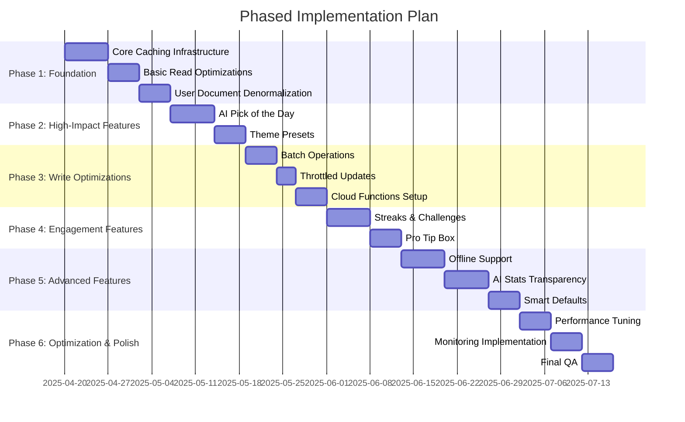
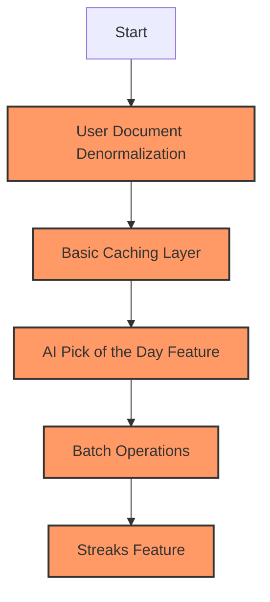
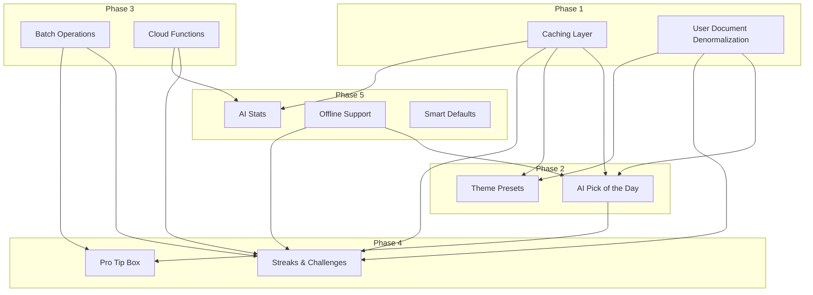

# Phased Implementation Plan for AI Sports Edge

## Overview

This document outlines a phased approach to implementing the new features and Firebase optimizations for AI Sports Edge. By breaking down the implementation into manageable phases, we can deliver value incrementally while managing complexity.

## Implementation Phases



## Phase 1: Foundation (2-3 weeks)

**Focus**: Establish the core optimization infrastructure and implement the most critical read optimizations.

### Key Components:

1. **Core Caching Infrastructure**

   - Implement basic caching service with TTL and versioning
   - Set up AsyncStorage/localStorage wrapper
   - Create cache invalidation mechanisms

2. **Basic Read Optimizations**

   - Implement data denormalization strategy
   - Set up composite document patterns
   - Create batch loading utilities

3. **User Document Denormalization**
   - Refactor user document structure
   - Embed frequently accessed data
   - Update user-related services

### Expected Benefits:

- 40-50% reduction in read operations
- Improved app performance for most common user flows
- Foundation for further optimizations

## Phase 2: High-Impact Features (2 weeks)

**Focus**: Implement the highest-value features that will provide immediate user benefits.

### Key Components:

1. **AI Pick of the Day**

   - Implement pick display component
   - Create confidence indicator
   - Set up basic following mechanism

2. **Theme Presets**
   - Implement theme selector
   - Create preset themes (Light, Dark, Team Colors)
   - Integrate with existing ThemeContext

### Expected Benefits:

- Immediate user-facing improvements
- Enhanced engagement through AI picks
- Improved user experience with theme options

## Phase 3: Write Optimizations (2 weeks)

**Focus**: Implement write optimizations to reduce Firebase write operations.

### Key Components:

1. **Batch Operations**

   - Implement batch write utilities
   - Refactor services to use batch operations
   - Add transaction support for critical operations

2. **Throttled Updates**

   - Create debounce/throttle utilities
   - Implement for frequently changing data
   - Add write consolidation logic

3. **Cloud Functions Setup**
   - Set up initial Cloud Functions
   - Implement pick follower function
   - Create activity processor function

### Expected Benefits:

- 50-60% reduction in write operations
- Improved data consistency
- Foundation for server-side processing

## Phase 4: Engagement Features (2 weeks)

**Focus**: Implement features that drive user engagement and retention.

### Key Components:

1. **Streaks & Challenges**

   - Implement streak tracking
   - Create streak visualization
   - Set up basic rewards system

2. **Pro Tip Box**
   - Create insight component
   - Implement dynamic tip generation
   - Integrate with AI picks

### Expected Benefits:

- Increased user retention through streaks
- Enhanced user understanding through insights
- Improved engagement metrics

## Phase 5: Advanced Features (3 weeks)

**Focus**: Implement more complex features and optimizations.

### Key Components:

1. **Offline Support**

   - Implement offline detection
   - Create offline write queue
   - Add conflict resolution

2. **AI Stats Transparency**

   - Create stats visualization components
   - Implement premium access control
   - Set up stats aggregation

3. **Smart Defaults**
   - Implement geolocation service
   - Create team suggestion algorithm
   - Integrate with onboarding

### Expected Benefits:

- Better user experience in poor connectivity
- Premium feature for revenue generation
- Improved onboarding experience

## Phase 6: Optimization & Polish (2 weeks)

**Focus**: Fine-tune performance, implement monitoring, and ensure quality.

### Key Components:

1. **Performance Tuning**

   - Optimize critical paths
   - Fine-tune caching strategies
   - Address any performance bottlenecks

2. **Monitoring Implementation**

   - Set up Firebase usage tracking
   - Implement performance monitoring
   - Create analytics dashboard

3. **Final QA**
   - Cross-platform testing
   - Edge case validation
   - Performance validation

### Expected Benefits:

- Optimized performance across platforms
- Visibility into Firebase usage and costs
- High-quality user experience

## Critical Path Optimizations

These optimizations should be prioritized as they provide the highest impact with the lowest implementation complexity:



### 1. User Document Denormalization

- **Impact**: High (reduces multiple reads to a single read)
- **Complexity**: Medium
- **Implementation Time**: 3-5 days

```typescript
// Before: Multiple reads
const getUserData = async (userId) => {
  const userDoc = await firestore.collection("users").doc(userId).get();
  const prefsDoc = await firestore
    .collection("userPreferences")
    .doc(userId)
    .get();
  const streaksDoc = await firestore
    .collection("userStreaks")
    .doc(userId)
    .get();

  return {
    user: userDoc.data(),
    preferences: prefsDoc.data(),
    streaks: streaksDoc.data(),
  };
};

// After: Single read
const getUserData = async (userId) => {
  const userDoc = await firestore.collection("users").doc(userId).get();
  return userDoc.data(); // Contains embedded preferences and streaks
};
```

### 2. Basic Caching Layer

- **Impact**: High (reduces repeated reads)
- **Complexity**: Medium
- **Implementation Time**: 3-5 days

```typescript
// Simple caching service
class CacheService {
  async get(key, ttl = 5 * 60 * 1000) {
    try {
      const cached = await AsyncStorage.getItem(key);
      if (!cached) return null;

      const { data, timestamp } = JSON.parse(cached);
      if (Date.now() - timestamp > ttl) {
        await AsyncStorage.removeItem(key);
        return null;
      }

      return data;
    } catch (error) {
      console.error("Cache read error:", error);
      return null;
    }
  }

  async set(key, data) {
    try {
      await AsyncStorage.setItem(
        key,
        JSON.stringify({
          data,
          timestamp: Date.now(),
        })
      );
    } catch (error) {
      console.error("Cache write error:", error);
    }
  }
}
```

### 3. AI Pick of the Day Feature

- **Impact**: High (user-facing feature)
- **Complexity**: Medium
- **Implementation Time**: 5-7 days

### 4. Batch Operations

- **Impact**: High (reduces write operations)
- **Complexity**: Low
- **Implementation Time**: 2-3 days

```typescript
// Batch write utility
const batchUpdate = async (updates) => {
  const batch = firestore.batch();

  updates.forEach(({ ref, data }) => {
    batch.update(ref, data);
  });

  return batch.commit();
};
```

### 5. Streaks Feature

- **Impact**: High (engagement feature)
- **Complexity**: Medium
- **Implementation Time**: 5-7 days

## Feature Dependencies



## Risk Assessment

| Risk                                | Impact | Probability | Mitigation                                 |
| ----------------------------------- | ------ | ----------- | ------------------------------------------ |
| Data migration issues               | High   | Medium      | Implement gradual migration with fallbacks |
| Performance degradation             | High   | Low         | Benchmark each phase before release        |
| User confusion with new features    | Medium | Medium      | Provide clear onboarding for new features  |
| Firebase cost increases             | Medium | Low         | Monitor usage closely during rollout       |
| Cross-platform compatibility issues | Medium | Medium      | Test thoroughly on both web and iOS        |

## Success Metrics

For each phase, we'll track the following metrics:

1. **Firebase Operations**

   - Read operations per user session
   - Write operations per user session
   - Cost per active user

2. **Performance**

   - App startup time
   - Screen transition time
   - Data loading time

3. **User Engagement**
   - Session duration
   - Feature usage
   - Retention metrics

## Conclusion

This phased approach allows us to implement the most critical optimizations first, delivering value incrementally while managing complexity. By focusing on the foundation in Phase 1 and then building on it with high-impact features in Phase 2, we can achieve significant improvements early in the process.

The critical path optimizations provide the highest return on investment and should be prioritized. As we progress through the phases, we can adjust the plan based on feedback and metrics to ensure we're delivering the most value to users while optimizing Firebase usage.
