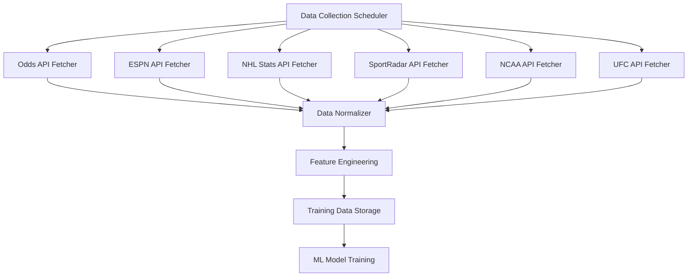
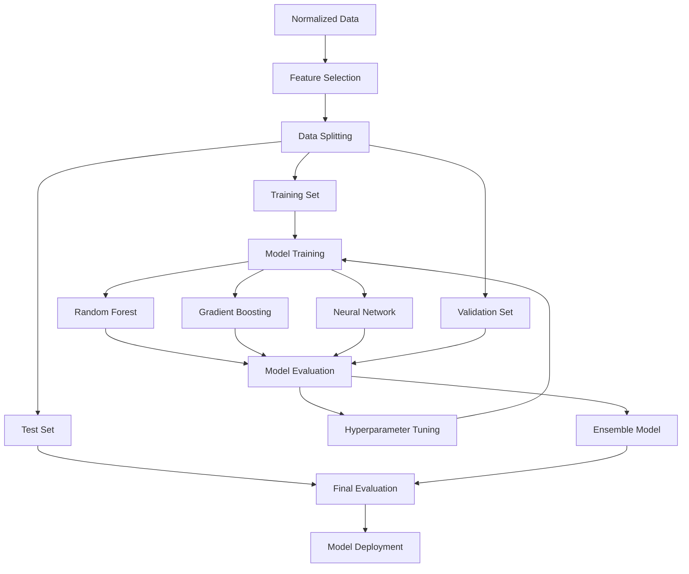

# Sports API Integration Plan for ML Model

## Overview

This document outlines the plan for compiling all available sports APIs and integrating them into our machine learning model. By leveraging multiple data sources, we can create more accurate predictions and provide more comprehensive insights to users.

## Available Sports APIs

We have access to the following sports data APIs:

1. **Odds API**
   - Provides betting odds for all major sports
   - API Key: `fdf4ad2d50a6b6d2ca77e52734851aa4`
   - Supports: NBA, WNBA, MLB, NHL, NCAA, Formula 1, MMA
   - Endpoint: `https://api.the-odds-api.com/v4/sports`

2. **ESPN API**
   - Provides game data, scores, and schedules
   - No authentication required
   - Supports: NBA, WNBA, MLB, NHL, NCAA, Formula 1
   - Endpoint: `https://site.api.espn.com/apis/site/v2/sports`

3. **NHL Stats API**
   - Provides detailed hockey statistics
   - No authentication required
   - Endpoints for schedule, teams, standings, player stats
   - Base URL: `https://api-web.nhl.com`

4. **SportRadar API**
   - Provides detailed data for multiple sports
   - Requires API key (currently using trial key)
   - Supports: NBA, NFL, MLB, NHL, UFC
   - Base URL: `https://api.sportradar.com`

5. **NCAA Basketball API**
   - Provides college basketball data
   - Uses SportRadar as the backend
   - Separate endpoints for men's and women's basketball
   - Base URL: `https://api.sportradar.com`

6. **UFC/MMA API**
   - Provides MMA data and betting options
   - Uses both Odds API and Sherdog API
   - Sherdog API URL: `https://sherdog-api.vercel.app/api`

## Integration Strategy

### 1. Enhanced Data Collection

We'll enhance our data collection process to gather information from all available APIs:



### 2. Data Normalization and Merging

For each sport, we'll collect data from multiple sources and merge them into a unified dataset:

#### NBA Example:
- Game schedules and basic stats from ESPN API
- Detailed player and team statistics from SportRadar API
- Betting odds from Odds API

#### NHL Example:
- Game schedules from ESPN API
- Detailed statistics from NHL Stats API
- Betting odds from Odds API

### 3. Feature Engineering

We'll extract and create features from the combined data sources:

1. **Team Performance Features**
   - Recent form (last N games)
   - Home/away performance
   - Head-to-head history
   - Offensive/defensive efficiency
   - Pace of play
   - Strength of schedule

2. **Player-Level Features**
   - Star player availability
   - Player efficiency ratings
   - Player matchup advantages
   - Recent player performance

3. **Contextual Features**
   - Rest days
   - Travel distance
   - Back-to-back games
   - Weather conditions (for outdoor sports)
   - Altitude

4. **Betting Market Features**
   - Line movement
   - Public betting percentages
   - Historical betting trends
   - Odds from multiple bookmakers

### 4. Model Training Pipeline

We'll enhance our model training pipeline to use the enriched dataset:



### 5. API-Specific Implementation Details

#### Odds API Integration
- Fetch odds for all supported sports
- Store historical odds movement
- Calculate implied probabilities
- Compare odds across bookmakers

#### ESPN API Integration
- Fetch game schedules and results
- Extract basic team and player statistics
- Track game status updates

#### NHL Stats API Integration
- Fetch detailed hockey statistics
- Extract player performance metrics
- Track in-game events and statistics

#### SportRadar API Integration
- Fetch detailed statistics for NBA, NFL, MLB, NHL
- Extract advanced metrics and analytics
- Track play-by-play data

#### NCAA Basketball API Integration
- Fetch college basketball data
- Track tournament brackets and results
- Extract team and player statistics

#### UFC/MMA API Integration
- Fetch fighter statistics and matchups
- Track event schedules and results
- Extract betting odds and line movements

## Implementation Plan

### Phase 1: Enhanced Data Collection (Week 1-2)

1. Update the data fetcher to include all APIs
2. Implement rate limiting and error handling
3. Set up data storage and versioning
4. Create data validation and cleaning processes

### Phase 2: Data Normalization and Feature Engineering (Week 3-4)

1. Develop sport-specific data normalizers
2. Implement feature extraction for each sport
3. Create feature selection pipeline
4. Set up data transformation workflows

### Phase 3: Model Enhancement (Week 5-6)

1. Update model training scripts
2. Implement cross-validation
3. Add new model architectures
4. Create ensemble methods

### Phase 4: Evaluation and Deployment (Week 7-8)

1. Evaluate models on historical data
2. Compare performance against baseline
3. Deploy updated models to production
4. Set up monitoring and retraining pipeline

## Code Implementation

### Enhanced Data Fetcher

The enhanced data fetcher will collect data from all available APIs:

```javascript
// api/ml-sports-edge/data/fetch-enhanced.js

const API_CONFIG = {
  ODDS_API: {
    BASE_URL: 'https://api.the-odds-api.com/v4',
    API_KEY: process.env.ODDS_API_KEY || 'fdf4ad2d50a6b6d2ca77e52734851aa4',
    SPORTS: {
      NBA: 'basketball_nba',
      WNBA: 'basketball_wnba',
      MLB: 'baseball_mlb',
      NHL: 'icehockey_nhl',
      NCAA_MENS: 'basketball_ncaa',
      NCAA_WOMENS: 'basketball_ncaaw',
      FORMULA1: 'motorsport_f1',
      UFC: 'mma_mixed_martial_arts'
    }
  },
  ESPN_API: {
    BASE_URL: 'https://site.api.espn.com/apis/site/v2/sports',
    ENDPOINTS: {
      NBA: 'basketball/nba/scoreboard',
      WNBA: 'basketball/wnba/scoreboard',
      MLB: 'baseball/mlb/scoreboard',
      NHL: 'hockey/nhl/scoreboard',
      NCAA_MENS: 'basketball/mens-college-basketball/scoreboard',
      NCAA_WOMENS: 'basketball/womens-college-basketball/scoreboard',
      FORMULA1: 'racing/f1/scoreboard'
    }
  },
  NHL_API: {
    BASE_URL: 'https://api-web.nhl.com',
    LEGACY_URL: 'https://statsapi.web.nhl.com',
    ENDPOINTS: {
      SCHEDULE: '/api/v1/schedule',
      TEAMS: '/api/v1/teams',
      STANDINGS: '/api/v1/standings',
      PLAYER_STATS: '/api/v1/people',
      GAME_STATS: '/api/v1/game'
    }
  },
  SPORTRADAR_API: {
    BASE_URL: 'https://api.sportradar.com',
    API_KEY: process.env.SPORTRADAR_API_KEY || 'YOUR_API_KEY',
    ENDPOINTS: {
      NBA: {
        GAME_SUMMARY: '/nba/trial/v7/en/games/{game_id}/summary.json',
        PLAYER_PROFILE: '/nba/trial/v7/en/players/{player_id}/profile.json',
        LEAGUE_SCHEDULE: '/nba/trial/v7/en/games/{year}/{month}/{day}/schedule.json',
      },
      NFL: {
        GAME_STATISTICS: '/nfl/official/trial/v7/en/games/{game_id}/statistics.json',
        PLAYER_PROFILE: '/nfl/official/trial/v7/en/players/{player_id}/profile.json',
      },
      MLB: {
        GAME_SUMMARY: '/mlb/trial/v7/en/games/{game_id}/summary.json',
        PLAYER_PROFILE: '/mlb/trial/v7/en/players/{player_id}/profile.json',
      },
      NHL: {
        GAME_SUMMARY: '/nhl/trial/v7/en/games/{game_id}/summary.json',
        PLAYER_PROFILE: '/nhl/trial/v7/en/players/{player_id}/profile.json',
      },
      UFC: {
        EVENT_SUMMARY: '/ufc/trial/v7/en/events/{event_id}/summary.json',
        FIGHTER_PROFILE: '/ufc/trial/v7/en/competitors/{fighter_id}/profile.json',
      }
    }
  },
  NCAA_BASKETBALL_API: {
    BASE_URL: 'https://api.sportradar.com',
    API_KEY: process.env.NCAA_BASKETBALL_API_KEY || 'YOUR_NCAA_API_KEY',
    ENDPOINTS: {
      MENS: {
        GAME_SUMMARY: '/ncaamb/trial/v7/en/games/{game_id}/summary.json',
        PLAYER_PROFILE: '/ncaamb/trial/v7/en/players/{player_id}/profile.json',
        LEAGUE_SCHEDULE: '/ncaamb/trial/v7/en/games/{year}/{month}/{day}/schedule.json',
        TOURNAMENT_SUMMARY: '/ncaamb/trial/v7/en/tournaments/{tournament_id}/summary.json',
      },
      WOMENS: {
        GAME_SUMMARY: '/ncaawb/trial/v7/en/games/{game_id}/summary.json',
        PLAYER_PROFILE: '/ncaawb/trial/v7/en/players/{player_id}/profile.json',
        LEAGUE_SCHEDULE: '/ncaawb/trial/v7/en/games/{year}/{month}/{day}/schedule.json',
        TOURNAMENT_SUMMARY: '/ncaawb/trial/v7/en/tournaments/{tournament_id}/summary.json',
      }
    }
  },
  SHERDOG_API: {
    BASE_URL: 'https://sherdog-api.vercel.app/api',
    ENDPOINTS: {
      FIGHTERS: '/fighters',
      EVENTS: '/events',
      SEARCH: '/search'
    }
  }
};

// Fetch data from all APIs for a specific sport
async function fetchAllDataForSport(sport) {
  console.log(`Fetching all data for ${sport}...`);
  
  // Create a data object to store all fetched data
  const sportData = {
    sport,
    timestamp: new Date().toISOString(),
    sources: {}
  };
  
  // Fetch odds data
  const oddsData = await fetchOddsData(sport);
  if (oddsData) {
    sportData.sources.odds = oddsData;
  }
  
  // Fetch ESPN data
  const espnData = await fetchESPNData(sport);
  if (espnData) {
    sportData.sources.espn = espnData;
  }
  
  // Fetch sport-specific data
  if (sport === 'NHL') {
    const nhlData = await fetchNHLStats();
    if (nhlData) {
      sportData.sources.nhlStats = nhlData;
    }
  }
  
  // Fetch SportRadar data
  const sportRadarData = await fetchSportRadarData(sport);
  if (sportRadarData) {
    sportData.sources.sportRadar = sportRadarData;
  }
  
  // Fetch NCAA data
  if (sport === 'NCAA_MENS' || sport === 'NCAA_WOMENS') {
    const ncaaData = await fetchNCAAData(sport);
    if (ncaaData) {
      sportData.sources.ncaa = ncaaData;
    }
  }
  
  // Fetch UFC data
  if (sport === 'UFC') {
    const ufcData = await fetchUFCData();
    if (ufcData) {
      sportData.sources.ufc = ufcData;
    }
    
    const sherdogData = await fetchSherdogData();
    if (sherdogData) {
      sportData.sources.sherdog = sherdogData;
    }
  }
  
  // Save combined data
  const filename = `${sport.toLowerCase()}_combined_${new Date().toISOString().split('T')[0]}.json`;
  fs.writeFileSync(
    path.join(DATA_DIR, filename),
    JSON.stringify(sportData, null, 2)
  );
  
  console.log(`Saved combined data for ${sport} to ${filename}`);
  return sportData;
}
```

### Data Normalization

The data normalizer will transform data from different sources into a consistent format:

```javascript
// api/ml-sports-edge/data/normalize.js

// Normalize team sports data (NBA, WNBA, MLB, NHL, NCAA)
function normalizeTeamSportData(sportData) {
  const { sport, sources } = sportData;
  const games = [];
  
  // Process ESPN data
  if (sources.espn && sources.espn.events) {
    sources.espn.events.forEach(event => {
      const gameId = event.id;
      const date = new Date(event.date);
      const competitors = event.competitions[0]?.competitors || [];
      const homeTeam = competitors.find(team => team.homeAway === 'home')?.team.displayName || 'TBD';
      const awayTeam = competitors.find(team => team.homeAway === 'away')?.team.displayName || 'TBD';
      
      // Create base game object
      const game = {
        id: gameId,
        sport,
        date,
        homeTeam,
        awayTeam,
        status: event.status?.type?.state || 'pre',
        espnData: {
          // Extract relevant ESPN data
        }
      };
      
      // Add to games array
      games.push(game);
    });
  }
  
  // Enrich with odds data
  if (sources.odds && Array.isArray(sources.odds)) {
    sources.odds.forEach(oddsItem => {
      // Find matching game
      const game = games.find(g => 
        (g.homeTeam.includes(oddsItem.home_team) || oddsItem.home_team.includes(g.homeTeam)) &&
        (g.awayTeam.includes(oddsItem.away_team) || oddsItem.away_team.includes(g.awayTeam))
      );
      
      if (game) {
        game.odds = {
          // Extract and normalize odds data
        };
      }
    });
  }
  
  // Enrich with SportRadar data
  if (sources.sportRadar) {
    // Add SportRadar data to matching games
  }
  
  // Sport-specific enrichment
  if (sport === 'NHL' && sources.nhlStats) {
    // Add NHL stats to matching games
  }
  
  if (sport.includes('NCAA') && sources.ncaa) {
    // Add NCAA-specific data
  }
  
  return games;
}
```

### Feature Engineering

The feature engineering module will extract and create features for the ML model:

```javascript
// api/ml-sports-edge/models/features.js

// Extract features for team sports
function extractTeamSportFeatures(games, historicalGames) {
  return games.map(game => {
    // Base features
    const features = {
      sportType: game.sport,
      isHomeGame: 1, // For home team perspective
      dayOfWeek: game.date.getDay(),
      isWeekend: game.date.getDay() === 0 || game.date.getDay() === 6 ? 1 : 0,
      // More base features...
    };
    
    // Team performance features
    const homeTeamHistory = getTeamHistory(game.homeTeam, historicalGames);
    const awayTeamHistory = getTeamHistory(game.awayTeam, historicalGames);
    
    features.homeTeamWinRate = calculateWinRate(homeTeamHistory);
    features.awayTeamWinRate = calculateWinRate(awayTeamHistory);
    features.homeTeamRecentForm = calculateRecentForm(homeTeamHistory, 10);
    features.awayTeamRecentForm = calculateRecentForm(awayTeamHistory, 10);
    features.homeTeamHomeWinRate = calculateHomeWinRate(homeTeamHistory);
    features.awayTeamAwayWinRate = calculateAwayWinRate(awayTeamHistory);
    
    // Head-to-head features
    const h2hGames = getHeadToHeadGames(game.homeTeam, game.awayTeam, historicalGames);
    features.h2hHomeWinRate = calculateH2HWinRate(h2hGames, game.homeTeam);
    
    // Odds-based features
    if (game.odds) {
      features.homeTeamImpliedProbability = calculateImpliedProbability(game.odds.homeMoneyline);
      features.awayTeamImpliedProbability = calculateImpliedProbability(game.odds.awayMoneyline);
      features.spreadValue = game.odds.spread;
      features.totalValue = game.odds.total;
    }
    
    // Sport-specific features
    if (game.sport === 'NHL' && game.nhlStats) {
      // Add NHL-specific features
    }
    
    if (game.sport.includes('NCAA')) {
      // Add NCAA-specific features
    }
    
    return features;
  });
}
```

### Model Training

The model training module will use the extracted features to train prediction models:

```javascript
// api/ml-sports-edge/models/train-enhanced.js

// Train models for all sports
async function trainAllSportsModels() {
  const sports = ['NBA', 'WNBA', 'MLB', 'NHL', 'NCAA_MENS', 'NCAA_WOMENS', 'FORMULA1', 'UFC'];
  
  for (const sport of sports) {
    console.log(`Training models for ${sport}...`);
    
    // Load normalized data
    const data = loadNormalizedData(sport);
    
    // Extract features
    const features = extractFeatures(data);
    
    // Split data
    const { trainFeatures, trainLabels, valFeatures, valLabels, testFeatures, testLabels } = splitData(features);
    
    // Train models
    const models = {
      spread: await trainSpreadModel(trainFeatures, trainLabels.spread, valFeatures, valLabels.spread),
      total: await trainTotalModel(trainFeatures, trainLabels.total, valFeatures, valLabels.total),
      moneyline: await trainMoneylineModel(trainFeatures, trainLabels.moneyline, valFeatures, valLabels.moneyline)
    };
    
    // Evaluate models
    const evaluation = {
      spread: evaluateModel(models.spread, testFeatures, testLabels.spread),
      total: evaluateModel(models.total, testFeatures, testLabels.total),
      moneyline: evaluateModel(models.moneyline, testFeatures, testLabels.moneyline)
    };
    
    console.log(`${sport} model evaluation:`, evaluation);
    
    // Save models
    saveModels(sport, models);
  }
}
```

## Conclusion

By integrating all available sports APIs into our ML model, we can create more accurate predictions and provide more comprehensive insights to users. This plan outlines the steps needed to collect, normalize, and process data from multiple sources, extract meaningful features, and train enhanced prediction models.

The implementation will be done in phases, starting with enhanced data collection and ending with model evaluation and deployment. Each phase builds on the previous one, ensuring a systematic approach to improving our prediction capabilities.

As we gather more data and refine our models, we can continue to enhance our predictions and provide even more value to users.