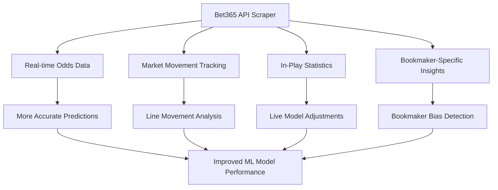
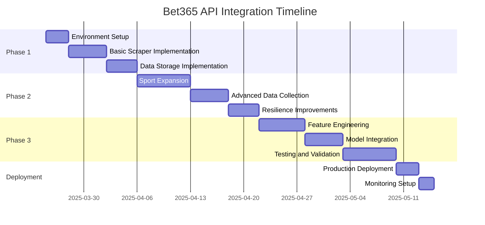

# Bet365 API Scraper Integration Plan

## Overview

This document evaluates the potential benefits of integrating a Bet365 API scraper into our ML Sports Edge prediction system and outlines an implementation plan. The Bet365 scraper would complement our planned ESPN API integration to provide a more comprehensive dataset for our ML models.

## Value Assessment

### Benefits of Bet365 API Integration



1. **Real-time Betting Odds**
   - Bet365 is one of the world's largest bookmakers with extensive market coverage
   - Access to real-time odds across multiple bet types (moneyline, spread, totals, props)
   - Ability to track odds changes over time, which can be a powerful predictive signal

2. **Complementary to ESPN Data**
   - ESPN provides rich game statistics, schedules, and historical data
   - Bet365 provides market-based probabilities and betting trends
   - Combining both sources creates a more complete picture for the ML model

3. **In-Play Data Access**
   - The scraper specifically targets live match data ("Ao-Vivo")
   - In-play statistics and odds movements provide valuable real-time signals
   - Enables development of live betting models and recommendations

4. **Market Sentiment Indicators**
   - Betting odds reflect both statistical probabilities and market sentiment
   - Discrepancies between statistical models and market odds can reveal value opportunities
   - Tracking line movements helps identify sharp money and market reactions

5. **Expanded Sports Coverage**
   - Bet365 covers a wide range of sports and leagues globally
   - Would enhance our coverage beyond what's available in the ESPN API
   - Particularly valuable for international sports and niche markets

### Potential Challenges

1. **Technical Complexity**
   - Requires maintaining proper headers and cookies to mimic browser behavior
   - Response format appears to be non-standard and requires custom parsing
   - May require regular updates if Bet365 changes their API structure

2. **Reliability Concerns**
   - Unofficial API access may be unstable or subject to blocking
   - Rate limiting could restrict the frequency of data collection
   - IP address blocking risk if scraping is too aggressive

3. **Legal and Terms of Service Considerations**
   - Scraping may violate Bet365's terms of service
   - Need to implement responsible scraping practices (rate limiting, caching)
   - Should be used for analytical purposes only, not for commercial redistribution

## Implementation Plan

### Phase 1: Scraper Setup and Basic Data Collection

1. **Environment Configuration**
   - Set up a dedicated Python environment for the scraper
   - Configure the necessary headers and cookies in a .env file
   - Implement proper error handling and logging

2. **Basic Data Collection**
   - Implement the core scraping functionality based on the GitHub repository
   - Focus initially on football/soccer matches as demonstrated in the example
   - Add support for additional sports based on priority

3. **Data Storage**
   - Create a structured database schema for storing the scraped odds data
   - Implement a caching mechanism to reduce API calls
   - Set up historical tracking of odds movements

### Phase 2: Enhanced Features and Sport Expansion

1. **Expanded Sport Coverage**
   - Extend the scraper to support all sports in our ML model
   - Identify and map the sport-specific data fields
   - Create sport-specific parsers as needed

2. **Advanced Data Collection**
   - Implement scheduled scraping at regular intervals
   - Add support for pre-game odds in addition to in-play data
   - Collect additional bet types (props, futures, etc.)

3. **Resilience Improvements**
   - Implement proxy rotation to avoid IP blocking
   - Add automatic retry logic with exponential backoff
   - Create monitoring alerts for scraper failures

### Phase 3: ML Model Integration

1. **Feature Engineering**
   - Create new features based on Bet365 odds data
   - Develop indicators for line movements and market sentiment
   - Calculate derived metrics (implied probabilities, market efficiency)

2. **Model Enhancement**
   - Integrate Bet365 features into existing ML models
   - Create specialized models for in-play betting
   - Develop ensemble approaches combining statistical and market-based predictions

3. **Validation and Testing**
   - Measure prediction improvement with Bet365 data
   - Conduct backtesting on historical odds data
   - Perform A/B testing of models with and without Bet365 features

## Technical Implementation

### Core Components

1. **Scraper Module**

```python
# bet365_scraper.py
import os
import requests
from dotenv import load_dotenv

class Bet365Scraper:
    def __init__(self):
        load_dotenv()
        self.session = requests.Session()
        self.headers = {
            'Accept': os.getenv('ACCEPT'),
            'Accept-Encoding': os.getenv('ACCEPT_ENCODING'),
            'Accept-Language': os.getenv('ACCEPT_LANGUAGE'),
            'Cache-Control': os.getenv('CACHE_CONTROL'),
            'Connection': os.getenv('CONNECTION'),
            'Cookie': os.getenv('COOKIE'),
            'Host': os.getenv('HOST'),
            'Origin': os.getenv('ORIGIN'),
            'Pragma': os.getenv('PRAGMA'),
            'Referer': os.getenv('REFERER'),
            'Sec-Ch-Ua': os.getenv('SEC_CH_UA'),
            'Sec-Ch-Ua-Mobile': os.getenv('SEC_CH_UA_MOBILE'),
            'Sec-Ch-Ua-Platform': os.getenv('SEC_CH_UA_PLATFORM'),
            'User-Agent': os.getenv('USER_AGENT')
        }
        self.api_url = os.getenv('INPLAYDIARYAPI')
        
    def get_live_events(self, sport=None):
        """Fetch live events from Bet365, optionally filtered by sport"""
        try:
            response = self.session.get(self.api_url, headers=self.headers, timeout=60)
            response.raise_for_status()
            
            # Process the response
            data = response.text.split('EV')
            events = []
            
            for item in data:
                # Filter by sport if specified
                if sport and sport.lower() not in item.lower():
                    continue
                    
                # Extract event data
                event_data = self._parse_event(item)
                if event_data:
                    events.append(event_data)
                    
            return events
            
        except requests.exceptions.RequestException as e:
            print(f"Error fetching Bet365 data: {e}")
            return []
            
    def _parse_event(self, item):
        """Parse a single event item from the response"""
        try:
            # Check if this is a valid event
            if not ('CL' in item and 'NA' in item):
                return None
                
            # Extract basic event information
            event = {
                'league': self._extract_data(item, 'CL', 'CI'),
                'league_id': self._extract_data(item, 'CI', 'NA'),
                'teams': self._extract_data(item, 'NA', 'VI'),
                'scores': self._extract_data(item, 'VI', 'SM'),
                'match_time': self._extract_data(item, 'SM', 'CN'),
                'betting_status': self._extract_data(item, 'CB', 'CI'),
                'odds': {}
            }
            
            # Extract odds data
            # This would need to be customized based on the actual response format
            # and the specific odds types we're interested in
            
            return event
            
        except Exception as e:
            print(f"Error parsing event: {e}")
            return None
            
    def _extract_data(self, item, start, end):
        """Extract data between two markers in the response"""
        try:
            start_idx = item.index(start) + len(start) + 1
            end_idx = item.index(end) - 1
            return item[start_idx:end_idx]
        except ValueError:
            return None
```

2. **Data Processor Module**

```python
# bet365_processor.py
import pandas as pd
from datetime import datetime

class Bet365Processor:
    def __init__(self, db_connector):
        self.db = db_connector
        
    def process_events(self, events):
        """Process and store events data"""
        if not events:
            return
            
        # Convert to DataFrame for easier processing
        df = pd.DataFrame(events)
        
        # Add timestamp
        df['timestamp'] = datetime.now().isoformat()
        
        # Parse team names and scores
        df = self._parse_teams_and_scores(df)
        
        # Calculate implied probabilities
        df = self._calculate_implied_probabilities(df)
        
        # Store in database
        self.db.store_events(df.to_dict('records'))
        
        return df
        
    def _parse_teams_and_scores(self, df):
        """Parse team names and scores from the raw data"""
        # Implementation would depend on the exact format of the data
        # This is a placeholder for the actual parsing logic
        return df
        
    def _calculate_implied_probabilities(self, df):
        """Calculate implied probabilities from odds"""
        # Implementation would depend on the odds format
        # This is a placeholder for the actual calculation
        return df
```

3. **Integration with ML Pipeline**

```python
# ml_pipeline.py
from bet365_scraper import Bet365Scraper
from bet365_processor import Bet365Processor
from database import DatabaseConnector
import pandas as pd

class MLPipeline:
    def __init__(self):
        self.db = DatabaseConnector()
        self.scraper = Bet365Scraper()
        self.processor = Bet365Processor(self.db)
        
    def collect_data(self):
        """Collect data from all sources"""
        # Collect ESPN data (from existing implementation)
        espn_data = self.collect_espn_data()
        
        # Collect Bet365 data
        bet365_events = self.scraper.get_live_events()
        bet365_data = self.processor.process_events(bet365_events)
        
        # Merge data sources
        combined_data = self.merge_data_sources(espn_data, bet365_data)
        
        return combined_data
        
    def merge_data_sources(self, espn_data, bet365_data):
        """Merge data from ESPN and Bet365"""
        # Implementation would depend on the structure of both datasets
        # This is a placeholder for the actual merging logic
        return combined_data
        
    def extract_features(self, data):
        """Extract features for ML model"""
        # Extract standard features
        features = self.extract_standard_features(data)
        
        # Extract Bet365-specific features
        bet365_features = self.extract_bet365_features(data)
        
        # Combine features
        all_features = pd.concat([features, bet365_features], axis=1)
        
        return all_features
        
    def extract_bet365_features(self, data):
        """Extract Bet365-specific features"""
        features = pd.DataFrame()
        
        # Market confidence (derived from odds)
        features['market_confidence_home'] = data['home_implied_probability']
        features['market_confidence_away'] = data['away_implied_probability']
        
        # Line movement (if historical data available)
        features['line_movement'] = data['current_spread'] - data['opening_spread']
        
        # Market vs. model discrepancy
        features['market_model_discrepancy'] = data['model_probability'] - data['implied_probability']
        
        return features
```

### Integration with Existing ML System

The Bet365 scraper will be integrated with our existing ML system as follows:

1. **Data Collection Layer**
   - Add Bet365Scraper as a new data source alongside ESPN API
   - Implement scheduling to collect data at regular intervals
   - Store raw data in a dedicated collection/table

2. **Data Processing Layer**
   - Create parsers for different sports and bet types
   - Normalize Bet365 data to match our standard format
   - Merge with data from other sources

3. **Feature Engineering Layer**
   - Create new features based on betting odds and line movements
   - Calculate market-derived metrics (implied probabilities, etc.)
   - Develop indicators for market sentiment and sharp money

4. **Model Training Layer**
   - Incorporate Bet365 features into training datasets
   - Adjust feature importance based on performance
   - Create specialized models for in-play betting

5. **Prediction Layer**
   - Enhance predictions with real-time odds data
   - Provide confidence scores based on model-market agreement
   - Identify value bets where model and market disagree

## Implementation Timeline



## Conclusion

Integrating the Bet365 API scraper would provide significant value to our ML Sports Edge prediction system by adding real-time betting odds data, market sentiment indicators, and in-play statistics. This data would complement our planned ESPN API integration to create a more comprehensive and accurate prediction model.

The implementation would require careful attention to technical details, particularly around maintaining proper headers and cookies for API access, as well as responsible scraping practices to avoid blocking. However, the potential benefits in terms of prediction accuracy and feature richness make this a worthwhile investment.

We recommend proceeding with the implementation according to the phased approach outlined in this document, starting with basic data collection for a limited set of sports and gradually expanding to cover all sports and advanced features.

## Next Steps

1. Set up the development environment and configure the necessary credentials
2. Implement the basic scraper functionality for football/soccer matches
3. Test the data collection and parsing with live matches
4. Begin integrating with the existing ML pipeline
5. Expand to additional sports based on priority