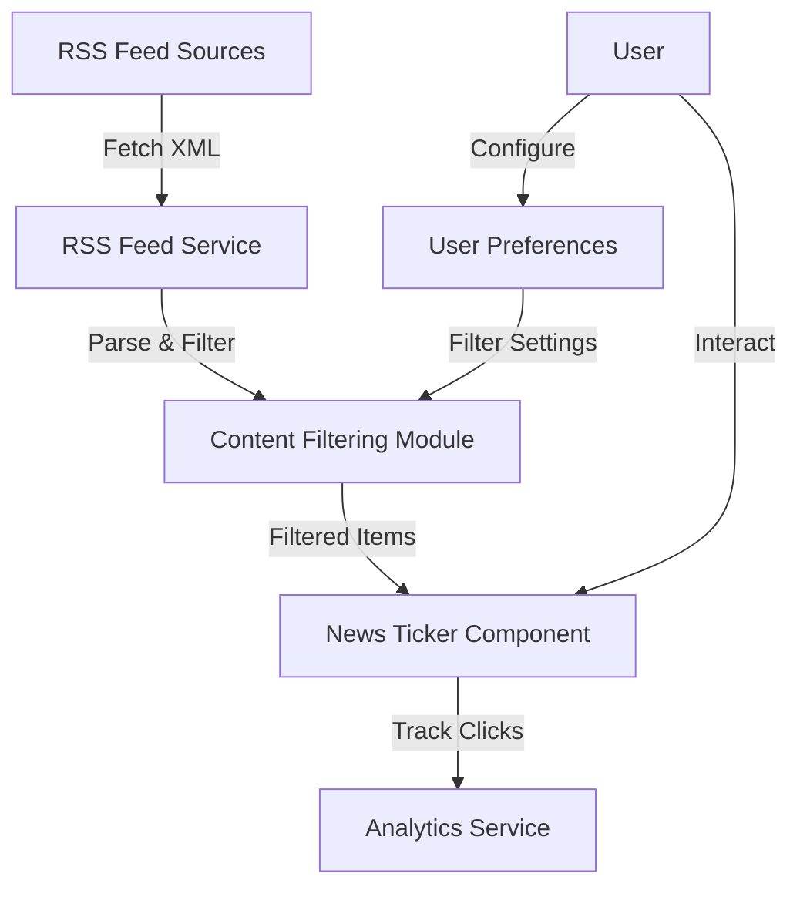

# RSS Feed Integration Summary

## Overview

This document provides a summary of the implementation plan for integrating RSS feeds into the AI Sports Edge app, including content filtering and user preferences features.

## Key Features

1. **RSS Feed Integration**
   - Display sports news from multiple sources in a scrolling ticker on the login page
   - Fetch and parse RSS feeds from various sports news sources
   - Cache results to reduce API calls
   - Track news item clicks for analytics

2. **Content Filtering**
   - Implement keyword-based filtering to ensure only the most relevant sports odds appear for the user
   - Calculate relevance scores based on user preferences
   - Identify betting-related content
   - Filter content based on sports categories, teams, and betting relevance

3. **User Preferences**
   - Allow users to customize which sports news categories they want to see
   - Save preferences to Firestore
   - Apply preferences to filter news content
   - Provide a user-friendly interface for managing preferences

## Architecture

The RSS feed integration follows a modular architecture:

## Implementation Components

1. **Backend Components**
   - RSS Feed Service (`fetchRssFeeds.js`)
   - Content Filtering Module (`contentFiltering.js`)
   - API Endpoints (`index.js`)
   - User Preferences Service (`userPreferencesService.js`)

2. **Frontend Components**
   - News Ticker Component (`NewsTicker.jsx`)
   - User Preferences Component (`UserPreferences.jsx`)
   - CSS Styles (`news-ticker.css`, `user-preferences.css`)

3. **Database**
   - User Preferences Collection in Firestore
   - News Item Clicks Collection for Analytics

## Implementation Phases

1. **Phase 1: Core RSS Feed Service** (1 week)
   - Implement feed fetching and parsing
   - Set up caching mechanism
   - Create basic API endpoints

2. **Phase 2: Content Filtering** (1 week)
   - Implement keyword-based filtering
   - Create relevance scoring algorithm
   - Integrate with RSS feed service

3. **Phase 3: User Preferences** (1 week)
   - Create user preferences data model
   - Implement preferences service
   - Create preferences UI component

4. **Phase 4: News Ticker Component** (1 week)
   - Create scrolling news ticker
   - Implement auto-scrolling with pause on hover
   - Integrate with user preferences

5. **Phase 5: Analytics Integration** (1 week)
   - Implement click tracking
   - Set up analytics events
   - Create analytics dashboard

6. **Testing and Deployment** (1 week)
   - Unit testing
   - Integration testing
   - End-to-end testing
   - Deployment to production

## Key Technical Decisions

1. **RSS Feed Parsing**
   - Use xml2js for parsing XML feeds
   - Normalize different feed formats to a consistent structure
   - Cache feeds for 15 minutes to reduce API calls

2. **Content Filtering**
   - Use keyword-based filtering for sports categories
   - Calculate relevance scores based on multiple factors
   - Sort and filter items based on relevance scores

3. **User Preferences**
   - Store preferences in Firestore
   - Use default preferences for non-authenticated users
   - Allow customization of sports categories, betting content, and favorite teams

4. **News Ticker**
   - Implement horizontal auto-scrolling
   - Allow pausing on hover
   - Highlight betting-related content
   - Track clicks for analytics

## Benefits

1. **For Users**
   - Access to latest sports news
   - Personalized news feed based on preferences
   - Easy access to betting-related content
   - Seamless integration with login page

2. **For Business**
   - Increased user engagement
   - Better understanding of user interests through analytics
   - Potential for targeted advertising
   - Enhanced user experience

## Future Enhancements

1. Add more RSS feed sources
2. Implement machine learning for better content relevance scoring
3. Add support for more sports categories
4. Implement natural language processing for better keyword extraction
5. Add analytics dashboard for monitoring news item performance
6. Add push notifications for breaking news
7. Implement social sharing functionality
8. Add ability to save/bookmark news items

## Conclusion

The RSS feed integration will enhance the AI Sports Edge app by providing users with the latest sports news, personalized to their interests. The implementation follows a modular architecture that allows for easy maintenance and future enhancements. The content filtering and user preferences features ensure that users see the most relevant content, improving the overall user experience.