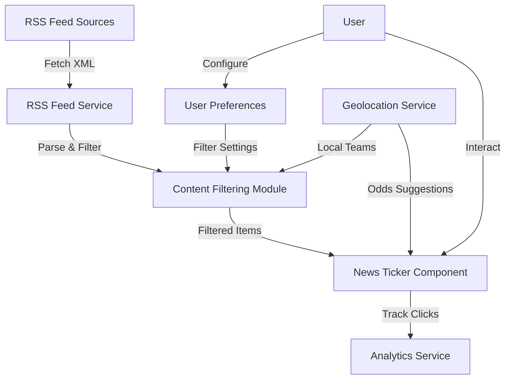

# Complete RSS Feed Integration Plan

## Overview

This document provides a comprehensive overview of the RSS feed integration for the AI Sports Edge app, including both the core implementation and the geolocation enhancement.

## Core Implementation (Completed)

The core RSS feed integration has been successfully implemented with the following components:

### Backend Components

1. **Content Filtering Module** (`api/rssFeeds/contentFiltering.js`)
   - Keyword-based filtering for sports categories
   - Betting content identification
   - Relevance scoring algorithm
   - Team-specific filtering

2. **RSS Feed Service** (`api/rssFeeds/fetchRssFeeds.js`)
   - Fetches RSS feeds from multiple sources
   - Parses XML to JSON
   - Caches results to reduce API calls
   - Applies content filtering based on user preferences

3. **API Endpoints** (`api/rssFeeds/index.js`)
   - GET endpoint for retrieving RSS feeds
   - POST endpoint for retrieving feeds with user preferences
   - POST endpoint for tracking news item clicks

4. **Cron Job** (`jobs/rssFeedCronJob.js`)
   - Periodically fetches and caches RSS feeds
   - Runs every 15 minutes
   - Ensures fresh content is always available

### Frontend Components

1. **News Ticker Component** (`web/components/NewsTicker.js`)
   - Displays scrolling news headlines
   - Auto-scrolls with configurable speed
   - Pauses on hover
   - Highlights betting-related content
   - Tracks clicks for analytics

2. **User Preferences Component** (`web/components/UserPreferences.js`)
   - Allows users to select preferred sports categories
   - Provides option to show only betting-related content
   - Enables users to add favorite teams
   - Allows setting maximum number of news items

3. **CSS Styles**
   - News ticker styles (`web/styles/news-ticker.css`)
   - User preferences styles (`web/styles/user-preferences.css`)

### Server Integration

1. **Server Configuration** (`server.js`)
   - Registers RSS feed API endpoints
   - Starts the RSS feed cron job

2. **Dependencies**
   - Added xml2js for XML parsing
   - Uses axios for HTTP requests
   - Employs node-cron for scheduling

## Geolocation Enhancement (Planned)

The geolocation enhancement will build upon the core implementation to provide localized content and odds suggestions:

### New Components

1. **Geolocation Service** (`services/geolocationService.js`)
   - Integrates with IPgeolocation.io API
   - Determines user location based on IP address
   - Identifies local teams based on location
   - Provides localized odds suggestions

2. **Enhanced Content Filtering**
   - Updates relevance scoring to prioritize local team news
   - Boosts scores for content related to local teams

3. **Updated User Preferences**
   - Adds location settings to preferences
   - Displays identified local teams
   - Provides opt-out mechanism for privacy

4. **Enhanced News Ticker**
   - Displays localized odds suggestions
   - Highlights local team news

### Technical Requirements

1. IPgeolocation.io API key
2. Secure storage for location data
3. Privacy controls and compliance measures

## Implementation Flow

## RSS Sources

The following RSS sources are used:

1. **ESPN**: https://www.espn.com/espn/rss/news
2. **CBS Sports**: https://www.cbssports.com/rss/headlines
3. **Bleacher Report**: https://bleacherreport.com/articles/feed
4. **Yahoo Sports**: https://sports.yahoo.com/rss/
5. **The Athletic**: https://theathletic.com/news/feed

Sport-specific feeds are also available for:

- Football (NFL)
- Basketball (NBA)
- Baseball (MLB)
- Hockey (NHL)
- MMA/UFC
- Formula 1

## User Experience

1. **Initial View**
   - User sees the news ticker on the login page
   - Ticker displays latest sports news
   - Betting-related content is highlighted

2. **Customization**
   - User clicks settings icon to open preferences
   - User selects preferred sports categories
   - User adds favorite teams
   - User enables/disables location-based personalization

3. **Personalized Content**
   - News ticker displays content filtered by preferences
   - Local team news is prioritized (if location enabled)
   - Localized odds suggestions are displayed (if location enabled)

4. **Interaction**
   - User clicks on news items of interest
   - Clicks are tracked for analytics
   - User experience improves over time as the system learns preferences

## Privacy Considerations

1. **Transparent Data Collection**
   - Clear notice about location data collection
   - Explanation of how data is used

2. **User Control**
   - Opt-out mechanism for location-based features
   - Ability to manually set location

3. **Data Security**
   - Secure storage of location data
   - No sharing with third parties

4. **Regulatory Compliance**
   - GDPR compliance for European users
   - CCPA compliance for California users

## Implementation Timeline

1. **Phase 1: Core Implementation** (Completed)
   - Content filtering
   - User preferences
   - News ticker
   - API endpoints

2. **Phase 2: Geolocation Enhancement** (4 weeks)
   - Week 1: Geolocation service setup
   - Week 2: Content filtering enhancement
   - Week 3: UI updates
   - Week 4: Testing and privacy compliance

## Success Metrics

1. **Engagement**
   - Increased time spent on the login page
   - Higher click-through rates on news items
   - More interaction with the preferences settings

2. **Relevance**
   - Higher click rates on local team news
   - Positive feedback on content relevance
   - Increased usage of betting features from news clicks

3. **Conversion**
   - Higher conversion from free to premium users
   - Increased betting activity from news referrals
   - More return visits to the app

## Conclusion

The RSS feed integration provides a valuable feature for the AI Sports Edge app, enhancing the user experience with personalized sports news and betting opportunities. The core implementation delivers the fundamental functionality, while the geolocation enhancement will further personalize the content to each user's location and local teams.

By combining content filtering, user preferences, and geolocation data, the system will deliver highly relevant sports news and odds suggestions, increasing user engagement and potentially driving higher conversion rates for premium features and betting activities.