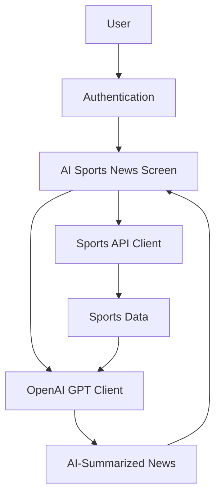

# AI Sports News Implementation Plan

This document outlines the implementation plan for adding an AI-powered Sports News feature to the AI Sports Edge app. This feature will pull real-time injury reports, lineup changes, and trade rumors affecting odds and summarize them using OpenAI's GPT API.

## Overview

The AI Sports News feature will:
- Fetch real-time sports news from a sports API
- Use OpenAI's GPT API to summarize news with a betting focus
- Display the summarized news in a dedicated screen
- Require user authentication to access

## Architecture



## Implementation Steps

### 1. Setup Dependencies

Add the following dependencies to the project:

```bash
npm install axios openai react-native-dotenv
```

### 2. Create API Services

#### 2.1 Sports News Service

Create a new file at `services/sportsNewsService.ts`:

```typescript
import axios from 'axios';
import { SPORTS_API_KEY } from '@env';

interface NewsItem {
  id: string;
  title: string;
  content: string;
  category: 'injury' | 'lineup' | 'trade' | 'general';
  timestamp: string;
  teams: string[];
  players?: string[];
  source: string;
  url: string;
}

export async function fetchSportsNews(): Promise<NewsItem[]> {
  try {
    const response = await axios.get(
      `https://api.sportsdata.io/v3/nba/news-rotoballer/json/RotoBallerArticlesByDate/{date}`,
      {
        params: {
          key: SPORTS_API_KEY
        }
      }
    );
    
    // Transform API response to our NewsItem format
    return response.data.map((item: any) => ({
      id: item.NewsID,
      title: item.Title,
      content: item.Content,
      category: categorizeNews(item.Title, item.Content),
      timestamp: item.Updated,
      teams: extractTeams(item.Content),
      players: extractPlayers(item.Content),
      source: 'SportsData.io',
      url: item.OriginalSourceUrl
    }));
  } catch (error) {
    console.error('Error fetching sports news:', error);
    throw error;
  }
}

// Helper functions to categorize news and extract entities
function categorizeNews(title: string, content: string): 'injury' | 'lineup' | 'trade' | 'general' {
  const text = (title + ' ' + content).toLowerCase();
  if (text.includes('injury') || text.includes('injured') || text.includes('out')) {
    return 'injury';
  } else if (text.includes('lineup') || text.includes('starting') || text.includes('bench')) {
    return 'lineup';
  } else if (text.includes('trade') || text.includes('sign') || text.includes('deal')) {
    return 'trade';
  } else {
    return 'general';
  }
}

function extractTeams(content: string): string[] {
  // This would use a more sophisticated algorithm in production
  // For now, we'll use a simple placeholder
  return [];
}

function extractPlayers(content: string): string[] {
  // This would use a more sophisticated algorithm in production
  // For now, we'll use a simple placeholder
  return [];
}
```

#### 2.2 AI Summary Service

Create a new file at `services/aiSummaryService.ts`:

```typescript
import axios from 'axios';
import { OPENAI_API_KEY } from '@env';

interface SummaryRequest {
  content: string;
  maxLength?: number;
  focusOn?: 'betting' | 'fantasy' | 'general';
}

export async function summarizeWithAI(request: SummaryRequest): Promise<string> {
  try {
    const focusPrompt = request.focusOn === 'betting' 
      ? 'Focus on how this might affect betting odds, point spreads, and game outcomes.'
      : request.focusOn === 'fantasy'
      ? 'Focus on fantasy sports implications and player performance expectations.'
      : 'Provide a general summary of the key points.';
    
    const response = await axios.post(
      'https://api.openai.com/v1/chat/completions',
      {
        model: 'gpt-4',
        messages: [
          {
            role: 'system',
            content: `You are a sports analyst specializing in summarizing sports news. ${focusPrompt} Be concise and focus on facts.`
          },
          {
            role: 'user',
            content: `Summarize the following sports news in ${request.maxLength || 150} words or less:\n\n${request.content}`
          }
        ],
        max_tokens: 300,
        temperature: 0.5
      },
      {
        headers: {
          'Authorization': `Bearer ${OPENAI_API_KEY}`,
          'Content-Type': 'application/json'
        }
      }
    );
    
    return response.data.choices[0].message.content.trim();
  } catch (error) {
    console.error('Error summarizing with AI:', error);
    throw error;
  }
}
```

### 3. Create Firebase Cloud Function for AI Processing

Create a new file at `functions/aiSummary.js`:

```javascript
const functions = require('firebase-functions');
const admin = require('firebase-admin');
const axios = require('axios');
const cors = require('cors')({ origin: true });

admin.initializeApp();

exports.summarizeSportsNews = functions.https.onCall(async (data, context) => {
  // Check if user is authenticated
  if (!context.auth) {
    throw new functions.https.HttpsError(
      'unauthenticated',
      'The function must be called while authenticated.'
    );
  }

  const { content, maxLength = 150, focusOn = 'betting' } = data;
  
  if (!content) {
    throw new functions.https.HttpsError(
      'invalid-argument',
      'The function must be called with "content" argument.'
    );
  }

  try {
    const focusPrompt = focusOn === 'betting' 
      ? 'Focus on how this might affect betting odds, point spreads, and game outcomes.'
      : focusOn === 'fantasy'
      ? 'Focus on fantasy sports implications and player performance expectations.'
      : 'Provide a general summary of the key points.';
    
    const response = await axios.post(
      'https://api.openai.com/v1/chat/completions',
      {
        model: 'gpt-4',
        messages: [
          {
            role: 'system',
            content: `You are a sports analyst specializing in summarizing sports news. ${focusPrompt} Be concise and focus on facts.`
          },
          {
            role: 'user',
            content: `Summarize the following sports news in ${maxLength} words or less:\n\n${content}`
          }
        ],
        max_tokens: 300,
        temperature: 0.5
      },
      {
        headers: {
          'Authorization': `Bearer ${process.env.OPENAI_API_KEY}`,
          'Content-Type': 'application/json'
        }
      }
    );
    
    return {
      summary: response.data.choices[0].message.content.trim()
    };
  } catch (error) {
    console.error('Error calling OpenAI API:', error);
    throw new functions.https.HttpsError(
      'internal',
      'Error processing AI summary',
      error.message
    );
  }
});
```

Update `functions/index.js` to include the new function:

```javascript
const aiSummary = require('./aiSummary');

// Export existing functions
// ...

// Export new functions
exports.summarizeSportsNews = aiSummary.summarizeSportsNews;
```

### 4. Create UI Components

#### 4.1 News Item Component

Create a new file at `components/NewsItem.tsx`:

```typescript
import React, { useState, useEffect } from 'react';
import { View, Text, StyleSheet, TouchableOpacity } from 'react-native';
import { Ionicons } from '@expo/vector-icons';
import { NeonCard, NeonText } from './ui';
import { summarizeWithAI } from '../services/aiSummaryService';
import { useThemeColor } from '../hooks/useThemeColor';

interface NewsItemProps {
  id: string;
  title: string;
  content: string;
  category: 'injury' | 'lineup' | 'trade' | 'general';
  timestamp: string;
  teams: string[];
  players?: string[];
  source: string;
  url: string;
}

const NewsItem: React.FC<NewsItemProps> = ({
  title,
  content,
  category,
  timestamp,
  teams,
  players,
  source
}) => {
  const [expanded, setExpanded] = useState(false);
  const [aiSummary, setAiSummary] = useState<string | null>(null);
  const [loading, setLoading] = useState(false);
  
  const primaryColor = useThemeColor({}, 'tint');
  const textColor = useThemeColor({}, 'text');
  
  const getCategoryIcon = () => {
    switch (category) {
      case 'injury':
        return 'bandage';
      case 'lineup':
        return 'people';
      case 'trade':
        return 'swap-horizontal';
      default:
        return 'newspaper';
    }
  };
  
  const getCategoryColor = () => {
    switch (category) {
      case 'injury':
        return '#e74c3c';
      case 'lineup':
        return '#3498db';
      case 'trade':
        return '#f39c12';
      default:
        return '#2ecc71';
    }
  };
  
  const toggleExpand = async () => {
    setExpanded(!expanded);
    
    // Generate AI summary if expanding and not already loaded
    if (!expanded && !aiSummary && !loading) {
      try {
        setLoading(true);
        const summary = await summarizeWithAI({
          content,
          maxLength: 150,
          focusOn: 'betting'
        });
        setAiSummary(summary);
      } catch (error) {
        console.error('Error getting AI summary:', error);
      } finally {
        setLoading(false);
      }
    }
  };
  
  return (
    <NeonCard style={styles.container}>
      <TouchableOpacity onPress={toggleExpand} activeOpacity={0.7}>
        <View style={styles.header}>
          <View style={styles.categoryContainer}>
            <View style={[styles.categoryBadge, { backgroundColor: getCategoryColor() }]}>
              <Ionicons name={getCategoryIcon()} size={16} color="#fff" />
            </View>
            <Text style={[styles.category, { color: getCategoryColor() }]}>
              {category.charAt(0).toUpperCase() + category.slice(1)}
            </Text>
          </View>
          <Text style={[styles.timestamp, { color: textColor }]}>
            {new Date(timestamp).toLocaleString()}
          </Text>
        </View>
        
        <NeonText type="subheading" style={styles.title}>
          {title}
        </NeonText>
        
        {teams.length > 0 && (
          <View style={styles.teamsContainer}>
            {teams.map(team => (
              <View key={team} style={styles.teamBadge}>
                <Text style={styles.teamText}>{team}</Text>
              </View>
            ))}
          </View>
        )}
        
        {expanded && (
          <View style={styles.expandedContent}>
            {aiSummary ? (
              <View style={styles.aiSummaryContainer}>
                <View style={styles.aiHeader}>
                  <Ionicons name="flash" size={16} color={primaryColor} />
                  <Text style={[styles.aiTitle, { color: primaryColor }]}>AI BETTING ANALYSIS</Text>
                </View>
                <Text style={[styles.aiSummary, { color: textColor }]}>{aiSummary}</Text>
              </View>
            ) : loading ? (
              <View style={styles.loadingContainer}>
                <Text style={[styles.loadingText, { color: textColor }]}>Generating AI analysis...</Text>
              </View>
            ) : null}
            
            <Text style={[styles.content, { color: textColor }]}>{content}</Text>
            
            <View style={styles.footer}>
              <Text style={[styles.source, { color: textColor }]}>Source: {source}</Text>
            </View>
          </View>
        )}
        
        <View style={styles.expandIconContainer}>
          <Ionicons 
            name={expanded ? 'chevron-up' : 'chevron-down'} 
            size={20} 
            color={textColor} 
          />
        </View>
      </TouchableOpacity>
    </NeonCard>
  );
};

const styles = StyleSheet.create({
  container: {
    marginBottom: 16,
    padding: 16,
  },
  header: {
    flexDirection: 'row',
    justifyContent: 'space-between',
    alignItems: 'center',
    marginBottom: 8,
  },
  categoryContainer: {
    flexDirection: 'row',
    alignItems: 'center',
  },
  categoryBadge: {
    width: 24,
    height: 24,
    borderRadius: 12,
    justifyContent: 'center',
    alignItems: 'center',
    marginRight: 6,
  },
  category: {
    fontSize: 12,
    fontWeight: '600',
  },
  timestamp: {
    fontSize: 12,
  },
  title: {
    fontSize: 16,
    fontWeight: 'bold',
    marginBottom: 8,
  },
  teamsContainer: {
    flexDirection: 'row',
    flexWrap: 'wrap',
    marginBottom: 8,
  },
  teamBadge: {
    backgroundColor: 'rgba(52, 152, 219, 0.2)',
    paddingHorizontal: 8,
    paddingVertical: 4,
    borderRadius: 4,
    marginRight: 8,
    marginBottom: 4,
  },
  teamText: {
    fontSize: 12,
    color: '#3498db',
  },
  expandedContent: {
    marginTop: 8,
  },
  aiSummaryContainer: {
    backgroundColor: 'rgba(52, 152, 219, 0.1)',
    padding: 12,
    borderRadius: 8,
    marginBottom: 12,
  },
  aiHeader: {
    flexDirection: 'row',
    alignItems: 'center',
    marginBottom: 6,
  },
  aiTitle: {
    fontSize: 12,
    fontWeight: 'bold',
    marginLeft: 4,
  },
  aiSummary: {
    fontSize: 14,
    lineHeight: 20,
  },
  loadingContainer: {
    padding: 12,
    alignItems: 'center',
  },
  loadingText: {
    fontSize: 14,
  },
  content: {
    fontSize: 14,
    lineHeight: 20,
  },
  footer: {
    marginTop: 12,
    borderTopWidth: 1,
    borderTopColor: 'rgba(150, 150, 150, 0.2)',
    paddingTop: 8,
  },
  source: {
    fontSize: 12,
    fontStyle: 'italic',
  },
  expandIconContainer: {
    alignItems: 'center',
    marginTop: 8,
  },
});

export default NewsItem;
```

#### 4.2 News Filter Component

Create a new file at `components/NewsFilter.tsx`:

```typescript
import React from 'react';
import { View, Text, StyleSheet, TouchableOpacity } from 'react-native';
import { Ionicons } from '@expo/vector-icons';
import { useThemeColor } from '../hooks/useThemeColor';

interface NewsFilterProps {
  selectedCategories: ('injury' | 'lineup' | 'trade' | 'general')[];
  onToggleCategory: (category: 'injury' | 'lineup' | 'trade' | 'general') => void;
}

const NewsFilter: React.FC<NewsFilterProps> = ({
  selectedCategories,
  onToggleCategory
}) => {
  const primaryColor = useThemeColor({}, 'tint');
  const textColor = useThemeColor({}, 'text');
  const backgroundColor = useThemeColor({}, 'background');
  
  const categories = [
    { id: 'injury', label: 'Injuries', icon: 'bandage', color: '#e74c3c' },
    { id: 'lineup', label: 'Lineups', icon: 'people', color: '#3498db' },
    { id: 'trade', label: 'Trades', icon: 'swap-horizontal', color: '#f39c12' },
    { id: 'general', label: 'General', icon: 'newspaper', color: '#2ecc71' }
  ];
  
  return (
    <View style={styles.container}>
      <Text style={[styles.title, { color: textColor }]}>Filter News</Text>
      
      <View style={styles.filterOptions}>
        {categories.map(category => {
          const isSelected = selectedCategories.includes(category.id as any);
          
          return (
            <TouchableOpacity
              key={category.id}
              style={[
                styles.filterOption,
                { 
                  backgroundColor: isSelected ? category.color : 'transparent',
                  borderColor: category.color
                }
              ]}
              onPress={() => onToggleCategory(category.id as any)}
            >
              <Ionicons 
                name={category.icon as any} 
                size={16} 
                color={isSelected ? '#fff' : category.color} 
              />
              <Text 
                style={[
                  styles.filterLabel, 
                  { color: isSelected ? '#fff' : category.color }
                ]}
              >
                {category.label}
              </Text>
            </TouchableOpacity>
          );
        })}
      </View>
    </View>
  );
};

const styles = StyleSheet.create({
  container: {
    marginBottom: 16,
  },
  title: {
    fontSize: 16,
    fontWeight: 'bold',
    marginBottom: 8,
  },
  filterOptions: {
    flexDirection: 'row',
    flexWrap: 'wrap',
  },
  filterOption: {
    flexDirection: 'row',
    alignItems: 'center',
    paddingHorizontal: 12,
    paddingVertical: 6,
    borderRadius: 20,
    borderWidth: 1,
    marginRight: 8,
    marginBottom: 8,
  },
  filterLabel: {
    fontSize: 12,
    fontWeight: '600',
    marginLeft: 4,
  },
});

export default NewsFilter;
```

### 5. Create AI Sports News Screen

Create a new file at `screens/AISportsNewsScreen.tsx`:

```typescript
import React, { useState, useEffect } from 'react';
import { 
  View, 
  Text, 
  StyleSheet, 
  FlatList, 
  ActivityIndicator, 
  RefreshControl 
} from 'react-native';
import { useTheme } from '../contexts/ThemeContext';
import { auth } from '../config/firebase';
import { fetchSportsNews } from '../services/sportsNewsService';
import NewsItem from '../components/NewsItem';
import NewsFilter from '../components/NewsFilter';
import { NeonContainer, NeonText } from '../components/ui';

interface NewsItem {
  id: string;
  title: string;
  content: string;
  category: 'injury' | 'lineup' | 'trade' | 'general';
  timestamp: string;
  teams: string[];
  players?: string[];
  source: string;
  url: string;
}

const AISportsNewsScreen: React.FC = () => {
  const [news, setNews] = useState<NewsItem[]>([]);
  const [loading, setLoading] = useState(true);
  const [refreshing, setRefreshing] = useState(false);
  const [selectedCategories, setSelectedCategories] = useState<('injury' | 'lineup' | 'trade' | 'general')[]>(
    ['injury', 'lineup', 'trade', 'general']
  );
  
  const { colors } = useTheme();
  
  useEffect(() => {
    loadNews();
  }, []);
  
  const loadNews = async () => {
    try {
      setLoading(true);
      const newsData = await fetchSportsNews();
      setNews(newsData);
    } catch (error) {
      console.error('Error loading news:', error);
    } finally {
      setLoading(false);
      setRefreshing(false);
    }
  };
  
  const handleRefresh = () => {
    setRefreshing(true);
    loadNews();
  };
  
  const toggleCategory = (category: 'injury' | 'lineup' | 'trade' | 'general') => {
    setSelectedCategories(prev => {
      if (prev.includes(category)) {
        return prev.filter(c => c !== category);
      } else {
        return [...prev, category];
      }
    });
  };
  
  const filteredNews = news.filter(item => selectedCategories.includes(item.category));
  
  return (
    <NeonContainer>
      <View style={styles.container}>
        <NeonText type="heading" glow={true} style={styles.title}>
          AI Sports News
        </NeonText>
        <Text style={[styles.subtitle, { color: colors.text }]}>
          AI-powered insights on injuries, lineups, and trades
        </Text>
        
        <NewsFilter 
          selectedCategories={selectedCategories}
          onToggleCategory={toggleCategory}
        />
        
        {loading && !refreshing ? (
          <View style={styles.loadingContainer}>
            <ActivityIndicator size="large" color={colors.primary} />
            <Text style={[styles.loadingText, { color: colors.text }]}>
              Loading AI sports news...
            </Text>
          </View>
        ) : filteredNews.length === 0 ? (
          <View style={styles.emptyContainer}>
            <Text style={[styles.emptyText, { color: colors.text }]}>
              No news found for the selected categories.
            </Text>
          </View>
        ) : (
          <FlatList
            data={filteredNews}
            renderItem={({ item }) => <NewsItem {...item} />}
            keyExtractor={item => item.id}
            contentContainerStyle={styles.listContent}
            refreshControl={
              <RefreshControl
                refreshing={refreshing}
                onRefresh={handleRefresh}
                colors={[colors.primary]}
              />
            }
          />
        )}
      </View>
    </NeonContainer>
  );
};

const styles = StyleSheet.create({
  container: {
    flex: 1,
    padding: 16,
  },
  title: {
    fontSize: 28,
    textAlign: 'center',
    marginBottom: 8,
  },
  subtitle: {
    fontSize: 16,
    textAlign: 'center',
    marginBottom: 24,
    opacity: 0.8,
  },
  loadingContainer: {
    flex: 1,
    justifyContent: 'center',
    alignItems: 'center',
  },
  loadingText: {
    marginTop: 16,
    fontSize: 16,
  },
  emptyContainer: {
    flex: 1,
    justifyContent: 'center',
    alignItems: 'center',
  },
  emptyText: {
    fontSize: 16,
    textAlign: 'center',
  },
  listContent: {
    paddingBottom: 16,
  },
});

export default AISportsNewsScreen;
```

### 6. Update App.tsx to Include the New Screen

Update `App.tsx` to include the new screen:

```typescript
// Add import
import AISportsNewsScreen from "./screens/AISportsNewsScreen";

// Add to the Stack.Navigator
<Stack.Screen
  name="AISportsNews"
  component={AISportsNewsScreen}
  options={{
    title: "AI SPORTS NEWS",
    headerBackTitle: "Back"
  }}
/>
```

### 7. Update NeonLoginScreen to Add AI News Icon

Update `NeonLoginScreen.tsx` to add a navigation icon:

```typescript
// Add to the renderAnimatedIcon calls in the iconContainer
{renderAnimatedIcon("newspaper", "Ionicons", "AI News", () => navigation.navigate("AISportsNews" as never))}
```

## Environment Setup

### 1. API Keys

Create a `.env` file in the project root with the following variables:

```
SPORTS_API_KEY=your_sports_api_key
OPENAI_API_KEY=your_openai_api_key
```

### 2. Firebase Configuration

Update the Firebase Cloud Functions configuration to include the OpenAI API key:

```bash
firebase functions:config:set openai.apikey="your_openai_api_key"
```

## Security Considerations

1. **API Key Protection**: Store API keys in environment variables and use Firebase Cloud Functions to make API calls to protect keys from client exposure.

2. **Authentication**: Ensure only authenticated users can access the AI Sports News feature.

3. **Rate Limiting**: Implement rate limiting on the Firebase Cloud Function to prevent abuse of the OpenAI API.

4. **Data Validation**: Validate all data from external APIs before processing.

## Testing Strategy

1. **Unit Tests**: Test individual components and services.

2. **Integration Tests**: Test the interaction between components and services.

3. **End-to-End Tests**: Test the complete flow from authentication to displaying AI-summarized news.

## Implementation Timeline

1. **Week 1**: Set up API services and Firebase Cloud Function
2. **Week 2**: Create UI components and screens
3. **Week 3**: Integrate with authentication and test

## Future Enhancements

1. **Personalization**: Allow users to select favorite teams and players to customize news feed.

2. **Notifications**: Send push notifications for important news affecting betting odds.

3. **Betting Integration**: Link news directly to betting opportunities within the app.

4. **Advanced Filtering**: Add more sophisticated filtering options by league, team, player, etc.