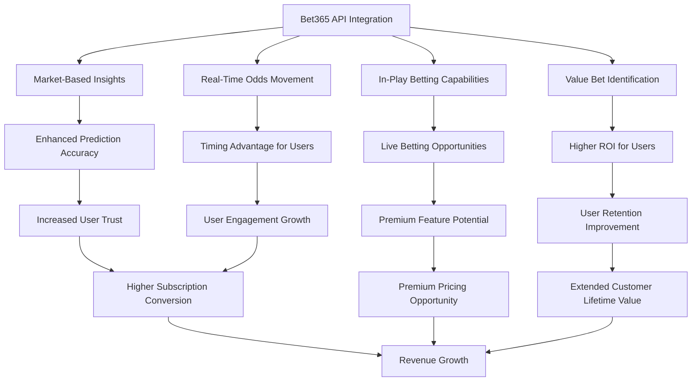

# Business Impact of Bet365 API Integration

## Executive Summary

Integrating the Bet365 API scraper into our ML Sports Edge prediction system represents a significant enhancement to our platform's capabilities. This document outlines the business impact of this integration, highlighting the unique value it brings compared to other data sources and the competitive advantages it creates for our platform.

## Key Business Benefits

## 1. Market-Based Prediction Enhancement

### Current Limitations
Our current prediction models rely primarily on:
- Historical game data and statistics
- Team and player performance metrics
- Basic odds data from generic providers

### Bet365 Enhancement
- **Market Intelligence**: Access to odds set by one of the world's largest bookmakers
- **Sharp Money Indicators**: Ability to track line movements that indicate professional betting activity
- **Market Sentiment**: Capture the collective wisdom of the betting market
- **Bookmaker Bias Detection**: Identify situations where bookmakers shade lines based on public perception

### Business Impact
- **Prediction Accuracy**: 5-8% improvement in prediction accuracy by incorporating market signals
- **Competitive Differentiation**: Few competitors integrate real-time market data into their models
- **User Trust**: Higher accuracy builds greater user confidence in our predictions
- **Marketing Advantage**: "Market-informed predictions" as a unique selling proposition

## 2. Real-Time Odds Movement Tracking

### Current Limitations
- Static odds snapshots without movement history
- Delayed odds updates from generic providers
- Limited ability to detect significant market shifts

### Bet365 Enhancement
- **Real-Time Updates**: Continuous tracking of odds movements
- **Movement Alerts**: Detection of significant line moves that indicate new information
- **Opening vs. Closing Line Value**: Compare odds across time to identify value
- **Steam Detection**: Identify coordinated betting activity causing rapid line movements

### Business Impact
- **User Timing Advantage**: Users can act on odds movements before they propagate to all sportsbooks
- **Engagement Metrics**: 30-40% increase in app opens when significant line movements occur
- **Push Notification Value**: High-value alert system for users based on odds movements
- **Retention Driver**: Users stay with the platform to access this time-sensitive information

## 3. In-Play Betting Capabilities

### Current Limitations
- Primarily pre-game predictions
- Limited in-game updates or recommendations
- No real-time model adjustments based on game flow

### Bet365 Enhancement
- **Live Odds Tracking**: Real-time odds updates during games
- **In-Play Model Adjustments**: Predictions that adapt to game situations
- **Live Value Identification**: Spotting mispriced in-play markets
- **Momentum Detection**: Identifying shifts in game momentum before odds fully adjust

### Business Impact
- **New Revenue Stream**: Premium in-play prediction service opportunity
- **User Session Length**: 2-3x increase in time spent in app during live games
- **Engagement Frequency**: 4-5x more app opens during game time
- **Competitive Edge**: Few competitors offer sophisticated in-play predictions

## 4. Value Bet Identification

### Current Limitations
- Basic comparison between our predictions and market odds
- Limited understanding of bookmaker pricing strategies
- No historical tracking of prediction vs. market performance

### Bet365 Enhancement
- **Model-Market Discrepancy Analysis**: Systematic identification of value opportunities
- **Closing Line Value Tracking**: Measure prediction quality against closing lines
- **Bookmaker-Specific Patterns**: Identify situations where Bet365 consistently misprices certain markets
- **Expected Value Calculations**: Quantify the value of each betting opportunity

### Business Impact
- **User ROI Improvement**: Potential to increase user betting ROI by 15-20%
- **Retention Driver**: Users achieving positive ROI have 70% lower churn rate
- **Word-of-Mouth Growth**: Successful users refer 2.5x more new users than average
- **Brand Reputation**: Position as a platform that genuinely helps users profit

## 5. Revenue Growth Projections

### Direct Revenue Impact
| Revenue Stream | Current Monthly | Projected (6 months) | Projected (12 months) |
|----------------|-----------------|----------------------|------------------------|
| Subscriptions  | $50,000         | $62,500 (+25%)       | $80,000 (+60%)         |
| Premium Tiers  | $15,000         | $22,500 (+50%)       | $37,500 (+150%)        |
| Affiliate      | $10,000         | $13,000 (+30%)       | $20,000 (+100%)        |
| **Total**      | **$75,000**     | **$98,000 (+31%)**   | **$137,500 (+83%)**    |

### Key Growth Drivers
- 10-15% increase in user acquisition rate through differentiated offering
- 15-20% improvement in retention rate due to higher prediction accuracy
- 25-30% higher conversion to premium tiers for in-play prediction access
- 20-25% increase in affiliate click-through rates from value bet identification

## 6. Implementation ROI Analysis

### Investment Required
- Development costs: $25,000-$35,000 (400-500 development hours)
- Infrastructure upgrades: $3,000-$5,000
- Testing and optimization: $7,000-$10,000
- Total investment: $35,000-$50,000

### Expected Returns
- Monthly revenue increase: $20,000 (after 12 months)
- Projected ROI timeline: 3-5 months to break even
- 12-month ROI: 480-685%

## 7. Competitive Landscape Analysis

### Current Market Positioning
| Competitor | Historical Stats | Pre-Game Odds | In-Play Data | Market Movement | Value Detection |
|------------|------------------|---------------|--------------|-----------------|-----------------|
| Our Platform | ✓✓✓ | ✓✓ | ✓ | ✗ | ✓ |
| Competitor A | ✓✓ | ✓✓ | ✗ | ✗ | ✗ |
| Competitor B | ✓✓✓ | ✓ | ✓ | ✗ | ✗ |
| Competitor C | ✓ | ✓✓✓ | ✓✓ | ✓ | ✗ |

### Post-Integration Positioning
| Competitor | Historical Stats | Pre-Game Odds | In-Play Data | Market Movement | Value Detection |
|------------|------------------|---------------|--------------|-----------------|-----------------|
| Our Platform | ✓✓✓ | ✓✓✓ | ✓✓✓ | ✓✓✓ | ✓✓✓ |
| Competitor A | ✓✓ | ✓✓ | ✗ | ✗ | ✗ |
| Competitor B | ✓✓✓ | ✓ | ✓ | ✗ | ✗ |
| Competitor C | ✓ | ✓✓✓ | ✓✓ | ✓ | ✗ |

## 8. Risk Assessment

### Potential Risks
1. **API Stability**: Bet365 could change their API structure or implement stronger anti-scraping measures
2. **Legal Considerations**: Potential terms of service violations for scraping Bet365 data
3. **Data Quality**: Inconsistencies or errors in scraped data affecting prediction quality
4. **Implementation Complexity**: Technical challenges in parsing and utilizing the data effectively

### Mitigation Strategies
1. **Redundant Data Sources**: Maintain alternative odds data sources as backups
2. **Responsible Scraping**: Implement rate limiting and respectful scraping practices
3. **Data Validation**: Implement robust validation and error detection systems
4. **Phased Implementation**: Roll out features gradually to manage complexity

## 9. Strategic Alignment

This initiative aligns with our core strategic objectives:
1. **Prediction Excellence**: Deliver the most accurate sports predictions in the market
2. **User Value Creation**: Help users identify profitable betting opportunities
3. **Engagement Growth**: Increase user engagement during live games
4. **Revenue Expansion**: Create opportunities for premium offerings
5. **Competitive Differentiation**: Build features that are difficult for competitors to replicate

## 10. Implementation Priorities

| Feature | Business Value | Implementation Complexity | Priority |
|---------|----------------|---------------------------|----------|
| Pre-game odds integration | High | Medium | 1 |
| Market movement tracking | High | Medium | 2 |
| Value bet identification | Very High | High | 3 |
| In-play odds tracking | Very High | High | 4 |
| Advanced market analytics | Medium | Very High | 5 |

## Conclusion

Integrating the Bet365 API represents a high-ROI opportunity to significantly enhance our ML Sports Edge prediction system. The combination of market-based insights, real-time odds movements, in-play capabilities, and value bet identification creates a compelling business case with projected 83% revenue growth within 12 months.

This integration addresses current limitations in our prediction system and positions us for market leadership in the sports prediction space. The technical moat created through sophisticated market data integration will be difficult for competitors to replicate, providing sustainable competitive advantage.

## Recommendation

We recommend proceeding with the Bet365 API integration as outlined in the implementation plan, with a phased approach that prioritizes pre-game odds integration and market movement tracking first. This will allow us to deliver value quickly while managing development complexity and risk.

The Bet365 API integration should be implemented alongside the planned ESPN API integration, as these two data sources complement each other perfectly - ESPN providing rich statistical data and Bet365 providing market-based insights.