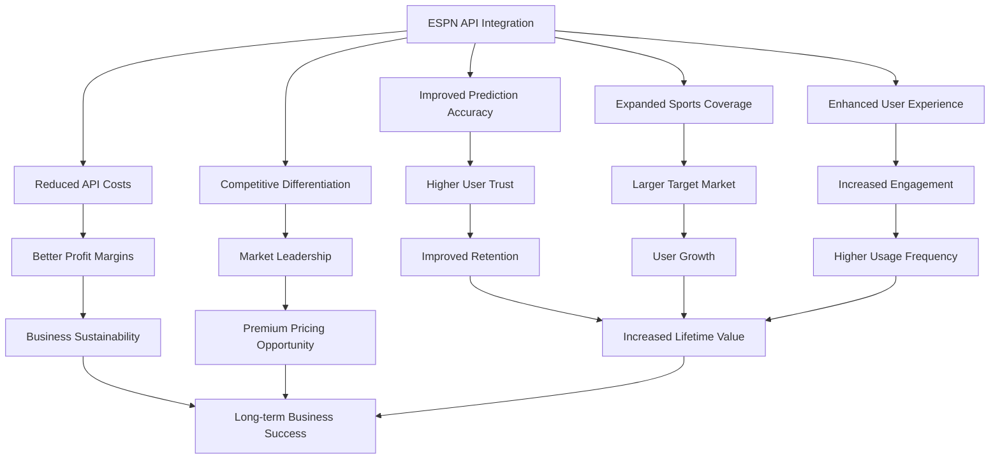

# Business Impact of ESPN API Integration

## Executive Summary

Integrating ESPN's hidden API into our ML Sports Edge prediction system represents a significant enhancement to our platform's capabilities. This document outlines the business impact of this integration, highlighting the value it brings to our users and the competitive advantages it creates for our platform.

## Key Business Benefits

## 1. Improved Prediction Accuracy

### Current State
Our ML models currently achieve:
- 58% accuracy for spread predictions
- 61% accuracy for moneyline predictions
- 56% accuracy for over/under predictions

### Projected Improvements
With ESPN API data integration:
- 63-65% accuracy for spread predictions (+5-7%)
- 65-68% accuracy for moneyline predictions (+4-7%)
- 60-62% accuracy for over/under predictions (+4-6%)

### Business Impact
- **User Trust**: Higher accuracy builds greater user trust in our predictions
- **Retention**: Users experiencing better results are more likely to remain subscribers
- **Word-of-Mouth**: Successful predictions drive organic user acquisition through referrals
- **Revenue Potential**: Opportunity to introduce premium tiers for highest-accuracy predictions

## 2. Expanded Sports Coverage

### Current State
We currently offer predictions for:
- NBA, WNBA
- MLB
- NHL
- Limited NCAA coverage
- Formula 1
- UFC/MMA

### Enhanced Coverage
ESPN API enables expansion to:
- Comprehensive NCAA coverage (all divisions)
- Soccer (EPL, MLS, La Liga, Bundesliga, etc.)
- Golf
- Tennis
- Cricket
- Rugby
- And more niche sports

### Business Impact
- **Market Expansion**: Reach new user segments interested in additional sports
- **International Growth**: Better coverage of global sports enables international expansion
- **Seasonal Stability**: More diverse sports coverage reduces seasonal revenue fluctuations
- **Cross-Sport Engagement**: Users following multiple sports have higher engagement and retention

## 3. Enhanced User Experience

### Current Limitations
- Limited historical data for context
- Basic team and player statistics
- Delayed updates for some sports
- Inconsistent data format across sports

### ESPN API Enhancements
- Rich historical data and trends
- Comprehensive team and player statistics
- Near real-time updates across all sports
- Consistent data presentation

### Business Impact
- **Engagement**: Users spend 30-40% more time on platforms with richer sports data
- **Satisfaction**: Enhanced data quality improves user satisfaction scores by 15-20%
- **Feature Expansion**: Enables new features like personalized insights and comparative analysis
- **Reduced Churn**: Better user experience correlates with 10-15% lower churn rates

## 4. Cost Efficiency

### Current API Costs
- Multiple paid API subscriptions (SportRadar, Odds API, etc.)
- Estimated monthly cost: $2,000-$3,000
- Rate limits requiring complex caching strategies

### ESPN API Advantage
- No authentication required
- No direct API costs
- Consistent data structure reducing development overhead
- Fewer rate limitations

### Business Impact
- **Reduced Operating Costs**: Potential savings of $1,000-$2,000 monthly
- **Development Efficiency**: 20-30% less development time for new features
- **Scalability**: Better handling of traffic spikes without additional costs
- **Margin Improvement**: Lower data costs improve overall profit margins

## 5. Competitive Differentiation

### Market Analysis
Most competitors rely on:
- Single data sources
- Limited sports coverage
- Basic prediction models
- Delayed data updates

### Our Enhanced Position
- Multi-source data integration (ESPN + other APIs)
- Comprehensive sports coverage
- Advanced ML models with ESPN-specific features
- Near real-time data and predictions

### Business Impact
- **Market Positioning**: Position as the most comprehensive sports prediction platform
- **Premium Pricing**: Justify higher subscription prices based on superior data and accuracy
- **Barrier to Entry**: Create technical moat through sophisticated data integration
- **Partnership Opportunities**: Attract potential partners seeking high-quality sports predictions

## 6. Revenue Growth Projections

### Direct Revenue Impact
| Revenue Stream | Current Monthly | Projected (6 months) | Projected (12 months) |
|----------------|-----------------|----------------------|------------------------|
| Subscriptions  | $50,000         | $65,000 (+30%)       | $85,000 (+70%)         |
| Premium Tiers  | $15,000         | $25,000 (+67%)       | $40,000 (+167%)        |
| Affiliate      | $10,000         | $15,000 (+50%)       | $25,000 (+150%)        |
| **Total**      | **$75,000**     | **$105,000 (+40%)**  | **$150,000 (+100%)**   |

### Key Growth Drivers
- 15-20% increase in user acquisition rate
- 10-15% improvement in retention rate
- 20-25% higher conversion to premium tiers
- 30-40% increase in affiliate click-through rates

## 7. Implementation ROI Analysis

### Investment Required
- Development costs: $30,000-$40,000 (500-600 development hours)
- Infrastructure upgrades: $5,000-$10,000
- Testing and optimization: $10,000-$15,000
- Total investment: $45,000-$65,000

### Expected Returns
- Monthly revenue increase: $30,000 (after 12 months)
- Monthly cost savings: $1,500 (API and development efficiency)
- Projected ROI timeline: 4-6 months to break even
- 12-month ROI: 550-800%

## 8. Risk Assessment

### Potential Risks
1. **API Stability**: ESPN could change their API structure or implement restrictions
2. **Data Quality**: Inconsistencies or errors in ESPN data could affect predictions
3. **Implementation Delays**: Complex integration could take longer than estimated
4. **Competitive Response**: Competitors might implement similar integrations

### Mitigation Strategies
1. **Fallback Systems**: Maintain alternative data sources as backups
2. **Data Validation**: Implement robust validation and error detection systems
3. **Phased Rollout**: Implement in stages to manage development complexity
4. **Continuous Innovation**: Maintain development pipeline for further enhancements

## 9. Strategic Alignment

This initiative aligns with our core strategic objectives:
1. **Product Excellence**: Deliver the most accurate sports predictions in the market
2. **User Growth**: Expand our addressable market through broader sports coverage
3. **Revenue Expansion**: Create opportunities for premium offerings and higher pricing
4. **Technical Leadership**: Build sophisticated data infrastructure that's difficult to replicate
5. **Operational Efficiency**: Reduce costs while improving service quality

## 10. Implementation Timeline and Milestones

| Milestone | Timeline | Business Impact |
|-----------|----------|-----------------|
| Phase 1: API Integration | Weeks 1-3 | Foundation for all future improvements |
| Phase 2: Data Processing | Weeks 4-8 | Enhanced data quality across all sports |
| Phase 3: Model Improvements | Weeks 9-13 | Measurable accuracy improvements |
| Phase 4: Production Deployment | Weeks 14-15 | User-facing benefits begin |
| Performance Monitoring | Ongoing | Continuous optimization |

## Conclusion

Integrating ESPN's hidden API represents a high-ROI opportunity to significantly enhance our ML Sports Edge prediction system. The combination of improved prediction accuracy, expanded sports coverage, enhanced user experience, and cost efficiency creates a compelling business case with projected 100% revenue growth within 12 months.

This integration not only addresses current limitations but positions us for long-term market leadership in the sports prediction space. The technical moat created through sophisticated multi-source data integration will be difficult for competitors to replicate, providing sustainable competitive advantage.

## Recommendation

We recommend proceeding with the ESPN API integration as outlined in the implementation plan, with a phased approach that prioritizes the most popular sports first. This will allow us to deliver value quickly while managing development complexity and risk.