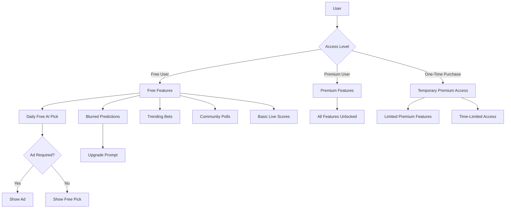

# AI Sports Edge: Freemium Model Implementation Plan

## Overview

This document outlines the comprehensive implementation plan for converting AI Sports Edge into a freemium application. The freemium model will provide free users with valuable but limited content while encouraging upgrades to premium subscriptions.

## Core Architecture

### User Access Levels

1. **Free User**
   - Access to limited features with strategic upgrade prompts
   - Ad-supported content
   - Time-based unlocks (daily free picks)

2. **Premium User**
   - Full access to all features
   - No ads
   - Unlimited usage

3. **One-Time Purchase User**
   - Temporary access to specific premium features
   - Time-limited (24-48 hours)

### Freemium Feature Matrix

| Feature | Free Users | Premium Users |
|---------|------------|---------------|
| AI Picks | 1 daily pick (with ad) | Unlimited picks |
| Predictions | Blurred/limited | Full access |
| Trending Bets | Basic trends | AI insights |
| Community Polls | Vote & view results | Compare with AI |
| Live Scores | Basic scores | AI-driven insights |
| Bet Tracker | Manual entry | Auto-tracking + AI analysis |
| Game Previews | Basic stats | AI best bets |
| Betting Guide | Beginner tips | Advanced strategies |

## Implementation Components

### 1. FreemiumFeature Component

A new component that extends the existing PremiumFeature component but with additional options for freemium content:

```typescript
interface FreemiumFeatureProps {
  children: React.ReactNode;
  type: 'free' | 'blurred' | 'teaser' | 'locked';
  freeContent?: React.ReactNode;
  message?: string;
  adRequired?: boolean;
  timeBasedUnlock?: boolean;
  unlockTime?: number;
}
```

This component will:
- Show free content to all users
- Show blurred/teaser content with upgrade prompts
- Handle ad viewing requirements
- Manage time-based unlocks

### 2. Subscription Service Updates

New methods to support freemium features:

- `hasViewedAdToday`: Check if user has viewed an ad today
- `markAdAsViewed`: Record that user has viewed an ad
- `hasUsedFreeDailyPick`: Check if user has used their free daily pick
- `markFreeDailyPickAsUsed`: Record that user has used their free daily pick
- `getNextUnlockTime`: Get time until next free feature unlock

### 3. AI Prediction Service Updates

New methods to support different levels of predictions:

- `getFreeDailyPick`: Get one free AI pick per day
- `getBlurredPredictions`: Get predictions with confidence scores hidden
- `getTrendingBets`: Get public betting percentages
- `getCommunityPollResults`: Get results of community polls

### 4. New Freemium Components

#### 4.1 DailyFreePick Component

Shows one free AI pick per day with:
- Ad viewing requirement
- 24-hour cooldown
- Clear upgrade prompt

#### 4.2 BlurredPrediction Component

Shows AI predictions with:
- Visible winner prediction
- Blurred confidence scores
- Hidden detailed reasoning
- Upgrade prompt overlay

#### 4.3 TrendingBets Component

Shows betting trends with:
- Public betting percentages
- Popular bet types
- Upgrade prompt for AI edge

#### 4.4 CommunityPolls Component

Interactive polls with:
- Daily/weekly voting on big games
- Results comparison
- Upgrade prompt for AI comparison

#### 4.5 AILeaderboard Component

Tracks AI vs public betting with:
- Historical performance
- Delayed results for free users
- Upgrade prompt for real-time edge

#### 4.6 LiveScoreTracker Component

Shows game scores with:
- Basic scores for free users
- Enhanced insights for premium users

#### 4.7 BasicBetTracker Component

Tracks user bets with:
- Manual entry for free users
- Automated tracking for premium users

#### 4.8 GamePreview Component

Shows game information with:
- Basic stats for free users
- AI insights for premium users

#### 4.9 BettingGuide Component

Educational content with:
- Basic guide for free users
- Advanced strategies for premium users

### 5. Screen Updates

#### 5.1 OddsScreen

The main screen will be updated to:
- Show free daily pick section
- Display blurred predictions
- Show trending bets
- Include community polls
- Feature strategic upgrade prompts

#### 5.2 Other Screens

Other screens will be updated as needed to incorporate freemium features and upgrade prompts.

## Monetization Strategy

### 1. Strategic Upgrade Prompts

- Place "Upgrade Now" buttons at key decision points
- Show comparison of free vs premium features
- Highlight value proposition

### 2. Ad Integration

- Show ads before unlocking free daily picks
- Implement rewarded ads for additional free content
- Maintain good user experience

### 3. Time-Based Unlocks

- Implement 24-hour cooldowns for free features
- Show countdown timers for next available free pick
- Encourage regular app usage

### 4. Conversion Metrics

- Track free-to-premium conversion rates
- Monitor usage patterns of free features
- Optimize based on user behavior

## Implementation Flow



## Implementation Timeline

### Week 1: Core Components
- Create FreemiumFeature component
- Update Subscription Service
- Update AI Prediction Service

### Week 2: Free Feature Components
- Implement DailyFreePick
- Implement BlurredPrediction
- Implement TrendingBets

### Week 3: Additional Free Features
- Implement CommunityPolls
- Implement AILeaderboard
- Implement LiveScoreTracker

### Week 4: Screen Updates & Integration
- Update OddsScreen
- Update other screens as needed
- Testing and refinement

## Technical Considerations

### State Management
- Use AsyncStorage for tracking free feature usage
- Implement proper cleanup in useEffect hooks
- Use functional state updates to avoid dependency issues

### Performance
- Lazy load premium features
- Optimize rendering of blurred content
- Minimize unnecessary re-renders

### Security
- Validate free feature usage server-side when possible
- Prevent manipulation of local storage values
- Implement proper authentication checks

## Conclusion

This freemium implementation will provide a balanced approach that offers genuine value to free users while creating clear incentives to upgrade to premium subscriptions. By strategically limiting certain features and providing time-based free content, we can drive engagement and conversion while maintaining a positive user experience.