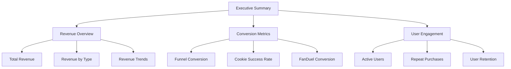
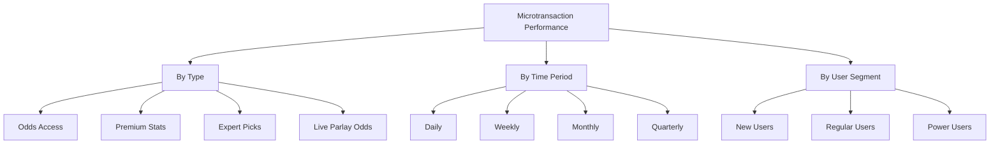
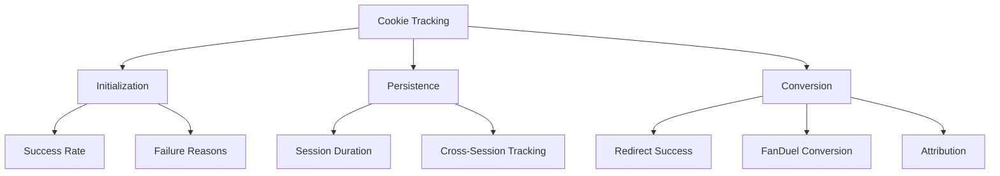
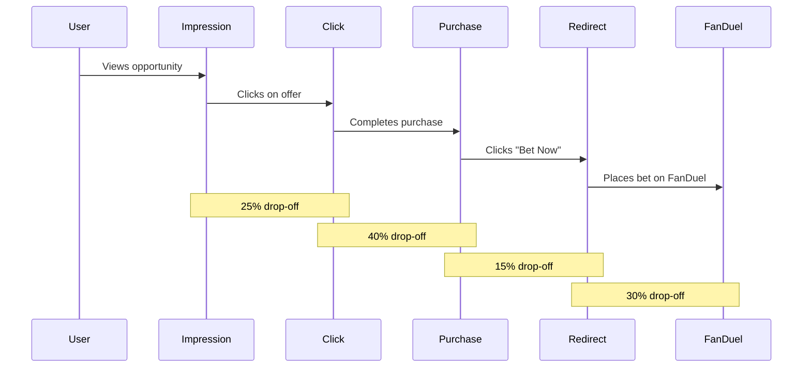
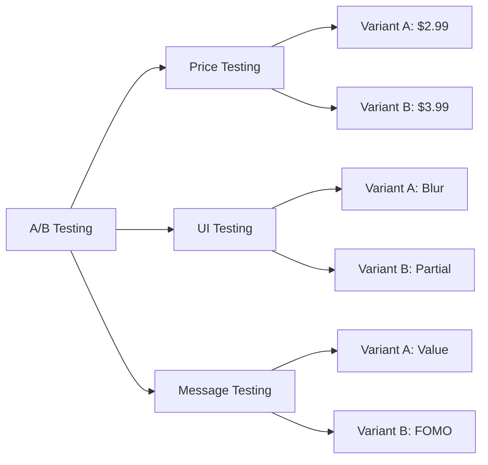
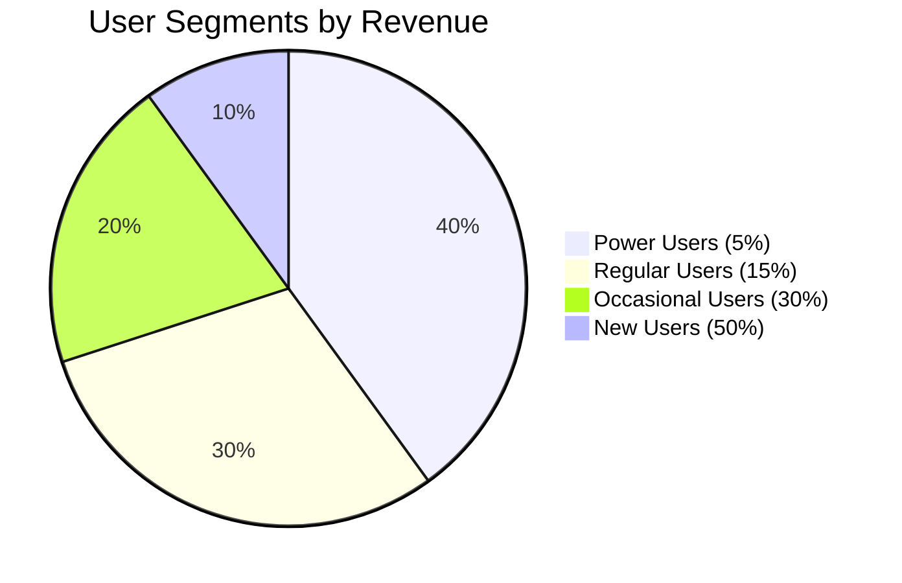
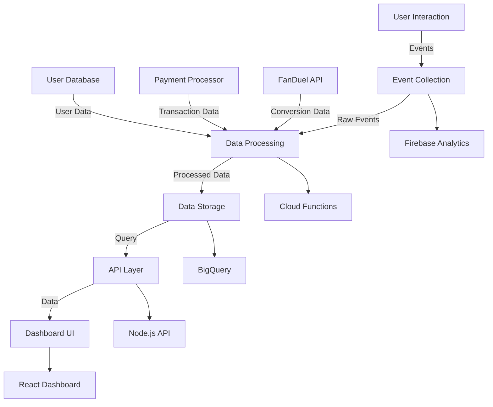

# Microtransaction and Cookie Performance Analytics Dashboard

## Overview

This document outlines the implementation plan for an analytics dashboard to monitor the performance of microtransactions and cookie tracking across the AI Sports Edge platform. The dashboard will provide real-time insights into user behavior, conversion rates, and revenue generation from microtransactions, with a particular focus on the new Live Parlay Odds feature.

## Business Value

- **Revenue Optimization**: Identify the most profitable microtransaction opportunities and optimize pricing
- **Conversion Tracking**: Monitor conversion rates from impressions to purchases to FanDuel bets
- **User Behavior Analysis**: Understand how users interact with microtransaction opportunities
- **Cookie Effectiveness**: Measure the effectiveness of cookie tracking for FanDuel integration
- **A/B Testing**: Support data-driven decisions through A/B testing of different approaches
- **ROI Measurement**: Calculate return on investment for different microtransaction types

## Dashboard Requirements

### Functional Requirements

1. **Real-time Metrics Display**
   - Show key performance indicators (KPIs) in real-time
   - Update metrics automatically without page refresh
   - Support filtering by date range, microtransaction type, and user segments

2. **Microtransaction Performance**
   - Track impressions, clicks, and purchases for each microtransaction type
   - Calculate conversion rates at each stage of the funnel
   - Display revenue by microtransaction type, time period, and user segment
   - Show average revenue per user (ARPU) and lifetime value (LTV)

3. **Cookie Tracking Performance**
   - Monitor cookie initialization success rate
   - Track successful redirects to FanDuel
   - Measure conversion rate from AI Sports Edge to FanDuel bets
   - Analyze cookie persistence across sessions

4. **User Behavior Analysis**
   - Visualize user journey from impression to purchase to betting
   - Identify drop-off points in the conversion funnel
   - Segment users by behavior, spending patterns, and preferences
   - Track repeat purchases and subscription renewals

5. **A/B Testing Framework**
   - Compare performance of different pricing strategies
   - Test various UI/UX approaches for microtransaction presentation
   - Evaluate different cookie tracking methods
   - Measure impact of promotional campaigns

6. **Alerting and Notifications**
   - Set up alerts for significant changes in key metrics
   - Create notifications for conversion rate drops
   - Configure threshold-based alerts for revenue targets
   - Implement anomaly detection for unusual patterns

### Technical Requirements

1. **Data Collection**
   - Implement comprehensive event tracking across the application
   - Capture detailed metadata for each interaction
   - Store historical data for trend analysis
   - Ensure data accuracy and consistency

2. **Data Processing**
   - Aggregate raw event data into meaningful metrics
   - Calculate derived metrics in real-time
   - Implement data cleansing and validation
   - Support complex analytical queries

3. **Data Visualization**
   - Create interactive charts and graphs
   - Design intuitive dashboards for different user roles
   - Support drill-down capabilities for detailed analysis
   - Enable custom report generation

4. **Integration**
   - Connect with existing analytics systems
   - Integrate with FanDuel's affiliate tracking
   - Pull data from payment processors
   - Incorporate user profile information

5. **Security and Privacy**
   - Implement role-based access control
   - Ensure compliance with data protection regulations
   - Anonymize sensitive user information
   - Secure data transmission and storage

## Implementation Plan

### Phase 1: Data Collection Infrastructure (Week 1)

1. **Event Tracking Implementation**
   - Define comprehensive event taxonomy
   - Implement tracking for all microtransaction interactions
   - Add cookie-specific event tracking
   - Create consistent metadata structure for events

2. **Data Storage Setup**
   - Configure Firebase Analytics for real-time event collection
   - Set up BigQuery for data warehousing
   - Implement data retention policies
   - Create data backup procedures

3. **API Development**
   - Create APIs for retrieving analytics data
   - Implement authentication and authorization
   - Add rate limiting and caching
   - Document API endpoints

4. **Testing Framework**
   - Develop automated tests for data collection
   - Create validation tools for data accuracy
   - Implement monitoring for data pipeline
   - Set up alerting for data collection failures

### Phase 2: Data Processing and Analysis (Week 2)

1. **ETL Pipeline Development**
   - Create data transformation processes
   - Implement aggregation functions
   - Set up scheduled data processing jobs
   - Develop incremental processing for real-time updates

2. **Metrics Calculation**
   - Implement conversion rate calculations
   - Create revenue attribution models
   - Develop user segmentation algorithms
   - Build funnel analysis capabilities

3. **Statistical Analysis**
   - Implement A/B testing statistical framework
   - Create anomaly detection algorithms
   - Develop trend analysis functions
   - Build predictive models for user behavior

4. **Performance Optimization**
   - Optimize query performance
   - Implement data partitioning
   - Create materialized views for common queries
   - Set up caching for frequently accessed data

### Phase 3: Dashboard UI Development (Week 3)

1. **Dashboard Framework**
   - Select and set up dashboard framework (React with Chart.js/D3.js)
   - Create responsive layout
   - Implement theme and styling
   - Set up navigation and user flow

2. **KPI Visualization**
   - Develop KPI cards with real-time updates
   - Create trend indicators
   - Implement comparison with historical data
   - Add goal tracking visualization

3. **Interactive Charts**
   - Build conversion funnel visualization
   - Create revenue breakdown charts
   - Implement user behavior flow diagrams
   - Develop heat maps for user engagement

4. **Filtering and Customization**
   - Add date range selectors
   - Implement microtransaction type filters
   - Create user segment selection
   - Develop saved views functionality

### Phase 4: Integration and Testing (Week 4)

1. **System Integration**
   - Connect dashboard to data APIs
   - Integrate with authentication system
   - Implement real-time updates
   - Set up error handling and fallbacks

2. **User Testing**
   - Conduct usability testing with stakeholders
   - Gather feedback on dashboard functionality
   - Identify pain points and improvement areas
   - Iterate based on user feedback

3. **Performance Testing**
   - Test dashboard with large datasets
   - Measure load times and responsiveness
   - Optimize client-side performance
   - Ensure mobile compatibility

4. **Security Review**
   - Conduct security audit
   - Test access control mechanisms
   - Verify data privacy compliance
   - Address security vulnerabilities

### Phase 5: Deployment and Optimization (Week 5)

1. **Deployment**
   - Set up staging environment
   - Conduct final integration testing
   - Deploy to production
   - Implement monitoring and logging

2. **User Training**
   - Create documentation
   - Develop training materials
   - Conduct training sessions
   - Set up support channels

3. **Feedback Collection**
   - Implement feedback mechanism
   - Collect initial user feedback
   - Prioritize enhancement requests
   - Plan for iterative improvements

4. **Optimization**
   - Monitor system performance
   - Identify bottlenecks
   - Implement performance enhancements
   - Optimize data refresh rates

## Dashboard Sections

### 1. Executive Summary



- **Purpose**: High-level overview for executives and managers
- **Key Metrics**:
  - Total revenue from microtransactions
  - Overall conversion rate
  - Active users and growth
  - Revenue per user
  - FanDuel conversion rate

### 2. Microtransaction Performance



- **Purpose**: Detailed analysis of microtransaction performance
- **Key Metrics**:
  - Revenue by microtransaction type
  - Conversion rate by type
  - Average purchase value
  - Purchase frequency
  - Refund rate

### 3. Cookie Tracking Analytics



- **Purpose**: Monitor cookie tracking effectiveness
- **Key Metrics**:
  - Cookie initialization success rate
  - Cookie persistence across sessions
  - Redirect success rate
  - FanDuel conversion attribution
  - Cookie-based user journey completion

### 4. User Journey Analysis



- **Purpose**: Visualize and analyze the complete user journey
- **Key Metrics**:
  - Funnel conversion rates
  - Drop-off points
  - Time between stages
  - Completion rate
  - Abandonment reasons

### 5. A/B Testing Results



- **Purpose**: Compare performance of different approaches
- **Key Metrics**:
  - Conversion rate by variant
  - Revenue by variant
  - Statistical significance
  - Lift percentage
  - User preference indicators

### 6. User Segmentation



- **Purpose**: Analyze different user segments
- **Key Metrics**:
  - Revenue by segment
  - Conversion rate by segment
  - Lifetime value by segment
  - Retention rate by segment
  - Growth of high-value segments

## Technical Architecture



## Data Model

### Event Schema

```json
{
  "event_id": "string",
  "event_type": "string",
  "timestamp": "datetime",
  "user_id": "string",
  "session_id": "string",
  "properties": {
    "microtransaction_type": "string",
    "price": "number",
    "currency": "string",
    "game_id": "string",
    "team_id": "string",
    "position": "string",
    "variant": "string",
    "cookie_enabled": "boolean",
    "platform": "string",
    "device": "string"
  },
  "metadata": {
    "app_version": "string",
    "os_version": "string",
    "user_agent": "string",
    "ip_address": "string",
    "location": "string"
  }
}
```

### Metrics Schema

```json
{
  "metric_id": "string",
  "metric_name": "string",
  "time_period": {
    "start": "datetime",
    "end": "datetime",
    "granularity": "string"
  },
  "dimensions": {
    "microtransaction_type": "string",
    "user_segment": "string",
    "platform": "string",
    "location": "string"
  },
  "values": {
    "count": "number",
    "sum": "number",
    "average": "number",
    "min": "number",
    "max": "number",
    "median": "number",
    "percentiles": {
      "p25": "number",
      "p50": "number",
      "p75": "number",
      "p90": "number",
      "p95": "number",
      "p99": "number"
    }
  }
}
```

## Key Performance Indicators (KPIs)

### Revenue Metrics

1. **Total Revenue**
   - Definition: Total revenue generated from all microtransactions
   - Formula: Sum of all transaction amounts
   - Target: Increase by 20% month-over-month

2. **Average Revenue Per User (ARPU)**
   - Definition: Average revenue generated per user
   - Formula: Total revenue / Number of active users
   - Target: $5.00 per active user per month

3. **Revenue by Microtransaction Type**
   - Definition: Revenue breakdown by microtransaction type
   - Formula: Sum of transaction amounts by type
   - Target: Live Parlay Odds to account for 30% of revenue

### Conversion Metrics

1. **Impression-to-Click Rate**
   - Definition: Percentage of impressions that result in clicks
   - Formula: (Clicks / Impressions) * 100
   - Target: 15% or higher

2. **Click-to-Purchase Rate**
   - Definition: Percentage of clicks that result in purchases
   - Formula: (Purchases / Clicks) * 100
   - Target: 10% or higher

3. **Purchase-to-Bet Rate**
   - Definition: Percentage of purchases that result in FanDuel bets
   - Formula: (FanDuel Bets / Purchases) * 100
   - Target: 50% or higher

### Cookie Performance Metrics

1. **Cookie Initialization Rate**
   - Definition: Percentage of attempts that successfully initialize cookies
   - Formula: (Successful Initializations / Total Attempts) * 100
   - Target: 95% or higher

2. **Cookie Persistence Rate**
   - Definition: Percentage of cookies that persist across sessions
   - Formula: (Persistent Cookies / Total Cookies) * 100
   - Target: 80% or higher

3. **Cookie-Based Conversion Rate**
   - Definition: Percentage of cookie-tracked users who convert on FanDuel
   - Formula: (FanDuel Conversions / Cookie Redirects) * 100
   - Target: 60% or higher

## Risk Assessment

| Risk | Impact | Likelihood | Mitigation |
|------|--------|------------|------------|
| Data accuracy issues | High | Medium | Implement validation checks and data reconciliation processes |
| Performance bottlenecks with large data volumes | Medium | High | Use data partitioning, indexing, and query optimization |
| Privacy compliance concerns | High | Medium | Ensure anonymization and implement strict access controls |
| Dashboard performance issues | Medium | Medium | Optimize front-end, implement pagination and lazy loading |
| Integration failures with FanDuel | High | Low | Develop robust error handling and fallback mechanisms |
| User adoption challenges | Medium | Medium | Create intuitive UI and provide comprehensive training |

## Success Metrics

The success of the analytics dashboard will be measured by:

1. **Usage Metrics**
   - Number of daily active users of the dashboard
   - Average time spent analyzing data
   - Number of custom reports generated

2. **Business Impact**
   - Increase in overall microtransaction revenue
   - Improvement in conversion rates
   - Growth in FanDuel attribution

3. **Operational Efficiency**
   - Reduction in time spent generating reports
   - Faster identification of issues
   - More data-driven decisions

## Next Steps

1. Finalize requirements with stakeholders
2. Set up data collection infrastructure
3. Develop initial dashboard prototype
4. Conduct user testing and gather feedback
5. Implement full dashboard with all features
6. Deploy to production and train users

## Conclusion

The Microtransaction and Cookie Performance Analytics Dashboard will provide comprehensive insights into the performance of our monetization strategy. By tracking key metrics across the entire user journey, from initial impression to FanDuel bet placement, we can optimize our approach, increase revenue, and improve the user experience. The dashboard will enable data-driven decision-making and help maximize the return on investment for our microtransaction features, particularly the new Live Parlay Odds offering.