# Comprehensive Onboarding Experience Improvement Plan for AI Sports Edge

## Overview

This plan details improvements to the AI Sports Edge onboarding experience across four key areas, with considerations for error handling, caching, documentation, design aesthetics, and cross-platform functionality (web, iOS, and Android).

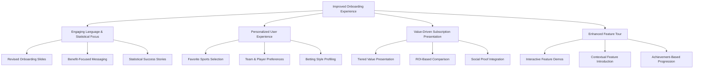

## 1. Engaging Language & Statistical Focus

### Revised Onboarding Slides Content

| Slide | Current Content | Improved Content |
|-------|----------------|------------------|
| Welcome | "Welcome to AI Sports Edge. Your ultimate companion for AI-powered sports betting insights and predictions." | "Welcome to AI Sports Edge! Turn your sports knowledge into winning bets with the power of AI. Our users are beating the odds by up to 15% compared to traditional betting." |
| AI Advantage | "Get access to cutting-edge AI predictions with confidence scores to make informed betting decisions." | "Our AI analyzes millions of data points to spot value bets that humans miss. See exactly where bookmakers have set odds that don't match real probabilities—giving you a statistical edge on every bet." |
| Live Betting Odds | "Stay updated with real-time odds from multiple bookmakers, all in one place." | "Never miss the best odds again! Our real-time comparison shows you exactly where to place your bet for maximum returns. Users who follow our odds recommendations increase their potential winnings by an average of 12%." |
| Track Performance | "Compare AI predictions with actual results to see how well our system performs." | "Watch your betting success grow! Track your performance against AI predictions, learn from personalized insights, and see your ROI increase over time. Users who follow our system consistently outperform their previous betting results." |
| Ready to Start | "Get started now and elevate your betting strategy with AI-powered insights!" | "Ready to start winning smarter? Set up your personalized betting profile in just 2 minutes and make your next bet your best bet! Join thousands of bettors who are already using data to beat the bookmakers." |

### Implementation Details

#### Technical Architecture

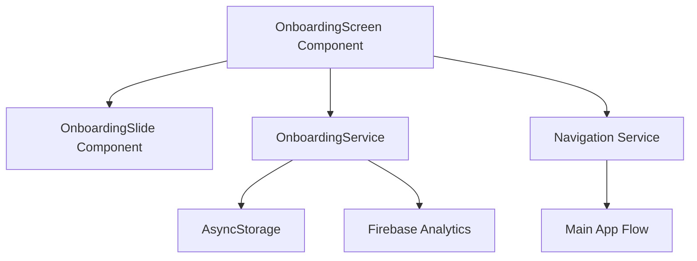

#### Code Changes

1. **Update OnboardingScreen.tsx**:
   - Modify the `slides` array with new content
   - Enhance analytics tracking for slide engagement
   - Implement A/B testing for different messaging variants

2. **Enhance OnboardingSlide.tsx**:
   - Add support for statistical highlight callouts
   - Implement animated statistics counters
   - Add visual indicators of value (charts, graphs, etc.)

3. **Error Handling**:
   - Implement robust error boundaries around onboarding components
   - Add fallback content if dynamic content fails to load
   - Create error logging for analytics tracking failures

4. **Caching Strategy**:
   - Cache onboarding progress in AsyncStorage
   - Implement slide preloading for smoother transitions
   - Store onboarding analytics offline if network unavailable

5. **Cross-Platform Considerations**:
   - Use responsive typography that scales appropriately on all devices
   - Implement platform-specific animations (native for iOS/Android, web animations for browsers)
   - Ensure text rendering is consistent across platforms

#### Documentation

```markdown
# Onboarding Slides Content Guidelines

## Purpose
The onboarding slides introduce new users to AI Sports Edge with engaging, benefit-focused language that emphasizes the statistical advantage of using AI for betting decisions.

## Content Requirements
- Focus on concrete benefits and statistical advantages
- Use active, engaging language that creates excitement
- Include specific metrics and success stories where possible
- Maintain a friendly, approachable tone while establishing expertise

## Implementation Notes
- Text should be concise enough to read in 5-10 seconds per slide
- Font sizes must remain readable on all device sizes
- Consider localization needs for text expansion
- A/B test variations to optimize conversion
```

## 2. Personalized User Experience

### Enhanced Account Creation Flow

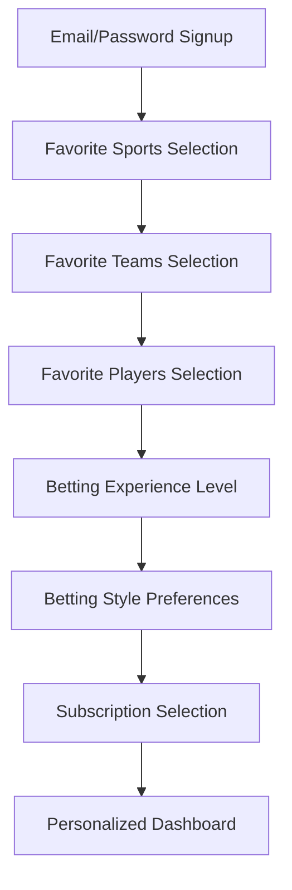

### Implementation Details

#### Technical Architecture

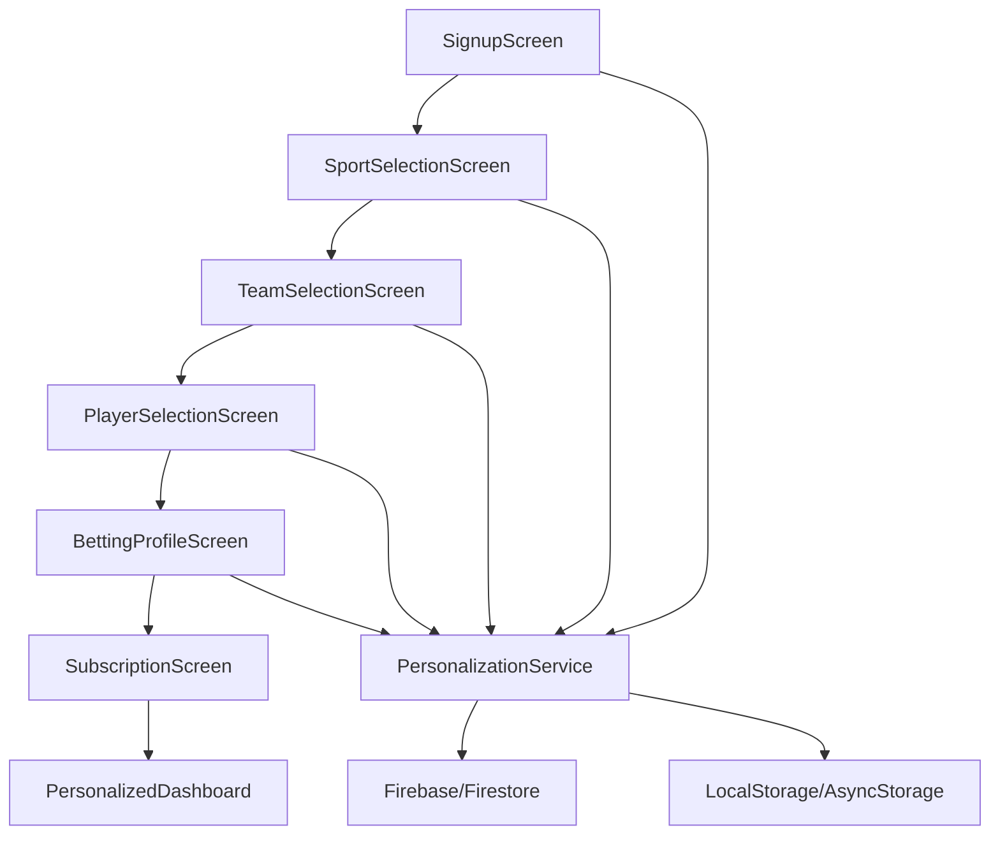

#### New Components

1. **SportSelectionScreen**:
   - Grid/list of popular sports with visual icons
   - Multi-select capability with toggle animations
   - Search functionality for less common sports
   - "Continue" button that activates after at least one selection

2. **TeamSelectionScreen**:
   - Dynamic loading of teams based on selected sports
   - Team logos and basic info display
   - Limit selection to 5 teams with clear indication
   - Search and filter capabilities

3. **PlayerSelectionScreen**:
   - Player cards with photos and key stats
   - Search by name, team, or position
   - "Follow" button for each player
   - Recommendations based on team selections

4. **BettingProfileScreen**:
   - Experience level selection (Beginner, Intermediate, Expert)
   - Preferred bet types (Moneyline, Spread, Over/Under, Props, Parlays)
   - Typical stake amounts (ranges)
   - Risk tolerance assessment

#### Error Handling

1. **Network Failures**:
   - Implement offline mode for basic onboarding
   - Cache selected preferences locally
   - Retry mechanisms for API calls
   - Clear error messages with recovery options

2. **Data Loading Issues**:
   - Skeleton screens during loading
   - Fallback to generic options if specific data unavailable
   - Graceful degradation of functionality

3. **User Input Validation**:
   - Real-time validation with helpful error messages
   - Prevent progression until required selections made
   - Auto-correction where appropriate

#### Caching Strategy

1. **User Preferences**:
   - Store selections in AsyncStorage/LocalStorage
   - Sync with cloud when connection available
   - Implement versioning for preference schema
   - TTL for cached sports/teams data

2. **Sports/Teams/Players Data**:
   - Pre-cache common sports and teams
   - Progressive loading of player data
   - Background refresh of data when app is idle
   - Purge outdated cache entries

#### Cross-Platform Considerations

1. **Web App**:
   - Responsive grid layouts that adapt to screen size
   - Keyboard navigation support
   - Progressive enhancement for older browsers
   - Touch and mouse interaction support

2. **iOS App**:
   - Native iOS UI patterns and animations
   - Support for Dynamic Type
   - Dark mode compatibility
   - Haptic feedback for selections

3. **Android App**:
   - Material Design components
   - Support for different screen densities
   - Adaptive layouts for various device sizes
   - Performance optimizations for lower-end devices

#### Documentation

```markdown
# Personalization Flow

## Purpose
The personalization flow collects user preferences to create a tailored experience that increases engagement and provides more relevant content.

## User Flow
1. Sport Selection - User selects favorite sports
2. Team Selection - User selects up to 5 favorite teams
3. Player Selection - User follows specific players
4. Betting Profile - User indicates experience and preferences
5. Subscription Selection - User chooses a subscription tier

## Implementation Guidelines
- Each step should be completable in under 30 seconds
- Provide skip options for non-essential steps
- Save progress at each step to prevent data loss
- Use visual feedback to confirm selections
- Implement analytics tracking at each step

## Data Schema
- User preferences stored in Firestore under `/users/{userId}/preferences`
- Local cache maintained in AsyncStorage with key `@AISportsEdge:userPreferences`
- Preference versioning handled through `schemaVersion` field
```

## 3. Value-Driven Subscription Presentation

### Redesigned Subscription Tiers

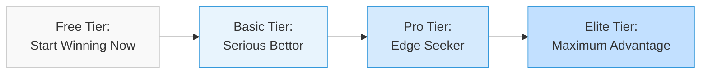

### Tier Content Improvements

| Tier | Current Presentation | Improved Presentation |
|------|---------------------|----------------------|
| Free | Basic features list | "Start Winning Now - No Credit Card Required! <br><br>• AI predictions for major games <br>• Basic odds comparison <br>• Performance tracking <br><br>Users report 5% better results than betting on their own." |
| Basic | Features list with price | "Serious Bettor - $9.99/month <br><br>• All Free features PLUS: <br>• Predictions for ALL games <br>• Real-time odds alerts <br>• Historical trends analysis <br><br>Users report 2x more winning bets than Free tier! <br>30-day money-back guarantee." |
| Pro | Features list with price | "Edge Seeker - $19.99/month <br><br>• All Basic features PLUS: <br>• Advanced player metrics <br>• Weather impact analysis <br>• Personalized betting insights <br>• Email & chat support <br><br>Average ROI: 12% higher than Basic users. <br>30-day money-back guarantee." |
| Elite | Features list with price | "Maximum Advantage - $29.99/month <br><br>• All Pro features PLUS: <br>• Parlay optimizers <br>• Prop bet analyzers <br>• VIP support <br>• Early access to new features <br><br>Elite users report 22% higher returns than betting on their own. <br>30-day money-back guarantee." |

### Implementation Details

#### Technical Architecture

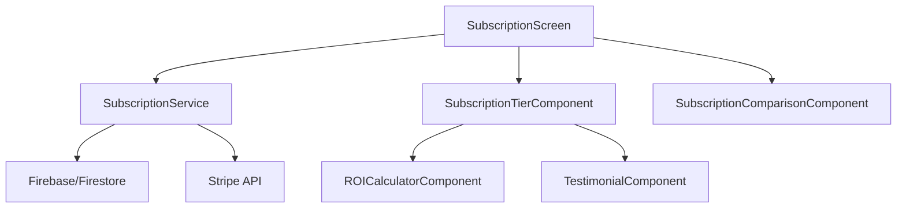

#### Code Changes

1. **Update SubscriptionScreen.tsx**:
   - Redesign layout with focus on value comparison
   - Add ROI calculator component
   - Implement testimonial carousel
   - Add feature comparison table

2. **Create New Components**:
   - `ROICalculatorComponent`: Interactive tool showing potential returns
   - `TestimonialComponent`: User success stories with statistics
   - `SubscriptionComparisonComponent`: Side-by-side feature comparison
   - `MoneyBackGuaranteeComponent`: Highlight risk-free trial

3. **Error Handling**:
   - Graceful degradation if subscription data fails to load
   - Offline support for viewing subscription options
   - Clear error messaging for payment processing issues
   - Retry mechanisms for API calls

4. **Caching Strategy**:
   - Cache subscription plan details locally
   - Implement background refresh of pricing and features
   - Store user's subscription status for offline access
   - Sync with server when connection restored

5. **Cross-Platform Considerations**:
   - Responsive pricing tables for web
   - Native payment flows for iOS (Apple Pay) and Android (Google Pay)
   - Platform-specific animations and transitions
   - Consistent visual hierarchy across devices

#### Documentation

```markdown
# Subscription Presentation Guidelines

## Purpose
The subscription screen presents pricing tiers in a value-focused way that emphasizes ROI and benefits rather than just features and price.

## Design Principles
- Lead with value, not price
- Use social proof and statistical evidence
- Highlight guarantees to reduce perceived risk
- Create clear differentiation between tiers
- Use visual hierarchy to guide attention

## Implementation Notes
- A/B test different value propositions
- Track conversion rates by entry point
- Monitor time spent on subscription screen
- Analyze drop-off points in the subscription flow
- Test different highlight features for each tier
```

## 4. Enhanced Feature Tour

### Interactive Feature Tour Flow

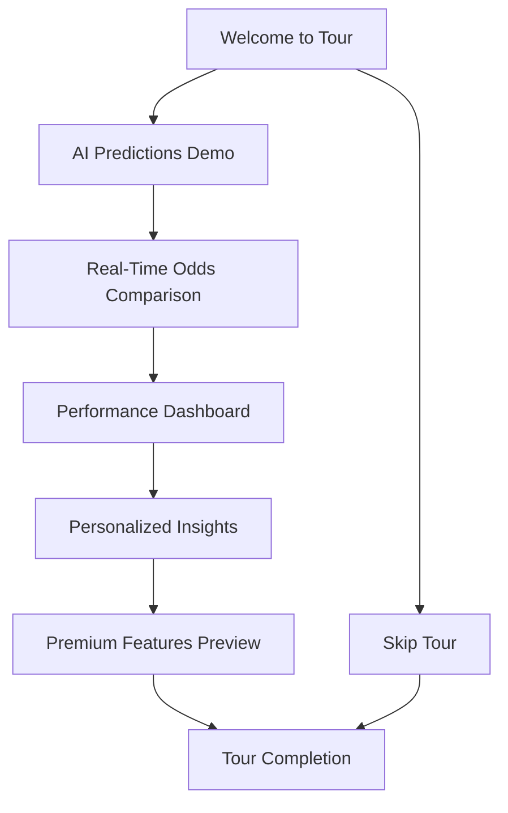

### Feature Tour Content Improvements

| Feature | Current Presentation | Improved Presentation |
|---------|---------------------|----------------------|
| AI Predictions | Basic description | "**Find Value Where Others Don't**<br><br>Our AI doesn't just predict winners—it finds VALUE. See exactly where the bookmakers have set odds that don't match the real probabilities.<br><br>[Interactive Demo: Tap to see a real prediction with explanation]<br><br>Users who follow our AI picks see a 15% higher win rate on average." |
| Real-Time Odds | Basic description | "**Never Miss the Best Odds Again**<br><br>Watch odds move in real-time across all major sportsbooks. Get alerts when there's value to be found.<br><br>[Interactive Demo: Live comparison between sportsbooks]<br><br>Getting the best odds on every bet can increase your returns by up to 12% with no additional risk." |
| Performance Dashboard | Basic description | "**Your Betting Command Center**<br><br>Track performance over time, see where you're making and losing money, and get AI-powered suggestions to improve.<br><br>[Interactive Demo: Sample dashboard with tooltips]<br><br>Users who regularly check their dashboard improve their ROI by 8% on average." |
| Personalized Insights | Basic description | "**Your Personal Betting Analyst**<br><br>Receive custom insights based on your favorite teams, betting history, and preferences.<br><br>[Interactive Demo: Sample personalized insight]<br><br>Personalized insights help users spot 23% more valuable betting opportunities." |
| Premium Features | Basic description | "**Unlock Your Maximum Advantage**<br><br>Preview our premium tools like parlay optimizers, prop bet analyzers, and weather impact analysis.<br><br>[Interactive Demo: Blurred premium feature with 'Unlock' button]<br><br>Premium users report 22% higher returns than betting on their own." |

### Feature Tour Reset Button

A key addition to the app will be a dedicated button in the Settings screen that allows users to retake the feature tour at any time. This addresses the need for users to refresh their understanding of app features or explore new features added since their initial onboarding.

#### Implementation Details

1. **Settings Screen Update**:
   - Add a new section titled "App Tour & Help"
   - Include a "Replay Feature Tour" button with descriptive text
   - Add an icon indicating a tour/guide function

2. **Tour Completion Notification**:
   - After completing the initial onboarding tour, show a message:
     > "You can replay this feature tour anytime from Settings > App Tour & Help > Replay Feature Tour"
   - Include a visual indicator pointing to the Settings icon
   - Allow users to dismiss with "Got it" or "Show me now" options

3. **Tour Reset Functionality**:
   - Reset tour progress in AsyncStorage/LocalStorage
   - Maintain user preferences and settings
   - Allow partial tour completion with exit option
   - Track tour replay analytics separately from initial onboarding

4. **Cross-Platform Considerations**:
   - Consistent placement in settings across all platforms
   - Platform-appropriate visual styling
   - Accessibility considerations for all platforms

### Implementation Details

#### Technical Architecture

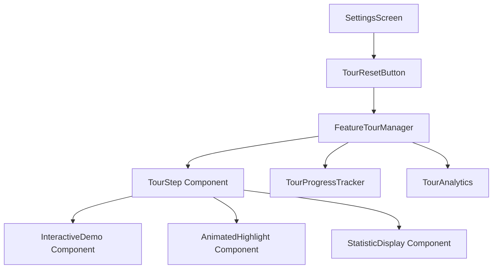

#### New Components

1. **FeatureTourManager**:
   - Controls tour flow and progression
   - Manages tour state and completion
   - Handles skip and resume functionality
   - Integrates with analytics

2. **TourStep Component**:
   - Renders individual tour steps
   - Manages animations and transitions
   - Handles user interactions
   - Supports accessibility features

3. **InteractiveDemo Component**:
   - Provides simplified interactive examples of features
   - Simulates real app functionality
   - Guides user through sample interactions
   - Provides feedback and explanations

4. **AnimatedHighlight Component**:
   - Visually highlights UI elements
   - Creates focus on specific features
   - Supports different animation styles
   - Works across platforms

5. **TourResetButton Component**:
   - Renders in Settings screen
   - Handles tour reset functionality
   - Provides confirmation dialog
   - Tracks reset analytics

#### Error Handling

1. **Tour Progression**:
   - Save tour progress to resume if interrupted
   - Handle navigation errors between steps
   - Provide manual navigation controls
   - Allow restarting tour if errors occur

2. **Demo Functionality**:
   - Fallback to static content if interactive demos fail
   - Detect and report interaction errors
   - Provide skip options for problematic demos
   - Timeout handling for unresponsive interactions

3. **Content Loading**:
   - Preload tour content to prevent delays
   - Show loading indicators for dynamic content
   - Fallback content for network failures
   - Graceful error messaging

#### Caching Strategy

1. **Tour Content**:
   - Cache tour content and assets locally
   - Implement versioning for tour content
   - Background update of tour content when new versions available
   - Purge outdated cache entries

2. **User Progress**:
   - Store tour progress in AsyncStorage/LocalStorage
   - Sync with cloud when connection available
   - Implement recovery mechanisms for interrupted tours
   - Track completion status for analytics

#### Cross-Platform Considerations

1. **Web App**:
   - Use web animations API for smooth transitions
   - Implement keyboard navigation support
   - Ensure responsive layout for all screen sizes
   - Support touch and mouse interactions

2. **iOS App**:
   - Use native iOS animations and transitions
   - Implement haptic feedback for interactions
   - Support Dynamic Type for accessibility
   - Optimize for different iOS devices

3. **Android App**:
   - Follow Material Design motion guidelines
   - Implement adaptive layouts for device diversity
   - Optimize performance for various Android versions
   - Support different input methods

#### Documentation

```markdown
# Feature Tour Implementation Guide

## Purpose
The feature tour introduces users to key app capabilities through interactive demonstrations that highlight the unique value proposition of AI Sports Edge.

## Tour Structure
1. Welcome - Introduction to the tour
2. AI Predictions - Demonstration of prediction interface
3. Real-Time Odds - Interactive odds comparison
4. Performance Dashboard - Sample dashboard with explanations
5. Personalized Insights - Example of personalized content
6. Premium Features - Preview of premium capabilities
7. Completion - Congratulations and next steps

## Implementation Guidelines
- Each step should be completable in under 60 seconds
- Provide skip and back navigation options
- Save progress to allow resuming the tour
- Use analytics to identify drop-off points
- Ensure all demos work offline with sample data

## Technical Requirements
- Preload assets to ensure smooth transitions
- Implement tour state management
- Create fallback content for all interactive elements
- Support accessibility requirements
- Ensure cross-platform compatibility

## Tour Reset Functionality
- Implement in Settings screen under "App Tour & Help" section
- Notify users about this feature after initial tour completion
- Track separate analytics for tour replays
- Maintain user preferences when resetting tour
```

## Cross-Cutting Concerns

### Error Handling Framework

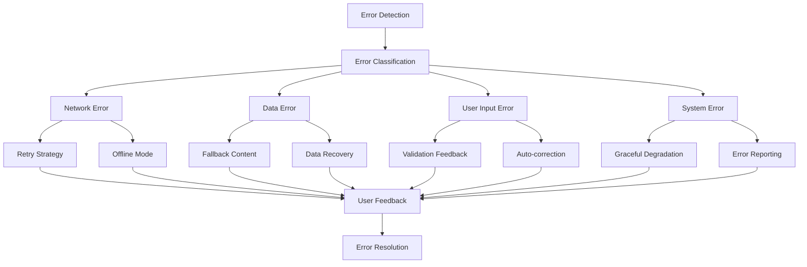

### Comprehensive Caching Strategy

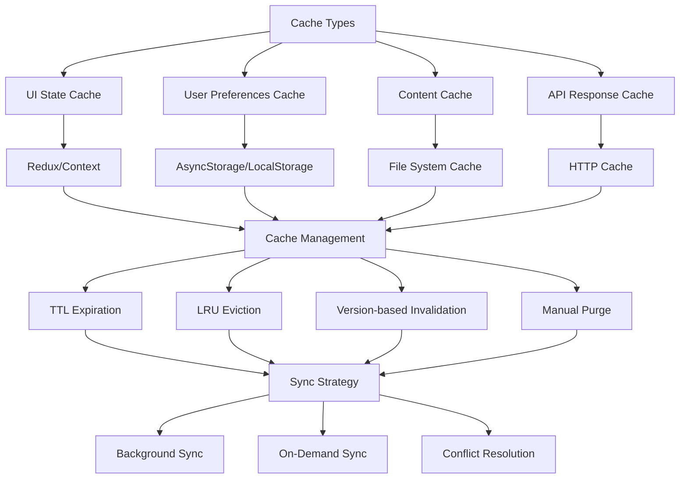

### Design System Integration

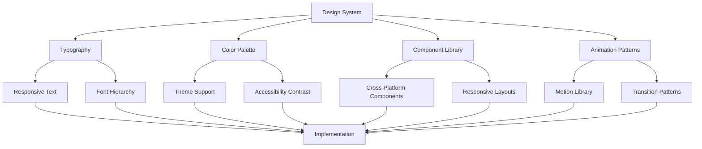

## Implementation Timeline and Dependencies

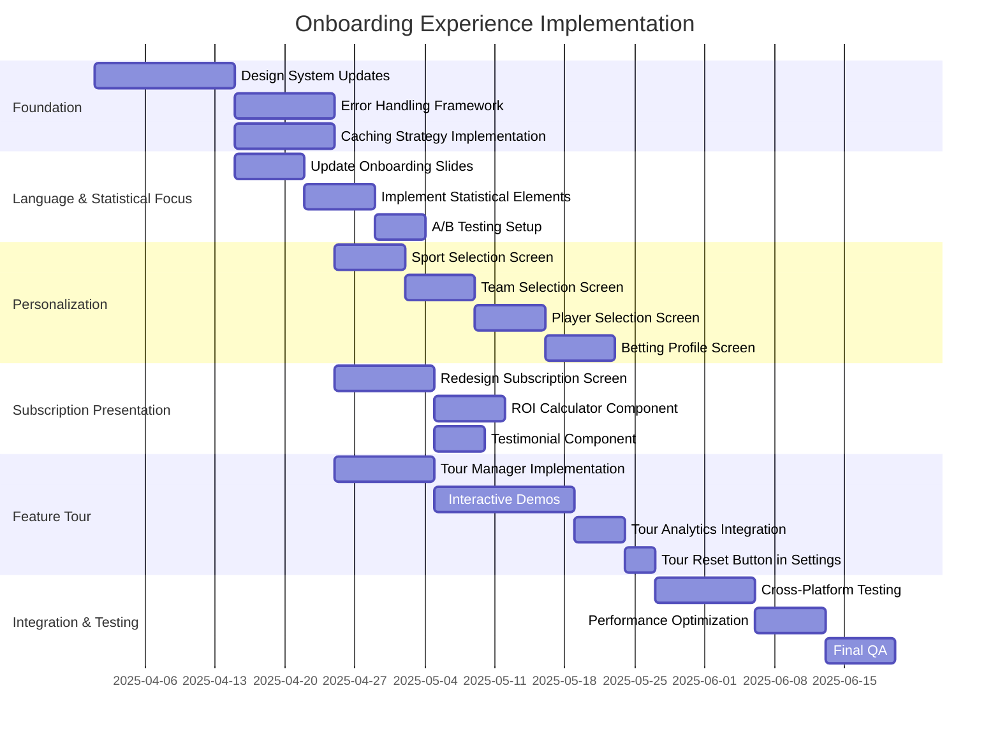

## Conclusion

This comprehensive plan addresses all four key improvement areas for the AI Sports Edge onboarding experience, with detailed implementation guidance for error handling, caching, documentation, design aesthetics, and cross-platform functionality. The improvements focus on creating an engaging, personalized experience that clearly communicates the value proposition of using statistical odds for betting decisions.

The addition of a feature tour reset button in the Settings screen ensures users can revisit the tour at any time to refresh their understanding or explore new features. This enhances the overall user experience and helps maintain engagement over time.