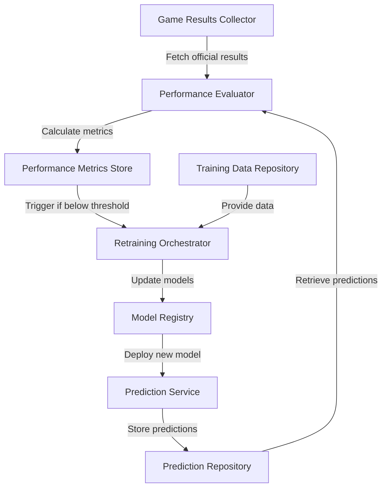

# Self-Learning ML Component Design

## Overview

This document outlines the design for a self-learning component that automatically evaluates and retrains the ML Sports Edge models by comparing pre-game predictions with post-game official statistics. This creates a continuous improvement cycle without human intervention.

## Architecture



## Key Components

### 1. Game Results Collector

The Game Results Collector is responsible for fetching official game results from league APIs after games are completed.

**Responsibilities:**
- Fetch official game results from league APIs (NBA, NFL, MLB, etc.)
- Normalize data into a consistent format
- Update game records with official results
- Trigger prediction evaluation

**Implementation:**
```javascript
class GameResultsCollector {
  async fetchGameResults(game) {
    // Fetch results from appropriate sports API based on game.sport
    // Match API response to our game record
    // Extract and normalize scores and statistics
    // Update game record with official results
  }
  
  async collectPendingGameResults() {
    // Find games that have ended but don't have official results
    // Fetch results for each game
    // Update game records
  }
}
```

### 2. Performance Evaluator

The Performance Evaluator compares predictions with actual results to assess model performance.

**Responsibilities:**
- Retrieve predictions made before games
- Compare predictions with actual results
- Calculate accuracy, precision, recall, and other metrics
- Identify patterns in prediction errors
- Generate performance reports

**Implementation:**
```javascript
class PerformanceEvaluator {
  async evaluateSpreadModel() {
    // Retrieve spread predictions with actual results
    // Calculate accuracy, precision, recall
    // Analyze confidence calibration
    // Identify error patterns
  }
  
  async evaluateOverUnderModel() {
    // Similar to spread model evaluation
  }
  
  async evaluateMoneylineModel() {
    // Similar to spread model evaluation
  }
  
  async evaluateScoreModel() {
    // Calculate mean squared error for score predictions
    // Analyze prediction bias
  }
  
  calculateCalibration(predictions, type) {
    // Group predictions by confidence level
    // Compare predicted confidence with actual accuracy
    // Calculate calibration error
  }
  
  analyzeErrorPatterns(predictions) {
    // Identify common factors in incorrect predictions
    // Analyze errors by sport, team, market conditions
    // Detect systematic biases
  }
}
```

### 3. Retraining Orchestrator

The Retraining Orchestrator manages the model retraining process when triggered by performance metrics.

**Responsibilities:**
- Prepare training data incorporating new results
- Apply insights from error analysis to feature engineering
- Manage the retraining process
- Validate new models against holdout data
- Handle model versioning

**Implementation:**
```javascript
class RetrainingOrchestrator {
  async prepareTrainingData() {
    // Collect completed games with results
    // Analyze prediction errors to improve feature selection
    // Create training, validation, and test datasets
  }
  
  async retrainModels(trainingData) {
    // Retrain models with new data
    // Apply insights from error analysis
    // Validate models on holdout data
    // Compare performance with previous versions
  }
  
  enhanceTrainingData(trainingData) {
    // Apply feature engineering based on error analysis
    // Balance datasets if needed
    // Generate synthetic features
  }
}
```

### 4. Self-Learning Service

The Self-Learning Service coordinates the entire self-learning process.

**Responsibilities:**
- Schedule regular collection of game results
- Trigger performance evaluation
- Decide when to retrain models
- Manage the continuous learning cycle
- Track model evolution over time

**Implementation:**
```javascript
class SelfLearningService {
  initialize() {
    // Set up scheduled tasks
    // Initialize components
  }
  
  async collectGameResults() {
    // Use GameResultsCollector to fetch and update results
    // Update predictions with actual results
  }
  
  async evaluatePerformance() {
    // Use PerformanceEvaluator to assess model performance
    // Check if retraining is needed
  }
  
  async retrainModels() {
    // Use RetrainingOrchestrator to retrain models
    // Register and deploy new models
  }
  
  checkRetrainingNeeded(metrics) {
    // Check if performance is below thresholds
    // Consider data growth and error patterns
  }
}
```

## Automated Learning Cycle

The self-learning component implements a continuous learning cycle:

1. **Data Collection**
   - Games are played and completed
   - Official results are fetched from league APIs
   - Game records are updated with official statistics

2. **Performance Evaluation**
   - Pre-game predictions are compared with actual results
   - Performance metrics are calculated for each model
   - Error patterns are identified and analyzed

3. **Decision Making**
   - Performance metrics are compared against thresholds
   - If performance is below threshold, retraining is triggered
   - If sufficient new data is available, retraining is considered

4. **Model Retraining**
   - Training data is prepared with new results
   - Error analysis insights are applied to feature engineering
   - Models are retrained and validated
   - New models are compared with previous versions

5. **Deployment**
   - If new models outperform old ones, they are deployed
   - Model versions are tracked in the registry
   - The cycle begins again with new predictions

## Performance Metrics

The system tracks the following metrics to evaluate model performance:

1. **Accuracy**: Percentage of correct predictions
2. **Precision**: Ratio of true positives to all positive predictions
3. **Recall**: Ratio of true positives to all actual positives
4. **F1 Score**: Harmonic mean of precision and recall
5. **Calibration Error**: Difference between predicted confidence and actual accuracy
6. **Mean Squared Error**: For score predictions
7. **ROI**: Return on investment if betting based on predictions

## Retraining Triggers

The system automatically triggers retraining when:

1. **Performance Degradation**: Accuracy drops below a threshold (e.g., 65%)
2. **Calibration Error**: Model confidence doesn't match actual accuracy
3. **Data Growth**: Significant new data is available (e.g., 10% more games)
4. **Systematic Errors**: Patterns of errors are detected in specific scenarios

## Implementation Considerations

1. **API Rate Limits**: Game results collection must respect API rate limits
2. **Data Quality**: Official results must be verified for accuracy
3. **Model Stability**: Avoid frequent model changes that could confuse users
4. **Computational Resources**: Retraining should be scheduled during off-peak hours
5. **Versioning**: Track model lineage and performance over time

## Conclusion

This self-learning component creates a continuous improvement cycle for the ML Sports Edge API. By automatically comparing predictions with actual results, evaluating performance, and retraining models, the system will continuously refine itself and provide increasingly accurate predictions over time.

The design emphasizes:
- Automated data collection and validation
- Rigorous performance evaluation
- Intelligent retraining decisions
- Continuous model improvement
- Transparent tracking of model evolution

This approach ensures that the ML Sports Edge API will become more accurate and valuable over time without requiring manual intervention.