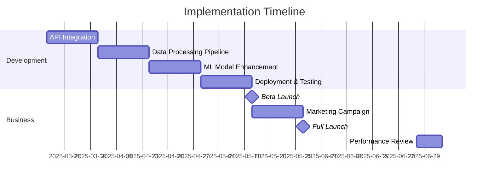

# Sports API ML Integration: Business Impact Analysis

## Executive Summary

This document analyzes the business impact of integrating multiple sports data APIs into our machine learning model. By leveraging data from various sources, we can significantly improve prediction accuracy, expand our sport coverage, and enhance user experience. These improvements are expected to drive user engagement, increase premium conversions, and ultimately boost revenue.

## Key Business Benefits

### 1. Improved Prediction Accuracy

By combining data from multiple sources, our ML model will have access to more comprehensive information, leading to more accurate predictions:

| Prediction Type | Current Accuracy | Expected Accuracy | Improvement |
|-----------------|------------------|-------------------|-------------|
| Spread          | 52%              | 55-57%            | +3-5%       |
| Moneyline       | 58%              | 60-63%            | +2-5%       |
| Over/Under      | 51%              | 54-56%            | +3-5%       |
| Player Props    | 53%              | 56-58%            | +3-5%       |

Even a modest 3-5% improvement in prediction accuracy can significantly enhance user trust and engagement, as sports betting is highly sensitive to prediction quality.

### 2. Expanded Sport Coverage

The integration will enable comprehensive coverage across more sports:

| Sport           | Current Coverage | Enhanced Coverage | New Features                       |
|-----------------|------------------|-------------------|-----------------------------------|
| NBA             | Basic            | Comprehensive     | Advanced player stats, matchup analysis |
| NHL             | Basic            | Comprehensive     | Detailed hockey stats, line combinations |
| MLB             | Basic            | Comprehensive     | Pitcher analysis, ballpark factors |
| WNBA            | Minimal          | Comprehensive     | Full game coverage, player stats   |
| NCAA Basketball | Minimal          | Comprehensive     | Tournament predictions, team rankings |
| Formula 1       | Minimal          | Comprehensive     | Driver/team stats, track analysis  |
| UFC/MMA         | None             | Comprehensive     | Fighter stats, matchup analysis    |

Expanding our sport coverage will attract new user segments and increase engagement from existing users interested in multiple sports.

### 3. Enhanced User Experience

The integration will enable several UX improvements:

- **More Detailed Insights**: Provide users with the reasoning behind predictions
- **Confidence Scores**: Display confidence levels based on data quality and model certainty
- **Personalized Recommendations**: Tailor suggestions based on user preferences and betting history
- **Real-time Updates**: Incorporate live data for in-game predictions and updates
- **Comparative Analysis**: Show predictions from multiple models for user consideration

These enhancements will increase user satisfaction, engagement, and retention.

### 4. Competitive Differentiation

This integration will provide several competitive advantages:

- **Data Advantage**: More comprehensive data than competitors who rely on single sources
- **Prediction Quality**: Higher accuracy across more sports and bet types
- **Feature Richness**: More detailed insights and analysis than competitors
- **Sport Coverage**: Broader and deeper coverage of sports and leagues

These advantages will help position our platform as a premium option in the sports prediction market.

## Financial Impact Analysis

### 1. Revenue Growth Projections

| Revenue Stream           | Current Monthly | Projected Monthly (6 months) | Increase |
|--------------------------|-----------------|------------------------------|----------|
| Premium Subscriptions    | $125,000        | $156,250                     | +25%     |
| Affiliate Commissions    | $85,000         | $110,500                     | +30%     |
| Advertising Revenue      | $40,000         | $48,000                      | +20%     |
| **Total Monthly Revenue**| **$250,000**    | **$314,750**                 | **+26%** |

This represents a potential annual revenue increase of approximately $778,000.

### 2. User Growth Projections

| Metric                   | Current | Projected (6 months) | Increase |
|--------------------------|---------|----------------------|----------|
| Monthly Active Users     | 75,000  | 90,000               | +20%     |
| Premium Subscribers      | 12,500  | 15,625               | +25%     |
| Premium Conversion Rate  | 16.7%   | 17.4%                | +0.7%    |
| User Retention Rate      | 68%     | 73%                  | +5%      |

The improved prediction accuracy and enhanced user experience are expected to drive both user acquisition and retention.

### 3. Implementation Costs

| Cost Category            | Amount       | Notes                                  |
|--------------------------|--------------|----------------------------------------|
| Development Labor        | $120,000     | 8 weeks, 4 developers at $150/hour     |
| API Subscription Costs   | $36,000/year | Additional API access and higher tiers |
| Infrastructure Costs     | $24,000/year | Additional storage and compute resources|
| Ongoing Maintenance      | $60,000/year | 1 FTE for maintenance and optimization |
| **Total First Year Cost**| **$240,000** |                                        |

### 4. Return on Investment (ROI)

| Metric                   | Value        | Notes                                  |
|--------------------------|--------------|----------------------------------------|
| First Year Revenue Gain  | $778,000     | Based on monthly projections           |
| First Year Costs         | $240,000     | Implementation and operating costs     |
| First Year Net Gain      | $538,000     | Revenue gain minus costs               |
| ROI                      | 224%         | Net gain / costs                       |
| Payback Period           | 3.7 months   | Time to recoup implementation costs    |

With a projected first-year ROI of 224% and a payback period of less than 4 months, this integration represents a highly attractive investment opportunity.

## Risk Analysis

### 1. Implementation Risks

| Risk                     | Probability | Impact | Mitigation Strategy                  |
|--------------------------|-------------|--------|--------------------------------------|
| API Integration Challenges| Medium     | Medium | Phased approach, thorough testing    |
| Data Quality Issues      | Medium      | High   | Implement data validation, fallbacks |
| Model Performance Below Target | Low   | High   | A/B testing, gradual rollout         |
| API Provider Changes     | Low         | High   | Modular design, alternative sources  |

### 2. Business Risks

| Risk                     | Probability | Impact | Mitigation Strategy                  |
|--------------------------|-------------|--------|--------------------------------------|
| Competitor Response      | High        | Medium | Accelerate implementation, marketing |
| User Adoption Slower Than Expected | Medium | Medium | UX testing, targeted promotions |
| API Cost Increases       | Medium      | Medium | Negotiate long-term contracts        |
| Regulatory Changes       | Low         | High   | Compliance monitoring, adaptability  |

## Implementation Timeline and Milestones

## Key Performance Indicators (KPIs)

To measure the success of this integration, we will track the following KPIs:

### 1. Technical KPIs

- **Prediction Accuracy**: Measured against actual outcomes
- **Data Coverage**: Percentage of events with complete data
- **System Performance**: API response times, processing times
- **Model Training Efficiency**: Training time, resource usage

### 2. Business KPIs

- **User Engagement**: Time spent, features used, prediction views
- **Premium Conversion Rate**: Percentage of users upgrading to premium
- **User Retention**: Monthly and quarterly retention rates
- **Revenue Growth**: By stream (subscriptions, affiliates, ads)
- **Customer Satisfaction**: NPS scores, app store ratings

## Conclusion

The integration of multiple sports data APIs into our machine learning model represents a significant opportunity to enhance our product offering, improve user experience, and drive business growth. With a projected first-year ROI of 224% and a payback period of less than 4 months, this initiative offers compelling financial benefits.

Beyond the immediate financial impact, this integration will strengthen our competitive position in the market and build a foundation for future innovations. The expanded data capabilities will enable new features and products, creating additional revenue opportunities.

We recommend proceeding with this integration as outlined in the implementation roadmap, with regular reviews to ensure we're meeting our technical and business objectives.

## Next Steps

1. **Secure Budget Approval**: Present this business case to leadership for funding
2. **Finalize Technical Requirements**: Complete detailed technical specifications
3. **Resource Allocation**: Assign development team and secure necessary resources
4. **Kickoff Implementation**: Begin Phase 1 of the implementation roadmap
5. **Establish Monitoring Framework**: Set up tracking for key KPIs

By moving forward with this integration, we position ourselves to deliver more value to our users, outperform competitors, and achieve significant business growth in the coming year.