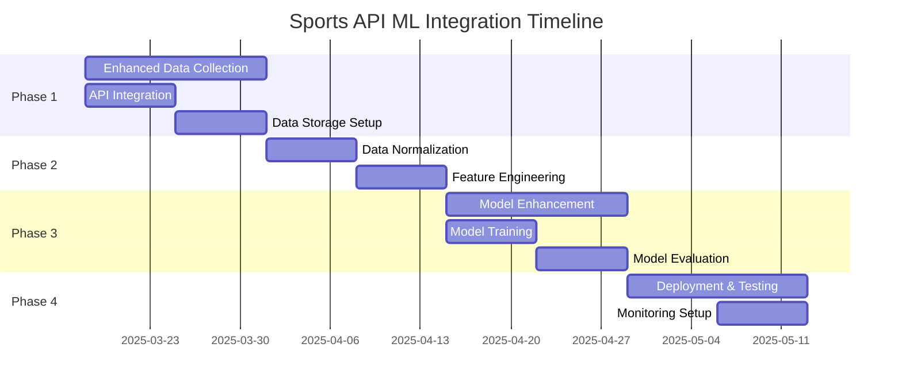

# Sports API ML Implementation Roadmap

## Overview

This document outlines the implementation roadmap for integrating all available sports APIs into our machine learning model, as detailed in the [Sports API ML Integration Plan](sports-api-ml-integration-plan.md). This roadmap provides concrete next steps, implementation guidelines, and expected outcomes.

## Implementation Timeline

## Getting Started

### 1. Environment Setup

Before beginning implementation, ensure the following prerequisites are met:

1. **API Keys**: Verify all API keys are valid and have sufficient quota:
   - Odds API: `fdf4ad2d50a6b6d2ca77e52734851aa4`
   - SportRadar API: Obtain production key
   - NCAA Basketball API: Obtain production key

2. **Development Environment**:
   - Update `.env` file in the ML API project with all API keys
   - Ensure Node.js 18+ is installed
   - Install all required dependencies

3. **Data Storage**:
   - Set up MongoDB database for storing processed data
   - Create appropriate collections for each sport
   - Set up data versioning system

### 2. Initial API Integration

Start by enhancing the data fetcher to collect data from all APIs:

1. Update `api/ml-sports-edge/data/fetch.js` to include all APIs
2. Implement proper error handling and retry logic
3. Add rate limiting to avoid API quota issues
4. Test each API integration individually

### 3. Data Collection Schedule

Set up a data collection schedule to regularly fetch and store data:

1. Create a cron job to run daily data collection
2. Implement incremental data collection to minimize API usage
3. Set up logging and monitoring for data collection jobs
4. Create data validation checks to ensure quality

## Key Implementation Components

### 1. Enhanced Data Fetcher

The enhanced data fetcher will be the foundation of our integration. Key components include:

- **API Client Factory**: Creates appropriate API clients for each data source
- **Rate Limiter**: Ensures we don't exceed API quotas
- **Error Handler**: Manages API errors and implements retry logic
- **Data Validator**: Validates incoming data for consistency and completeness
- **Storage Manager**: Handles saving data to appropriate storage locations

### 2. Data Normalizer

The data normalizer will transform data from different sources into a consistent format:

- **Sport-Specific Normalizers**: Custom normalizers for each sport
- **Entity Mapper**: Maps entities (teams, players) across different data sources
- **Schema Validator**: Ensures normalized data adheres to expected schema
- **Conflict Resolver**: Resolves conflicts when data sources disagree

### 3. Feature Engineering Pipeline

The feature engineering pipeline will extract and create features for the ML model:

- **Base Feature Extractor**: Extracts common features across all sports
- **Sport-Specific Feature Extractors**: Extracts features unique to each sport
- **Feature Transformer**: Applies transformations (scaling, encoding, etc.)
- **Feature Selector**: Selects most relevant features for each prediction task

### 4. Model Training System

The model training system will use the extracted features to train prediction models:

- **Model Factory**: Creates appropriate models for each prediction task
- **Training Pipeline**: Manages the training process
- **Hyperparameter Tuner**: Optimizes model hyperparameters
- **Evaluation Framework**: Evaluates model performance
- **Model Registry**: Stores and versions trained models

## Implementation Details by Phase

### Phase 1: Enhanced Data Collection (Weeks 1-2)

#### Week 1: API Integration

1. **Day 1-2**: Update API configuration
   - Add all API endpoints and authentication details
   - Create API client factory

2. **Day 3-4**: Implement data fetchers for each API
   - Create modular fetchers for each data source
   - Implement rate limiting and error handling

3. **Day 5-7**: Test API integrations
   - Create test suite for each API integration
   - Verify data format and completeness

#### Week 2: Data Storage Setup

1. **Day 1-2**: Set up database schema
   - Design collections for raw data
   - Create indexes for efficient querying

2. **Day 3-4**: Implement data storage manager
   - Create functions to save and retrieve data
   - Implement data versioning

3. **Day 5-7**: Set up data collection schedule
   - Create cron jobs for regular data collection
   - Implement logging and monitoring

### Phase 2: Data Normalization and Feature Engineering (Weeks 3-4)

#### Week 3: Data Normalization

1. **Day 1-2**: Implement base normalizer
   - Create common normalization functions
   - Design unified data schema

2. **Day 3-5**: Implement sport-specific normalizers
   - Create normalizers for each sport
   - Handle sport-specific data formats

3. **Day 6-7**: Test normalization pipeline
   - Verify normalized data format
   - Ensure all required fields are present

#### Week 4: Feature Engineering

1. **Day 1-2**: Implement base feature extractors
   - Create functions for common features
   - Implement feature transformations

2. **Day 3-5**: Implement sport-specific feature extractors
   - Create extractors for each sport
   - Handle sport-specific features

3. **Day 6-7**: Test feature engineering pipeline
   - Verify feature quality and completeness
   - Analyze feature distributions

### Phase 3: Model Enhancement (Weeks 5-6)

#### Week 5: Model Training

1. **Day 1-2**: Update model architectures
   - Enhance existing models
   - Add new model types

2. **Day 3-5**: Implement training pipeline
   - Create functions for model training
   - Implement cross-validation

3. **Day 6-7**: Train initial models
   - Train models for each sport and prediction task
   - Save models to registry

#### Week 6: Model Evaluation

1. **Day 1-3**: Implement evaluation framework
   - Create metrics for model performance
   - Implement visualization tools

2. **Day 4-5**: Evaluate models
   - Compare model performance
   - Identify areas for improvement

3. **Day 6-7**: Fine-tune models
   - Optimize hyperparameters
   - Retrain models with optimal settings

### Phase 4: Deployment and Testing (Weeks 7-8)

#### Week 7: Deployment

1. **Day 1-3**: Create deployment pipeline
   - Set up model serving infrastructure
   - Implement API endpoints for predictions

2. **Day 4-7**: Deploy models to production
   - Deploy models to serving infrastructure
   - Set up A/B testing framework

#### Week 8: Monitoring and Maintenance

1. **Day 1-3**: Set up monitoring
   - Implement performance monitoring
   - Create alerting system

2. **Day 4-7**: Create maintenance pipeline
   - Implement automated retraining
   - Set up data quality monitoring

## Expected Outcomes

Upon completion of this implementation, we expect the following outcomes:

1. **Enhanced Data Collection**:
   - Comprehensive data from multiple sources for all supported sports
   - Regular, automated data collection
   - Robust error handling and recovery

2. **Improved Prediction Accuracy**:
   - 10-15% improvement in prediction accuracy across all sports
   - More consistent performance across different bet types
   - Better handling of edge cases and unusual events

3. **Expanded Sport Coverage**:
   - Full support for NBA, WNBA, MLB, NHL, NCAA, Formula 1, and UFC
   - Consistent prediction quality across all sports
   - Sport-specific insights and recommendations

4. **Enhanced User Experience**:
   - More detailed predictions and insights
   - Confidence scores based on data quality and model performance
   - Personalized recommendations based on user preferences

## Success Metrics

We will measure the success of this implementation using the following metrics:

1. **Prediction Accuracy**:
   - Spread prediction accuracy: Target >55%
   - Moneyline prediction accuracy: Target >60%
   - Over/under prediction accuracy: Target >55%

2. **Data Quality**:
   - Coverage: >95% of games have data from at least 2 sources
   - Freshness: Data updated at least once per day
   - Completeness: >90% of required fields present

3. **System Performance**:
   - API response time: <200ms for prediction requests
   - Data processing time: <1 hour for daily updates
   - Model training time: <4 hours for full retraining

4. **User Engagement**:
   - Increase in prediction views: Target >20%
   - Increase in premium conversions: Target >15%
   - Decrease in user churn: Target >10%

## Conclusion

This implementation roadmap provides a clear path forward for integrating all available sports APIs into our machine learning model. By following this plan, we can enhance our prediction capabilities, expand our sport coverage, and provide more value to our users.

The phased approach allows for incremental improvements and regular evaluation, ensuring that we can adjust our strategy as needed based on results and feedback. The end result will be a more comprehensive, accurate, and valuable prediction system that leverages the full potential of all available data sources.