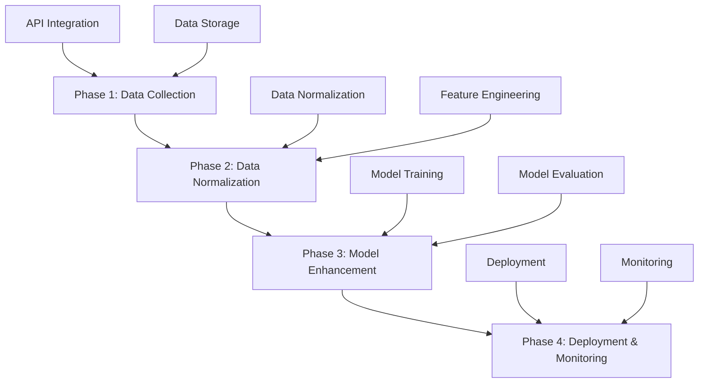
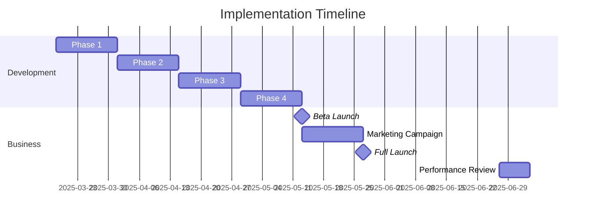

# Sports API ML Integration: Executive Summary

## Overview

This document provides a comprehensive summary of our plan to integrate multiple sports data APIs into our machine learning model. This initiative will significantly enhance our prediction capabilities, expand our sport coverage, and drive business growth.

## Key Documents

This summary references three detailed documents that together form our complete integration strategy:

1. [**Sports API ML Integration Plan**](sports-api-ml-integration-plan.md) - Technical details of the integration approach
2. [**Sports API ML Implementation Roadmap**](sports-api-ml-implementation-roadmap.md) - Step-by-step implementation guide
3. [**Sports API ML Business Impact Analysis**](sports-api-ml-business-impact.md) - Financial and business benefits

## Strategic Objectives

This integration initiative aims to achieve the following strategic objectives:

1. **Enhance Prediction Accuracy** by leveraging multiple data sources
2. **Expand Sport Coverage** to include more leagues and bet types
3. **Improve User Experience** with more detailed insights and personalization
4. **Drive Business Growth** through increased engagement and conversions

## Available Data Sources

We have identified the following sports data APIs that will be integrated:

| API | Description | Authentication | Sports Covered |
|-----|-------------|----------------|----------------|
| Odds API | Betting odds and lines | API Key available | All major sports |
| ESPN API | Game data and schedules | No auth required | All major sports |
| NHL Stats API | Detailed hockey statistics | No auth required | NHL |
| SportRadar API | Comprehensive sports data | API Key required | NBA, NFL, MLB, NHL, UFC |
| NCAA Basketball API | College basketball data | API Key required | NCAA Men's & Women's |
| UFC/MMA API | MMA event and fighter data | Multiple sources | UFC, MMA |

## Technical Approach

Our technical approach follows a four-phase implementation:

### Phase 1: Enhanced Data Collection

- Integrate all identified APIs
- Implement rate limiting and error handling
- Set up data storage and versioning
- Create data validation processes

### Phase 2: Data Normalization and Feature Engineering

- Develop sport-specific data normalizers
- Create unified data schema
- Implement feature extraction for each sport
- Design feature selection pipeline

### Phase 3: Model Enhancement

- Update model architectures
- Implement cross-validation
- Train and evaluate models
- Fine-tune hyperparameters

### Phase 4: Deployment and Monitoring

- Deploy models to production
- Set up A/B testing
- Implement performance monitoring
- Create automated retraining pipeline

## Implementation Timeline

The implementation will follow this timeline:

## Expected Outcomes

### Technical Outcomes

1. **Enhanced Data Collection**:
   - Comprehensive data from multiple sources
   - Regular, automated data collection
   - Robust error handling and recovery

2. **Improved Prediction Accuracy**:
   - Spread prediction: +3-5% accuracy
   - Moneyline prediction: +2-5% accuracy
   - Over/under prediction: +3-5% accuracy

3. **Expanded Sport Coverage**:
   - Full support for NBA, WNBA, MLB, NHL, NCAA, Formula 1, and UFC
   - Consistent prediction quality across all sports
   - Sport-specific insights and recommendations

### Business Outcomes

1. **Revenue Growth**:
   - 25% increase in premium subscriptions
   - 30% increase in affiliate commissions
   - 20% increase in advertising revenue
   - Overall 26% increase in monthly revenue

2. **User Growth**:
   - 20% increase in monthly active users
   - 25% increase in premium subscribers
   - 5% improvement in user retention

## Financial Impact

| Metric | Value | Notes |
|--------|-------|-------|
| First Year Revenue Gain | $778,000 | Based on monthly projections |
| First Year Costs | $240,000 | Implementation and operating costs |
| First Year Net Gain | $538,000 | Revenue gain minus costs |
| ROI | 224% | Net gain / costs |
| Payback Period | 3.7 months | Time to recoup implementation costs |

## Success Metrics

We will measure success using the following key performance indicators:

### Technical KPIs

- **Prediction Accuracy**: Target >55% for spread, >60% for moneyline
- **Data Quality**: >95% coverage, daily updates, >90% completeness
- **System Performance**: <200ms API response time, <1 hour for data processing

### Business KPIs

- **User Engagement**: 20% increase in prediction views
- **Premium Conversion**: 25% increase in premium subscribers
- **User Retention**: 5% improvement in retention rate
- **Revenue Growth**: 26% increase in monthly revenue

## Risk Assessment

| Risk | Probability | Impact | Mitigation |
|------|-------------|--------|------------|
| API Integration Challenges | Medium | Medium | Phased approach, thorough testing |
| Data Quality Issues | Medium | High | Data validation, fallbacks |
| Model Performance Below Target | Low | High | A/B testing, gradual rollout |
| Competitor Response | High | Medium | Accelerate implementation, marketing |
| User Adoption Slower Than Expected | Medium | Medium | UX testing, targeted promotions |

## Next Steps

1. **Secure Approval**: Present this plan to leadership for approval
2. **Allocate Resources**: Assign development team and secure necessary resources
3. **Begin Implementation**: Start with Phase 1 (Data Collection)
4. **Regular Reviews**: Conduct weekly progress reviews
5. **Measure Results**: Track KPIs against baseline metrics

## Conclusion

The integration of multiple sports data APIs into our machine learning model represents a significant opportunity to enhance our product offering, improve user experience, and drive business growth. With a projected first-year ROI of 224% and a payback period of less than 4 months, this initiative offers compelling financial benefits.

By proceeding with this integration as outlined in our implementation roadmap, we can strengthen our competitive position in the market and build a foundation for future innovations. The expanded data capabilities will enable new features and products, creating additional revenue opportunities and positioning us for long-term success in the sports prediction market.