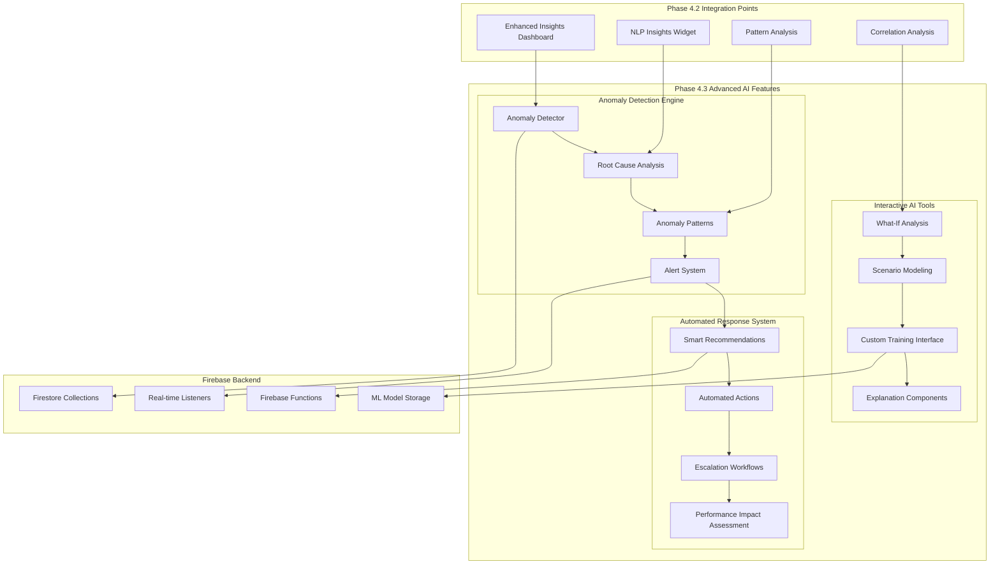

# Unified Admin Dashboard - Phase 4.3: Advanced AI Features

**Duration**: 4-5 weeks  
**Status**: Ready for Implementation  
**Prerequisites**: Phase 4.1 (Foundation) & Phase 4.2 (Enhanced Insights) Complete

## Overview

Phase 4.3 focuses on implementing advanced AI-driven features that provide proactive monitoring, interactive analysis tools, and intelligent automation. This phase transforms the admin dashboard from a reactive analytics platform into a proactive AI-powered management system.

## Table of Contents

1. [Architecture Overview](#architecture-overview)
2. [Core Components](#core-components)
3. [Implementation Plan](#implementation-plan)
4. [Technical Specifications](#technical-specifications)
5. [Success Metrics](#success-metrics)
6. [Risk Mitigation](#risk-mitigation)

## Architecture Overview



## Core Components

### 1. Advanced Anomaly Detection System

#### 1.1 Real-time Anomaly Detection Engine

**Purpose**: Continuously monitor system metrics and user behavior to identify anomalies using multiple ML algorithms.

**Key Features**:
- Multi-algorithm anomaly detection (Isolation Forest, One-Class SVM, Autoencoder)
- Configurable sensitivity levels based on business context
- Real-time processing with sub-second detection latency
- Historical pattern learning with adaptive thresholds

**Implementation Components**:

```typescript
// Core anomaly detection service
interface AnomalyDetectionService {
  detectAnomalies(data: MetricData[]): Promise<Anomaly[]>;
  configureDetector(config: DetectorConfig): Promise<void>;
  getDetectionHistory(timeRange: TimeRange): Promise<AnomalyHistory>;
  updateThresholds(metricId: string, thresholds: Thresholds): Promise<void>;
}

// Anomaly types and interfaces
interface Anomaly {
  id: string;
  type: AnomalyType;
  severity: 'critical' | 'high' | 'medium' | 'low';
  confidence: number;
  affectedMetrics: string[];
  detectedAt: Date;
  rootCause?: RootCauseAnalysis;
  recommendedActions: RecommendedAction[];
}
```

#### 1.2 Root Cause Analysis Engine

**Purpose**: Automatically analyze detected anomalies to identify likely root causes using correlation analysis and historical patterns.

**Key Features**:
- Automated correlation analysis between metrics
- Historical pattern matching for similar anomalies
- Dependency mapping for system components
- Confidence scoring for root cause hypotheses

**Implementation Components**:

```typescript
interface RootCauseAnalysisEngine {
  analyzeAnomaly(anomaly: Anomaly): Promise<RootCauseAnalysis>;
  identifyCorrelations(metricId: string, timeRange: TimeRange): Promise<Correlation[]>;
  suggestInvestigationSteps(analysis: RootCauseAnalysis): Promise<InvestigationStep[]>;
}

interface RootCauseAnalysis {
  likelyCauses: Cause[];
  correlatedMetrics: CorrelatedMetric[];
  historicalSimilarities: SimilarAnomaly[];
  investigationSteps: InvestigationStep[];
  confidence: number;
}
```

#### 1.3 Anomaly Pattern Recognition

**Purpose**: Learn from historical anomalies to improve detection accuracy and predict potential issues.

**Key Features**:
- Pattern clustering for anomaly types
- Seasonal anomaly pattern detection
- Predictive anomaly modeling
- False positive reduction through pattern learning

### 2. Interactive AI Tools

#### 2.1 What-If Analysis Interface

**Purpose**: Enable administrators to explore hypothetical scenarios and their potential impacts on system metrics.

**Key Features**:
- Interactive parameter adjustment with real-time predictions
- Scenario comparison with confidence intervals
- Impact visualization across multiple metrics
- Downloadable scenario reports

**Implementation Components**:

```typescript
interface WhatIfAnalysisService {
  createScenario(baselineData: MetricData[], modifications: Modification[]): Promise<Scenario>;
  runAnalysis(scenario: Scenario): Promise<AnalysisResult>;
  compareScenarios(scenarios: Scenario[]): Promise<ComparisonResult>;
  generateReport(analysis: AnalysisResult): Promise<ScenarioReport>;
}

interface Scenario {
  id: string;
  name: string;
  description: string;
  baselineData: MetricData[];
  modifications: Modification[];
  predictions: Prediction[];
  confidence: number;
}
```

#### 2.2 Scenario Modeling Engine

**Purpose**: Provide advanced modeling capabilities for complex business scenarios with multiple variables.

**Key Features**:
- Multi-variable scenario modeling
- Monte Carlo simulation for uncertainty analysis
- Sensitivity analysis for key parameters
- Risk assessment with probability distributions

#### 2.3 Custom Training Interface

**Purpose**: Allow administrators to train custom ML models for specific business needs.

**Key Features**:
- Drag-and-drop model configuration
- Automated hyperparameter tuning
- Model performance comparison
- One-click model deployment

**Implementation Components**:

```typescript
interface CustomTrainingService {
  createTrainingJob(config: TrainingConfig): Promise<TrainingJob>;
  monitorTraining(jobId: string): Promise<TrainingStatus>;
  evaluateModel(modelId: string, testData: TestData): Promise<ModelEvaluation>;
  deployModel(modelId: string, deploymentConfig: DeploymentConfig): Promise<Deployment>;
}

interface TrainingConfig {
  modelType: 'classification' | 'regression' | 'clustering' | 'anomaly_detection';
  dataSource: DataSource;
  features: Feature[];
  target?: string;
  hyperparameters: HyperparameterConfig;
  validationStrategy: ValidationStrategy;
}
```

#### 2.4 Advanced Explanation Components

**Purpose**: Provide interpretable AI explanations using SHAP values and other explainability techniques.

**Key Features**:
- SHAP-based feature importance visualization
- Local and global model explanations
- Counterfactual explanations for predictions
- Natural language explanation generation

### 3. Automated Response System

#### 3.1 Smart Recommendation Engine

**Purpose**: Generate contextual recommendations based on detected anomalies and system state.

**Key Features**:
- Context-aware recommendation generation
- Priority-based recommendation ranking
- Historical effectiveness tracking
- User feedback integration for improvement

**Implementation Components**:

```typescript
interface SmartRecommendationEngine {
  generateRecommendations(context: SystemContext): Promise<Recommendation[]>;
  rankRecommendations(recommendations: Recommendation[]): Promise<RankedRecommendation[]>;
  trackEffectiveness(recommendationId: string, outcome: Outcome): Promise<void>;
  updateRecommendationModel(feedback: UserFeedback[]): Promise<void>;
}

interface Recommendation {
  id: string;
  type: RecommendationType;
  title: string;
  description: string;
  urgency: 'immediate' | 'high' | 'medium' | 'low';
  estimatedImpact: ImpactEstimate;
  requiredActions: Action[];
  dependencies: string[];
  riskLevel: 'low' | 'medium' | 'high';
}
```

#### 3.2 Automated Action Triggers

**Purpose**: Automatically execute approved actions based on predefined rules and ML recommendations.

**Key Features**:
- Rule-based action automation
- ML-powered action selection
- Safety checks and approval workflows
- Rollback mechanisms for failed actions

#### 3.3 Escalation Workflows

**Purpose**: Automatically escalate critical issues to appropriate stakeholders based on severity and context.

**Key Features**:
- Dynamic escalation path determination
- Multi-channel notification support
- Escalation timing optimization
- Stakeholder availability tracking

#### 3.4 Performance Impact Assessment

**Purpose**: Continuously assess the impact of AI recommendations and automated actions on system performance.

**Key Features**:
- Before/after performance comparison
- ROI calculation for AI recommendations
- Success rate tracking for automated actions
- Cost-benefit analysis for AI interventions

## Implementation Plan

### Week 1: Anomaly Detection Foundation

#### Day 1-2: Core Anomaly Detection Service
```typescript
// /src/services/anomalyDetectionService.ts
export class AnomalyDetectionService extends AdminDashboardService {
  async detectAnomalies(data: MetricData[]): Promise<Anomaly[]> {
    // Implement multi-algorithm anomaly detection
    const isolationForestResults = await this.runIsolationForest(data);
    const oneClassSVMResults = await this.runOneClassSVM(data);
    const autoencoderResults = await this.runAutoencoder(data);
    
    return this.combineResults([
      isolationForestResults,
      oneClassSVMResults,
      autoencoderResults
    ]);
  }
}
```

#### Day 3-4: Root Cause Analysis Engine
```typescript
// /src/services/rootCauseAnalysisService.ts
export class RootCauseAnalysisService extends AdminDashboardService {
  async analyzeAnomaly(anomaly: Anomaly): Promise<RootCauseAnalysis> {
    const correlations = await this.identifyCorrelations(anomaly.affectedMetrics);
    const historicalPatterns = await this.findSimilarAnomalies(anomaly);
    const dependencyAnalysis = await this.analyzeDependencies(anomaly);
    
    return this.synthesizeRootCause(correlations, historicalPatterns, dependencyAnalysis);
  }
}
```

#### Day 5-7: Anomaly Detection UI Components
```typescript
// /src/components/dashboard/aiml/AnomalyDetectionDashboard.tsx
export const AnomalyDetectionDashboard: React.FC = () => {
  const { anomalies, isLoading } = useAnomalyDetection();
  
  return (
    <View style={styles.container}>
      <AnomalyOverviewWidget anomalies={anomalies} />
      <RealTimeAnomalyFeed anomalies={anomalies} />
      <AnomalyHeatMap data={anomalies} />
      <RootCauseAnalysisPanel selectedAnomaly={selectedAnomaly} />
    </View>
  );
};
```

### Week 2: Interactive AI Tools Foundation

#### Day 8-10: What-If Analysis Service
```typescript
// /src/services/whatIfAnalysisService.ts
export class WhatIfAnalysisService extends AdminDashboardService {
  async createScenario(baselineData: MetricData[], modifications: Modification[]): Promise<Scenario> {
    const modifiedData = this.applyModifications(baselineData, modifications);
    const predictions = await this.generatePredictions(modifiedData);
    
    return {
      id: generateId(),
      baselineData,
      modifications,
      predictions,
      confidence: this.calculateConfidence(predictions)
    };
  }
}
```

#### Day 11-12: Scenario Modeling Engine
```typescript
// /src/services/scenarioModelingService.ts
export class ScenarioModelingService extends AdminDashboardService {
  async runMonteCarloSimulation(scenario: Scenario, iterations: number): Promise<SimulationResult> {
    const results = [];
    for (let i = 0; i < iterations; i++) {
      const randomizedScenario = this.addUncertainty(scenario);
      const result = await this.runSingleSimulation(randomizedScenario);
      results.push(result);
    }
    
    return this.aggregateResults(results);
  }
}
```

#### Day 13-14: Interactive UI Components
```typescript
// /src/components/dashboard/aiml/WhatIfAnalysisDashboard.tsx
export const WhatIfAnalysisDashboard: React.FC = () => {
  return (
    <View style={styles.container}>
      <ScenarioBuilder onScenarioCreate={handleScenarioCreate} />
      <ParameterAdjustmentPanel scenario={selectedScenario} />
      <PredictionVisualization predictions={predictions} />
      <ScenarioComparison scenarios={scenarios} />
    </View>
  );
};
```

### Week 3: Automated Response System

#### Day 15-17: Smart Recommendation Engine
```typescript
// /src/services/smartRecommendationService.ts
export class SmartRecommendationService extends AdminDashboardService {
  async generateRecommendations(context: SystemContext): Promise<Recommendation[]> {
    const contextAnalysis = await this.analyzeContext(context);
    const historicalEffectiveness = await this.getHistoricalData(context);
    const ruleBasedRecommendations = this.generateRuleBasedRecommendations(contextAnalysis);
    const mlRecommendations = await this.generateMLRecommendations(context, historicalEffectiveness);
    
    return this.combineAndRankRecommendations(ruleBasedRecommendations, mlRecommendations);
  }
}
```

#### Day 18-19: Automated Action System
```typescript
// /src/services/automatedActionService.ts
export class AutomatedActionService extends AdminDashboardService {
  async executeAction(action: Action, approval: ApprovalContext): Promise<ActionResult> {
    // Pre-execution safety checks
    const safetyCheck = await this.performSafetyChecks(action);
    if (!safetyCheck.passed) {
      return { success: false, error: safetyCheck.issues };
    }
    
    // Execute with rollback capability
    const rollbackPoint = await this.createRollbackPoint();
    try {
      const result = await this.performAction(action);
      await this.validateActionSuccess(result);
      return { success: true, result };
    } catch (error) {
      await this.performRollback(rollbackPoint);
      return { success: false, error };
    }
  }
}
```

#### Day 20-21: Escalation Workflow System
```typescript
// /src/services/escalationWorkflowService.ts
export class EscalationWorkflowService extends AdminDashboardService {
  async triggerEscalation(issue: Issue, severity: Severity): Promise<EscalationResult> {
    const escalationPath = await this.determineEscalationPath(issue, severity);
    const stakeholders = await this.identifyStakeholders(escalationPath);
    const availableStakeholders = await this.checkAvailability(stakeholders);
    
    return this.notifyStakeholders(issue, availableStakeholders, escalationPath);
  }
}
```

### Week 4: Advanced Features & Integration

#### Day 22-24: Custom Training Interface
```typescript
// /src/components/dashboard/aiml/CustomTrainingDashboard.tsx
export const CustomTrainingDashboard: React.FC = () => {
  return (
    <View style={styles.container}>
      <ModelConfigurationWizard onConfigComplete={handleConfigComplete} />
      <TrainingJobMonitor jobs={trainingJobs} />
      <ModelEvaluationPanel model={selectedModel} />
      <ModelDeploymentInterface models={trainedModels} />
    </View>
  );
};
```

#### Day 25-26: Advanced Explanation Components
```typescript
// /src/components/dashboard/aiml/ExplanationDashboard.tsx
export const ExplanationDashboard: React.FC = () => {
  return (
    <View style={styles.container}>
      <SHAPVisualization model={selectedModel} prediction={selectedPrediction} />
      <FeatureImportanceChart features={features} />
      <CounterfactualExplanation prediction={selectedPrediction} />
      <NaturalLanguageExplanation explanation={explanation} />
    </View>
  );
};
```

#### Day 27-28: Performance Impact Assessment
```typescript
// /src/services/performanceImpactService.ts
export class PerformanceImpactService extends AdminDashboardService {
  async assessRecommendationImpact(recommendationId: string): Promise<ImpactAssessment> {
    const baseline = await this.getBaselineMetrics();
    const postImplementation = await this.getPostImplementationMetrics();
    const roi = this.calculateROI(baseline, postImplementation);
    
    return {
      recommendationId,
      baseline,
      postImplementation,
      roi,
      successMetrics: this.calculateSuccessMetrics(baseline, postImplementation)
    };
  }
}
```

### Week 5: Testing, Documentation & Optimization

#### Day 29-31: Comprehensive Testing
- Unit tests for all new services and components
- Integration tests for AI component interactions
- Performance testing for real-time anomaly detection
- User acceptance testing with admin stakeholders

#### Day 32-33: Documentation & Training
- Complete API documentation for all new services
- User guide for advanced AI features
- Training materials for admin dashboard users
- Video tutorials for complex features

#### Day 34-35: Performance Optimization & Deployment Preparation
- Optimize ML model inference performance
- Implement caching strategies for expensive operations
- Configure monitoring and alerting for new features
- Prepare deployment scripts and rollback procedures

## Technical Specifications

### Performance Requirements

| Component | Target Latency | Throughput | Success Rate |
|-----------|---------------|------------|---------------|
| Anomaly Detection | < 500ms | 1000 metrics/sec | > 95% |
| Root Cause Analysis | < 2 seconds | 100 analyses/min | > 90% |
| What-If Analysis | < 3 seconds | 50 scenarios/min | > 95% |
| Recommendation Generation | < 1 second | 200 contexts/min | > 90% |
| Automated Actions | < 5 seconds | 20 actions/min | > 99% |

### Scalability Requirements

| Metric | Current Scale | Target Scale | Growth Factor |
|--------|---------------|--------------|---------------|
| Concurrent Users | 50 | 500 | 10x |
| Anomalies/Day | 1,000 | 10,000 | 10x |
| Scenarios/Day | 100 | 1,000 | 10x |
| Recommendations/Day | 500 | 5,000 | 10x |
| Automated Actions/Day | 50 | 500 | 10x |

### Data Storage Requirements

```typescript
// Firestore Collections for Phase 4.3
interface Phase43Collections {
  anomalies: {
    id: string;
    type: AnomalyType;
    severity: Severity;
    detectedAt: Timestamp;
    resolvedAt?: Timestamp;
    rootCause?: RootCauseAnalysis;
  };
  
  scenarios: {
    id: string;
    createdBy: string;
    name: string;
    modifications: Modification[];
    predictions: Prediction[];
    createdAt: Timestamp;
  };
  
  recommendations: {
    id: string;
    context: SystemContext;
    type: RecommendationType;
    priority: number;
    status: 'pending' | 'implemented' | 'rejected';
    effectiveness?: number;
  };
  
  automatedActions: {
    id: string;
    recommendationId: string;
    action: Action;
    executedAt: Timestamp;
    result: ActionResult;
    rollbackPoint?: RollbackPoint;
  };
}
```

## Success Metrics

### Technical Success Metrics

| Metric | Target | Measurement Method | Timeline |
|--------|--------|-------------------|----------|
| Anomaly Detection Precision | > 90% | Cross-validation on test data | Week 2 |
| Anomaly Detection Recall | > 85% | Cross-validation on test data | Week 2 |
| Root Cause Accuracy | > 70% | Expert validation | Week 3 |
| What-If Analysis Accuracy | > 80% | Historical validation | Week 3 |
| Recommendation Relevance | > 75% | User feedback | Week 4 |
| Automated Action Success Rate | > 99% | Execution monitoring | Week 4 |

### Business Impact Metrics

| Metric | Baseline | Target | Measurement Method | Timeline |
|--------|----------|--------|-------------------|----------|
| Time to Detect Anomalies | 30 minutes | 2 minutes | Incident logs | 2 weeks post-deployment |
| Time to Identify Root Cause | 2 hours | 30 minutes | Analysis logs | 3 weeks post-deployment |
| Decision-Making Speed | 4 hours | 1 hour | Process timing | 4 weeks post-deployment |
| Operational Efficiency | Baseline | +30% | Task completion rates | 6 weeks post-deployment |
| User Satisfaction | 3.5/5.0 | 4.2/5.0 | User surveys | 8 weeks post-deployment |

### Adoption Metrics

| Feature | Target Adoption Rate | Measurement Method | Timeline |
|---------|---------------------|-------------------|----------|
| Anomaly Detection Dashboard | > 80% of admin users | Dashboard analytics | 2 weeks post-deployment |
| What-If Analysis Tools | > 60% of admin users | Feature usage logs | 4 weeks post-deployment |
| Custom Training Interface | > 40% of admin users | Training job creation | 6 weeks post-deployment |
| Automated Recommendations | > 70% acceptance rate | Recommendation tracking | 3 weeks post-deployment |

## Risk Mitigation

### Technical Risks

| Risk | Impact | Probability | Mitigation Strategy |
|------|--------|-------------|-------------------|
| ML Model Performance Degradation | High | Medium | Continuous monitoring, automated retraining, fallback models |
| Real-time Processing Bottlenecks | High | Medium | Horizontal scaling, caching, async processing |
| False Positive Anomalies | Medium | High | Tunable thresholds, user feedback integration, continuous learning |
| Custom Training Complexity | Medium | Medium | Wizard-based interface, preset templates, expert mode toggle |

### Business Risks

| Risk | Impact | Probability | Mitigation Strategy |
|------|--------|-------------|-------------------|
| User Adoption Resistance | High | Medium | Comprehensive training, gradual rollout, change management |
| Over-reliance on Automation | Medium | Medium | Manual override capabilities, human-in-the-loop design |
| Regulatory Compliance Issues | High | Low | Audit trails, explainable AI, compliance validation |
| ROI Not Meeting Expectations | Medium | Medium | Phased rollout, continuous measurement, iterative improvement |

### Operational Risks

| Risk | Impact | Probability | Mitigation Strategy |
|------|--------|-------------|-------------------|
| System Overload from AI Processing | High | Medium | Resource monitoring, auto-scaling, circuit breakers |
| Data Quality Issues Affecting ML | Medium | Medium | Data validation pipelines, quality monitoring, anomaly detection |
| Knowledge Transfer for Maintenance | Medium | High | Comprehensive documentation, code comments, knowledge sharing sessions |

## Conclusion

Phase 4.3 represents a significant advancement in the AI Sports Edge admin dashboard capabilities, introducing proactive monitoring, intelligent automation, and advanced analytical tools. The comprehensive implementation plan ensures systematic delivery of these advanced features while maintaining system reliability and user experience.

The success of this phase will position AI Sports Edge as a leader in AI-powered sports analytics platforms, providing administrators with unprecedented insights and automation capabilities that drive operational efficiency and business growth.