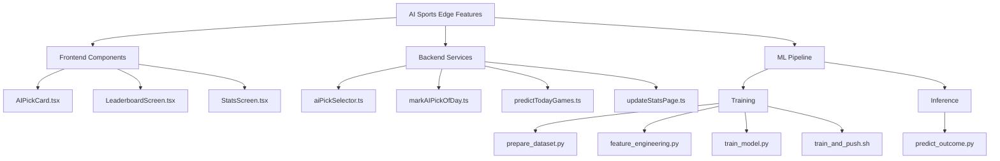

<!-- ROO-NARRATIVE-CONTEXT -->

# Comprehensive AI Sports Edge Implementation Plan

## Overview

This comprehensive plan outlines the implementation of the AI Sports Edge features, including the AI Pick of the Day system, ML training and inference pipeline, and supporting components. The implementation will use modular components, Firebase SDK (v9 modular), and TypeScript throughout.

## Feature Components



## Frontend Components

### 1. AIPickCard.tsx

This component will display:

- Team matchup (teamA vs teamB)
- Confidence indicator (color-coded bar)
- Momentum score
- AI insight text
- Follow button (optional)

```typescript
interface AIPickCardProps {
  gameId: string;
  teamA: string;
  teamB: string;
  confidence: number;
  momentumScore: number;
  aiInsightText: string;
  onFollow?: (gameId: string) => void;
}

// Component will include:
// - Color-coded confidence bar (green >80%, yellow 60-80%, red <60%)
// - Insight text with icon (💡 or 📈)
// - Subtle background styling
// - Follow button with star icon
```

### 2. LeaderboardScreen.tsx

This screen will display:

- Ranking of AI picks by performance
- Win/loss record for the past 7 days
- Confidence average
- Performance by sport

```typescript
interface LeaderboardEntry {
  rank: number;
  gameId: string;
  teamA: string;
  teamB: string;
  confidence: number;
  result: 'win' | 'loss' | 'push' | 'pending';
  sport: string;
  createdAt: Timestamp;
}

// Screen will include:
// - Tabs for different time periods (7 days, 30 days, all time)
// - Filters for sports categories
// - Visual indicators for wins (✅) and losses (❌)
// - Sorting options (by confidence, by result)
```

### 3. StatsScreen.tsx

This screen will display:

- AI win percentage breakdown by confidence tier
- Simple bar chart or stat boxes
- Performance metrics

```typescript
interface ConfidenceTierStats {
  tier: 'high' | 'medium' | 'low';
  range: string; // e.g., "80-100%"
  winPercentage: number;
  totalPicks: number;
  wins: number;
  losses: number;
}

// Screen will include:
// - Stat boxes for each confidence tier (green, yellow, red)
// - Bar chart visualization
// - Time period selector
// - Sport filters
```

## Backend Services

### 1. aiPickSelector.ts

This service will:

- Query today's games from Firestore
- Sort games by confidence score
- Select top picks (with confidence > 65%)
- Mark the top pick as the AI Pick of the Day
- Return formatted data for AIPickCard components

```typescript
interface AIPickData {
  gameId: string;
  teamA: string;
  teamB: string;
  confidence: number;
  momentumScore: number;
  aiInsightText: string;
  isAIPickOfDay?: boolean;
}

// Functions:
// - getTodaysGames(): Promise<Game[]>
// - getTopPicks(games: Game[], limit: number = 3): AIPickData[]
// - markPickOfDay(gameId: string): Promise<void>
```

### 2. markAIPickOfDay.ts (Cloud Function)

This Firebase Cloud Function will:

- Run daily at 9AM ET
- Call the aiPickSelector logic
- Mark top prediction(s) as isAIPickOfDay = true
- Save timestamp to Firestore for logging

```typescript
// Cloud function triggered by Pub/Sub
export const markAIPickOfDay = functions.pubsub
  .schedule('0 9 * * *') // Run at 9 AM ET every day
  .timeZone('America/New_York')
  .onRun(async context => {
    // Implementation will:
    // - Get today's games
    // - Select top picks
    // - Mark as Pick of the Day
    // - Log activity
  });
```

### 3. predictTodayGames.ts (Cloud Function)

This Firebase Cloud Function will:

- Run every day at 10AM
- Fetch today's games from Firestore
- Use prediction API (predict_outcome.py via HTTP trigger or Callable)
- Write prediction + confidence + insight back to Firestore

```typescript
// Cloud function triggered by Pub/Sub
export const predictTodayGames = functions.pubsub
  .schedule('0 10 * * *') // Run at 10 AM every day
  .timeZone('America/New_York')
  .onRun(async context => {
    // Implementation will:
    // - Get today's games
    // - Call prediction API for each game
    // - Update Firestore with predictions
    // - Log activity
  });
```

### 4. updateStatsPage.ts (Cloud Function)

This Firebase Cloud Function will:

- Run daily or weekly
- Calculate win percentages by confidence tier
- Update stats collection in Firestore
- Provide data for StatsScreen

```typescript
// Cloud function triggered by Pub/Sub
export const updateStatsPage = functions.pubsub
  .schedule('0 0 * * 0') // Run at midnight every Sunday
  .timeZone('America/New_York')
  .onRun(async context => {
    // Implementation will:
    // - Query historical predictions
    // - Calculate stats by confidence tier
    // - Update stats collection
    // - Log activity
  });
```

## ML Pipeline

### 1. Training Scripts

#### prepare_dataset.py

This script will:

- Connect to Firestore
- Fetch all completed games
- Extract relevant fields
- Save as CSV or JSON for local model training

```python
def pull_data_from_firestore():
    """Pull game data from Firestore and save as CSV"""
    # Connect to Firestore
    # Query completed games
    # Extract fields: momentumScore, lineMovement, publicBetPct, confidence, result
    # Save to CSV
```

#### feature_engineering.py

This script will:

- Load the raw dataset
- Add derived features
- Export enhanced dataset for training

```python
def engineer_features(df):
    """Add engineered features to the dataset"""
    # Add sharpEdgeSignal
    df['sharpEdgeSignal'] = (df['momentumScore'] > 10) & (df['publicBetPct'] < 40)

    # Add lineMoveImpact
    df['lineMoveImpact'] = df['lineMovement'] * df['confidence']

    # Add publicFadeScore
    df['publicFadeScore'] = df['momentumScore'] - df['publicBetPct']

    # Add aiLineDisagreement
    df['aiLineDisagreement'] = abs(df['aiLine'] - df['bookLine'])

    # Save enhanced dataset
```

#### train_model.py

This script will:

- Load the enhanced dataset
- Train an XGBoost or GradientBoosting model
- Evaluate model performance
- Save the trained model

```python
def train_model():
    """Train XGBoost model on game data"""
    # Load enhanced dataset
    # Prepare features and target
    # Split into training and testing sets
    # Train XGBoost model
    # Evaluate performance
    # Save model as model.pkl
```

#### train_and_push.sh

This bash script will:

- Run all training scripts in sequence
- Save the model
- Deploy the model or trigger inference update

```bash
#!/bin/bash
# Run training pipeline
python ml/training/prepare_dataset.py
python ml/training/feature_engineering.py
python ml/training/train_model.py

# Deploy model
# [Deployment commands]

echo "Training and deployment complete"
```

### 2. Inference Scripts

#### predict_outcome.py

This script will:

- Load the trained model
- Take in live game data
- Return prediction and adjusted confidence

```python
def predict_outcome(features):
    """Predict game outcome and confidence"""
    # Load model
    # Extract features
    # Make prediction
    # Adjust confidence
    # Return prediction and confidence
```

## Implementation Approach

I'll implement these components in the following order:

1. **ML Pipeline**

   - Training scripts
   - Inference scripts
   - Model deployment

2. **Backend Services**

   - aiPickSelector.ts
   - Cloud Functions

3. **Frontend Components**

   - AIPickCard.tsx
   - LeaderboardScreen.tsx
   - StatsScreen.tsx

4. **Integration and Testing**
   - End-to-end testing
   - Performance validation
   - Security review

## Technical Considerations

1. **Modular Architecture**

   - Use Firebase SDK v9 modular imports
   - Create reusable components
   - Implement clean separation of concerns

2. **Performance Optimization**

   - Implement caching for frequently accessed data
   - Use batch operations for Firestore updates
   - Optimize Cloud Function execution

3. **Security**

   - Secure API keys and credentials
   - Implement proper authentication for admin features
   - Validate inputs and sanitize outputs

4. **Monitoring and Logging**
   - Add comprehensive logging
   - Implement error tracking
   - Set up performance monitoring

## Next Steps

1. Switch to Code mode to begin implementation
2. Start with the ML pipeline components
3. Implement the backend services
4. Create the frontend components
5. Test and deploy the complete system
   Last updated: 2025-05-13 20:43:32
