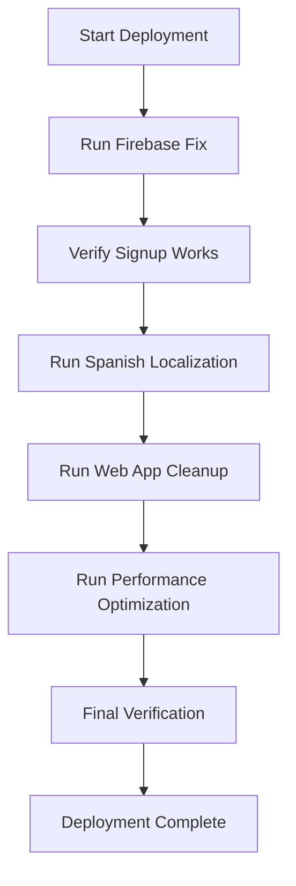

# Comprehensive Deployment Plan for AI Sports Edge

## Overview

This document outlines the comprehensive deployment plan for AI Sports Edge, focusing on:

1. Firebase Authentication Fix
2. Spanish Localization Implementation
3. Web App Architecture Cleanup
4. Performance Optimization

## 1. Firebase Authentication Fix

### Issue

Users are unable to sign up on the AI Sports Edge website due to an invalid Firebase API key error (`auth/api-key-not-valid`).

### Root Cause

- Deployment scripts use `npm run build` instead of `NODE_ENV=production npm run build:prod`
- This causes the application to use the test API key from `.env` instead of the real API key from `.env.production`
- Firebase configuration in static HTML files may be missing required fields

### Solution

1. Update all deployment scripts to use production environment:

   - `deploy.sh`
   - `deploy-api-key-security.sh`
   - `deploy-ai-features.sh`

2. Update Firebase configuration in `dist/login.html` to include `measurementId`

3. Deploy the changes using the `deploy-firebase-fix.sh` script

## 2. Spanish Localization Implementation

### Requirements

- Support for Spanish language throughout the application
- Behavior-driven language settings based on user activity
- Spanish-themed team cards with localized styling
- Odds format switching based on language preference

### Implementation

1. Install localization dependencies:

   - `i18n-js`
   - `expo-localization`

2. Create language files and loader:

   - `/i18n/en.ts`
   - `/i18n/es.ts`
   - `/i18n/i18n.ts`

3. Create language toggle component:

   - `/components/LanguageToggle.tsx`

4. Implement behavior-driven language settings:

   - `/utils/languageDetector.ts`
   - `/utils/defaultPreferences.ts`
   - Update user service to set defaults based on language

5. Create Firebase function for tracking soccer interaction:

   - `/functions/updateLanguageBasedOnBehavior.ts`

6. Implement odds format switching:

   - `/utils/oddsFormatter.ts`
   - `/components/OddsToggle.tsx`

7. Create Spanish-themed team cards:

   - `/components/SpanishTeamCard.tsx`
   - `/data/teams.ts` with Spanish teams data

8. Deploy using the `deploy-spanish-localization.sh` script

## 3. Web App Architecture Cleanup

### Goals

- Identify and remove dead code
- Fix circular dependencies
- Improve error handling
- Standardize code formatting
- Improve documentation

### Implementation

1. Run the detailed app debugger:

   - `debug-app-detailed.js`

2. Run the services debugger:

   - `debug-services.js`

3. Run the Firebase service initialization debugger:

   - `debug-service-init.js`

4. Review and implement recommendations from the debug reports

## 4. Performance Optimization

### Goals

- Improve application loading time
- Reduce Firebase reads/writes
- Implement caching strategies
- Optimize bundle size

### Implementation

1. Implement Firebase caching:

   - Enable Firestore persistence
   - Set appropriate cache size

2. Optimize bundle size:

   - Remove unused dependencies
   - Implement code splitting
   - Use dynamic imports

3. Implement service worker for caching:
   - Cache static assets
   - Cache API responses

## Deployment Process



### Step 1: Deploy Firebase Fix

```bash
./deploy-firebase-fix.sh
```

### Step 2: Verify Signup Works

- Test signup functionality
- Check for Firebase API key errors
- Verify user creation in Firestore

### Step 3: Deploy Spanish Localization

```bash
./deploy-spanish-localization.sh
```

### Step 4: Run Web App Cleanup

- Review debug reports
- Implement recommendations
- Remove dead code
- Fix circular dependencies

### Step 5: Run Performance Optimization

- Implement caching strategies
- Optimize bundle size
- Reduce Firebase reads/writes

### Step 6: Final Verification

- Test all functionality
- Verify performance improvements
- Check for any regressions

## Success Criteria

1. Users can successfully sign up and log in
2. Spanish localization works correctly
3. Application loads faster
4. Firebase costs are reduced
5. Code is cleaner and more maintainable

## Rollback Plan

In case of deployment issues:

1. Revert to previous version:

```bash
git checkout <previous-commit>
./deploy.sh
```

2. Restore Firebase configuration:

```bash
firebase hosting:clone <previous-version> <current-version>
```

3. Notify users of temporary issues

## Monitoring

After deployment, monitor:

1. Firebase Authentication success rates
2. Application performance metrics
3. Error rates
4. User feedback on Spanish localization
   Last updated: 2025-05-13 20:43:32
