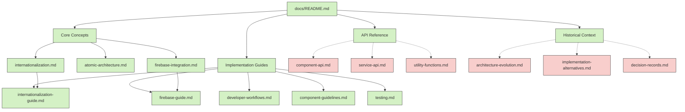

# Documentation Audit and Quality Assessment Plan

## Table of Contents

1. [Introduction](#introduction)
2. [Documentation Inventory and Gap Analysis](#documentation-inventory-and-gap-analysis)
3. [Quality Assessment](#quality-assessment)
4. [Recommendations for Improvement](#recommendations-for-improvement)
5. [Implementation Approach](#implementation-approach)
6. [Deliverables](#deliverables)

## Introduction

This document outlines the comprehensive plan for conducting a documentation audit and quality assessment for AI Sports Edge. The audit focuses on the documentation structure created during the documentation consolidation project, with special attention to identifying missing files, cross-referencing between documents, and technical accuracy.

### Objectives

- Create a complete inventory of existing documentation
- Identify gaps and missing files in the documentation
- Assess the quality, accuracy, and consistency of documentation
- Provide recommendations for improvement
- Outline an implementation approach for addressing identified issues

### Scope

The audit covers the following documentation sections:

- Core Concepts
- Implementation Guides
- API Reference
- Historical Context

## Documentation Inventory and Gap Analysis

### 1.1 Inventory of Existing Documentation

The current documentation structure is:

```
docs/
├── README.md                                  # Main documentation overview
├── core-concepts/                             # Fundamental architectural concepts
│   ├── README.md                              # Core concepts overview
│   ├── atomic-architecture.md                 # Consolidated atomic architecture guide
│   ├── internationalization.md                # Internationalization implementation
│   └── firebase-integration.md                # Firebase services integration
├── implementation-guides/                     # Practical implementation guides
│   ├── README.md                              # Implementation guides overview
│   ├── developer-workflows.md                 # Common development workflows
│   ├── component-guidelines.md                # Guidelines for creating components
│   ├── internationalization-guide.md          # Guide for implementing internationalization
│   ├── firebase-guide.md                      # Guide for using Firebase services
│   └── testing.md                             # Testing strategies and practices
├── api-reference/                             # API documentation
│   └── README.md                              # API reference overview
└── historical-context/                        # Evolution and decision records
    └── README.md                              # Historical context overview
```

The inventory process will:

1. Catalog all existing documentation files
2. Document file metadata (creation date, last modified date, size)
3. Create a summary of each file's content and purpose
4. Identify the primary audience for each document

### 1.2 Missing Files Identification

Based on initial analysis, the following files are referenced but missing:

1. **API Reference Section:**

   - component-api.md (referenced in main README.md)
   - service-api.md (referenced in main README.md)
   - utility-functions.md (referenced in main README.md)

2. **Historical Context Section:**
   - architecture-evolution.md (referenced in main README.md)
   - implementation-alternatives.md (referenced in main README.md)
   - decision-records.md (referenced in main README.md)

The gap analysis will:

1. Identify all referenced but missing files
2. Determine the importance and priority of each missing file
3. Recommend content outlines for missing files
4. Identify potential sources of information for creating missing files

### 1.3 Documentation Relationship Mapping

A comprehensive map of relationships between documentation files will be created, including:

- Direct references (links between documents)
- Conceptual relationships (topics that span multiple documents)
- Implementation relationships (how concepts relate to implementation guides)

The relationship mapping will be visualized using a diagram:



## Quality Assessment

### 2.1 Enhanced Technical Accuracy Assessment

#### 2.1.1 Code-Documentation Alignment Verification

- **Source Code Analysis**: Systematically compare code examples in documentation with actual implementation in the codebase
  - Map documented file paths to actual file paths
  - Verify class/function/method signatures match actual implementations
  - Check that parameter names, types, and default values are accurately documented
  - Confirm return types and values are correctly described

#### 2.1.2 Architecture Verification

- **Architecture Mapping**: Create a visual representation of the actual architecture from the codebase
  - Map atomic components (atoms, molecules, organisms) in the codebase
  - Compare with architectural descriptions in documentation
  - Identify discrepancies in component relationships and hierarchies
  - Verify that architectural principles described are actually implemented

#### 2.1.3 API Implementation Verification

- **API Contract Validation**: Compare API documentation with actual API implementations
  - Verify endpoint URLs, methods, and parameters
  - Check request/response formats and status codes
  - Validate authentication requirements
  - Test actual API behavior against documented behavior

#### 2.1.4 Implementation Guide Validation

- **Procedure Testing**: Test implementation guides by following them step-by-step
  - Execute documented procedures in a test environment
  - Verify that steps produce the expected results
  - Identify missing steps or prerequisites
  - Check for outdated instructions that no longer work with current implementation

#### 2.1.5 Version Alignment Check

- **Version Compatibility**: Verify documentation is aligned with the current version of the codebase
  - Check for references to deprecated features or APIs
  - Identify documentation that refers to future/planned features not yet implemented
  - Ensure version numbers and compatibility information are accurate

#### 2.1.6 Technical Debt Identification

- **Implementation Gaps**: Identify areas where implementation has evolved beyond documentation
  - Find new features or changes not reflected in documentation
  - Identify optimizations or refactorings that have changed the described behavior
  - Note architectural shifts that aren't documented

#### 2.1.7 Firebase Integration Validation

##### Firebase Configuration Verification

- **Configuration Accuracy**: Compare documented Firebase configuration with actual project configuration
  - Verify Firebase project IDs match between documentation and `.firebaserc`/config files
  - Check that documented Firebase services (Auth, Firestore, Storage, etc.) match enabled services
  - Validate environment-specific configurations (dev/staging/production)
  - Ensure API key handling follows documented security practices

##### Firebase Service Implementation Validation

- **Authentication Implementation**: Verify authentication methods described in documentation

  - Check that documented auth providers (email/password, social logins) are actually implemented
  - Validate auth state management implementation against documentation
  - Test user registration, login, and password reset flows against documentation
  - Verify security rules for user access

- **Firestore Implementation**: Validate Firestore database structure and operations

  - Compare documented data models with actual Firestore collections/documents
  - Verify CRUD operations implementation against documentation
  - Check query patterns and indexing against documentation
  - Validate transaction and batch operation implementations
  - Test offline capabilities if documented

- **Storage Implementation**: Verify Firebase Storage implementation

  - Compare documented storage structure with actual implementation
  - Validate file upload/download operations against documentation
  - Check security rules implementation for storage
  - Verify metadata handling if documented

- **Cloud Functions**: Validate serverless functions implementation
  - Map documented Cloud Functions to actual deployed functions
  - Verify function triggers (HTTP, Firestore, Auth) match documentation
  - Test function behavior against documented functionality
  - Check error handling implementation

##### Firebase Security Rules Validation

- **Security Implementation**: Verify security rules match documentation
  - Compare documented Firestore security rules with actual rules in `firestore.rules`
  - Validate Storage security rules against documentation
  - Test rule behavior with different user roles/states
  - Verify authentication and authorization patterns

##### Firebase Integration Architecture

- **Atomic Architecture Integration**: Verify Firebase integration follows documented atomic pattern
  - Check that atoms, molecules, and organisms are implemented as described
  - Validate service initialization and configuration flow
  - Verify error handling and retry mechanisms
  - Test integration with React components

##### Firebase Analytics Implementation Validation

- **Analytics Configuration**: Verify analytics setup matches documentation

  - Check that documented analytics configuration matches actual implementation
  - Verify proper initialization in the application lifecycle
  - Validate integration with other Firebase services as documented
  - Confirm consent management implementation if documented

- **Event Tracking Implementation**: Validate event tracking against documentation

  - Compare documented analytics events with actual implemented events
  - Verify event parameters and properties match documentation
  - Check custom event definitions against implementation
  - Validate that critical user journeys are tracked as documented

- **User Property Tracking**: Verify user property implementation

  - Compare documented user properties with actual implementation
  - Check that user property values are set correctly
  - Validate user identification methods against documentation
  - Verify proper handling of PII according to documentation

- **Conversion Tracking**: Validate conversion tracking implementation

  - Check that documented conversion events are properly implemented
  - Verify e-commerce event tracking if applicable
  - Validate revenue tracking implementation
  - Confirm that conversion goals match documentation

- **Analytics Integration**: Verify integration with other analytics systems

  - Check if documented integrations with third-party analytics are implemented
  - Validate data consistency across analytics platforms
  - Verify export configurations if documented

- **Analytics Debugging**: Validate debugging capabilities
  - Check implementation of analytics debugging tools
  - Verify that debug views match documentation
  - Validate test event functionality

### 2.2 Consistency Assessment

- **Terminology Consistency**: Check for consistent use of terms across documentation

  - Create a glossary of key terms used in the documentation
  - Verify consistent usage of technical terms
  - Identify inconsistencies in naming conventions
  - Check for consistent use of abbreviations and acronyms

- **Formatting Consistency**: Assess formatting consistency across documents

  - Check heading structure and hierarchy
  - Verify consistent use of code blocks, tables, and lists
  - Check for consistent use of emphasis (bold, italic)
  - Verify consistent use of links and references

- **Structural Consistency**: Evaluate document structure consistency

  - Compare section organization across similar documents
  - Check for consistent use of introductions and summaries
  - Verify consistent use of examples and code snippets
  - Check for consistent use of notes, warnings, and tips

- **Voice and Tone Consistency**: Assess consistency in writing style
  - Check for consistent level of formality
  - Verify consistent use of active/passive voice
  - Check for consistent use of first/second/third person
  - Verify consistent use of imperative/indicative mood

### 2.3 Completeness Assessment

- **Conceptual Coverage**: Evaluate completeness of conceptual documentation

  - Identify missing concepts or architectural principles
  - Check for gaps in explanations of key concepts
  - Verify that all architectural components are documented
  - Identify areas where more context or background is needed

- **Implementation Coverage**: Assess completeness of implementation guides

  - Check for missing steps or procedures
  - Verify that all common use cases are documented
  - Identify missing error handling or edge cases
  - Check for missing troubleshooting information

- **API Coverage**: Evaluate completeness of API documentation

  - Verify that all public APIs are documented
  - Check for missing parameters or return values
  - Identify missing error codes or exceptions
  - Verify that all API examples are complete

- **Cross-Reference Completeness**: Check for missing cross-references
  - Identify opportunities for additional cross-references
  - Check for missing links between related documents
  - Verify that all references to external resources are complete
  - Identify missing references to source code

### 2.4 Cross-Reference Verification

- **Link Validation**: Verify all links between documents

  - Check for broken internal links
  - Verify that links point to the correct targets
  - Check for outdated or obsolete links
  - Verify that all links have descriptive text

- **Bidirectional Reference Check**: Ensure appropriate bidirectional references

  - Verify that related documents reference each other
  - Check for one-way references that should be bidirectional
  - Identify missing back-references
  - Verify that reference chains are complete

- **Reference Accuracy**: Validate accuracy of references

  - Check that referenced content exists and is accurate
  - Verify that references to specific sections are correct
  - Check for references to outdated or changed content
  - Verify that references to examples are accurate

- **Reference Opportunity Identification**: Identify opportunities for additional references
  - Find related content that is not currently cross-referenced
  - Identify common concepts that should be linked
  - Check for implicit references that should be explicit
  - Identify opportunities for "See Also" sections

## Recommendations for Improvement

### 3.1 Prioritized Improvement List

Recommendations will be categorized by priority:

1. **Critical** - Issues that significantly impact usability or accuracy

   - Missing essential documentation
   - Incorrect or misleading technical information
   - Broken critical cross-references
   - Outdated security information

2. **Important** - Issues that should be addressed in the near term

   - Inconsistent terminology or structure
   - Incomplete API documentation
   - Missing cross-references
   - Outdated implementation guides

3. **Enhancement** - Opportunities for improvement
   - Additional examples or use cases
   - Improved formatting or organization
   - Additional cross-references
   - Enhanced visual aids or diagrams

### 3.2 Specific Change Recommendations

For each document, specific recommendations will be provided for:

- **Content Additions or Modifications**

  - Specific sections to add or update
  - Technical inaccuracies to correct
  - Examples to add or update
  - Concepts to clarify or expand

- **Structural Changes**

  - Reorganization of sections
  - Heading structure improvements
  - Addition of tables of contents
  - Improved navigation elements

- **Cross-Reference Improvements**

  - Specific cross-references to add
  - Links to update or fix
  - Bidirectional references to establish
  - "See Also" sections to add

- **Formatting Standardization**
  - Code block formatting
  - Table and list formatting
  - Heading hierarchy
  - Link formatting

### 3.3 Standardization Recommendations

Recommendations for standardization will include:

- **Document Structure Standards**

  - Standard sections for each document type
  - Heading hierarchy guidelines
  - Introduction and summary guidelines
  - Example inclusion guidelines

- **Formatting Conventions**

  - Code block formatting standards
  - Table and list formatting standards
  - Link formatting standards
  - Emphasis and highlighting standards

- **Terminology Standards**

  - Glossary of standard terms
  - Abbreviation and acronym standards
  - Naming convention standards
  - Technical term usage guidelines

- **Cross-Referencing Standards**
  - Link text guidelines
  - Cross-reference placement guidelines
  - Bidirectional reference guidelines
  - External reference guidelines

## Implementation Approach

### 4.1 Documentation Audit Report

The comprehensive audit report will include:

- **Executive Summary**

  - Overview of findings
  - Key recommendations
  - Implementation priorities

- **Detailed Findings**

  - Inventory of existing documentation
  - List of missing files
  - Quality assessment results
  - Cross-reference analysis

- **Recommendations**

  - Prioritized improvement list
  - Specific change recommendations
  - Standardization recommendations
  - Implementation roadmap

- **Appendices**
  - Documentation relationship map
  - Terminology glossary
  - Quality assessment matrices
  - Missing file templates

### 4.2 Phased Implementation Plan

The implementation plan will be divided into phases:

1. **Phase 1: Critical Issues**

   - Address critical technical inaccuracies
   - Create essential missing files
   - Fix broken critical cross-references
   - Update outdated security information

2. **Phase 2: Standardization and Consistency**

   - Implement document structure standards
   - Standardize formatting conventions
   - Establish terminology standards
   - Create cross-referencing standards

3. **Phase 3: Cross-Referencing and Relationships**

   - Implement bidirectional references
   - Add missing cross-references
   - Create "See Also" sections
   - Enhance navigation between documents

4. **Phase 4: Content Enhancement**
   - Add additional examples and use cases
   - Enhance visual aids and diagrams
   - Expand conceptual explanations
   - Add troubleshooting information

### 4.3 Documentation Maintenance Strategy

Recommendations for ongoing documentation maintenance will include:

- **Regular Review Cycles**

  - Quarterly technical accuracy reviews
  - Monthly cross-reference checks
  - Weekly new content reviews
  - Annual comprehensive audits

- **Documentation Update Processes**

  - Documentation change request process
  - Technical review process
  - Editorial review process
  - Publication process

- **Ownership and Responsibilities**

  - Documentation ownership matrix
  - Review responsibilities
  - Approval authorities
  - Escalation paths

- **Quality Standards and Checks**
  - Technical accuracy standards
  - Formatting and style standards
  - Cross-reference standards
  - Completeness standards

## Deliverables

The final deliverables will include:

1. **Documentation Audit Report**

   - Comprehensive findings and recommendations
   - Prioritized improvement list
   - Implementation roadmap

2. **Missing File Templates**

   - Content outlines for missing files
   - Suggested structure and sections
   - Recommended cross-references
   - Potential information sources

3. **Documentation Relationship Map**

   - Visual representation of documentation relationships
   - Cross-reference matrix
   - Dependency graph
   - Navigation map

4. **Quality Assessment Matrix**

   - Technical accuracy assessment
   - Consistency assessment
   - Completeness assessment
   - Cross-reference assessment

5. **Prioritized Improvement Plan**
   - Phased implementation plan
   - Resource requirements
   - Timeline and milestones
   - Success criteria
