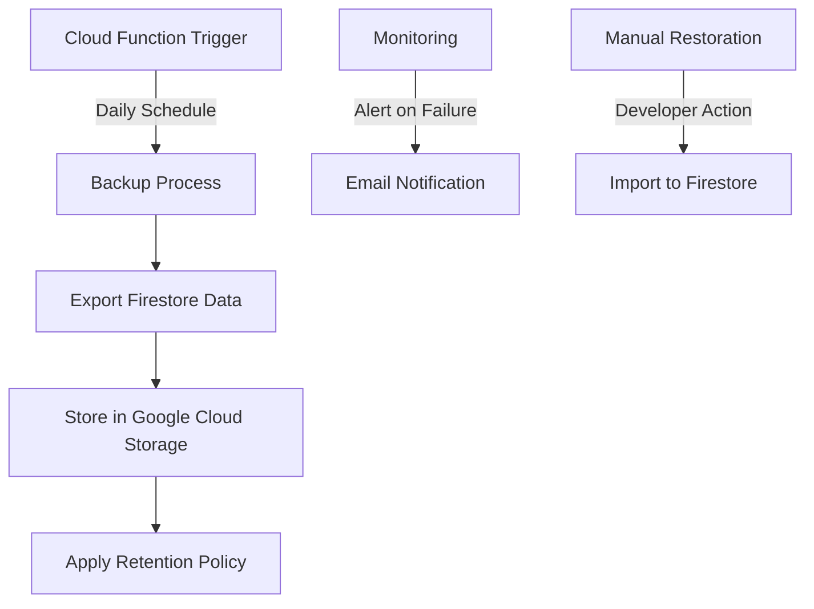

# Firebase Firestore Backup Implementation Plan

## Overview

This document outlines the implementation plan for a daily backup procedure for the Firebase Firestore database used in AI Sports Edge. The backups will be stored in a new dedicated Google Cloud Storage bucket with a 30-day retention period, following the atomic architecture pattern established in the project.

## Requirements

- Daily backups of the entire Firestore database
- Storage in a dedicated Google Cloud Storage bucket
- 30-day retention period
- Implementation as a Firebase Cloud Function
- Email notifications to devops@aisportsedge.com for backup failures
- Standard GCP security practices with restricted IAM access

## Architecture



## Implementation Components

Following our atomic architecture pattern:

### Atoms

1. **`firebaseBackupConfig.js`**: Configuration settings for the backup process

   - Backup frequency
   - Storage bucket name
   - Retention period
   - Notification settings

2. **`firebaseBackupUtils.js`**: Utility functions for backup operations
   - Date formatting
   - Path generation
   - Error handling

### Molecules

1. **`firebaseBackupExport.js`**: Functions to export Firestore data

   - Initiate Firestore export
   - Monitor export progress
   - Handle export completion

2. **`firebaseBackupStorage.js`**: Functions to manage backup storage

   - Upload to Google Cloud Storage
   - Apply retention policy
   - List available backups

3. **`firebaseBackupMonitoring.js`**: Functions to monitor backup process
   - Log backup events
   - Send notifications on failure
   - Track backup statistics

### Organisms

1. **`firebaseBackupService.js`**: Integrated service that combines all backup functionality
   - Schedule backups
   - Execute backup process
   - Manage backup lifecycle

## Implementation Steps

### 1. Setup Google Cloud Storage Bucket

1. Create a new dedicated Google Cloud Storage bucket named `ai-sports-edge-firestore-backups`
2. Configure appropriate IAM access controls:
   - Grant admin access to the Firebase service account
   - Grant read access to developer accounts
3. Set up lifecycle rules for the 30-day retention period
4. Enable versioning for additional protection

### 2. Create Firebase Cloud Function

1. Create a new Cloud Function in the `functions` directory
2. Configure the function to run on a daily schedule (3 AM UTC)
3. Implement the Firestore export operation using the Firebase Admin SDK
4. Store the export in the dedicated Google Cloud Storage bucket
5. Apply retention policy to remove backups older than 30 days

### 3. Implement Backup Configuration

Create the `atomic/atoms/firebaseBackupConfig.js` file with the following settings:

```javascript
/**
 * Firebase Backup Configuration
 *
 * This file contains configuration settings for the Firebase Firestore backup process.
 */

export const backupConfig = {
  // Backup schedule
  schedule: {
    frequency: 'daily',
    timeOfDay: '03:00', // 3 AM UTC
  },

  // Storage settings
  storage: {
    bucketName: 'ai-sports-edge-firestore-backups',
    pathPrefix: 'daily-backups',
  },

  // Retention settings
  retention: {
    days: 30,
    enforceAutomatically: true,
  },

  // Notification settings
  notifications: {
    onFailure: true,
    onSuccess: false,
    recipients: ['devops@aisportsedge.com'],
  },
};

export default backupConfig;
```

### 4. Implement Backup Utilities

Create the `atomic/atoms/firebaseBackupUtils.js` file with utility functions:

```javascript
/**
 * Firebase Backup Utilities
 *
 * This file contains utility functions for the Firebase Firestore backup process.
 */

/**
 * Generates a backup path based on the current date
 * @param {Date} date - The date to use for the path (defaults to current date)
 * @returns {string} The generated backup path
 */
export const generateBackupPath = (date = new Date()) => {
  const year = date.getUTCFullYear();
  const month = String(date.getUTCMonth() + 1).padStart(2, '0');
  const day = String(date.getUTCDate()).padStart(2, '0');
  return `${year}/${month}/${day}/firestore-backup-${year}${month}${day}`;
};

/**
 * Formats a date for use in backup filenames and logs
 * @param {Date} date - The date to format (defaults to current date)
 * @returns {string} The formatted date string (YYYY-MM-DD)
 */
export const formatBackupDate = (date = new Date()) => {
  return date.toISOString().split('T')[0];
};

/**
 * Calculates the expiration date for a backup based on retention period
 * @param {Date} date - The backup date (defaults to current date)
 * @param {number} retentionDays - The number of days to retain the backup
 * @returns {Date} The calculated expiration date
 */
export const calculateExpirationDate = (date = new Date(), retentionDays = 30) => {
  const expirationDate = new Date(date);
  expirationDate.setDate(expirationDate.getDate() + retentionDays);
  return expirationDate;
};

/**
 * Formats an error for logging and notification
 * @param {Error} error - The error to format
 * @returns {Object} The formatted error object
 */
export const formatError = error => {
  return {
    message: error.message,
    stack: error.stack,
    timestamp: new Date().toISOString(),
  };
};

export default {
  generateBackupPath,
  formatBackupDate,
  calculateExpirationDate,
  formatError,
};
```

### 5. Implement Backup Export Functions

Create the `atomic/molecules/firebaseBackupExport.js` file:

```javascript
/**
 * Firebase Backup Export
 *
 * This file contains functions for exporting Firestore data for backup purposes.
 */

import { initializeApp, getApp } from 'firebase-admin/app';
import { getFirestore } from 'firebase-admin/firestore';
import { getStorage } from 'firebase-admin/storage';
import { backupConfig } from '../atoms/firebaseBackupConfig';
import { generateBackupPath, formatError } from '../atoms/firebaseBackupUtils';

// Initialize Firebase Admin if not already initialized
let app;
try {
  app = getApp();
} catch (e) {
  app = initializeApp();
}

const firestore = getFirestore(app);
const storage = getStorage(app);

/**
 * Exports Firestore data to Google Cloud Storage
 * @returns {Promise<Object>} The result of the export operation
 */
export const exportFirestoreData = async () => {
  try {
    const backupPath = generateBackupPath();
    const bucket = storage.bucket(backupConfig.storage.bucketName);

    // Create a Firestore export
    const [operation] = await firestore.client.databaseAdminClient.exportDocuments({
      name: firestore.client.databaseAdminClient.databasePath,
      outputUriPrefix: `gs://${backupConfig.storage.bucketName}/${backupConfig.storage.pathPrefix}/${backupPath}`,
      collectionIds: [], // Empty array means all collections
    });

    // Wait for the export operation to complete
    await operation.promise();

    return {
      success: true,
      path: `${backupConfig.storage.pathPrefix}/${backupPath}`,
      timestamp: new Date().toISOString(),
    };
  } catch (error) {
    console.error('Firestore export failed:', error);
    return {
      success: false,
      error: formatError(error),
      timestamp: new Date().toISOString(),
    };
  }
};

export default {
  exportFirestoreData,
};
```

### 6. Implement Backup Storage Functions

Create the `atomic/molecules/firebaseBackupStorage.js` file:

```javascript
/**
 * Firebase Backup Storage
 *
 * This file contains functions for managing backup storage in Google Cloud Storage.
 */

import { initializeApp, getApp } from 'firebase-admin/app';
import { getStorage } from 'firebase-admin/storage';
import { backupConfig } from '../atoms/firebaseBackupConfig';
import { calculateExpirationDate, formatError } from '../atoms/firebaseBackupUtils';

// Initialize Firebase Admin if not already initialized
let app;
try {
  app = getApp();
} catch (e) {
  app = initializeApp();
}

const storage = getStorage(app);

/**
 * Applies the retention policy to remove expired backups
 * @returns {Promise<Object>} The result of the retention policy application
 */
export const applyRetentionPolicy = async () => {
  try {
    const bucket = storage.bucket(backupConfig.storage.bucketName);
    const [files] = await bucket.getFiles({
      prefix: backupConfig.storage.pathPrefix,
    });

    const now = new Date();
    const retentionThreshold = new Date(now);
    retentionThreshold.setDate(retentionThreshold.getDate() - backupConfig.retention.days);

    const expiredFiles = files.filter(file => {
      const fileCreationDate = new Date(file.metadata.timeCreated);
      return fileCreationDate < retentionThreshold;
    });

    for (const file of expiredFiles) {
      await file.delete();
      console.log(`Deleted expired backup file: ${file.name}`);
    }

    return {
      success: true,
      deletedCount: expiredFiles.length,
      timestamp: now.toISOString(),
    };
  } catch (error) {
    console.error('Error applying retention policy:', error);
    return {
      success: false,
      error: formatError(error),
      timestamp: new Date().toISOString(),
    };
  }
};

/**
 * Lists available backups in the storage bucket
 * @returns {Promise<Object>} The list of available backups
 */
export const listAvailableBackups = async () => {
  try {
    const bucket = storage.bucket(backupConfig.storage.bucketName);
    const [files] = await bucket.getFiles({
      prefix: backupConfig.storage.pathPrefix,
    });

    // Group files by backup date
    const backups = {};
    files.forEach(file => {
      const pathParts = file.name.split('/');
      if (pathParts.length >= 5) {
        const year = pathParts[1];
        const month = pathParts[2];
        const day = pathParts[3];
        const date = `${year}-${month}-${day}`;

        if (!backups[date]) {
          backups[date] = [];
        }

        backups[date].push({
          name: file.name,
          size: parseInt(file.metadata.size, 10),
          created: file.metadata.timeCreated,
        });
      }
    });

    return {
      success: true,
      backups,
      timestamp: new Date().toISOString(),
    };
  } catch (error) {
    console.error('Error listing backups:', error);
    return {
      success: false,
      error: formatError(error),
      timestamp: new Date().toISOString(),
    };
  }
};

export default {
  applyRetentionPolicy,
  listAvailableBackups,
};
```

### 7. Implement Backup Monitoring Functions

Create the `atomic/molecules/firebaseBackupMonitoring.js` file:

```javascript
/**
 * Firebase Backup Monitoring
 *
 * This file contains functions for monitoring the backup process and sending notifications.
 */

import { initializeApp, getApp } from 'firebase-admin/app';
import { getFirestore } from 'firebase-admin/firestore';
import { backupConfig } from '../atoms/firebaseBackupConfig';
import { formatError } from '../atoms/firebaseBackupUtils';
import nodemailer from 'nodemailer';

// Initialize Firebase Admin if not already initialized
let app;
try {
  app = getApp();
} catch (e) {
  app = initializeApp();
}

const firestore = getFirestore(app);

/**
 * Logs a backup event to Firestore
 * @param {Object} event - The event to log
 * @returns {Promise<Object>} The result of the logging operation
 */
export const logBackupEvent = async event => {
  try {
    const backupLogRef = firestore.collection('system_logs').doc('backups');
    const backupEventRef = backupLogRef.collection('events').doc();

    await backupEventRef.set({
      ...event,
      timestamp: new Date(),
    });

    return {
      success: true,
      eventId: backupEventRef.id,
    };
  } catch (error) {
    console.error('Error logging backup event:', error);
    return {
      success: false,
      error: formatError(error),
    };
  }
};

/**
 * Sends an email notification
 * @param {string} subject - The email subject
 * @param {string} message - The email message
 * @param {Array<string>} recipients - The email recipients
 * @returns {Promise<Object>} The result of the notification operation
 */
export const sendEmailNotification = async (
  subject,
  message,
  recipients = backupConfig.notifications.recipients
) => {
  try {
    // This is a placeholder for an actual email sending implementation
    // In a real implementation, you would use a service like SendGrid, Mailgun, or SMTP
    console.log(`EMAIL NOTIFICATION: ${subject}`);
    console.log(`Message: ${message}`);
    console.log(`Recipients: ${recipients.join(', ')}`);

    // Log the notification to Firestore
    const notificationRef = firestore.collection('system_logs').doc('notifications');
    const notificationEventRef = notificationRef.collection('events').doc();

    await notificationEventRef.set({
      subject,
      message,
      recipients,
      type: 'email',
      timestamp: new Date(),
    });

    return {
      success: true,
      notificationId: notificationEventRef.id,
    };
  } catch (error) {
    console.error('Error sending notification:', error);
    return {
      success: false,
      error: formatError(error),
    };
  }
};

export default {
  logBackupEvent,
  sendEmailNotification,
};
```

### 8. Implement Integrated Backup Service

Create the `atomic/organisms/firebaseBackupService.js` file:

```javascript
/**
 * Firebase Backup Service
 *
 * This file provides an integrated service for Firebase Firestore backups.
 */

import { exportFirestoreData } from '../molecules/firebaseBackupExport';
import { applyRetentionPolicy, listAvailableBackups } from '../molecules/firebaseBackupStorage';
import { logBackupEvent, sendEmailNotification } from '../molecules/firebaseBackupMonitoring';
import { backupConfig } from '../atoms/firebaseBackupConfig';

/**
 * Executes a complete backup process
 * @returns {Promise<Object>} The result of the backup operation
 */
export const executeBackup = async () => {
  try {
    // Log backup start
    await logBackupEvent({
      type: 'backup_started',
      status: 'in_progress',
    });

    // Export Firestore data
    const exportResult = await exportFirestoreData();

    if (!exportResult.success) {
      // Log backup failure
      await logBackupEvent({
        type: 'backup_failed',
        status: 'failed',
        error: exportResult.error,
      });

      // Send notification if configured
      if (backupConfig.notifications.onFailure) {
        await sendEmailNotification(
          'Firestore Backup Failed',
          `The Firestore backup failed with error: ${exportResult.error.message}`
        );
      }

      return {
        success: false,
        error: exportResult.error,
      };
    }

    // Apply retention policy
    await applyRetentionPolicy();

    // Log backup completion
    await logBackupEvent({
      type: 'backup_completed',
      status: 'success',
      path: exportResult.path,
    });

    // Send notification if configured
    if (backupConfig.notifications.onSuccess) {
      await sendEmailNotification(
        'Firestore Backup Completed',
        `The Firestore backup was completed successfully. Path: ${exportResult.path}`
      );
    }

    return {
      success: true,
      path: exportResult.path,
    };
  } catch (error) {
    console.error('Backup execution failed:', error);

    // Log backup error
    await logBackupEvent({
      type: 'backup_error',
      status: 'error',
      error: error.message,
    });

    // Send notification
    if (backupConfig.notifications.onFailure) {
      await sendEmailNotification(
        'Firestore Backup Error',
        `An unexpected error occurred during the Firestore backup: ${error.message}`
      );
    }

    return {
      success: false,
      error: {
        message: error.message,
        stack: error.stack,
      },
    };
  }
};

/**
 * Gets the current status of the backup system
 * @returns {Promise<Object>} The backup system status
 */
export const getBackupStatus = async () => {
  try {
    const backups = await listAvailableBackups();

    if (!backups.success) {
      return {
        success: false,
        error: backups.error,
      };
    }

    // Get the most recent backup events
    const firestore = require('firebase-admin').firestore();
    const eventsSnapshot = await firestore
      .collection('system_logs')
      .doc('backups')
      .collection('events')
      .orderBy('timestamp', 'desc')
      .limit(10)
      .get();

    const events = [];
    eventsSnapshot.forEach(doc => {
      events.push({
        id: doc.id,
        ...doc.data(),
      });
    });

    return {
      success: true,
      backups: backups.backups,
      recentEvents: events,
    };
  } catch (error) {
    console.error('Error getting backup status:', error);
    return {
      success: false,
      error: {
        message: error.message,
        stack: error.stack,
      },
    };
  }
};

export default {
  executeBackup,
  getBackupStatus,
};
```

### 9. Implement Cloud Function

Create a new Cloud Function in the `functions/src/backups.js` file:

```javascript
/**
 * Firebase Cloud Functions for Firestore Backups
 *
 * This file contains Cloud Functions for scheduling and managing Firestore backups.
 */

const functions = require('firebase-functions');
const admin = require('firebase-admin');

// Initialize Firebase Admin if not already initialized
if (!admin.apps.length) {
  admin.initializeApp();
}

// Import the backup service
const { executeBackup } = require('../../atomic/organisms/firebaseBackupService');

/**
 * Scheduled Cloud Function that runs daily at 3 AM UTC to backup Firestore
 */
exports.scheduledFirestoreBackup = functions.pubsub
  .schedule('0 3 * * *')
  .timeZone('UTC')
  .onRun(async context => {
    console.log('Starting scheduled Firestore backup...');

    try {
      const result = await executeBackup();

      if (result.success) {
        console.log(`Backup completed successfully. Path: ${result.path}`);
        return null;
      } else {
        console.error(`Backup failed: ${result.error.message}`);
        return null;
      }
    } catch (error) {
      console.error('Unexpected error in backup function:', error);
      return null;
    }
  });

/**
 * HTTP Function to manually trigger a Firestore backup
 */
exports.manualFirestoreBackup = functions.https.onCall(async (data, context) => {
  // Check if the user is authenticated and has admin privileges
  if (!context.auth) {
    throw new functions.https.HttpsError(
      'unauthenticated',
      'You must be authenticated to trigger a backup.'
    );
  }

  // In a real implementation, you would check if the user has admin privileges
  // For now, we'll just check if they're authenticated

  console.log(`Manual backup triggered by user: ${context.auth.uid}`);

  try {
    const result = await executeBackup();

    if (result.success) {
      console.log(`Manual backup completed successfully. Path: ${result.path}`);
      return {
        success: true,
        path: result.path,
      };
    } else {
      console.error(`Manual backup failed: ${result.error.message}`);
      return {
        success: false,
        error: result.error,
      };
    }
  } catch (error) {
    console.error('Unexpected error in manual backup function:', error);
    throw new functions.https.HttpsError(
      'internal',
      'An unexpected error occurred during the backup.',
      { message: error.message }
    );
  }
});

/**
 * HTTP Function to get the status of the backup system
 */
exports.getBackupStatus = functions.https.onCall(async (data, context) => {
  // Check if the user is authenticated
  if (!context.auth) {
    throw new functions.https.HttpsError(
      'unauthenticated',
      'You must be authenticated to get backup status.'
    );
  }

  // Import the backup service
  const { getBackupStatus } = require('../../atomic/organisms/firebaseBackupService');

  try {
    const status = await getBackupStatus();
    return status;
  } catch (error) {
    console.error('Error getting backup status:', error);
    throw new functions.https.HttpsError(
      'internal',
      'An error occurred while getting backup status.',
      { message: error.message }
    );
  }
});
```

### 10. Create Restoration Documentation

Create a documentation file for manual restoration at `docs/firestore-backup-restoration-guide.md`:

````markdown
# Firestore Backup Restoration Guide

This guide provides instructions for manually restoring a Firestore database from a backup.

## Prerequisites

- Firebase Admin SDK access
- Google Cloud SDK installed
- Appropriate IAM permissions

## Restoration Steps

1. **List Available Backups**

   Use the Firebase Admin SDK to list available backups:

   ```javascript
   const { listAvailableBackups } = require('../atomic/molecules/firebaseBackupStorage');

   async function listBackups() {
     const result = await listAvailableBackups();
     console.log(JSON.stringify(result.backups, null, 2));
   }

   listBackups();
   ```
````

2. **Select a Backup to Restore**

   Identify the backup date and path you want to restore.

3. **Import Data from Backup**

   Use the Firebase Admin SDK to import the data:

   ```javascript
   const admin = require('firebase-admin');
   admin.initializeApp();

   async function restoreBackup(backupPath) {
     try {
       const firestore = admin.firestore();
       const [operation] = await firestore.client.databaseAdminClient.importDocuments({
         name: firestore.client.databaseAdminClient.databasePath,
         inputUriPrefix: `gs://ai-sports-edge-firestore-backups/${backupPath}`,
       });

       // Wait for the import operation to complete
       await operation.promise();
       console.log('Restoration completed successfully');
     } catch (error) {
       console.error('Restoration failed:', error);
     }
   }

   // Example: Restore from a specific backup
   restoreBackup('daily-backups/2025/05/19/firestore-backup-20250519');
   ```

4. **Verify Restoration**

   After restoration, verify that the data has been properly restored by checking key collections and documents.

## Important Notes

- Restoration will overwrite existing data in the Firestore database
- Consider restoring to a temporary database first for verification
- Ensure that no critical operations are in progress during restoration

````

### 11. Update Project Documentation

Update the Firebase integration documentation to include information about the backup system by adding a new section to `docs/core-concepts/firebase-integration.md`:

```markdown
## Firestore Backup System

The AI Sports Edge application includes an automated backup system for Firestore data. This system performs daily backups and stores them in Google Cloud Storage with a 30-day retention period.

### Backup Schedule

- Backups run daily at 3 AM UTC
- Backups are stored in the `ai-sports-edge-firestore-backups` Google Cloud Storage bucket
- Backups are retained for 30 days

### Monitoring

- Backup events are logged in the `system_logs/backups/events` collection in Firestore
- Email notifications are sent to the development team in case of backup failures

### Restoration

For instructions on restoring from a backup, see the [Firestore Backup Restoration Guide](../docs/firestore-backup-restoration-guide.md).
````

## Testing Plan

1. **Unit Testing**

   - Test utility functions in `firebaseBackupUtils.js`
   - Test monitoring functions in `firebaseBackupMonitoring.js`

2. **Integration Testing**

   - Test the backup export process with a small test database
   - Test the retention policy application
   - Test the notification system

3. **End-to-End Testing**
   - Deploy the Cloud Function to a test environment
   - Verify that backups are created according to the schedule
   - Verify that backups are stored in the correct location
   - Verify that the retention policy is applied correctly

## Deployment Plan

1. **Preparation**

   - Create the Google Cloud Storage bucket for backups
   - Configure appropriate IAM permissions
   - Set up monitoring and alerting

2. **Implementation**

   - Implement the atomic components (atoms, molecules, organisms)
   - Implement the Cloud Function
   - Create the restoration documentation

3. **Testing**

   - Execute the testing plan
   - Fix any issues discovered during testing

4. **Deployment**

   - Deploy the Cloud Function to production
   - Verify that the first backup runs successfully
   - Update the project documentation

5. **Monitoring**
   - Monitor backup execution and success
   - Verify that retention policies are applied correctly

## Security Considerations

1. **Access Control**

   - Restrict access to the backup bucket to only authorized personnel
   - Use IAM roles to control access to backup operations
   - Implement proper authentication for manual backup operations

2. **Data Protection**

   - Enable encryption at rest for the backup bucket
   - Ensure secure transmission of backup data
   - Implement proper error handling to prevent data leakage

3. **Monitoring and Alerting**
   - Log all backup operations for audit purposes
   - Send notifications for backup failures
   - Regularly review backup logs for suspicious activity

## Conclusion

This implementation plan provides a comprehensive approach to implementing a basic database backup procedure for Firebase Firestore. By following this plan, we will create a reliable, secure, and maintainable backup system that ensures the safety of our application data.
