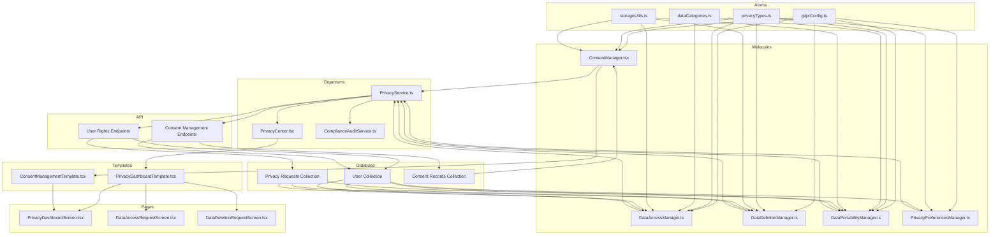
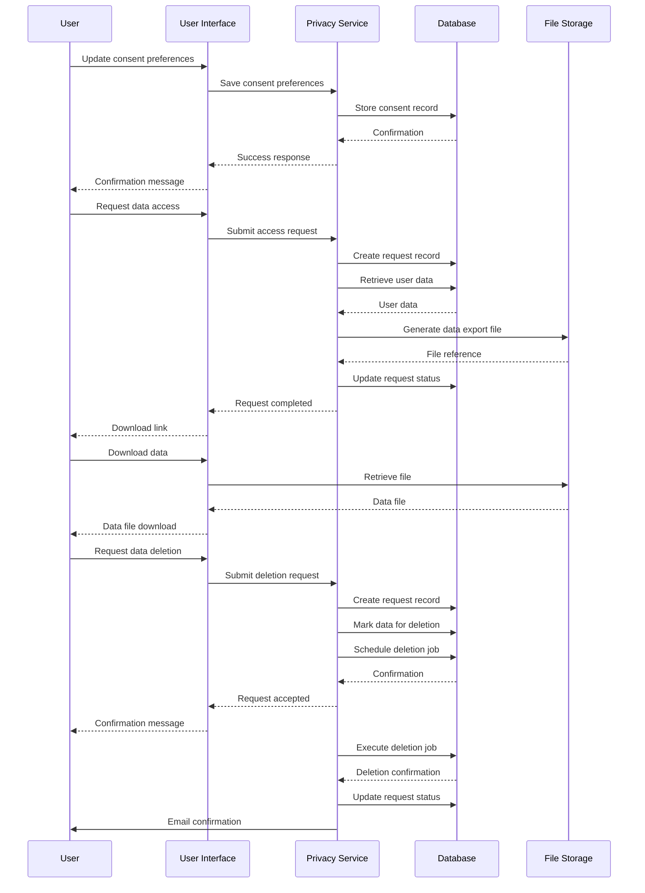

# GDPR/CCPA Compliance Implementation Plan

## Overview

This document outlines the implementation plan for ensuring AI Sports Edge complies with GDPR (General Data Protection Regulation) and CCPA (California Consumer Privacy Act) requirements. These regulations govern how we collect, process, store, and protect user data, as well as the rights users have regarding their personal information.

## Compliance Requirements

### GDPR Requirements

1. **Lawful Basis for Processing**

   - Obtain explicit consent
   - Document legitimate interests
   - Fulfill contractual obligations

2. **User Rights**

   - Right to access personal data
   - Right to rectification
   - Right to erasure ("right to be forgotten")
   - Right to restrict processing
   - Right to data portability
   - Right to object to processing
   - Rights related to automated decision making and profiling

3. **Data Protection Measures**

   - Data protection by design and default
   - Data minimization
   - Purpose limitation
   - Storage limitation
   - Integrity and confidentiality

4. **Documentation and Accountability**
   - Records of processing activities
   - Data protection impact assessments
   - Breach notification procedures

### CCPA Requirements

1. **User Rights**

   - Right to know what personal information is collected
   - Right to know whether personal information is sold or disclosed
   - Right to opt-out of the sale of personal information
   - Right to access personal information
   - Right to equal service and price

2. **Business Obligations**
   - Provide notice at collection
   - Respond to consumer requests
   - Verify consumer requests
   - Maintain records of requests and responses

## Implementation Architecture

We will implement GDPR/CCPA compliance using our atomic architecture pattern:

### Atoms (Basic Building Blocks)

1. **`gdprConfig.ts`**

   - Configuration settings for GDPR/CCPA compliance
   - Feature flags for different compliance features
   - Regional settings for different jurisdictions

2. **`privacyTypes.ts`**

   - TypeScript interfaces for privacy-related data structures
   - Consent record types
   - User rights request types

3. **`dataCategories.ts`**

   - Definitions of different data categories
   - Mapping of data fields to categories
   - Purpose definitions for data collection

4. **`storageUtils.ts`**
   - Utilities for secure data storage
   - Data encryption/decryption helpers
   - Data anonymization utilities

### Molecules (Functional Components)

1. **`ConsentManager.tsx`**

   - Manages user consent for data processing
   - Stores and retrieves consent records
   - Provides interface for updating consent

2. **`DataAccessManager.ts`**

   - Handles data access requests
   - Compiles user data from various sources
   - Formats data for export

3. **`DataDeletionManager.ts`**

   - Manages data deletion requests
   - Implements data removal across systems
   - Maintains deletion records

4. **`DataPortabilityManager.ts`**

   - Handles data portability requests
   - Exports data in machine-readable format
   - Supports data import functionality

5. **`PrivacyPreferencesManager.ts`**
   - Manages user privacy preferences
   - Controls data processing restrictions
   - Handles marketing opt-outs

### Organisms (Complex Components)

1. **`PrivacyCenter.tsx`**

   - User-facing privacy dashboard
   - Interface for exercising privacy rights
   - Privacy preference management UI

2. **`PrivacyService.ts`**

   - Central service for privacy-related operations
   - Coordinates between different privacy managers
   - Handles authentication for privacy requests

3. **`ComplianceAuditService.ts`**
   - Logs privacy-related activities
   - Generates compliance reports
   - Monitors compliance status

### Templates (Page Layouts)

1. **`PrivacyDashboardTemplate.tsx`**

   - Layout for privacy dashboard
   - Sections for different privacy rights
   - Responsive design for all devices

2. **`ConsentManagementTemplate.tsx`**
   - Layout for consent management
   - Granular consent options
   - Clear explanations of data usage

### Pages (Screen Implementations)

1. **`PrivacyDashboardScreen.tsx`**

   - Main privacy dashboard screen
   - Navigation to specific privacy features
   - User-friendly explanations

2. **`DataAccessRequestScreen.tsx`**

   - Interface for requesting data access
   - Status tracking for requests
   - Data preview and download

3. **`DataDeletionRequestScreen.tsx`**
   - Interface for requesting data deletion
   - Confirmation workflow
   - Status tracking for deletion requests

## Database Schema Updates

### User Collection

Add the following fields to the user document:

```typescript
interface UserPrivacyFields {
  // Consent records
  consentRecords: {
    [consentType: string]: {
      given: boolean;
      timestamp: Date;
      method: string; // How consent was collected
      version: string; // Version of privacy policy/terms
    };
  };

  // Privacy preferences
  privacyPreferences: {
    marketingCommunications: boolean;
    dataAnalytics: boolean;
    thirdPartySharing: boolean;
    // Other preferences
  };

  // Data retention settings
  dataRetention: {
    accountDeletionScheduled: boolean;
    scheduledDeletionDate?: Date;
  };
}
```

### Privacy Requests Collection

Create a new collection for tracking privacy-related requests:

```typescript
interface PrivacyRequest {
  id: string;
  userId: string;
  type: 'access' | 'deletion' | 'portability' | 'restriction' | 'objection';
  status: 'pending' | 'processing' | 'completed' | 'denied';
  createdAt: Date;
  updatedAt: Date;
  completedAt?: Date;
  requestData?: any; // Additional request details
  responseData?: any; // Response details
}
```

### Consent Records Collection

Create a new collection for storing detailed consent records:

```typescript
interface ConsentRecord {
  id: string;
  userId: string;
  consentType: string;
  given: boolean;
  timestamp: Date;
  method: string;
  ipAddress?: string;
  userAgent?: string;
  policyVersion: string;
  policyText: string; // The actual text shown to the user
}
```

## API Endpoints

### User Rights Endpoints

1. **Data Access Request**

   - `POST /api/privacy/access-request`
   - `GET /api/privacy/access-request/:requestId`
   - `GET /api/privacy/access-request/:requestId/download`

2. **Data Deletion Request**

   - `POST /api/privacy/deletion-request`
   - `GET /api/privacy/deletion-request/:requestId`

3. **Data Portability Request**

   - `POST /api/privacy/portability-request`
   - `GET /api/privacy/portability-request/:requestId/download`

4. **Processing Restriction Request**
   - `POST /api/privacy/restriction-request`
   - `PUT /api/privacy/restriction-request/:requestId`

### Consent Management Endpoints

1. **Consent Management**

   - `GET /api/privacy/consent`
   - `PUT /api/privacy/consent`
   - `GET /api/privacy/consent/history`

2. **Privacy Preferences**
   - `GET /api/privacy/preferences`
   - `PUT /api/privacy/preferences`

## Implementation Phases

### Phase 1: Core Infrastructure

1. **Data Inventory and Mapping**

   - Identify all personal data collected
   - Document data flows and storage locations
   - Determine legal basis for processing

2. **Database Schema Updates**

   - Update user collection schema
   - Create privacy requests collection
   - Create consent records collection

3. **Basic Atom Components**
   - Implement configuration settings
   - Create type definitions
   - Develop storage utilities

### Phase 2: User Rights Implementation

1. **Data Access Implementation**

   - Develop data access manager
   - Create data export functionality
   - Implement access request workflow

2. **Data Deletion Implementation**

   - Develop data deletion manager
   - Implement deletion workflow
   - Create deletion verification process

3. **Data Portability Implementation**
   - Develop data portability manager
   - Create data export in standard format
   - Implement portability request workflow

### Phase 3: Consent Management

1. **Consent Collection**

   - Implement consent collection UI
   - Develop consent storage system
   - Create consent verification process

2. **Consent Management**

   - Develop consent management UI
   - Implement consent update functionality
   - Create consent history tracking

3. **Privacy Preferences**
   - Implement privacy preferences UI
   - Develop preference enforcement system
   - Create preference update functionality

### Phase 4: User Interface

1. **Privacy Dashboard**

   - Develop privacy dashboard UI
   - Implement navigation between privacy features
   - Create user-friendly explanations

2. **Request Management UI**

   - Implement request submission forms
   - Create request status tracking
   - Develop request response handling

3. **Preference Management UI**
   - Implement preference management forms
   - Create preference visualization
   - Develop preference impact explanations

### Phase 5: Testing and Documentation

1. **Compliance Testing**

   - Test all user rights workflows
   - Verify data accuracy and completeness
   - Validate security measures

2. **Documentation**

   - Create internal documentation
   - Update privacy policy
   - Develop staff training materials

3. **Audit Preparation**
   - Implement logging for compliance activities
   - Create audit reports
   - Prepare demonstration materials

## Implementation Timeline

| Phase                               | Duration | Start Date    | End Date      |
| ----------------------------------- | -------- | ------------- | ------------- |
| Phase 1: Core Infrastructure        | 1 week   | May 21, 2025  | May 28, 2025  |
| Phase 2: User Rights Implementation | 1 week   | May 29, 2025  | June 5, 2025  |
| Phase 3: Consent Management         | 1 week   | June 6, 2025  | June 13, 2025 |
| Phase 4: User Interface             | 1 week   | June 14, 2025 | June 21, 2025 |
| Phase 5: Testing and Documentation  | 1 week   | June 22, 2025 | June 29, 2025 |

## Architecture Diagram



## Data Flow Diagram



## Risk Assessment

| Risk                                    | Impact | Likelihood | Mitigation                                                  |
| --------------------------------------- | ------ | ---------- | ----------------------------------------------------------- |
| Incomplete data inventory               | High   | Medium     | Thorough audit of all data collection points                |
| Inadequate consent records              | High   | Low        | Implement robust consent tracking system                    |
| Failure to respond to requests in time  | Medium | Low        | Automated workflow with alerts for pending requests         |
| Data breach during export               | High   | Low        | Encryption of all exported data and secure delivery methods |
| Incomplete data deletion                | High   | Medium     | Comprehensive deletion verification process                 |
| Non-compliance with regional variations | Medium | Medium     | Region-specific configuration options                       |

## Success Criteria

1. **Compliance Verification**

   - All GDPR/CCPA requirements implemented
   - Documentation complete and up-to-date
   - All user rights workflows tested and verified

2. **User Experience**

   - Privacy controls easily accessible
   - User rights requests simple to submit
   - Clear explanations of privacy practices

3. **Technical Implementation**

   - All components implemented according to atomic architecture
   - Database schema updates completed
   - API endpoints fully functional

4. **Performance**
   - Privacy features do not impact app performance
   - Request processing completes within required timeframes
   - Data exports generated efficiently

## Conclusion

This implementation plan provides a comprehensive approach to achieving GDPR and CCPA compliance for AI Sports Edge. By following the atomic architecture pattern and implementing the components in phases, we can ensure a systematic and thorough implementation of all required compliance features.

The plan addresses all key aspects of data privacy regulations, including user rights, consent management, data protection measures, and documentation requirements. The phased approach allows for incremental implementation and testing, ensuring that each component is properly integrated and validated before moving on to the next phase.
