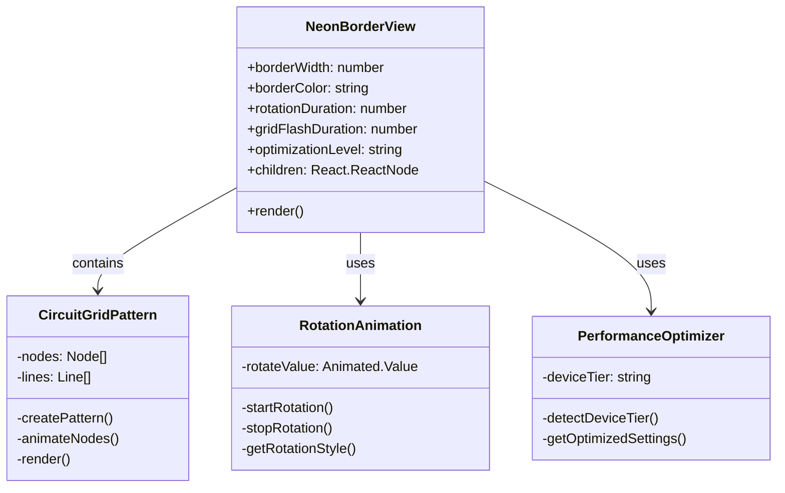
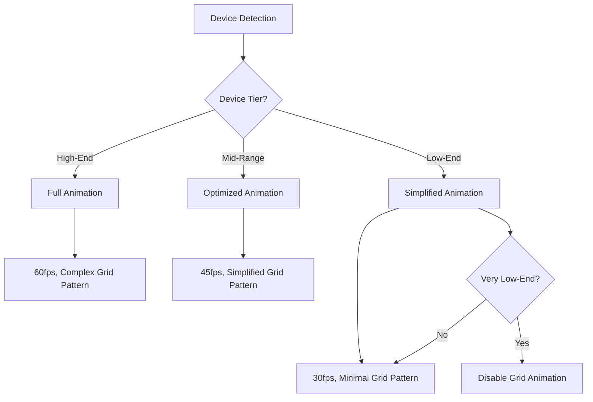
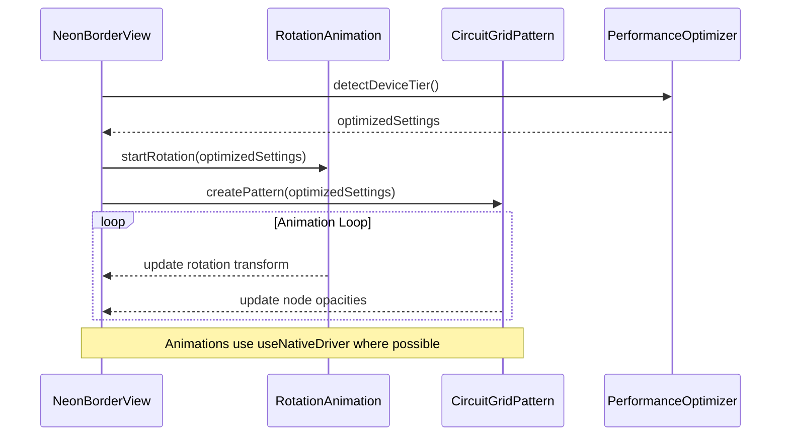

# NeonBorderView Technical Specification

## 1. Introduction

This document provides a detailed technical specification for the `NeonBorderView` component, a new atom component for the AI Sports Edge application. The component will implement an enhanced neon blue border effect with rotation animation and a flashing grid pattern that resembles a simplified circuit board.

### 1.1 Purpose

The `NeonBorderView` component will be used to wrap around the featured guides section on the Knowledge Edge screen, providing a visually appealing and engaging user interface element that aligns with the app's neon aesthetic.

### 1.2 Background

The AI Sports Edge application already includes several neon-themed components:

- `NeonCard` - Uses shadow properties with animated values for the glow effect
- `NeonText` - Uses text shadow for the glow effect
- `NeonContainer` - Provides a container with gradient background
- `NeonButton` - Uses shadow properties with animated values for the glow effect
- `useNeonPulse` - Animation hook for creating a pulsing effect
- `useGlowHoverEffect` - Animation hook for creating a glow effect on hover

The `NeonBorderView` component will build upon these existing patterns while introducing new animation capabilities.

## 2. Component Architecture and File Structure

### 2.1 File Structure

```
/atomic
  /atoms
    /NeonBorderView
      NeonBorderView.tsx       # Main component implementation
      CircuitGridPattern.tsx    # Sub-component for the grid pattern
      RotationAnimation.ts      # Animation utility for rotation
      NeonBorderView.styles.ts  # Styles for the component
      index.ts                  # Export file
```

### 2.2 Component Hierarchy



### 2.3 Integration with Existing Utilities

The component will leverage the following existing utilities:

1. **Animation Utilities**

   - `useNeonPulse` from `utils/animationUtils.ts` for the pulsing effect of the circuit nodes
   - `useGlowHoverEffect` from `utils/animationUtils.ts` for the glow effect of the border

2. **Device Optimization Utilities**
   - `getDeviceType` from `utils/deviceOptimization.ts` to detect device capabilities
   - `getOptimizedGlowIntensity` from `utils/deviceOptimization.ts` to adjust glow intensity based on device performance

## 3. Props Interface

### 3.1 NeonBorderView Props

```typescript
interface NeonBorderViewProps {
  /**
   * Width of the border in pixels
   * @default 2
   */
  borderWidth?: number;

  /**
   * Color of the neon border
   * @default '#00BFFF' (Deep Sky Blue)
   */
  borderColor?: string;

  /**
   * Duration of one complete rotation in milliseconds
   * @default 20000 (20 seconds)
   */
  rotationDuration?: number;

  /**
   * Duration of the grid flash animation cycle in milliseconds
   * @default 3000 (3 seconds)
   */
  gridFlashDuration?: number;

  /**
   * Density of the grid pattern (number of lines)
   * @default 'medium'
   */
  gridDensity?: 'low' | 'medium' | 'high';

  /**
   * Level of performance optimization
   * 'auto': Automatically determine based on device capabilities
   * 'high': Full animations and effects
   * 'medium': Reduced complexity animations
   * 'low': Minimal animations for low-end devices
   * @default 'auto'
   */
  optimizationLevel?: 'auto' | 'high' | 'medium' | 'low';

  /**
   * Whether to respect the user's reduced motion settings
   * @default true
   */
  respectReducedMotion?: boolean;

  /**
   * Additional style for the container
   */
  style?: StyleProp<ViewStyle>;

  /**
   * Content to be wrapped by the neon border
   */
  children: React.ReactNode;
}
```

### 3.2 CircuitGridPattern Props

```typescript
interface CircuitGridPatternProps {
  /**
   * Width of the container
   */
  width: number;

  /**
   * Height of the container
   */
  height: number;

  /**
   * Color of the grid lines and nodes
   */
  color: string;

  /**
   * Density of the grid pattern
   */
  density: 'low' | 'medium' | 'high';

  /**
   * Duration of the flash animation cycle
   */
  flashDuration: number;

  /**
   * Performance optimization level
   */
  optimizationLevel: 'high' | 'medium' | 'low';
}
```

## 4. Implementation Details

### 4.1 NeonBorderView Component

The main component will be responsible for:

1. Wrapping the children with a neon border
2. Applying the rotation animation to the border
3. Rendering the circuit grid pattern
4. Implementing performance optimizations based on device capabilities

```typescript
const NeonBorderView: React.FC<NeonBorderViewProps> = ({
  borderWidth = 2,
  borderColor = '#00BFFF',
  rotationDuration = 20000,
  gridFlashDuration = 3000,
  gridDensity = 'medium',
  optimizationLevel = 'auto',
  respectReducedMotion = true,
  style,
  children,
}) => {
  // Detect device capabilities and determine actual optimization level
  const deviceType = getDeviceType();
  const actualOptimizationLevel =
    optimizationLevel === 'auto' ? determineOptimizationLevel(deviceType) : optimizationLevel;

  // Check if reduced motion is enabled
  const isReducedMotionEnabled = useReducedMotion() && respectReducedMotion;

  // Get rotation animation style
  const { rotationStyle, startRotation, stopRotation } = useRotationAnimation(
    rotationDuration,
    isReducedMotionEnabled
  );

  // Start rotation animation on mount
  useEffect(() => {
    startRotation();
    return () => {
      stopRotation();
    };
  }, [startRotation, stopRotation]);

  // Measure container dimensions for the grid pattern
  const [dimensions, setDimensions] = useState({ width: 0, height: 0 });
  const onLayout = useCallback(event => {
    const { width, height } = event.nativeEvent.layout;
    setDimensions({ width, height });
  }, []);

  return (
    <View style={[styles.container, style]} onLayout={onLayout}>
      {/* Border with rotation animation */}
      <Animated.View style={[styles.border, { borderColor, borderWidth }, rotationStyle]}>
        {/* Circuit grid pattern */}
        {dimensions.width > 0 && dimensions.height > 0 && (
          <CircuitGridPattern
            width={dimensions.width}
            height={dimensions.height}
            color={borderColor}
            density={gridDensity}
            flashDuration={gridFlashDuration}
            optimizationLevel={actualOptimizationLevel}
          />
        )}
      </Animated.View>

      {/* Content */}
      <View style={styles.content}>{children}</View>
    </View>
  );
};
```

### 4.2 Rotation Animation

The rotation animation will be implemented using React Native's Animated API with `useNativeDriver: true` for optimal performance.

```typescript
const useRotationAnimation = (duration: number, isReducedMotionEnabled: boolean) => {
  // Create animated value for rotation
  const rotateValue = useRef(new Animated.Value(0)).current;

  // Create animation loop
  const startRotation = useCallback(() => {
    // If reduced motion is enabled, don't animate
    if (isReducedMotionEnabled) {
      return;
    }

    // Reset rotation value
    rotateValue.setValue(0);

    // Create and start animation
    Animated.loop(
      Animated.timing(rotateValue, {
        toValue: 1,
        duration,
        easing: Easing.linear,
        useNativeDriver: true,
      })
    ).start();
  }, [rotateValue, duration, isReducedMotionEnabled]);

  // Stop animation
  const stopRotation = useCallback(() => {
    rotateValue.stopAnimation();
  }, [rotateValue]);

  // Create rotation style
  const rotationStyle = {
    transform: [
      {
        rotate: rotateValue.interpolate({
          inputRange: [0, 1],
          outputRange: ['0deg', '360deg'],
        }),
      },
    ],
  };

  return { rotationStyle, startRotation, stopRotation };
};
```

### 4.3 Circuit Grid Pattern

The circuit grid pattern will be implemented as a separate component that renders a simplified circuit board with straight lines and occasional nodes that pulse.

```typescript
const CircuitGridPattern: React.FC<CircuitGridPatternProps> = ({
  width,
  height,
  color,
  density,
  flashDuration,
  optimizationLevel,
}) => {
  // Generate grid pattern based on density and optimization level
  const { lines, nodes } = useMemo(() => {
    return generateCircuitPattern(width, height, density, optimizationLevel);
  }, [width, height, density, optimizationLevel]);

  // Create pulsing animation for nodes
  const pulseAnim = useNeonPulse(
    flashDuration,
    0.3, // min opacity
    1.0 // max opacity
  );

  return (
    <View style={styles.gridContainer}>
      {/* Render lines */}
      {lines.map((line, index) => (
        <View
          key={`line-${index}`}
          style={[
            styles.line,
            {
              backgroundColor: color,
              width: line.width,
              height: line.height,
              left: line.x,
              top: line.y,
              opacity: 0.6,
            },
          ]}
        />
      ))}

      {/* Render nodes with pulsing animation */}
      {nodes.map((node, index) => (
        <Animated.View
          key={`node-${index}`}
          style={[
            styles.node,
            {
              backgroundColor: color,
              left: node.x,
              top: node.y,
              opacity: pulseAnim.interpolate({
                inputRange: [0.3, 0.6, 1.0],
                outputRange: [0.3, 0.8, 1.0],
              }),
            },
          ]}
        />
      ))}
    </View>
  );
};
```

### 4.4 Pattern Generation

The circuit pattern will be generated based on the container dimensions, density setting, and optimization level.

```typescript
const generateCircuitPattern = (
  width: number,
  height: number,
  density: 'low' | 'medium' | 'high',
  optimizationLevel: 'high' | 'medium' | 'low'
) => {
  // Determine number of lines and nodes based on density and optimization level
  const lineCount = {
    low: { low: 4, medium: 6, high: 8 },
    medium: { low: 6, medium: 10, high: 14 },
    high: { low: 8, medium: 16, high: 24 },
  }[density][optimizationLevel];

  const nodeCount = {
    low: { low: 3, medium: 5, high: 8 },
    medium: { low: 5, medium: 8, high: 12 },
    high: { low: 8, medium: 12, high: 18 },
  }[density][optimizationLevel];

  // Generate lines
  const lines = [];
  for (let i = 0; i < lineCount; i++) {
    // Generate horizontal or vertical lines with random positions
    // ...
  }

  // Generate nodes
  const nodes = [];
  for (let i = 0; i < nodeCount; i++) {
    // Generate nodes at line intersections or endpoints
    // ...
  }

  return { lines, nodes };
};
```

## 5. Performance Optimization Strategy

### 5.1 Tiered Animation Complexity

The component will implement a tiered approach to animation complexity based on device capabilities:



The device tier detection will use:

- `Platform.OS` to identify the operating system
- `PixelRatio.get()` to determine screen density
- `getDeviceType()` utility to categorize the device based on screen size

### 5.2 Conditional Rendering

For low-end devices, the component will:

- Reduce the number of lines and nodes in the circuit pattern
- Simplify the border effect with minimal glow
- Potentially disable the grid pattern animation completely if necessary

```typescript
const determineOptimizationLevel = (deviceType: DeviceType): 'high' | 'medium' | 'low' => {
  // Check if device is low-end
  const isLowEndDevice = Platform.OS === 'android' && PixelRatio.get() < 2;

  // Check if device is small
  const isSmallDevice = deviceType === DeviceType.PHONE_SMALL;

  if (isLowEndDevice || isSmallDevice) {
    return 'low';
  }

  // Check if device is mid-range
  const isMidRangeDevice = Platform.OS === 'android' && PixelRatio.get() < 3;

  if (isMidRangeDevice) {
    return 'medium';
  }

  // Otherwise, use high optimization level
  return 'high';
};
```

### 5.3 Memory and CPU Optimizations

The component will implement several optimizations to reduce memory and CPU usage:

1. **Use `useNativeDriver: true` for animations**

   - All animations that support native driver will use it to offload animation calculations to the native thread

2. **Proper cleanup in useEffect returns**

   - All animations will be properly stopped and cleaned up when the component unmounts

3. **Use `InteractionManager` to delay non-essential animations**

   - Grid pattern animation will be delayed until after interactions are complete

4. **Implement `requestAnimationFrame` throttling for complex animations**
   - For devices that need it, complex animations will be throttled to maintain performance

```typescript
// Example of InteractionManager usage
useEffect(() => {
  const interactionPromise = InteractionManager.runAfterInteractions(() => {
    // Start non-essential animations after interactions
    startGridAnimation();
  });

  return () => {
    // Clean up
    interactionPromise.cancel();
    stopGridAnimation();
  };
}, []);
```

### 5.4 Render Optimizations

To prevent unnecessary re-renders:

1. **Use `React.memo` with custom comparison**

   - The component will use `React.memo` with a custom comparison function to prevent re-renders when props haven't changed significantly

2. **Cache layout calculations**

   - Layout calculations for the grid pattern will be cached and only recalculated when dimensions change

3. **Use opacity animations instead of color interpolations**

   - For better performance, the component will use opacity animations instead of color interpolations where possible

4. **Avoid creating new function references in render methods**
   - All callback functions will be memoized using `useCallback`

```typescript
// Example of React.memo usage with custom comparison
const CircuitGridPattern = React.memo(
  ({ width, height, color, density, flashDuration, optimizationLevel }) => {
    // Component implementation
    // ...
  },
  (prevProps, nextProps) => {
    // Only re-render if these props change
    return (
      prevProps.width === nextProps.width &&
      prevProps.height === nextProps.height &&
      prevProps.color === nextProps.color &&
      prevProps.density === nextProps.density &&
      prevProps.optimizationLevel === nextProps.optimizationLevel
    );
  }
);
```

### 5.5 Bitmap Caching for Android

For Android devices, the component will implement bitmap caching for the grid pattern to reduce the rendering cost of complex patterns:

```typescript
// Example of bitmap caching for Android
if (Platform.OS === 'android') {
  // Use setRenderEffect or similar APIs for bitmap caching
  if (Platform.Version >= 28) {
    // Android 9 (Pie) or higher
    // Use hardware bitmap caching
    ViewStyle.cacheToHardwareBitmap = true;
  } else {
    // Use software bitmap caching for older versions
    ViewStyle.cacheToSoftwareBitmap = true;
  }
}
```

### 5.6 Testing Protocol

The component will be tested on a matrix of devices to ensure performance meets the requirements:

1. **Device Testing Matrix**

   - Low-end Android devices (Android 7-9 with <2GB RAM)
   - Mid-range Android devices
   - High-end Android devices
   - iOS devices (various generations)

2. **Performance Metrics**

   - Frame rate monitoring during animations (must maintain >30fps on low-end devices)
   - Memory usage monitoring
   - CPU usage monitoring

3. **Automated Testing**
   - Unit tests for the component and its sub-components
   - Integration tests with the Knowledge Edge screen
   - Performance tests to ensure the component meets performance requirements

## 6. Animation Flow

The animation flow for the component is illustrated in the following sequence diagram:



## 7. Integration with Knowledge Edge Screen

### 7.1 Integration Example

The `NeonBorderView` component will be integrated into the Knowledge Edge screen to wrap around the featured guides section:

```tsx
// In KnowledgeEdgeScreen.tsx
import NeonBorderView from '../atomic/atoms/NeonBorderView';

// ...

// Featured Guides
<AccessibleThemedView style={styles.sectionContainer}>
  <AccessibleThemedText style={styles.sectionTitle} type="h3">
    {t('knowledgeEdge.sections.featuredGuides').toUpperCase()}
  </AccessibleThemedText>

  <NeonBorderView borderColor={colors.neon.blue} gridDensity="medium" optimizationLevel="auto">
    {featuredGuides.map(renderFeaturedGuide)}
  </NeonBorderView>
</AccessibleThemedView>;
```

### 7.2 Styling Considerations

When integrating the component, consider the following styling aspects:

1. **Padding and Margins**

   - The `NeonBorderView` component adds its own padding to accommodate the border and grid pattern
   - Adjust the padding of the wrapped content accordingly

2. **Background Color**

   - The component works best against a dark background
   - Ensure the background of the Knowledge Edge screen is dark enough for the neon effect to be visible

3. **Accessibility**
   - The component respects the user's reduced motion preferences
   - Ensure sufficient contrast between the border color and background

## 8. Accessibility Considerations

The component implements several accessibility features:

1. **Reduced Motion Support**

   - Respects the user's reduced motion preferences
   - Disables or simplifies animations when reduced motion is enabled

2. **Performance Optimizations for All Users**

   - Ensures the component performs well on all devices
   - Prevents performance issues that could affect usability

3. **Contrast and Visibility**
   - Uses high-contrast colors for the border and grid pattern
   - Ensures the component is visible against the background

## 9. Conclusion

The `NeonBorderView` component will enhance the visual appeal of the Knowledge Edge screen by adding a neon blue border with rotation animation and a flashing grid pattern. The component is designed to be performant on all devices, with special considerations for low-end devices.

By implementing the performance optimizations outlined in this specification, the component will maintain a minimum of 30fps on low-end devices while providing a visually appealing effect on high-end devices.
