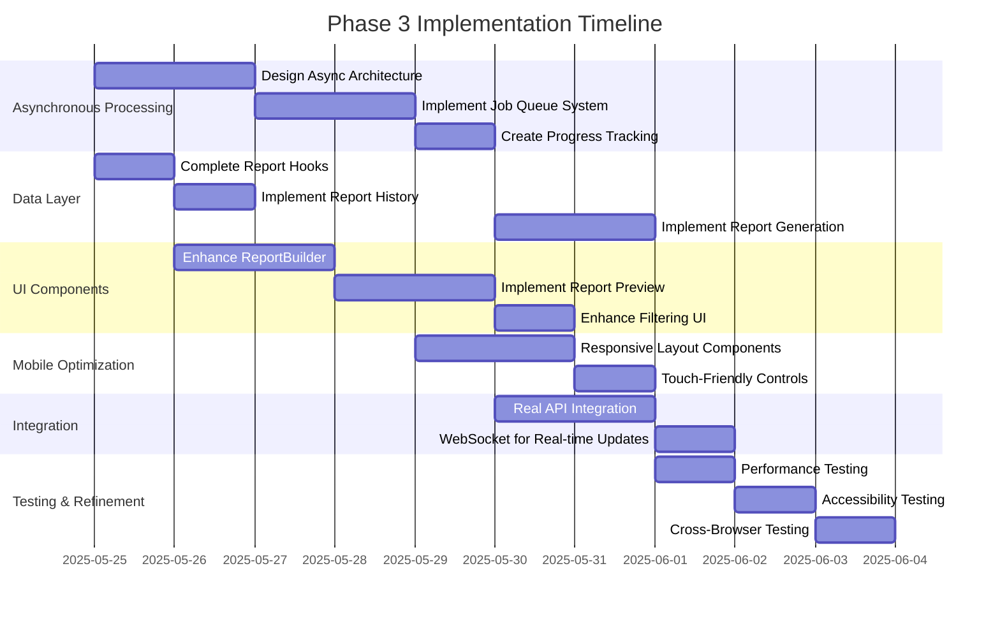

# Phase 3 Implementation Plan: Reporting & Automation

## Executive Summary

Based on a comprehensive analysis of the codebase, Phase 3 of the Unified Admin Dashboard is partially implemented. The core components have been created with basic functionality, but several critical features are still missing. This plan outlines the steps to complete the Phase 3 implementation with a focus on asynchronous report processing to handle large reports efficiently.

## Current Status

### Implemented Components

- Basic UI components for reporting center
- Type definitions for reports and exports
- Mock API service methods
- Export-related hooks
- Integration with AdminDashboard

### Missing Components

- Report template and scheduled report hooks
- Asynchronous report generation functionality
- Report preview capabilities
- Advanced filtering and scheduling
- Mobile optimization
- Real API integration

## Implementation Plan



## Detailed Tasks

### 1. Asynchronous Processing Architecture

#### 1.1 Design Asynchronous Architecture

- Create a job queue system for report generation
- Design a worker process architecture
- Implement a status tracking mechanism
- Design a notification system for completed reports

```typescript
// Job queue interface
interface ReportJob {
  id: string;
  type: 'generate' | 'export';
  status: 'pending' | 'processing' | 'completed' | 'failed';
  progress: number;
  createdAt: string;
  startedAt?: string;
  completedAt?: string;
  params: Record<string, any>;
  result?: any;
  error?: string;
}

// Job queue service
class JobQueueService {
  static async addJob(type: string, params: Record<string, any>): Promise<string> {
    // Add job to queue and return job ID
  }

  static async getJobStatus(id: string): Promise<ReportJob> {
    // Get job status
  }

  static async cancelJob(id: string): Promise<boolean> {
    // Cancel job
  }
}
```

#### 1.2 Implement Job Queue System

- Create a job queue database schema
- Implement job creation, updating, and retrieval
- Create a worker process for processing jobs
- Implement job prioritization

#### 1.3 Create Progress Tracking

- Implement real-time progress updates
- Create a progress notification system
- Add error handling and retry mechanisms

### 2. Data Layer Completion

#### 2.1 Complete Report Hooks

- Implement `useReportTemplates` hook
  ```typescript
  export function useReportTemplates() {
    const [templates, setTemplates] = useState<ReportTemplate[]>([]);
    const [isLoading, setIsLoading] = useState<boolean>(true);
    const [error, setError] = useState<Error | null>(null);

    // Fetch templates, create, update, delete functionality
    // ...
  }
  ```
- Implement `useScheduledReports` hook
  ```typescript
  export function useScheduledReports() {
    const [reports, setReports] = useState<ScheduledReport[]>([]);
    const [isLoading, setIsLoading] = useState<boolean>(true);
    const [error, setError] = useState<Error | null>(null);

    // Fetch reports, create, update, delete, pause, resume functionality
    // ...
  }
  ```
- Implement `useReportJobs` hook for tracking asynchronous jobs
  ```typescript
  export function useReportJobs() {
    const [jobs, setJobs] = useState<ReportJob[]>([]);
    const [isLoading, setIsLoading] = useState<boolean>(true);
    const [error, setError] = useState<Error | null>(null);

    // Fetch jobs, track progress, cancel functionality
    // ...
  }
  ```

#### 2.2 Implement Report History

- Create `ReportHistory` component
- Implement `useReportHistory` hook
- Add download and delete functionality

#### 2.3 Implement Report Generation

- Create asynchronous report generation service
- Implement job submission and tracking
- Add notification system for completed reports
- Implement caching for generated reports

### 3. UI Component Enhancement

#### 3.1 Enhance ReportBuilder

- Improve widget selection UI
- Add drag-and-drop functionality for widget arrangement
- Implement advanced filtering options
- Add scheduling interface
- Add progress tracking UI for asynchronous generation

```typescript
// Enhanced ReportBuilder component
export function ReportBuilder({
  initialTemplate,
  onSave,
  onCancel,
  className = '',
}: ReportBuilderProps) {
  // State management
  const [name, setName] = useState('');
  const [description, setDescription] = useState('');
  const [type, setType] = useState<ReportType>(ReportType.STANDARD);
  const [selectedWidgets, setSelectedWidgets] = useState<string[]>([]);
  const [filters, setFilters] = useState<ReportFilter[]>([]);
  const [schedule, setSchedule] = useState<ReportSchedule | null>(null);

  // Job tracking
  const { submitJob, jobStatus, cancelJob } = useReportJobs();

  // Handle preview generation
  const handlePreview = async () => {
    const jobId = await submitJob('preview', {
      name,
      description,
      type,
      widgets: selectedWidgets,
      filters,
    });

    // Track job progress
    // ...
  };

  // UI rendering
  // ...
}
```

#### 3.2 Implement Report Preview

- Create preview components for different formats (PDF, Excel, CSV)
- Implement asynchronous preview generation
- Add progress tracking for preview generation
- Add print and download options

#### 3.3 Enhance Filtering UI

- Create advanced filter builder
- Add date range selector
- Implement saved filters functionality
- Add filter preview functionality

### 4. Mobile Optimization

#### 4.1 Responsive Layout Components

- Implement `ResponsiveLayout` component
- Create responsive grid system
- Optimize for different screen sizes

```typescript
// Responsive layout component
export function ResponsiveLayout({ breakpoints, children }: ResponsiveLayoutProps) {
  const [screenSize, setScreenSize] = useState<'xs' | 'sm' | 'md' | 'lg' | 'xl'>('md');

  // Screen size detection
  useEffect(() => {
    const handleResize = () => {
      const width = window.innerWidth;
      if (width < breakpoints.sm) setScreenSize('xs');
      else if (width < breakpoints.md) setScreenSize('sm');
      else if (width < breakpoints.lg) setScreenSize('md');
      else if (width < breakpoints.xl) setScreenSize('lg');
      else setScreenSize('xl');
    };

    window.addEventListener('resize', handleResize);
    handleResize();

    return () => window.removeEventListener('resize', handleResize);
  }, [breakpoints]);

  // Render with screen size context
  return <ScreenSizeContext.Provider value={screenSize}>{children}</ScreenSizeContext.Provider>;
}
```

#### 4.2 Touch-Friendly Controls

- Implement `TouchFriendlyControls` component
- Increase touch target sizes
- Add swipe gestures for navigation
- Optimize for touch interactions

### 5. Integration

#### 5.1 Real API Integration

- Replace mock data with real API calls
- Implement error handling
- Add retry mechanisms
- Implement caching

#### 5.2 WebSocket for Real-time Updates

- Set up WebSocket connection
- Implement real-time updates for report status
- Add notification system
- Handle reconnection and error states

```typescript
// WebSocket integration for real-time updates
export function useReportStatusUpdates() {
  const [status, setStatus] = useState<Record<string, ReportJob>>({});

  useEffect(() => {
    const socket = new WebSocket(process.env.NEXT_PUBLIC_WEBSOCKET_URL);

    socket.onopen = () => {
      console.log('WebSocket connected');
      socket.send(JSON.stringify({ type: 'subscribe', channel: 'report-status' }));
    };

    socket.onmessage = event => {
      const data = JSON.parse(event.data);
      if (data.type === 'report-status-update') {
        setStatus(prev => ({
          ...prev,
          [data.jobId]: data.job,
        }));
      }
    };

    socket.onclose = () => {
      console.log('WebSocket disconnected');
      // Implement reconnection logic
    };

    return () => {
      socket.close();
    };
  }, []);

  return status;
}
```

### 6. Technical Considerations

#### 6.1 Performance Optimization

- Implement lazy loading for report components
- Use virtualized lists for large data sets
- Optimize report generation for large data volumes
- Implement caching for generated reports

#### 6.2 Security

- Ensure proper authentication for all report endpoints
- Implement rate limiting
- Add expiration for generated reports
- Implement proper error handling

#### 6.3 Accessibility

- Ensure WCAG 2.1 AA compliance
- Implement keyboard navigation
- Add screen reader support
- Test with assistive technologies

#### 6.4 Cross-Browser Testing

- Test on Chrome, Firefox, Safari, and Edge
- Ensure mobile compatibility
- Test on different screen sizes
- Verify touch interactions

## Implementation Approach

### Asynchronous Processing First

- Start with designing and implementing the asynchronous processing architecture
- Build the job queue system and progress tracking
- Implement the UI components for job tracking and progress visualization

### Component-First Approach

- Complete each component fully before moving to the next
- Ensure each component works with the asynchronous processing system
- Test components thoroughly before integration

### Vertical Slices

- Implement complete features from UI to API
- Focus on end-to-end functionality
- Ensure each slice works with the asynchronous processing system

### Test-Driven Development

- Write tests before implementation
- Focus on testing asynchronous behavior
- Implement comprehensive test coverage

## Dependencies and Priorities

### Critical Path Components

- Asynchronous processing architecture (highest priority)
- Job queue system (highest priority)
- Report generation service (high priority)
- Real-time status updates (high priority)

### Secondary Components

- Report preview (medium priority)
- Mobile optimization (medium priority)
- Advanced filtering (medium priority)

### Nice-to-Have Components

- Custom branding for reports (low priority)
- Advanced scheduling options (low priority)
- Export to additional formats (low priority)

## Risk Assessment

### Technical Risks

- Asynchronous processing complexity
- Performance issues with large reports
- Real-time update reliability
- Cross-browser compatibility

### Mitigation Strategies

- Thorough design and testing of asynchronous architecture
- Performance testing with large datasets
- Fallback mechanisms for real-time updates
- Comprehensive cross-browser testing

## Conclusion

This implementation plan focuses on building a robust asynchronous report processing system to handle large reports efficiently. By prioritizing the asynchronous architecture and job queue system, we ensure that the reporting system can scale to handle complex reports without performance issues. The plan also includes mobile optimization and UI enhancements to provide a seamless user experience across all devices.
