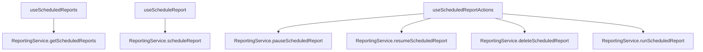
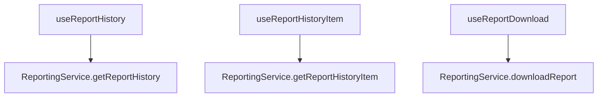
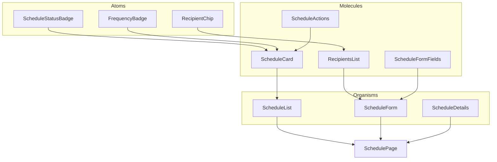
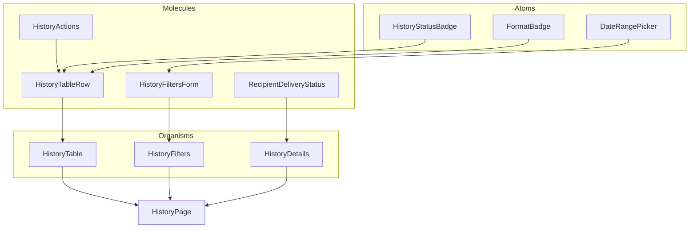

# Implementation Plan: ReportScheduling and ReportHistory Components

## Overview

This plan outlines the implementation of two key features for the admin dashboard reporting system:

1. **Report Scheduling** - Create, manage, and monitor scheduled reports with recurring options
2. **Report History** - View, filter, and download previously generated reports

Both features will follow our established atomic design pattern, ensure WCAG AA compliance, and support responsive layouts down to tablet sizes.

## 1. Service Layer Updates

### 1.1 Update ReportingService

```typescript
// Add to src/services/reportingService.ts

/**
 * Get report history
 * @param filters Optional filters for history
 * @returns Promise with array of report history items
 */
static async getReportHistory(filters?: ReportHistoryFilters): Promise<ReportHistory[]> {
  return this.request('/api/reports/history', {
    method: 'POST',
    body: JSON.stringify({ filters }),
  });
}

/**
 * Get a specific report history item
 * @param id History item ID
 * @returns Promise with report history item
 */
static async getReportHistoryItem(id: string): Promise<ReportHistory> {
  return this.request(`/api/reports/history/${id}`);
}

/**
 * Download a report file
 * @param id History item ID
 * @returns Promise with download URL
 */
static async downloadReport(id: string): Promise<{ url: string }> {
  return this.request(`/api/reports/history/${id}/download`);
}
```

### 1.2 Add Types

```typescript
// Add to src/types/reporting.ts

export interface ReportHistoryFilters {
  startDate?: string;
  endDate?: string;
  templateId?: string;
  status?: 'success' | 'failed';
  reportType?: ReportType;
}

export interface ReportRecipientWithDeliveryStatus extends ReportRecipient {
  deliveryStatus: 'sent' | 'failed' | 'pending';
  deliveredAt?: string;
  errorMessage?: string;
}

// Update ReportHistory interface
export interface ReportHistory {
  id: string;
  scheduledReportId?: string;
  templateId: string;
  templateName: string;
  name: string;
  runAt: string;
  runBy: string;
  status: 'success' | 'failed';
  fileUrl?: string;
  recipients?: ReportRecipientWithDeliveryStatus[];
  error?: string;
  format: ReportFormat;
  reportType: ReportType;
}
```

## 2. React Hooks

### 2.1 Report Scheduling Hooks



### 2.2 Report History Hooks



## 3. Component Structure

### 3.1 Report Scheduling Components



### 3.2 Report History Components



## 4. Detailed Component Implementation

### 4.1 Report Scheduling Components

#### 4.1.1 Atoms

- **ScheduleStatusBadge**: Display status (active, paused, error) with appropriate colors
- **RecipientChip**: Display recipient with email and optional name
- **FrequencyBadge**: Display schedule frequency (daily, weekly, monthly)

#### 4.1.2 Molecules

- **ScheduleCard**: Card displaying schedule summary with status, name, frequency, next run
- **ScheduleActions**: Menu with actions (edit, run now, pause/resume, delete)
- **RecipientsList**: List of recipients with add/remove functionality
- **ScheduleFormFields**: Form fields for schedule configuration (frequency, time, days)

#### 4.1.3 Organisms

- **ScheduleList**: List of schedule cards with filtering and sorting
- **ScheduleForm**: Form for creating/editing schedules
- **ScheduleDetails**: Detailed view of a schedule with recipients and history

### 4.2 Report History Components

#### 4.2.1 Atoms

- **HistoryStatusBadge**: Display status (success, failed) with appropriate colors
- **FormatBadge**: Display report format (PDF, CSV, Excel)
- **DateRangePicker**: Component for selecting date ranges for filtering

#### 4.2.2 Molecules

- **HistoryTableRow**: Table row displaying history item summary
- **HistoryFiltersForm**: Form for filtering history items
- **HistoryActions**: Actions for history items (download, view details)
- **RecipientDeliveryStatus**: Display recipient with delivery status

#### 4.2.3 Organisms

- **HistoryTable**: Table of history items with sorting and pagination
- **HistoryFilters**: Filters panel for history items
- **HistoryDetails**: Detailed view of a history item with error details if applicable

## 5. Implementation Phases

### Phase 1: Foundation (1 day)

1. Update ReportingService with history methods
2. Create React hooks for data fetching and state management
   - `useScheduledReports.ts`
   - `useScheduleReport.ts`
   - `useScheduledReportActions.ts`
   - `useReportHistory.ts`
   - `useReportHistoryItem.ts`
   - `useReportDownload.ts`
3. Implement atom components for both features
4. Write unit tests for atoms

### Phase 2: Report Scheduling (2 days)

1. Implement molecule components for report scheduling
   - `ScheduleCard.tsx`
   - `ScheduleActions.tsx`
   - `RecipientsList.tsx`
   - `ScheduleFormFields.tsx`
2. Implement organism components for report scheduling
   - `ScheduleList.tsx`
   - `ScheduleForm.tsx`
   - `ScheduleDetails.tsx`
3. Create integration tests for scheduling components
4. Implement accessibility features and test with screen readers

### Phase 3: Report History (2 days)

1. Implement molecule components for report history
   - `HistoryTableRow.tsx`
   - `HistoryFiltersForm.tsx`
   - `HistoryActions.tsx`
   - `RecipientDeliveryStatus.tsx`
2. Implement organism components for report history
   - `HistoryTable.tsx`
   - `HistoryFilters.tsx`
   - `HistoryDetails.tsx`
3. Create integration tests for history components
4. Implement accessibility features and test with screen readers

### Phase 4: Integration and Refinement (1 day)

1. Connect components to real API endpoints
2. Implement responsive design adjustments
3. Conduct comprehensive accessibility testing
4. Performance optimization if needed

## 6. Accessibility Considerations

- Ensure all interactive elements have appropriate focus states
- Provide proper ARIA labels and roles
- Ensure sufficient color contrast (WCAG AA)
- Support keyboard navigation throughout all components
- Include screen reader announcements for dynamic content changes
- Test with screen readers (NVDA, VoiceOver)

## 7. Responsive Design Approach

- Desktop-first design with breakpoints for tablet
- Use flexbox and grid for responsive layouts
- Adjust font sizes and spacing at different breakpoints
- Ensure touch targets are appropriately sized for tablet use
- Test on various screen sizes and orientations

## 8. Testing Strategy

### Unit Tests

- Test each atom and molecule component in isolation
- Verify component rendering with different props
- Test state changes and user interactions
- Mock API calls and test error handling

### Integration Tests

- Test organism components with their child components
- Verify data flow between components
- Test form submissions and validation
- Test filtering and sorting functionality

### Accessibility Tests

- Automated testing with jest-axe
- Manual testing with screen readers
- Keyboard navigation testing
- Color contrast verification

## 9. File Structure

```
src/
├── components/
│   └── dashboard/
│       └── reporting/
│           ├── atoms/
│           │   ├── ScheduleStatusBadge.tsx
│           │   ├── RecipientChip.tsx
│           │   ├── FrequencyBadge.tsx
│           │   ├── HistoryStatusBadge.tsx
│           │   ├── FormatBadge.tsx
│           │   └── DateRangePicker.tsx
│           ├── molecules/
│           │   ├── ScheduleCard.tsx
│           │   ├── ScheduleActions.tsx
│           │   ├── RecipientsList.tsx
│           │   ├── ScheduleFormFields.tsx
│           │   ├── HistoryTableRow.tsx
│           │   ├── HistoryFiltersForm.tsx
│           │   ├── HistoryActions.tsx
│           │   └── RecipientDeliveryStatus.tsx
│           └── organisms/
│               ├── ScheduleList.tsx
│               ├── ScheduleForm.tsx
│               ├── ScheduleDetails.tsx
│               ├── HistoryTable.tsx
│               ├── HistoryFilters.tsx
│               └── HistoryDetails.tsx
├── hooks/
│   ├── useScheduledReports.ts
│   ├── useScheduleReport.ts
│   ├── useScheduledReportActions.ts
│   ├── useReportHistory.ts
│   ├── useReportHistoryItem.ts
│   └── useReportDownload.ts
├── services/
│   └── reportingService.ts (updated)
└── types/
    └── reporting.ts (updated)
```

## 10. Key Technical Decisions

1. **State Management**: Use React hooks for local state management and data fetching
2. **Form Handling**: Use Formik for form state management and validation
3. **Date Handling**: Use date-fns for date manipulation and formatting
4. **Styling**: Use Material UI components with custom styling
5. **Testing**: Use Jest and React Testing Library for unit and integration tests
6. **Accessibility**: Use jest-axe for automated accessibility testing

## 11. Potential Challenges and Mitigations

| Challenge                               | Mitigation                                                                  |
| --------------------------------------- | --------------------------------------------------------------------------- |
| Complex recurring schedule UI           | Break down into smaller, focused components with clear validation           |
| Performance with large history lists    | Implement pagination and virtualized lists                                  |
| Accessibility of complex forms          | Use ARIA attributes and test thoroughly with screen readers                 |
| Responsive design for data-heavy tables | Use responsive table patterns, consider different layouts for small screens |
| API error handling                      | Implement consistent error handling with user-friendly messages             |
