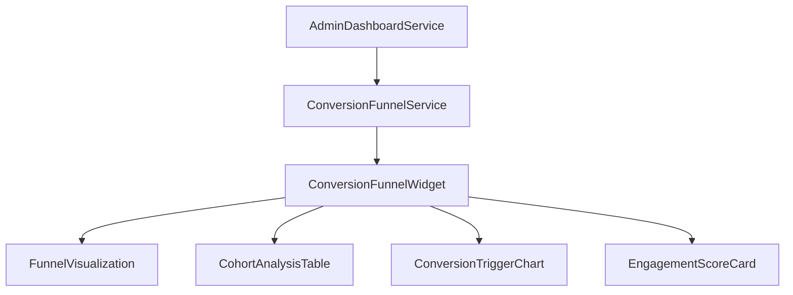

# Unified Admin Dashboard - Phase 2 Implementation Plan

## Overview

Phase 2 of the Unified Admin Dashboard focuses on Conversion & Fraud Intelligence, building upon the foundation established in Phase 1. This phase will implement three key features:

1. **Conversion Funnel Tracking** - A flexible system to track any conversion path
2. **Predictive Fraud Analytics** - Enhanced fraud detection with ML capabilities
3. **Advanced Error Handling** - Improved recovery mechanisms for API failures, authentication errors, and data inconsistency issues

## 1. Conversion Funnel Tracking

### Architecture

The Conversion Funnel Tracking feature will be implemented as a flexible system that can accommodate any conversion path defined in the future. It will include:



### Components

#### ConversionFunnelWidget

The main widget component that integrates all conversion funnel visualizations and metrics.

````typescript
// src/components/dashboard/widgets/ConversionFunnelWidget.tsx
import React from 'react';
import { EnhancedWidget } from './EnhancedWidget';
import { FunnelVisualization } from '../charts/FunnelVisualization';
import { CohortAnalysisTable } from '../tables/CohortAnalysisTable';
import { ConversionTriggerChart } from '../charts/ConversionTriggerChart';
import { EngagementScoreCard } from '../metrics/EngagementScoreCard';
import { useConversionFunnelData } from '../../../hooks/useConversionFunnelData';

export function ConversionFunnelWidget() {
  const { data, isLoading, error, refetch } = useConversionFunnelData();

  return (
    <EnhancedWidget
      title="Conversion Funnel"
      subtitle="Trial to Paid Conversion Analytics"
      size="large"
      isLoading={isLoading}
      error={error}
      onRefresh={refetch}
    >
      <div className="space-y-6">
        {/* Funnel Visualization */}
        <div>
          <h4 className="text-lg font-medium mb-3">Conversion Path</h4>
          <FunnelVisualization data={data?.funnelStages} />
        </div>

        {/* Cohort Analysis */}
        <div>
          <h4 className="text-lg font-medium mb-3">Cohort Analysis</h4>
          <CohortAnalysisTable data={data?.cohorts} />
        </div>

        {/* Conversion Triggers */}
        <div>
          <h4 className="text-lg font-medium mb-3">Conversion Triggers</h4>
          <ConversionTriggerChart data={data?.conversionTriggers} />
        </div>

        {/* Engagement Score */}
        <div>
          <h4 className="text-lg font-medium mb-3">Engagement Score</h4>
          <EngagementScoreCard data={data?.engagementScore} />
        </div>
#### FunnelVisualization

A flexible funnel chart component that can visualize any conversion path.

```typescript
// src/components/dashboard/charts/FunnelVisualization.tsx
import React from 'react';

interface FunnelStage {
  name: string;
  count: number;
  conversionRate: number;
  dropOffRate: number;
}

interface FunnelVisualizationProps {
  data?: FunnelStage[];
}

export function FunnelVisualization({ data = [] }: FunnelVisualizationProps) {
  if (!data.length) {
    return <div className="text-gray-500 dark:text-gray-400">No funnel data available</div>;
  }

  const maxCount = Math.max(...data.map(stage => stage.count));

  return (
    <div className="space-y-2">
      {data.map((stage, index) => {
        const width = `${(stage.count / maxCount) * 100}%`;
        const isLast = index === data.length - 1;

        return (
          <div key={stage.name} className="space-y-1">
            <div className="flex justify-between text-sm">
              <span>{stage.name}</span>
              <span>{stage.count.toLocaleString()} users</span>
            </div>
            <div className="relative h-10">
              <div
                className="absolute top-0 left-0 h-full bg-gradient-to-r from-blue-500 to-purple-500 rounded-md"
                style={{ width }}
              />
              <div className="absolute inset-0 flex items-center justify-center text-white text-sm font-medium">
                {stage.conversionRate}%
              </div>
            </div>
            {!isLast && (
              <div className="flex justify-between text-xs text-gray-500">
                <span>↓ {stage.dropOffRate}% drop off</span>
                <span>{data[index + 1].conversionRate}% continue</span>
              </div>
            )}
          </div>
        );
      })}
    </div>
  );
}
````

#### CohortAnalysisTable

A table component for displaying cohort analysis data.

```typescript
// src/components/dashboard/tables/CohortAnalysisTable.tsx
import React from 'react';

interface Cohort {
  startDate: string;
  size: number;
  conversionRate: number;
  retentionRates: { day: number; rate: number }[];
}

interface CohortAnalysisTableProps {
  data?: Cohort[];
}

export function CohortAnalysisTable({ data = [] }: CohortAnalysisTableProps) {
  if (!data.length) {
    return <div className="text-gray-500 dark:text-gray-400">No cohort data available</div>;
  }

  // Get unique retention days
  const days = [...new Set(data.flatMap(cohort => cohort.retentionRates.map(r => r.day)))].sort(
    (a, b) => a - b
  );

  return (
    <div className="overflow-x-auto">
      <table className="min-w-full divide-y divide-gray-200 dark:divide-gray-700">
        <thead className="bg-gray-50 dark:bg-gray-700">
          <tr>
            <th className="px-6 py-3 text-left text-xs font-medium text-gray-500 dark:text-gray-300 uppercase tracking-wider">
              Cohort
            </th>
            <th className="px-6 py-3 text-left text-xs font-medium text-gray-500 dark:text-gray-300 uppercase tracking-wider">
              Size
            </th>
            {days.map(day => (
              <th
                key={day}
                className="px-6 py-3 text-left text-xs font-medium text-gray-500 dark:text-gray-300 uppercase tracking-wider"
              >
                Day {day}
              </th>
            ))}
            <th className="px-6 py-3 text-left text-xs font-medium text-gray-500 dark:text-gray-300 uppercase tracking-wider">
              Conversion
            </th>
          </tr>
        </thead>
        <tbody className="bg-white dark:bg-gray-800 divide-y divide-gray-200 dark:divide-gray-700">
          {data.map(cohort => (
            <tr key={cohort.startDate}>
              <td className="px-6 py-4 whitespace-nowrap text-sm font-medium text-gray-900 dark:text-white">
                {new Date(cohort.startDate).toLocaleDateString()}
              </td>
              <td className="px-6 py-4 whitespace-nowrap text-sm text-gray-500 dark:text-gray-300">
                {cohort.size.toLocaleString()}
              </td>
              {days.map(day => {
                const retention = cohort.retentionRates.find(r => r.day === day);
                return (
                  <td
                    key={day}
                    className="px-6 py-4 whitespace-nowrap text-sm text-gray-500 dark:text-gray-300"
                  >
                    {retention ? `${retention.rate}%` : '-'}
                  </td>
                );
              })}
              <td className="px-6 py-4 whitespace-nowrap text-sm text-gray-500 dark:text-gray-300">
                {cohort.conversionRate}%
              </td>
            </tr>
          ))}
        </tbody>
      </table>
    </div>
  );
}
```

      </div>
    </EnhancedWidget>

);
}

```

```
