# Unified Admin Dashboard - Phase 4: AI/ML Integration

This document outlines the comprehensive plan for Phase 4 of the Unified Admin Dashboard project, focusing on AI/ML integration for predictive analytics, automated insights, and intelligent recommendations.

## Table of Contents

1. [Overview](#overview)
2. [Firebase Integration Strategy](#firebase-integration-strategy)
3. [Specific ML Models for Implementation](#specific-ml-models-for-implementation)
4. [Architecture Components](#architecture-components)
5. [Implementation Plan](#implementation-plan)
6. [Model Training & Deployment Strategy](#model-training--deployment-strategy)
7. [Cost Optimization & Estimation](#cost-optimization--estimation)
8. [Open-Source Alternatives for Cost Reduction](#open-source-alternatives-for-cost-reduction)
9. [Gradual Migration Strategy](#gradual-migration-strategy)
10. [Technical Considerations](#technical-considerations)
11. [New Components (Atomic Design)](#new-components-atomic-design)
12. [Success Metrics](#success-metrics)

## Overview

Phase 4 will transform the Unified Admin Dashboard from a data visualization and management platform into an intelligent system that provides predictive analytics, automated insights, and intelligent recommendations. This phase will leverage machine learning to analyze patterns, predict future trends, and offer actionable recommendations to administrators.

## Firebase Integration Strategy

We've analyzed the existing Firebase infrastructure and identified the following integration points for Phase 4:

### 1. Firestore Integration

- Extend the existing model registry collection to store ML models for dashboard analytics
- Create new collections for prediction feedback, insights, and recommendations
- Implement real-time listeners for dashboard metrics using existing patterns in firebaseMonitoringService

### 2. Firebase Authentication

- Leverage existing adminAuth.js middleware for dashboard access control
- Extend user roles to include AI-specific permissions (model training, insight management)

### 3. Firebase Functions

- Create new functions for asynchronous ML tasks (model training, batch predictions)
- Implement scheduled functions for automated insights generation
- Add webhook handlers for external ML service integration

## Specific ML Models for Implementation

Based on the existing ML infrastructure, we recommend implementing these specific models:

### 1. Time Series Forecasting Models

- **ARIMA/SARIMA**: For subscription trend forecasting
- **Prophet**: For seasonal pattern detection in user engagement
- **LSTM Neural Networks**: For complex pattern recognition in user behavior

### 2. Classification Models

- **Gradient Boosting**: For churn prediction (XGBoost implementation)
- **Random Forest**: For user segmentation and targeting
- **Logistic Regression**: For conversion funnel optimization

### 3. Anomaly Detection Models

- **Isolation Forest**: For detecting unusual system behavior
- **One-Class SVM**: For identifying outliers in performance metrics
- **Autoencoder Neural Networks**: For complex anomaly detection

### 4. Natural Language Processing

- **BERT-based Models**: For generating natural language insights
- **Sentiment Analysis**: For user feedback classification
- **Topic Modeling**: For categorizing user queries and issues

## Architecture Components

### Key Components

#### 1. AI/ML Service Layer

##### ML Service

- Central service for handling ML-related requests
- API endpoints for predictions, insights, and recommendations
- Authentication and authorization for ML services
- Request validation and error handling

##### Insight Engine

- Automated pattern detection in dashboard data
- Trend identification and correlation analysis
- Contextual insights based on user role and focus
- Natural language generation for insight descriptions

##### Prediction Engine

- Time-series forecasting for key metrics
- Regression and classification models for various predictions
- Confidence intervals and prediction accuracy metrics
- Explainable AI components for prediction transparency

##### Recommendation Engine

- Personalized action recommendations based on user behavior
- Context-aware suggestions for dashboard optimization
- Priority-based recommendation sorting
- Feedback loop for recommendation improvement

##### Anomaly Detection

- Real-time anomaly detection in metrics and user behavior
- Configurable sensitivity and alert thresholds
- Root cause analysis for detected anomalies
- Automated response suggestions for anomalies

#### 2. Data Layer

##### Data Pipeline

- ETL processes for ML-ready data preparation
- Real-time and batch processing capabilities
- Data validation and quality assurance
- Integration with existing data sources

##### Feature Store

- Centralized repository for ML features
- Feature versioning and lineage tracking
- Feature sharing across multiple models
- Real-time feature serving

##### Model Registry

- Version control for ML models
- Model metadata and performance metrics
- A/B testing framework for model comparison
- Model deployment management

##### Training Pipeline

- Automated model training and retraining
- Hyperparameter optimization
- Cross-validation and model evaluation
- Training job scheduling and monitoring

#### 3. Firebase Integration Layer

##### Firestore Service

- Store model metadata and configurations
- Cache prediction results for frequently requested items
- Store user feedback and model performance metrics
- Maintain historical data for training and evaluation

##### Firebase Functions

- Trigger model training and evaluation jobs
- Process data for feature extraction
- Handle webhook callbacks from external ML services
- Schedule periodic tasks for model maintenance

##### Firebase Auth

- Authenticate requests to ML services
- Manage permissions for model training and deployment
- Control access to sensitive ML features
- Track usage for billing and auditing

##### Realtime Listeners

- Update dashboard in real-time with new predictions
- Notify users of important insights
- Trigger UI updates for anomaly alerts
- Sync model status across clients

## Implementation Plan

### Phase 4.1: Foundation (Estimated: 4-5 weeks)

#### 1. Firebase Integration Setup

- Extend Firestore schema for ML models and predictions
- Create Firebase Functions for ML processing
- Implement authentication for ML services
- Set up real-time listeners for dashboard updates

#### 2. Basic Predictive Analytics

- Implement time-series forecasting for key metrics using ARIMA/Prophet
- Create prediction visualization components
- Develop confidence interval displays
- Build basic explanation components

### Phase 4.2: Insights & Recommendations (Estimated: 3-4 weeks)

#### 3. Automated Insight Generation

- Implement pattern detection algorithms using classification models
- Create natural language generation for insights using BERT
- Develop insight notification components
- Build insight management system with Firestore

#### 4. Recommendation Engine

- Implement recommendation algorithms using collaborative filtering
- Create recommendation card components
- Develop feedback mechanisms with Firebase Functions
- Build personalization controls with user preferences

### Phase 4.3: Advanced Features (Estimated: 4-5 weeks)

#### 5. Anomaly Detection

- Implement real-time anomaly detection using Isolation Forest
- Create anomaly alert components
- Develop root cause analysis tools
- Build automated response suggestions

#### 6. Interactive AI Tools

- Implement "what-if" analysis tools
- Create scenario comparison visualizations
- Develop custom prediction interfaces
- Build advanced explanation components

### Phase 4.4: Integration & Optimization (Estimated: 3-4 weeks)

#### 7. Dashboard Integration

- Integrate AI components with existing dashboard
- Implement consistent UI/UX for AI features
- Create AI feature discovery tour
- Build AI feature settings and controls

#### 8. Performance Optimization

- Optimize ML model inference performance
- Implement caching strategies for predictions
- Create fallback mechanisms for ML services
- Develop performance monitoring for ML components

## Model Training & Deployment Strategy

### Firebase Infrastructure Limitations & Solutions

**Limitations:**

1. **Compute Constraints**: Firebase Functions have execution time limits (9 minutes max) and memory constraints (2GB max)
2. **Cold Start Issues**: Functions experience cold starts that can delay processing
3. **Cost Scaling**: Firebase costs can increase significantly with heavy ML workloads
4. **Storage Limitations**: Firestore has document size limits (1MB) that affect model storage

**Solutions:**

#### 1. Hybrid Architecture Approach

#### 2. Model Training Pipeline

- **Preprocessing**: Use Firebase Functions to prepare and validate training data
- **Training Orchestration**: Implement a training coordinator in Google Cloud Functions that:
  - Extracts training data from Firestore in batches
  - Triggers training jobs on Google Cloud AI Platform
  - Monitors training progress and logs metrics
  - Registers completed models in the model registry
- **Feedback Loop**: Implement a continuous feedback collection system in Firestore that:
  - Captures prediction accuracy and user feedback
  - Triggers retraining when accuracy drops below thresholds
  - Maintains version history for A/B testing

#### 3. Model Deployment Strategy

- **Tiered Deployment Approach**:

  - **Tier 1 (Browser)**: Lightweight TensorFlow.js models for real-time, low-latency predictions
  - **Tier 2 (Firebase Functions)**: Medium-complexity models for near-real-time predictions
  - **Tier 3 (Cloud AI Platform)**: Complex models for batch predictions and deep analysis

- **Model Versioning & Rollout**:
  - Implement blue/green deployment for models
  - Use canary releases (5% → 20% → 100%) for new models
  - Maintain fallback models for reliability

### Implementation Details

#### 1. Model Training Workflow

**Key Components:**

1. **Training Coordinator Service**

   - Implemented as a Google Cloud Function with higher resource limits
   - Manages the training pipeline end-to-end
   - Handles data preparation, validation, and transformation
   - Implements retry logic and error handling

2. **Model Registry Service**

   - Stores model metadata in Firestore
   - Tracks model versions, performance metrics, and deployment status
   - Implements model lifecycle management (staging, production, deprecated)
   - Provides API for model discovery and selection

3. **Training Configuration Manager**
   - Allows customization of hyperparameters and training settings
   - Implements templates for different model types
   - Provides validation for training configurations
   - Stores configurations in Firestore for reproducibility

#### 2. Model Deployment Workflow

**Key Components:**

1. **Model Serving Infrastructure**

   - **TensorFlow Serving**: For high-performance model serving
   - **Model API Gateway**: Custom API service that:
     - Handles authentication and rate limiting
     - Routes requests to appropriate model versions
     - Implements request/response logging
     - Provides unified API across model types

2. **Client-Side Optimization**

   - **Model Quantization**: Reduce model size by 75-80% using quantization
   - **Model Pruning**: Remove unnecessary connections to reduce complexity
   - **Knowledge Distillation**: Train smaller "student" models from larger "teacher" models
   - **Progressive Loading**: Load critical model components first, then non-critical parts

3. **Caching Strategy**
   - **Prediction Cache**: Store common prediction results in Firestore/Realtime DB
   - **Feature Cache**: Cache extracted features to avoid recomputation
   - **Model Cache**: Implement intelligent model caching based on usage patterns
   - **CDN Integration**: Serve model files through CDN for faster loading

#### 3. Scaling Considerations

1. **Cost Management**

   - Implement tiered prediction service:
     - Free tier: Limited predictions using simpler models
     - Premium tier: Advanced predictions using complex models
   - Use Cloud Functions for sporadic workloads
   - Use Cloud Run for consistent workloads
   - Implement usage quotas and monitoring

2. **Performance Optimization**

   - Batch prediction requests where possible
   - Implement prediction prioritization (critical vs. non-critical)
   - Use WebGL acceleration for browser-based inference
   - Implement adaptive model selection based on device capabilities

3. **Reliability Measures**
   - Circuit breaker pattern for external ML services
   - Fallback to simpler models when complex ones fail
   - Implement prediction timeout with graceful degradation
   - Maintain model redundancy across regions

## Cost Optimization & Estimation

### Cost Optimization Strategies

#### 1. Compute Resource Optimization

**Strategy: Tiered Computation Model**

**Implementation Details:**

- **Client-Side Processing**:

  - Use TensorFlow.js for simple models (<5MB)
  - Implement aggressive caching (IndexedDB)
  - Reduce model size through quantization (8-bit)
  - Cost Savings: 60-80% reduction in API calls

- **Serverless Processing**:

  - Use Firebase Functions for medium complexity (execution time <2 min)
  - Implement request batching (10-50 requests per invocation)
  - Optimize cold starts with provisioned concurrency
  - Cost Savings: 40-60% reduction in compute costs

- **Dedicated Processing**:
  - Use Cloud Run for predictable workloads
  - Implement auto-scaling with minimum instances = 0
  - Use spot instances for training jobs (60-80% discount)
  - Cost Savings: 30-50% reduction in training costs

#### 2. Storage Optimization

**Strategy: Multi-tier Storage Architecture**

- **Hot Data**: Firestore for active models and recent predictions
- **Warm Data**: Cloud Storage Standard for models in active rotation
- **Cold Data**: Cloud Storage Nearline for backup models and historical data
- **Archive**: Cloud Storage Archive for compliance and audit data

**Implementation Details:**

- Implement TTL-based data lifecycle management
- Use compression for model storage (gzip, 30-50% reduction)
- Implement model pruning to reduce size (20-40% reduction)
- Cost Savings: 40-60% reduction in storage costs

#### 3. Network Optimization

**Strategy: Multi-region Deployment with CDN**

- Deploy models to CDN for global distribution
- Implement regional routing for API requests
- Use WebSocket for real-time updates instead of polling
- Cost Savings: 30-50% reduction in data transfer costs

#### 4. Operational Optimization

**Strategy: Usage-Based Scaling**

- Implement usage quotas per user/feature
- Scale resources based on actual demand patterns
- Implement graceful degradation for peak loads
- Cost Savings: 20-40% reduction in operational costs

### Estimated Cost Ranges

#### Small Scale Implementation (1-5k MAU)

| Component          | Monthly Cost Range | Notes                                       |
| ------------------ | ------------------ | ------------------------------------------- |
| **Firebase**       |                    |                                             |
| - Firestore        | $50-150            | 5-15GB storage, 1-3M reads, 200-500k writes |
| - Functions        | $40-120            | 1-3M invocations, 100-300GB-seconds         |
| - Auth             | $0                 | Under free tier                             |
| **Google Cloud**   |                    |                                             |
| - Cloud Functions  | $30-90             | 500k-1.5M invocations                       |
| - Cloud Storage    | $10-30             | 50-150GB storage                            |
| - Cloud Run        | $20-60             | 100-300 instance hours                      |
| - AI Platform      | $50-150            | 10-30 training hours                        |
| **CDN/Networking** | $20-60             | 100-300GB transfer                          |
| **Total**          | **$220-660/month** |                                             |

**Cost-saving opportunities**:

- Rely more heavily on client-side processing
- Implement aggressive caching
- Use serverless for most workloads
- Estimated savings: 30-40% ($150-400/month)

#### Medium Scale Implementation (5-25k MAU)

| Component          | Monthly Cost Range   | Notes                                     |
| ------------------ | -------------------- | ----------------------------------------- |
| **Firebase**       |                      |                                           |
| - Firestore        | $200-600             | 20-60GB storage, 5-15M reads, 1-3M writes |
| - Functions        | $150-450             | 5-15M invocations, 500-1500GB-seconds     |
| - Auth             | $0-50                | May exceed free tier                      |
| **Google Cloud**   |                      |                                           |
| - Cloud Functions  | $100-300             | 2-6M invocations                          |
| - Cloud Storage    | $40-120              | 200-600GB storage                         |
| - Cloud Run        | $80-240              | 400-1200 instance hours                   |
| - AI Platform      | $200-600             | 40-120 training hours                     |
| **CDN/Networking** | $80-240              | 400-1200GB transfer                       |
| **Total**          | **$850-2,600/month** |                                           |

**Cost-saving opportunities**:

- Implement hybrid client/server processing
- Use dedicated instances for predictable workloads
- Optimize data storage with lifecycle policies
- Estimated savings: 25-35% ($600-1,700/month)

#### Large Scale Implementation (25-100k+ MAU)

| Component          | Monthly Cost Range      | Notes                                        |
| ------------------ | ----------------------- | -------------------------------------------- |
| **Firebase**       |                         |                                              |
| - Firestore        | $800-2,400              | 80-240GB storage, 20-60M reads, 5-15M writes |
| - Functions        | $600-1,800              | 20-60M invocations, 2000-6000GB-seconds      |
| - Auth             | $50-150                 | Above free tier                              |
| **Google Cloud**   |                         |                                              |
| - Cloud Functions  | $400-1,200              | 8-24M invocations                            |
| - Cloud Storage    | $150-450                | 750-2250GB storage                           |
| - Cloud Run        | $300-900                | 1500-4500 instance hours                     |
| - AI Platform      | $800-2,400              | 160-480 training hours                       |
| **CDN/Networking** | $300-900                | 1500-4500GB transfer                         |
| **Total**          | **$3,400-10,200/month** |                                              |

**Cost-saving opportunities**:

- Implement reserved instances for predictable workloads
- Use custom training with preemptible VMs
- Optimize with regional data storage and processing
- Estimated savings: 20-30% ($2,700-7,100/month)

### Cost Comparison: Architectural Approaches

```mermaid
graph LR
    subgraph "Pure Firebase Approach"
        FB[Firebase Only]
        FB_Cost["$$$$ | High Cost"]
        FB_Perf["⚡⚡ | Medium Performance"]
        FB_Scale["📈📈 | Medium Scalability"]
    end

    subgraph "Hybrid Approach (Recommended)"
        HY[Firebase + Google Cloud]
        HY_Cost["$$$ | Medium Cost"]
        HY_Perf["⚡⚡⚡ | High Performance"]
        HY_Scale["📈📈📈 | High Scalability"]
    end

    subgraph "Custom Infrastructure Approach"
        CI[Custom Infrastructure]
        CI_Cost["$$ | Lower Cost"]
        CI_Perf["⚡⚡⚡⚡ | Highest Performance"]
        CI_Scale["📈📈📈📈 | Highest Scalability"]
        CI_Dev["🔧🔧🔧🔧 | Highest Development Effort"]
    end
```

#### Pure Firebase Approach

- **Pros**: Simplicity, integration with existing systems
- **Cons**: Higher costs at scale, performance limitations
- **When to use**: Early stages, small user base, rapid development
- **Cost efficiency**: Low (60-70% more expensive at scale)

#### Hybrid Approach (Recommended)

- **Pros**: Good balance of cost/performance, leverages existing Firebase
- **Cons**: More complex architecture, requires GCP knowledge
- **When to use**: Growing user base, need for advanced ML capabilities
- **Cost efficiency**: Medium (recommended for most cases)

#### Custom Infrastructure Approach

- **Pros**: Highest performance, lowest cost at large scale
- **Cons**: Highest development effort, complex maintenance
- **When to use**: Very large user base, specialized ML requirements
- **Cost efficiency**: High (but requires significant upfront investment)

### ROI Considerations

To justify the AI/ML investment, consider these potential returns:

1. **Increased User Engagement**: 15-25% improvement

   - Value: $X per user × improvement % × user count

2. **Reduced Churn**: 5-15% reduction

   - Value: Customer LTV × churn reduction % × user count

3. **Operational Efficiency**: 20-40% reduction in manual analysis

   - Value: Analyst hourly cost × hours saved

4. **Improved Decision Making**: 10-30% better outcomes
   - Value: Average decision value × improvement %

### Phased Implementation for Cost Control

We recommend a phased approach to control costs:

1. **Phase 1 (Month 1-2)**: Client-side ML only

   - Estimated cost: $100-300/month
   - Focus: TensorFlow.js models, basic insights

2. **Phase 2 (Month 3-4)**: Hybrid client/serverless

   - Estimated cost: $400-800/month
   - Focus: Add Firebase Functions, basic Cloud integration

3. **Phase 3 (Month 5-6)**: Full hybrid architecture
   - Estimated cost: Based on scale from tables above
   - Focus: Complete implementation with all components

This approach allows you to:

- Validate ROI before full investment
- Scale costs with actual usage
- Optimize based on real-world performance data

## Success Metrics

This section defines comprehensive success metrics and completion criteria for Phase 4 of the Unified Admin Dashboard AI/ML integration. These metrics follow SMART principles (Specific, Measurable, Achievable, Relevant, Time-bound) and provide clear thresholds that signify successful completion of each implementation phase and the overall project.

### Phase-Specific Success Metrics

#### Phase 4.1: Foundation (4-5 weeks)

##### Technical Performance Metrics

| Metric                           | Target          | Measurement Method         | Success Criteria                                                        |
| -------------------------------- | --------------- | -------------------------- | ----------------------------------------------------------------------- |
| Firebase Schema Extension        | 100% completion | Schema validation tests    | All required collections and fields for ML models created and validated |
| ML Service API Response Time     | < 500ms (p95)   | API performance monitoring | 95% of requests complete under threshold during load testing            |
| Time-Series Forecasting Accuracy | MAPE < 15%      | Cross-validation testing   | Mean Absolute Percentage Error below threshold on historical data       |
| Prediction Confidence Interval   | 90% accuracy    | Statistical validation     | 90% of actual values fall within predicted confidence intervals         |
| Authentication Success Rate      | > 99.5%         | Authentication logs        | Authentication success rate above threshold in production environment   |

##### Implementation Metrics

| Metric                                | Target          | Measurement Method    | Success Criteria                                                   |
| ------------------------------------- | --------------- | --------------------- | ------------------------------------------------------------------ |
| Firebase Integration Components       | 100% completion | Feature checklist     | All planned Firebase integration components implemented and tested |
| Basic Predictive Analytics Components | 100% completion | Feature checklist     | All planned visualization and analytics components implemented     |
| Unit Test Coverage                    | > 80%           | Test coverage reports | Code coverage percentage above threshold for all new components    |
| Documentation Completeness            | 100% coverage   | Documentation review  | All APIs, data models, and components fully documented             |

#### Phase 4.2: Insights & Recommendations (3-4 weeks)

##### Technical Performance Metrics

| Metric                      | Target      | Measurement Method     | Success Criteria                                                |
| --------------------------- | ----------- | ---------------------- | --------------------------------------------------------------- |
| Pattern Detection Precision | > 85%       | Validation testing     | Precision score above threshold on test dataset                 |
| Pattern Detection Recall    | > 80%       | Validation testing     | Recall score above threshold on test dataset                    |
| NLG Quality Score           | > 4.0/5.0   | Human evaluation       | Average quality rating above threshold from admin panel users   |
| Recommendation Relevance    | > 75%       | User feedback          | Percentage of recommendations rated as relevant above threshold |
| Insight Generation Latency  | < 2 seconds | Performance monitoring | Average time to generate insights below threshold               |

##### Implementation Metrics

| Metric                           | Target          | Measurement Method     | Success Criteria                                                 |
| -------------------------------- | --------------- | ---------------------- | ---------------------------------------------------------------- |
| Automated Insight Components     | 100% completion | Feature checklist      | All planned insight generation components implemented and tested |
| Recommendation Engine Components | 100% completion | Feature checklist      | All planned recommendation components implemented and tested     |
| Feedback Collection Mechanism    | 100% completion | Feature validation     | Feedback collection and processing system fully operational      |
| Integration Test Pass Rate       | > 95%           | Test execution reports | Percentage of passing integration tests above threshold          |

#### Phase 4.3: Advanced Features (4-5 weeks)

##### Technical Performance Metrics

| Metric                         | Target      | Measurement Method     | Success Criteria                                             |
| ------------------------------ | ----------- | ---------------------- | ------------------------------------------------------------ |
| Anomaly Detection Precision    | > 90%       | Validation testing     | Precision score above threshold on test dataset              |
| Anomaly Detection Recall       | > 85%       | Validation testing     | Recall score above threshold on test dataset                 |
| False Positive Rate            | < 5%        | Validation testing     | Percentage of false positives below threshold                |
| Root Cause Analysis Accuracy   | > 70%       | Validation testing     | Percentage of correct root causes identified above threshold |
| What-If Analysis Response Time | < 3 seconds | Performance monitoring | Average response time below threshold                        |

##### Implementation Metrics

| Metric                         | Target          | Measurement Method | Success Criteria                                                |
| ------------------------------ | --------------- | ------------------ | --------------------------------------------------------------- |
| Anomaly Detection Components   | 100% completion | Feature checklist  | All planned anomaly detection components implemented and tested |
| Interactive AI Tool Components | 100% completion | Feature checklist  | All planned interactive analysis tools implemented and tested   |
| Security Compliance            | 100% compliance | Security audit     | All security requirements met for handling sensitive data       |
| Error Handling Coverage        | 100% coverage   | Code review        | All edge cases and failure scenarios properly handled           |

#### Phase 4.4: Integration & Optimization (3-4 weeks)

##### Technical Performance Metrics

| Metric                          | Target        | Measurement Method        | Success Criteria                                                  |
| ------------------------------- | ------------- | ------------------------- | ----------------------------------------------------------------- |
| Dashboard Load Time             | < 2 seconds   | Performance monitoring    | Average initial dashboard load time below threshold               |
| Model Inference Time            | < 300ms (p95) | Performance monitoring    | 95% of model inference requests complete under threshold          |
| System Resource Utilization     | < 70% peak    | Infrastructure monitoring | Peak CPU and memory usage below threshold during load testing     |
| Caching Hit Rate                | > 80%         | Cache monitoring          | Percentage of cache hits above threshold for prediction results   |
| Fallback Mechanism Success Rate | > 99%         | Error monitoring          | Percentage of successful fallbacks during primary system failures |

##### Implementation Metrics

| Metric                 | Target          | Measurement Method   | Success Criteria                                             |
| ---------------------- | --------------- | -------------------- | ------------------------------------------------------------ |
| Dashboard Integration  | 100% completion | Feature checklist    | All AI components fully integrated with existing dashboard   |
| UI/UX Consistency      | 100% compliance | Design review        | All new components follow established design system          |
| AI Feature Discovery   | 100% completion | Feature validation   | AI feature discovery tour implemented and tested             |
| Performance Monitoring | 100% coverage   | Monitoring dashboard | Complete monitoring system for all ML components implemented |

### Overall Business Impact Metrics

| Metric                 | Target         | Measurement Method          | Success Criteria                                                 | Timeframe            |
| ---------------------- | -------------- | --------------------------- | ---------------------------------------------------------------- | -------------------- |
| Admin Time Savings     | > 30%          | Time tracking studies       | Percentage reduction in time spent on analysis tasks             | 3 months post-launch |
| Decision-Making Speed  | > 40% faster   | Process timing measurements | Percentage reduction in time to decision                         | 3 months post-launch |
| Anomaly Detection Time | > 60% faster   | Incident response logs      | Percentage reduction in time to detect system anomalies          | 2 months post-launch |
| Prediction Accuracy    | > 25% improved | Historical analysis         | Percentage improvement in forecast accuracy vs. previous methods | 4 months post-launch |
| User Satisfaction      | > 4.2/5.0      | User surveys                | Average satisfaction score from admin users                      | 3 months post-launch |

### Tracking and Measurement Framework

#### Data Collection Mechanisms

1. **Automated Performance Monitoring**

   - Real-time dashboards for technical metrics
   - Daily aggregation reports for trend analysis
   - Alerting system for metrics falling below thresholds

2. **User Feedback System**

   - In-dashboard feedback collection for recommendations and insights
   - Monthly user surveys for qualitative feedback
   - Feature usage analytics to track adoption rates

3. **Business Impact Assessment**
   - Quarterly ROI analysis comparing pre and post-implementation metrics
   - Monthly efficiency reports measuring time savings and improved outcomes
   - Incident response analysis for anomaly detection effectiveness

#### Reporting Cadence

1. **Weekly Progress Reports**

   - Implementation status against success metrics
   - Technical performance metrics trends
   - Blockers and issues affecting metric attainment

2. **Monthly Business Impact Reports**

   - Quantified business benefits achieved
   - User adoption and satisfaction metrics
   - ROI calculation based on time savings and improved outcomes

3. **Phase Completion Reports**
   - Comprehensive assessment against all phase-specific metrics
   - Lessons learned and optimization opportunities
   - Recommendations for subsequent phases

### Success Determination

Phase 4 will be considered successfully completed when:

1. **All phase-specific technical metrics** meet or exceed their defined thresholds
2. **All implementation deliverables** are 100% complete and tested
3. **At least 80% of business impact metrics** show positive trends toward their targets
4. **User satisfaction scores** meet or exceed the 4.2/5.0 target
5. **Performance monitoring systems** are fully operational with complete coverage

Final success determination will be made through a formal review process involving:

1. Technical assessment by the development team
2. User acceptance testing by administrator stakeholders
3. Business impact validation by management stakeholders
4. Security and compliance verification by the security team

This comprehensive success metrics framework provides clear, measurable criteria to evaluate the completion and effectiveness of Phase 4's AI/ML integration into the Unified Admin Dashboard.
