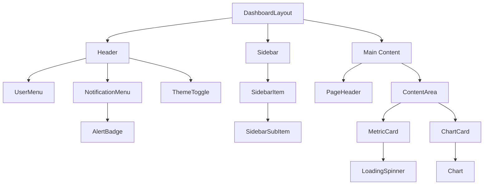
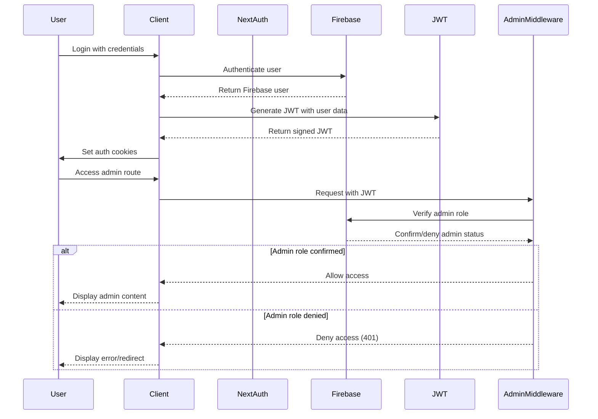

# Unified Admin Dashboard - Phase 1 Technical Specification

## Table of Contents

- [1. Project Setup & Configuration](#1-project-setup--configuration)
  - [1.1 Dependencies](#11-dependencies)
  - [1.2 TypeScript Configuration](#12-typescript-configuration)
  - [1.3 Tailwind Configuration](#13-tailwind-configuration)
  - [1.4 Next.js Configuration](#14-nextjs-configuration)
  - [1.5 Environment Variables](#15-environment-variables)
  - [1.6 Folder Structure](#16-folder-structure)
  - [1.7 Build & Deployment Scripts](#17-build--deployment-scripts)
- [2. Core Layout Components](#2-core-layout-components)
  - [2.1 Component Interfaces](#21-component-interfaces)
  - [2.2 Component Hierarchy](#22-component-hierarchy)
  - [2.3 State Management](#23-state-management)
  - [2.4 Responsive Breakpoints](#24-responsive-breakpoints)
  - [2.5 Accessibility Considerations](#25-accessibility-considerations)
  - [2.6 Example Usage](#26-example-usage)
- [3. Authentication Integration](#3-authentication-integration)
  - [3.1 Authentication Flow](#31-authentication-flow)
  - [3.2 JWT Token Structure](#32-jwt-token-structure)
  - [3.3 Auth Context Implementation](#33-auth-context-implementation)
  - [3.4 Protected Routes](#34-protected-routes)
  - [3.5 Session Management](#35-session-management)
  - [3.6 Integration with Existing Admin Auth](#36-integration-with-existing-admin-auth)
  - [3.7 Error Handling](#37-error-handling)
- [4. API Service Layer](#4-api-service-layer)
  - [4.1 API Service Interfaces](#41-api-service-interfaces)
  - [4.2 Error Handling](#42-error-handling)
  - [4.3 Retry Mechanism](#43-retry-mechanism)
  - [4.4 SWR Configuration](#44-swr-configuration)
  - [4.5 WebSocket Integration](#45-websocket-integration)
  - [4.6 Example Implementation](#46-example-implementation)
  - [4.7 Data Models](#47-data-models)
- [5. Integration Strategy](#5-integration-strategy)
  - [5.1 API Compatibility](#51-api-compatibility)
  - [5.2 Shared Authentication](#52-shared-authentication)
  - [5.3 Data Synchronization](#53-data-synchronization)
  - [5.4 Cross-Platform Navigation](#54-cross-platform-navigation)
  - [5.5 Shared UI Components](#55-shared-ui-components)

## 1. Project Setup & Configuration

### 1.1 Dependencies

```json
{
  "name": "unified-admin-dashboard",
  "version": "0.1.0",
  "private": true,
  "scripts": {
    "dev": "next dev",
    "build": "next build",
    "start": "next start",
    "lint": "next lint",
    "test": "jest",
    "test:watch": "jest --watch",
    "format": "prettier --write .",
    "analyze": "ANALYZE=true next build"
  },
  "dependencies": {
    "@headlessui/react": "^1.7.17",
    "@heroicons/react": "^2.0.18",
    "@tailwindcss/forms": "^0.5.6",
    "axios": "^1.5.0",
    "chart.js": "^4.4.0",
    "date-fns": "^2.30.0",
    "firebase": "^10.4.0",
    "firebase-admin": "^11.10.1",
    "framer-motion": "^10.16.4",
    "jose": "^4.14.6",
    "js-cookie": "^3.0.5",
    "next": "13.5.2",
    "react": "18.2.0",
    "react-chartjs-2": "^5.2.0",
    "react-dom": "18.2.0",
    "react-hook-form": "^7.46.1",
    "react-hot-toast": "^2.4.1",
    "socket.io-client": "^4.7.2",
    "swr": "^2.2.2",
    "tailwindcss": "^3.3.3",
    "zod": "^3.22.2"
  },
  "devDependencies": {
    "@testing-library/jest-dom": "^6.1.3",
    "@testing-library/react": "^14.0.0",
    "@testing-library/user-event": "^14.5.1",
    "@types/jest": "^29.5.5",
    "@types/js-cookie": "^3.0.4",
    "@types/node": "^20.6.3",
    "@types/react": "^18.2.22",
    "@types/react-dom": "^18.2.7",
    "@typescript-eslint/eslint-plugin": "^6.7.2",
    "@typescript-eslint/parser": "^6.7.2",
    "autoprefixer": "^10.4.15",
    "eslint": "^8.49.0",
    "eslint-config-next": "13.5.2",
    "eslint-config-prettier": "^9.0.0",
    "eslint-plugin-jest": "^27.4.0",
    "eslint-plugin-react": "^7.33.2",
    "eslint-plugin-react-hooks": "^4.6.0",
    "jest": "^29.7.0",
    "jest-environment-jsdom": "^29.7.0",
    "postcss": "^8.4.30",
    "prettier": "^3.0.3",
    "prettier-plugin-tailwindcss": "^0.5.4",
    "typescript": "^5.2.2"
  }
}
```

### 1.2 TypeScript Configuration

```json
{
  "compilerOptions": {
    "target": "es2017",
    "lib": ["dom", "dom.iterable", "esnext"],
    "allowJs": true,
    "skipLibCheck": true,
    "strict": true,
    "forceConsistentCasingInFileNames": true,
    "noEmit": true,
    "esModuleInterop": true,
    "module": "esnext",
    "moduleResolution": "node",
    "resolveJsonModule": true,
    "isolatedModules": true,
    "jsx": "preserve",
    "incremental": true,
    "baseUrl": ".",
    "paths": {
      "@/*": ["./src/*"],
      "@/components/*": ["./src/components/*"],
      "@/hooks/*": ["./src/hooks/*"],
      "@/lib/*": ["./src/lib/*"],
      "@/styles/*": ["./src/styles/*"],
      "@/types/*": ["./src/types/*"],
      "@/utils/*": ["./src/utils/*"],
      "@/contexts/*": ["./src/contexts/*"],
      "@/services/*": ["./src/services/*"]
    }
  },
  "include": ["next-env.d.ts", "**/*.ts", "**/*.tsx"],
  "exclude": ["node_modules"]
}
```

### 1.3 Tailwind Configuration

```javascript
// tailwind.config.js
const colors = require('tailwindcss/colors');

module.exports = {
  content: ['./src/pages/**/*.{js,ts,jsx,tsx}', './src/components/**/*.{js,ts,jsx,tsx}'],
  darkMode: 'class',
  theme: {
    extend: {
      colors: {
        // Neon color scheme based on existing app
        primary: {
          DEFAULT: '#00f5ff',
          50: '#e6feff',
          100: '#b3fcff',
          200: '#80faff',
          300: '#4df7ff',
          400: '#1af5ff',
          500: '#00f5ff',
          600: '#00c4cc',
          700: '#009399',
          800: '#006266',
          900: '#003133',
        },
        secondary: {
          DEFAULT: '#ff00ff',
          50: '#fff0ff',
          100: '#ffd1ff',
          200: '#ffb3ff',
          300: '#ff94ff',
          400: '#ff47ff',
          500: '#ff00ff',
          600: '#cc00cc',
          700: '#990099',
          800: '#660066',
          900: '#330033',
        },
        dark: {
          DEFAULT: '#121212',
          50: '#f7f7f7',
          100: '#e3e3e3',
          200: '#c8c8c8',
          300: '#a4a4a4',
          400: '#818181',
          500: '#666666',
          600: '#515151',
          700: '#434343',
          800: '#383838',
          900: '#121212',
        },
        // Additional colors
        success: colors.emerald,
        warning: colors.amber,
        danger: colors.rose,
        info: colors.sky,
      },
      fontFamily: {
        sans: ['Inter', 'sans-serif'],
        mono: ['Roboto Mono', 'monospace'],
      },
      animation: {
        'neon-pulse': 'neon-pulse 2s infinite',
        'glow-pulse': 'glow-pulse 3s infinite',
      },
      keyframes: {
        'neon-pulse': {
          '0%, 100%': {
            textShadow:
              '0 0 7px #fff, 0 0 10px #fff, 0 0 21px #fff, 0 0 42px #00f5ff, 0 0 82px #00f5ff, 0 0 92px #00f5ff, 0 0 102px #00f5ff, 0 0 151px #00f5ff',
          },
          '50%': {
            textShadow:
              '0 0 4px #fff, 0 0 7px #fff, 0 0 13px #fff, 0 0 26px #00f5ff, 0 0 50px #00f5ff, 0 0 60px #00f5ff, 0 0 70px #00f5ff, 0 0 90px #00f5ff',
          },
        },
        'glow-pulse': {
          '0%, 100%': { boxShadow: '0 0 5px #00f5ff, 0 0 10px #00f5ff, 0 0 15px #00f5ff' },
          '50%': { boxShadow: '0 0 10px #00f5ff, 0 0 20px #00f5ff, 0 0 30px #00f5ff' },
        },
      },
      backdropBlur: {
        xs: '2px',
      },
      backgroundImage: {
        'gradient-radial': 'radial-gradient(var(--tw-gradient-stops))',
        'gradient-conic': 'conic-gradient(from 180deg at 50% 50%, var(--tw-gradient-stops))',
        'glass-card':
          'linear-gradient(135deg, rgba(255, 255, 255, 0.1), rgba(255, 255, 255, 0.05))',
      },
    },
  },
  plugins: [require('@tailwindcss/forms')],
};
```

### 1.4 Next.js Configuration

```javascript
// next.config.js
/** @type {import('next').NextConfig} */
const nextConfig = {
  reactStrictMode: true,
  swcMinify: true,
  images: {
    domains: [
      'firebasestorage.googleapis.com',
      'storage.googleapis.com',
      'lh3.googleusercontent.com',
    ],
  },
  async headers() {
    return [
      {
        source: '/(.*)',
        headers: [
          {
            key: 'X-Frame-Options',
            value: 'DENY',
          },
          {
            key: 'X-Content-Type-Options',
            value: 'nosniff',
          },
          {
            key: 'Strict-Transport-Security',
            value: 'max-age=31536000; includeSubDomains',
          },
          {
            key: 'X-XSS-Protection',
            value: '1; mode=block',
          },
          {
            key: 'Referrer-Policy',
            value: 'strict-origin-when-cross-origin',
          },
          {
            key: 'Permissions-Policy',
            value: 'camera=(), microphone=(), geolocation=()',
          },
        ],
      },
    ];
  },
  async redirects() {
    return [
      {
        source: '/admin',
        destination: '/admin/dashboard',
        permanent: true,
      },
    ];
  },
};

module.exports = nextConfig;
```

### 1.5 Environment Variables

Create a `.env.local` file with the following variables:

```
# Firebase Configuration
NEXT_PUBLIC_FIREBASE_API_KEY=
NEXT_PUBLIC_FIREBASE_AUTH_DOMAIN=
NEXT_PUBLIC_FIREBASE_PROJECT_ID=
NEXT_PUBLIC_FIREBASE_STORAGE_BUCKET=
NEXT_PUBLIC_FIREBASE_MESSAGING_SENDER_ID=
NEXT_PUBLIC_FIREBASE_APP_ID=
NEXT_PUBLIC_FIREBASE_MEASUREMENT_ID=

# Firebase Admin (Server-side)
FIREBASE_ADMIN_PROJECT_ID=
FIREBASE_ADMIN_CLIENT_EMAIL=
FIREBASE_ADMIN_PRIVATE_KEY=

# API Configuration
NEXT_PUBLIC_API_URL=
NEXT_PUBLIC_WEBSOCKET_URL=

# Authentication
JWT_SECRET=
JWT_EXPIRES_IN=7d
COOKIE_SECRET=

# Feature Flags
NEXT_PUBLIC_ENABLE_ANALYTICS_DASHBOARD=true
NEXT_PUBLIC_ENABLE_FRAUD_DETECTION=true
NEXT_PUBLIC_ENABLE_SUBSCRIPTION_ANALYTICS=true

# Performance Monitoring
NEXT_PUBLIC_PERFORMANCE_MONITORING_ENABLED=true

# Deployment
NEXT_PUBLIC_VERCEL_URL=
NEXT_PUBLIC_VERCEL_ENV=
```

Create a `.env.example` file with the same variables but without values for documentation purposes.

### 1.6 Folder Structure

```
unified-admin-dashboard/
├── .github/                    # GitHub Actions workflows
├── .husky/                     # Git hooks
├── public/                     # Static assets
│   ├── favicon.ico
│   ├── logo.svg
│   └── ...
├── src/
│   ├── components/             # UI components
│   │   ├── atoms/              # Atomic design - basic components
│   │   ├── molecules/          # Atomic design - composite components
│   │   ├── organisms/          # Atomic design - complex components
│   │   ├── templates/          # Atomic design - page templates
│   │   └── ui/                 # Shared UI components
│   ├── contexts/               # React contexts
│   │   ├── AuthContext.tsx
│   │   ├── ThemeContext.tsx
│   │   └── ...
│   ├── hooks/                  # Custom React hooks
│   │   ├── useAuth.ts
│   │   ├── useDarkMode.ts
│   │   └── ...
│   ├── lib/                    # Library code
│   │   ├── firebase/           # Firebase integration
│   │   ├── api/                # API utilities
│   │   └── ...
│   ├── pages/                  # Next.js pages
│   │   ├── _app.tsx
│   │   ├── _document.tsx
│   │   ├── index.tsx
│   │   ├── login.tsx
│   │   ├── admin/              # Admin routes
│   │   │   ├── dashboard.tsx
│   │   │   ├── analytics.tsx
│   │   │   ├── fraud-detection.tsx
│   │   │   ├── subscriptions.tsx
│   │   │   └── ...
│   │   └── api/                # API routes
│   │       ├── auth/
│   │       ├── admin/
│   │       └── ...
│   ├── services/               # Service layer
│   │   ├── api.ts
│   │   ├── auth.ts
│   │   ├── analytics.ts
│   │   └── ...
│   ├── styles/                 # Global styles
│   │   ├── globals.css
│   │   └── ...
│   ├── types/                  # TypeScript type definitions
│   │   ├── auth.ts
│   │   ├── api.ts
│   │   └── ...
│   └── utils/                  # Utility functions
│       ├── formatters.ts
│       ├── validators.ts
│       └── ...
├── .env.local                  # Environment variables (gitignored)
├── .env.example                # Example environment variables
├── .eslintrc.js                # ESLint configuration
├── .gitignore                  # Git ignore file
├── .prettierrc                 # Prettier configuration
├── jest.config.js              # Jest configuration
├── next.config.js              # Next.js configuration
├── package.json                # Package manifest
├── postcss.config.js           # PostCSS configuration
├── README.md                   # Project documentation
├── tailwind.config.js          # Tailwind CSS configuration
└── tsconfig.json               # TypeScript configuration
```

### 1.7 Build & Deployment Scripts

#### Vercel Deployment Configuration

Create a `vercel.json` file:

```json
{
  "version": 2,
  "builds": [
    {
      "src": "package.json",
      "use": "@vercel/next"
    }
  ],
  "routes": [
    {
      "src": "/(.*)",
      "dest": "/$1"
    }
  ],
  "env": {
    "NEXT_PUBLIC_VERCEL_ENV": "production"
  }
}
```

#### GitHub Actions Workflow

Create `.github/workflows/deploy.yml`:

```yaml
name: Deploy to Vercel

on:
  push:
    branches: [main]
  pull_request:
    branches: [main]

jobs:
  deploy:
    runs-on: ubuntu-latest
    steps:
      - uses: actions/checkout@v3

      - name: Setup Node.js
        uses: actions/setup-node@v3
        with:
          node-version: '18'
          cache: 'npm'

      - name: Install dependencies
        run: npm ci

      - name: Run linting
        run: npm run lint

      - name: Run tests
        run: npm test

      - name: Deploy to Vercel
        if: github.event_name == 'push' && github.ref == 'refs/heads/main'
        uses: amondnet/vercel-action@v20
        with:
          vercel-token: ${{ secrets.VERCEL_TOKEN }}
          vercel-org-id: ${{ secrets.VERCEL_ORG_ID }}
          vercel-project-id: ${{ secrets.VERCEL_PROJECT_ID }}
          vercel-args: '--prod'
```

## 2. Core Layout Components

### 2.1 Component Interfaces

#### DashboardLayout Component

```typescript
// src/components/templates/DashboardLayout.tsx
import { ReactNode } from 'react';

export interface DashboardLayoutProps {
  children: ReactNode;
  title?: string;
  description?: string;
  showSidebar?: boolean;
  fullWidth?: boolean;
}
```

#### Header Component

```typescript
// src/components/organisms/Header.tsx
export interface HeaderProps {
  title?: string;
  showNotifications?: boolean;
  showUserMenu?: boolean;
  showThemeToggle?: boolean;
  onMenuToggle?: () => void;
}
```

#### Sidebar Component

```typescript
// src/components/organisms/Sidebar.tsx
export interface SidebarItem {
  name: string;
  href: string;
  icon: React.ComponentType<React.SVGProps<SVGSVGElement>>;
  current?: boolean;
  badge?: {
    count: number;
    color: 'red' | 'green' | 'blue' | 'yellow' | 'purple';
  };
  children?: Omit<SidebarItem, 'children'>[];
}

export interface SidebarProps {
  items: SidebarItem[];
  collapsed?: boolean;
  onCollapse?: () => void;
  className?: string;
}
```

#### MetricCard Component

```typescript
// src/components/molecules/MetricCard.tsx
export interface MetricCardProps {
  title: string;
  value: string | number;
  change?: {
    value: number;
    trend: 'up' | 'down' | 'neutral';
  };
  icon?: React.ComponentType<React.SVGProps<SVGSVGElement>>;
  description?: string;
  loading?: boolean;
  onClick?: () => void;
  className?: string;
  variant?: 'default' | 'primary' | 'secondary' | 'success' | 'warning' | 'danger';
  chartData?: number[];
}
```

#### ChartCard Component

```typescript
// src/components/molecules/ChartCard.tsx
import { ChartData, ChartOptions } from 'chart.js';

export interface ChartCardProps {
  title: string;
  subtitle?: string;
  type: 'line' | 'bar' | 'pie' | 'doughnut' | 'radar' | 'polarArea' | 'bubble' | 'scatter';
  data: ChartData;
  options?: ChartOptions;
  loading?: boolean;
  height?: number;
  className?: string;
  actions?: React.ReactNode;
}
```

#### AlertBadge Component

```typescript
// src/components/atoms/AlertBadge.tsx
export interface AlertBadgeProps {
  count: number;
  color?: 'red' | 'green' | 'blue' | 'yellow' | 'purple';
  size?: 'sm' | 'md' | 'lg';
  pulse?: boolean;
  className?: string;
}
```

#### LoadingSpinner Component

```typescript
// src/components/atoms/LoadingSpinner.tsx
export interface LoadingSpinnerProps {
  size?: 'sm' | 'md' | 'lg' | 'xl';
  color?: 'primary' | 'secondary' | 'white' | 'gray';
  className?: string;
}
```

### 2.2 Component Hierarchy



### 2.3 State Management

For state management, we'll use a combination of React Context and SWR for data fetching. Here's the implementation for the theme context:

```typescript
// src/contexts/ThemeContext.tsx
import { createContext, useContext, useEffect, useState, ReactNode } from 'react';

type Theme = 'dark' | 'light';

interface ThemeContextType {
  theme: Theme;
  setTheme: (theme: Theme) => void;
  toggleTheme: () => void;
}

const ThemeContext = createContext<ThemeContextType | undefined>(undefined);

export function ThemeProvider({ children }: { children: ReactNode }) {
  const [theme, setTheme] = useState<Theme>('dark');

  useEffect(() => {
    const savedTheme = localStorage.getItem('theme') as Theme | null;
    if (savedTheme) {
      setTheme(savedTheme);
    } else if (window.matchMedia('(prefers-color-scheme: dark)').matches) {
      setTheme('dark');
    }
  }, []);

  useEffect(() => {
    if (theme === 'dark') {
      document.documentElement.classList.add('dark');
    } else {
      document.documentElement.classList.remove('dark');
    }
    localStorage.setItem('theme', theme);
  }, [theme]);

  const toggleTheme = () => {
    setTheme(prevTheme => (prevTheme === 'dark' ? 'light' : 'dark'));
  };

  return (
    <ThemeContext.Provider value={{ theme, setTheme, toggleTheme }}>
      {children}
    </ThemeContext.Provider>
  );
}

export function useTheme() {
  const context = useContext(ThemeContext);
  if (context === undefined) {
    throw new Error('useTheme must be used within a ThemeProvider');
  }
  return context;
}
```

For sidebar state:

```typescript
// src/contexts/SidebarContext.tsx
import { createContext, useContext, useState, ReactNode } from 'react';

interface SidebarContextType {
  collapsed: boolean;
  toggleSidebar: () => void;
  setSidebarCollapsed: (collapsed: boolean) => void;
}

const SidebarContext = createContext<SidebarContextType | undefined>(undefined);
```

export function SidebarProvider({ children }: { children: ReactNode }) {
const [collapsed, setCollapsed] = useState(false);

const toggleSidebar = () => {
setCollapsed(prevState => !prevState);
};

const setSidebarCollapsed = (value: boolean) => {
setCollapsed(value);
};

return (
<SidebarContext.Provider value={{ collapsed, toggleSidebar, setSidebarCollapsed }}>
{children}
</SidebarContext.Provider>
);
}

export function useSidebar() {
const context = useContext(SidebarContext);
if (context === undefined) {
throw new Error('useSidebar must be used within a SidebarProvider');
}
return context;
}

````

### 2.4 Responsive Breakpoints

The dashboard will be fully responsive, with the following breakpoints defined in Tailwind:

```javascript
// tailwind.config.js (breakpoints section)
module.exports = {
  theme: {
    screens: {
      'sm': '640px',
      'md': '768px',
      'lg': '1024px',
      'xl': '1280px',
      '2xl': '1536px',
    },
  },
}
````

Responsive behavior for key components:

| Component   | Mobile (<640px)                        | Tablet (640px-1023px)                    | Desktop (1024px+)                |
| ----------- | -------------------------------------- | ---------------------------------------- | -------------------------------- |
| Sidebar     | Collapsed by default, opens as overlay | Collapsible, mini version when collapsed | Expanded by default, collapsible |
| Header      | Full width, simplified                 | Full width                               | Full width                       |
| MetricCards | 1 per row                              | 2 per row                                | 4 per row                        |
| ChartCards  | 1 per row                              | 1 per row                                | 2 per row                        |
| Tables      | Scrollable, simplified                 | Scrollable                               | Full view                        |
| Modals      | Full screen                            | 80% width                                | 50% width                        |

Example responsive implementation for the dashboard layout:

```tsx
// src/components/templates/DashboardLayout.tsx (responsive implementation)
<div className="flex h-screen overflow-hidden bg-dark-900">
  {/* Sidebar - hidden on mobile until toggled */}
  <div
    className={`
      ${collapsed ? 'w-0 -translate-x-full' : 'w-64 translate-x-0'}
      fixed inset-y-0 left-0 z-30
      transform bg-dark-800 transition-all duration-300 ease-in-out
      md:relative md:translate-x-0 md:${collapsed ? 'w-20' : 'w-64'}
    `}
  >
    <Sidebar collapsed={collapsed} onCollapse={toggleSidebar} />
  </div>

  {/* Main content */}
  <div className="relative flex flex-1 flex-col overflow-y-auto overflow-x-hidden">
    {/* Header */}
    <Header onMenuToggle={toggleSidebar} />

    {/* Page content */}
    <main className="flex-1 p-4 md:p-6">
      <div className="mx-auto max-w-7xl">{children}</div>
    </main>
  </div>
</div>
```

### 2.5 Accessibility Considerations

The dashboard will follow WCAG 2.1 AA standards with the following implementations:

1. **Semantic HTML**

   - Use proper heading hierarchy (h1-h6)
   - Use appropriate landmarks (main, nav, header, footer)
   - Use buttons for interactive elements, not divs

2. **Keyboard Navigation**

   - All interactive elements must be focusable
   - Focus states must be visible
   - Tab order must be logical
   - Implement keyboard shortcuts for common actions

3. **ARIA Attributes**

   - Use aria-label for elements without visible text
   - Use aria-expanded for collapsible elements
   - Use aria-current for current page in navigation
   - Use aria-live for dynamic content updates

4. **Color and Contrast**

   - Ensure 4.5:1 contrast ratio for normal text
   - Ensure 3:1 contrast ratio for large text
   - Don't rely on color alone to convey information

5. **Screen Reader Support**
   - Test with screen readers (NVDA, VoiceOver)
   - Provide alt text for all images
   - Use aria-hidden for decorative elements

Example implementation for an accessible MetricCard:

```tsx
// src/components/molecules/MetricCard.tsx (accessibility implementation)
<div
  className={`rounded-lg bg-glass-card p-6 backdrop-blur-sm ${className}`}
  role="region"
  aria-label={`${title} metric`}
>
  <div className="flex items-center justify-between">
    <h3 className="text-lg font-medium text-gray-100">{title}</h3>
    {icon && (
      <span className="text-primary-400" aria-hidden="true">
        <Icon className="h-6 w-6" />
      </span>
    )}
  </div>

  {loading ? (
    <div aria-live="polite" aria-busy="true">
      <LoadingSpinner size="md" />
      <span className="sr-only">Loading {title} data</span>
    </div>
  ) : (
    <>
      <div className="mt-2 flex items-baseline">
        <p className="text-3xl font-semibold text-white">{value}</p>
        {change && (
          <span
            className={`ml-2 text-sm ${
              change.trend === 'up'
                ? 'text-success-400'
                : change.trend === 'down'
                ? 'text-danger-400'
                : 'text-gray-400'
            }`}
            aria-label={`${change.value}% ${
              change.trend === 'up'
                ? 'increase'
                : change.trend === 'down'
                ? 'decrease'
                : 'no change'
            }`}
          >
            {change.trend === 'up' ? '↑' : change.trend === 'down' ? '↓' : '→'} {change.value}%
          </span>
        )}
      </div>
      {description && <p className="mt-1 text-sm text-gray-300">{description}</p>}
    </>
  )}
</div>
```

### 2.6 Example Usage

Example implementation of a dashboard page using the core components:

```tsx
// src/pages/admin/dashboard.tsx
import { useState } from 'react';
import { DashboardLayout } from '@/components/templates/DashboardLayout';
import { MetricCard } from '@/components/molecules/MetricCard';
import { ChartCard } from '@/components/molecules/ChartCard';
import {
  UsersIcon,
  CreditCardIcon,
  ExclamationTriangleIcon,
  ChartBarIcon,
} from '@heroicons/react/24/outline';
import { useAuth } from '@/hooks/useAuth';
import { useDashboardData } from '@/hooks/useDashboardData';

export default function Dashboard() {
  const { user } = useAuth();
  const { data, isLoading, error } = useDashboardData();

  if (error) {
    return (
      <DashboardLayout title="Dashboard">
        <div className="rounded-lg bg-danger-900 p-4 text-white">
          <h2 className="text-xl font-bold">Error loading dashboard data</h2>
          <p>{error.message}</p>
        </div>
      </DashboardLayout>
    );
  }

  return (
    <DashboardLayout
      title="Dashboard"
      description={`Welcome back, ${user?.displayName || 'Admin'}`}
    >
      <div className="mb-8">
        <h1 className="text-2xl font-bold text-white md:text-3xl">Dashboard Overview</h1>
        <p className="mt-1 text-gray-300">Real-time analytics and system status</p>
      </div>

      {/* Metrics Grid */}
      <div className="mb-8 grid grid-cols-1 gap-6 sm:grid-cols-2 lg:grid-cols-4">
        <MetricCard
          title="Active Users"
          value={isLoading ? '...' : data?.activeUsers.toLocaleString()}
          change={
            isLoading
              ? undefined
              : {
                  value: data?.activeUsersChange || 0,
                  trend: data?.activeUsersChange > 0 ? 'up' : 'down',
                }
          }
          icon={UsersIcon}
          loading={isLoading}
        />

        <MetricCard
          title="Subscriptions"
          value={isLoading ? '...' : data?.subscriptions.toLocaleString()}
          change={
            isLoading
              ? undefined
              : {
                  value: data?.subscriptionsChange || 0,
                  trend: data?.subscriptionsChange > 0 ? 'up' : 'down',
                }
          }
          icon={CreditCardIcon}
          loading={isLoading}
        />

        <MetricCard
          title="Fraud Alerts"
          value={isLoading ? '...' : data?.fraudAlerts.toLocaleString()}
          change={
            isLoading
              ? undefined
              : {
                  value: data?.fraudAlertsChange || 0,
                  trend: data?.fraudAlertsChange > 0 ? 'up' : 'down',
                }
          }
          icon={ExclamationTriangleIcon}
          loading={isLoading}
          variant="danger"
        />

        <MetricCard
          title="API Requests"
          value={isLoading ? '...' : `${(data?.apiRequests / 1000).toFixed(1)}k`}
          change={
            isLoading
              ? undefined
              : {
                  value: data?.apiRequestsChange || 0,
                  trend: data?.apiRequestsChange > 0 ? 'up' : 'down',
                }
          }
          icon={ChartBarIcon}
          loading={isLoading}
        />
      </div>

      {/* Charts Grid */}
      <div className="grid grid-cols-1 gap-6 lg:grid-cols-2">
        <ChartCard
          title="User Engagement"
          subtitle="Daily active users over time"
          type="line"
          data={isLoading ? { datasets: [] } : data?.userEngagementChart}
          loading={isLoading}
        />

        <ChartCard
          title="Revenue Breakdown"
          subtitle="By subscription type"
          type="doughnut"
          data={isLoading ? { datasets: [] } : data?.revenueChart}
          loading={isLoading}
        />
      </div>
    </DashboardLayout>
  );
}
```

## 3. Authentication Integration

### 3.1 Authentication Flow

The authentication flow will integrate with the existing Firebase Auth system and admin role verification:



### 3.2 JWT Token Structure

The JWT token will have the following structure:

```typescript
// src/types/auth.ts
interface JWTPayload {
  // Standard claims
  iss: string; // Issuer (our application)
  sub: string; // Subject (user ID)
  aud: string; // Audience
  exp: number; // Expiration time
  iat: number; // Issued at time

  // Custom claims
  uid: string; // Firebase UID
  email: string; // User email
  name?: string; // User display name
  picture?: string; // User profile picture URL
  roles: string[]; // User roles (includes 'admin' for admin users)
  permissions: string[]; // Specific permissions
  lastLogin: number; // Last login timestamp
}
```

JWT token generation and verification:

```typescript
// src/lib/auth/jwt.ts
import { SignJWT, jwtVerify } from 'jose';

const JWT_SECRET = new TextEncoder().encode(process.env.JWT_SECRET);
const JWT_EXPIRES_IN = process.env.JWT_EXPIRES_IN || '7d';

export async function signJWT(payload: JWTPayload): Promise<string> {
  const jwt = await new SignJWT(payload)
    .setProtectedHeader({ alg: 'HS256' })
    .setIssuedAt()
    .setIssuer('unified-admin-dashboard')
    .setAudience('admin-users')
    .setExpirationTime(JWT_EXPIRES_IN)
    .sign(JWT_SECRET);

  return jwt;
}

export async function verifyJWT(token: string): Promise<JWTPayload> {
  const { payload } = await jwtVerify(token, JWT_SECRET, {
    issuer: 'unified-admin-dashboard',
    audience: 'admin-users',
  });

  return payload as JWTPayload;
}
```

### 3.3 Auth Context Implementation

The Auth Context will manage authentication state across the application:

```typescript
// src/contexts/AuthContext.tsx
import { createContext, useContext, useEffect, useState, ReactNode } from 'react';
import {
  onAuthStateChanged,
  signInWithEmailAndPassword,
  signOut as firebaseSignOut,
} from 'firebase/auth';
import { doc, getDoc } from 'firebase/firestore';
import { auth, db } from '@/lib/firebase';
import { User } from '@/types/auth';
import { useRouter } from 'next/router';
import Cookies from 'js-cookie';

interface AuthContextType {
  user: User | null;
  loading: boolean;
  error: Error | null;
  signIn: (email: string, password: string) => Promise<void>;
  signOut: () => Promise<void>;
  isAdmin: boolean;
}

const AuthContext = createContext<AuthContextType | undefined>(undefined);

export function AuthProvider({ children }: { children: ReactNode }) {
  const [user, setUser] = useState<User | null>(null);
  const [loading, setLoading] = useState(true);
  const [error, setError] = useState<Error | null>(null);
  const [isAdmin, setIsAdmin] = useState(false);
  const router = useRouter();

  // Check if user has admin role
  const checkAdminRole = async (uid: string) => {
    try {
      const userDoc = await getDoc(doc(db, 'users', uid));
      const userData = userDoc.data();
      return userData?.roles?.includes('admin') || false;
    } catch (err) {
      console.error('Error checking admin role:', err);
      return false;
    }
  };

  // Listen for auth state changes
  useEffect(() => {
    const unsubscribe = onAuthStateChanged(auth, async firebaseUser => {
      setLoading(true);
      try {
        if (firebaseUser) {
          // Get user token
          const token = await firebaseUser.getIdToken();
          // Store token in cookie
          Cookies.set('auth-token', token, { expires: 7, secure: true });

          // Check admin role
          const admin = await checkAdminRole(firebaseUser.uid);
          setIsAdmin(admin);

          // Set user state
          setUser({
            uid: firebaseUser.uid,
            email: firebaseUser.email || '',
            displayName: firebaseUser.displayName || '',
            photoURL: firebaseUser.photoURL || '',
            isAdmin: admin,
          });
        } else {
          // No user is signed in
          Cookies.remove('auth-token');
          setUser(null);
          setIsAdmin(false);
        }
      } catch (err) {
        setError(err instanceof Error ? err : new Error('An unknown error occurred'));
      } finally {
        setLoading(false);
      }
    });

    return () => unsubscribe();
  }, []);

  // Sign in function
  const signIn = async (email: string, password: string) => {
    setLoading(true);
    setError(null);
    try {
      const userCredential = await signInWithEmailAndPassword(auth, email, password);
      const admin = await checkAdminRole(userCredential.user.uid);

      if (!admin) {
        await firebaseSignOut(auth);
        throw new Error('You do not have admin privileges');
      }

      router.push('/admin/dashboard');
    } catch (err) {
      setError(err instanceof Error ? err : new Error('Failed to sign in'));
      throw err;
    } finally {
      setLoading(false);
    }
  };

  // Sign out function
  const signOut = async () => {
    setLoading(true);
    try {
      await firebaseSignOut(auth);
      Cookies.remove('auth-token');
      router.push('/login');
    } catch (err) {
      setError(err instanceof Error ? err : new Error('Failed to sign out'));
    } finally {
      setLoading(false);
    }
  };

  return (
    <AuthContext.Provider value={{ user, loading, error, signIn, signOut, isAdmin }}>
      {children}
    </AuthContext.Provider>
  );
}

export function useAuth() {
  const context = useContext(AuthContext);
  if (context === undefined) {
    throw new Error('useAuth must be used within an AuthProvider');
  }
  return context;
}
```

### 3.4 Protected Routes

Implementation of protected routes using a Higher Order Component:

```typescript
// src/components/auth/withAuth.tsx
import { useEffect } from 'react';
import { useRouter } from 'next/router';
import { useAuth } from '@/hooks/useAuth';
import LoadingScreen from '@/components/ui/LoadingScreen';

export function withAuth(Component: React.ComponentType, adminRequired = true) {
  return function AuthenticatedComponent(props: any) {
    const { user, loading, isAdmin } = useAuth();
    const router = useRouter();

    useEffect(() => {
      if (!loading) {
        if (!user) {
          router.replace('/login');
        } else if (adminRequired && !isAdmin) {
          router.replace('/unauthorized');
        }
      }
    }, [user, loading, isAdmin, router]);

    if (loading) {
      return <LoadingScreen />;
    }

    if (!user || (adminRequired && !isAdmin)) {
      return null;
    }

    return <Component {...props} />;
  };
}
```

Usage in pages:

```typescript
// src/pages/admin/dashboard.tsx
import { withAuth } from '@/components/auth/withAuth';

function Dashboard() {
  // Dashboard component implementation
}

export default withAuth(Dashboard);
```

### 3.5 Session Management

Session management will be handled using cookies and server-side verification:

```typescript
// src/lib/auth/session.ts
import { NextApiRequest, NextApiResponse } from 'next';
import { verifyJWT } from './jwt';
import { JWTPayload } from '@/types/auth';
import Cookies from 'cookies';

export async function getSession(
  req: NextApiRequest,
  res: NextApiResponse
): Promise<JWTPayload | null> {
  const cookies = new Cookies(req, res);
  const token = cookies.get('auth-token');

  if (!token) {
    return null;
  }

  try {
    const payload = await verifyJWT(token);
    return payload;
  } catch (error) {
    // Invalid or expired token
    cookies.set('auth-token', '', { maxAge: 0 });
    return null;
  }
}

export async function setSession(
  req: NextApiRequest,
  res: NextApiResponse,
  payload: JWTPayload
): Promise<void> {
  const cookies = new Cookies(req, res);
  const token = await signJWT(payload);

  cookies.set('auth-token', token, {
    httpOnly: true,
    secure: process.env.NODE_ENV === 'production',
    sameSite: 'strict',
    maxAge: 7 * 24 * 60 * 60 * 1000, // 7 days
  });
}

export async function clearSession(req: NextApiRequest, res: NextApiResponse): Promise<void> {
  const cookies = new Cookies(req, res);
  cookies.set('auth-token', '', { maxAge: 0 });
}
```

### 3.6 Integration with Existing Admin Auth

Integration with the existing admin authentication middleware:

```typescript
// src/pages/api/middleware/adminAuth.ts
import { NextApiRequest, NextApiResponse } from 'next';
import { getSession } from '@/lib/auth/session';
import { admin } from '@/lib/firebase/admin';

export async function adminAuthMiddleware(
  req: NextApiRequest,
  res: NextApiResponse,
  next: () => Promise<void>
) {
  try {
    // Get session from cookie
    const session = await getSession(req, res);

    if (!session) {
      return res.status(401).json({ error: 'Unauthorized: No session found' });
    }

    // Verify with Firebase Admin
    const { uid } = session;
    const userRecord = await admin.auth().getUser(uid);

    // Get custom claims or check Firestore for admin role
    const userDoc = await admin.firestore().collection('users').doc(uid).get();
    const userData = userDoc.data();

    if (!userData?.roles?.includes('admin')) {
      return res.status(403).json({ error: 'Forbidden: Not an admin user' });
    }

    // Add user to request for downstream handlers
    (req as any).user = {
      ...session,
      firebaseUser: userRecord,
    };

    // Continue to the next middleware or handler
    await next();
  } catch (error) {
    console.error('Admin auth middleware error:', error);
    return res.status(500).json({ error: 'Internal server error during authentication' });
  }
}
```

### 3.7 Error Handling

Authentication error handling strategy:

```typescript
// src/lib/auth/errors.ts
export enum AuthErrorCode {
  INVALID_CREDENTIALS = 'auth/invalid-credentials',
  USER_NOT_FOUND = 'auth/user-not-found',
  WRONG_PASSWORD = 'auth/wrong-password',
  TOO_MANY_REQUESTS = 'auth/too-many-requests',
  UNAUTHORIZED = 'auth/unauthorized',
  FORBIDDEN = 'auth/forbidden',
  EXPIRED_TOKEN = 'auth/expired-token',
  INVALID_TOKEN = 'auth/invalid-token',
  NETWORK_ERROR = 'auth/network-error',
  UNKNOWN_ERROR = 'auth/unknown-error',
}

export class AuthError extends Error {
  code: AuthErrorCode;

  constructor(code: AuthErrorCode, message?: string) {
    super(message || getDefaultMessageForCode(code));
    this.code = code;
    this.name = 'AuthError';
  }
}

function getDefaultMessageForCode(code: AuthErrorCode): string {
  switch (code) {
    case AuthErrorCode.INVALID_CREDENTIALS:
      return 'Invalid email or password';
    case AuthErrorCode.USER_NOT_FOUND:
      return 'No user found with this email';
    case AuthErrorCode.WRONG_PASSWORD:
      return 'Incorrect password';
    case AuthErrorCode.TOO_MANY_REQUESTS:
      return 'Too many unsuccessful login attempts. Please try again later';
    case AuthErrorCode.UNAUTHORIZED:
      return 'You must be logged in to access this resource';
    case AuthErrorCode.FORBIDDEN:
      return 'You do not have permission to access this resource';
    case AuthErrorCode.EXPIRED_TOKEN:
      return 'Your session has expired. Please log in again';
    case AuthErrorCode.INVALID_TOKEN:
      return 'Invalid authentication token';
    case AuthErrorCode.NETWORK_ERROR:
      return 'Network error. Please check your connection';
    case AuthErrorCode.UNKNOWN_ERROR:
    default:
      return 'An unknown authentication error occurred';
  }
}

export function handleAuthError(error: any): AuthError {
  if (error instanceof AuthError) {
    return error;
  }

  // Firebase Auth errors
  if (error.code) {
    switch (error.code) {
      case 'auth/user-not-found':
        return new AuthError(AuthErrorCode.USER_NOT_FOUND);
      case 'auth/wrong-password':
        return new AuthError(AuthErrorCode.WRONG_PASSWORD);
      case 'auth/too-many-requests':
        return new AuthError(AuthErrorCode.TOO_MANY_REQUESTS);
      case 'auth/network-request-failed':
        return new AuthError(AuthErrorCode.NETWORK_ERROR);
      default:
        return new AuthError(AuthErrorCode.INVALID_CREDENTIALS);
    }
  }

  // JWT errors
  if (error.message?.includes('expired')) {
    return new AuthError(AuthErrorCode.EXPIRED_TOKEN);
  }

  if (error.message?.includes('invalid')) {
    return new AuthError(AuthErrorCode.INVALID_TOKEN);
  }

  // Default error
  return new AuthError(AuthErrorCode.UNKNOWN_ERROR, error.message);
}
```

## 4. API Service Layer

### 4.1 API Service Interfaces

The API service layer will be built using TypeScript interfaces for type safety:

```typescript
// src/types/api.ts
export interface ApiResponse<T> {
  data: T;
  status: number;
  message: string;
  timestamp: string;
}

export interface ApiError {
  status: number;
  code: string;
  message: string;
  details?: any;
  timestamp: string;
}

export interface PaginatedResponse<T> {
  items: T[];
  total: number;
  page: number;
  pageSize: number;
  totalPages: number;
}

export interface ApiRequestOptions {
  headers?: Record<string, string>;
  params?: Record<string, string | number | boolean>;
  timeout?: number;
  cache?: boolean;
  retries?: number;
}
```

Base API service implementation:

```typescript
// src/services/api.ts
import axios, { AxiosInstance, AxiosRequestConfig, AxiosResponse, AxiosError } from 'axios';
import { ApiResponse, ApiError, ApiRequestOptions } from '@/types/api';

export class ApiService {
  private client: AxiosInstance;
  private baseUrl: string;

  constructor(baseUrl: string = process.env.NEXT_PUBLIC_API_URL || '') {
    this.baseUrl = baseUrl;
    this.client = axios.create({
      baseURL: this.baseUrl,
      timeout: 10000,
      headers: {
        'Content-Type': 'application/json',
        Accept: 'application/json',
      },
    });

    // Add request interceptor for auth token
    this.client.interceptors.request.use(
      config => {
        const token = typeof window !== 'undefined' ? localStorage.getItem('auth-token') : null;
        if (token) {
          config.headers.Authorization = `Bearer ${token}`;
        }
        return config;
      },
      error => Promise.reject(error)
    );

    // Add response interceptor for error handling
    this.client.interceptors.response.use(
      response => response,
      (error: AxiosError) => this.handleApiError(error)
    );
  }

  private handleApiError(error: AxiosError): Promise<never> {
    const apiError: ApiError = {
      status: error.response?.status || 500,
      code: 'api_error',
      message: 'An error occurred while processing your request',
      timestamp: new Date().toISOString(),
    };

    if (error.response) {
      // The request was made and the server responded with a status code
      // that falls out of the range of 2xx
      apiError.status = error.response.status;
      apiError.message = (error.response.data as any)?.message || error.message;
      apiError.code = (error.response.data as any)?.code || `http_${error.response.status}`;
      apiError.details = (error.response.data as any)?.details;
    } else if (error.request) {
      // The request was made but no response was received
      apiError.code = 'network_error';
      apiError.message = 'Network error. Please check your connection';
    } else {
      // Something happened in setting up the request that triggered an Error
      apiError.code = 'request_setup_error';
      apiError.message = error.message;
    }

    // Handle authentication errors
    if (apiError.status === 401) {
      // Redirect to login or refresh token
      if (typeof window !== 'undefined') {
        localStorage.removeItem('auth-token');
        window.location.href = '/login';
      }
    }

    return Promise.reject(apiError);
  }

  async get<T>(url: string, options?: ApiRequestOptions): Promise<ApiResponse<T>> {
    const config: AxiosRequestConfig = {
      headers: options?.headers,
      params: options?.params,
      timeout: options?.timeout,
    };

    const response: AxiosResponse = await this.client.get(url, config);

    return {
      data: response.data.data,
      status: response.status,
      message: response.data.message || 'Success',
      timestamp: response.data.timestamp || new Date().toISOString(),
    };
  }

  async post<T, D = any>(
    url: string,
    data: D,
    options?: ApiRequestOptions
  ): Promise<ApiResponse<T>> {
    const config: AxiosRequestConfig = {
      headers: options?.headers,
      params: options?.params,
      timeout: options?.timeout,
    };

    const response: AxiosResponse = await this.client.post(url, data, config);

    return {
      data: response.data.data,
      status: response.status,
      message: response.data.message || 'Success',
      timestamp: response.data.timestamp || new Date().toISOString(),
    };
  }

  async put<T, D = any>(
    url: string,
    data: D,
    options?: ApiRequestOptions
  ): Promise<ApiResponse<T>> {
    const config: AxiosRequestConfig = {
      headers: options?.headers,
      params: options?.params,
      timeout: options?.timeout,
    };

    const response: AxiosResponse = await this.client.put(url, data, config);

    return {
      data: response.data.data,
      status: response.status,
      message: response.data.message || 'Success',
      timestamp: response.data.timestamp || new Date().toISOString(),
    };
  }

  async delete<T>(url: string, options?: ApiRequestOptions): Promise<ApiResponse<T>> {
    const config: AxiosRequestConfig = {
      headers: options?.headers,
      params: options?.params,
      timeout: options?.timeout,
    };

    const response: AxiosResponse = await this.client.delete(url, config);

    return {
      data: response.data.data,
      status: response.status,
      message: response.data.message || 'Success',
      timestamp: response.data.timestamp || new Date().toISOString(),
    };
  }
}
```

### 4.2 Error Handling

Comprehensive error handling strategy for API requests:

```typescript
// src/lib/api/errorHandler.ts
import { ApiError } from '@/types/api';
import { toast } from 'react-hot-toast';

export enum ErrorSeverity {
  INFO = 'info',
  WARNING = 'warning',
  ERROR = 'error',
  CRITICAL = 'critical',
}

export interface ErrorHandlingOptions {
  showToast?: boolean;
  logToServer?: boolean;
  retryCount?: number;
  fallbackData?: any;
  severity?: ErrorSeverity;
}

export async function handleApiError(
  error: ApiError | Error,
  options: ErrorHandlingOptions = {
    showToast: true,
    logToServer: true,
    retryCount: 0,
    severity: ErrorSeverity.ERROR,
  }
): Promise<void> {
  const { showToast, logToServer, severity } = options;

  // Extract error details
  const apiError =
    error instanceof Error
      ? {
          status: 500,
          code: 'unknown_error',
          message: error.message,
          timestamp: new Date().toISOString(),
        }
      : error;

  // Show toast notification if enabled
  if (showToast) {
    toast.error(apiError.message, {
      duration: severity === ErrorSeverity.CRITICAL ? 10000 : 5000,
    });
  }

  // Log to server if enabled
  if (logToServer) {
    try {
      await fetch('/api/admin/logs', {
        method: 'POST',
        headers: { 'Content-Type': 'application/json' },
        body: JSON.stringify({
          level: severity,
          message: apiError.message,
          code: apiError.code,
          status: apiError.status,
          timestamp: apiError.timestamp,
          details: apiError.details,
          url: window.location.href,
          userAgent: navigator.userAgent,
        }),
      });
    } catch (logError) {
      console.error('Failed to log error to server:', logError);
    }
  }

  // Always log to console
  console.error(`[${severity.toUpperCase()}] API Error:`, apiError);
}
```

### 4.3 Retry Mechanism

Implementation of a retry mechanism for failed API requests:

```typescript
// src/lib/api/retry.ts
import { ApiRequestOptions } from '@/types/api';

export interface RetryOptions {
  maxRetries: number;
  initialDelay: number;
  maxDelay: number;
  backoffFactor: number;
  retryCondition?: (error: any) => boolean;
}

export const defaultRetryOptions: RetryOptions = {
  maxRetries: 3,
  initialDelay: 300,
  maxDelay: 3000,
  backoffFactor: 2,
  retryCondition: error => {
    // Retry on network errors or 5xx server errors
    return !error.response || (error.response.status >= 500 && error.response.status < 600);
  },
};

export async function withRetry<T>(
  fn: () => Promise<T>,
  options: Partial<RetryOptions> = {}
): Promise<T> {
  const retryOptions: RetryOptions = {
    ...defaultRetryOptions,
    ...options,
  };

  let lastError: any;
  let delay = retryOptions.initialDelay;

  for (let attempt = 0; attempt <= retryOptions.maxRetries; attempt++) {
    try {
      return await fn();
    } catch (error) {
      lastError = error;

      // Check if we should retry
      if (
        attempt >= retryOptions.maxRetries ||
        (retryOptions.retryCondition && !retryOptions.retryCondition(error))
      ) {
        break;
      }

      // Wait before retrying
      await new Promise(resolve => setTimeout(resolve, delay));

      // Increase delay for next attempt
      delay = Math.min(delay * retryOptions.backoffFactor, retryOptions.maxDelay);
    }
  }

  throw lastError;
}

// Extension of ApiService to include retry functionality
export function createApiRequestWithRetry(
  apiRequest: <T>(url: string, options?: ApiRequestOptions) => Promise<T>,
  retryOptions?: Partial<RetryOptions>
) {
  return async <T>(url: string, options?: ApiRequestOptions): Promise<T> => {
    return withRetry(() => apiRequest<T>(url, options), retryOptions);
  };
}
```

### 4.4 SWR Configuration

Configuration for SWR (stale-while-revalidate) data fetching:

```typescript
// src/lib/api/swr.ts
import { SWRConfig, SWRConfiguration } from 'swr';
import { ApiError } from '@/types/api';
import { handleApiError } from './errorHandler';

export const swrDefaultConfig: SWRConfiguration = {
  errorRetryCount: 3,
  errorRetryInterval: 5000,
  focusThrottleInterval: 5000,
  dedupingInterval: 2000,
  loadingTimeout: 3000,
  onError: (error: ApiError) => {
    handleApiError(error);
  },
  revalidateOnFocus: true,
  revalidateOnReconnect: true,
  revalidateIfStale: true,
  shouldRetryOnError: (error: ApiError) => {
    // Don't retry on client errors (4xx)
    return !(error.status >= 400 && error.status < 500);
  },
};

export function SWRProvider({ children }: { children: React.ReactNode }) {
  return <SWRConfig value={swrDefaultConfig}>{children}</SWRConfig>;
}

// Custom hook for API data fetching with SWR
import useSWR, { SWRResponse, SWRConfiguration } from 'swr';
import { ApiResponse } from '@/types/api';
import { apiService } from '@/services/api';

export function useApiSWR<T>(
  url: string | null,
  options?: SWRConfiguration
): SWRResponse<T, ApiError> {
  const fetcher = async (url: string) => {
    const response = await apiService.get<ApiResponse<T>>(url);
    return response.data;
  };

  return useSWR<T, ApiError>(url, fetcher, options);
}
```

### 4.5 WebSocket Integration

WebSocket integration for real-time updates:

```typescript
// src/lib/api/websocket.ts
import { useEffect, useState, useRef, useCallback } from 'react';
import { io, Socket } from 'socket.io-client';
import { useAuth } from '@/hooks/useAuth';

export interface WebSocketOptions {
  autoConnect?: boolean;
  reconnectionAttempts?: number;
  reconnectionDelay?: number;
  reconnectionDelayMax?: number;
  timeout?: number;
}

export interface WebSocketState {
  isConnected: boolean;
  isConnecting: boolean;
  error: Error | null;
}

export function useWebSocket(namespace: string = '', options: WebSocketOptions = {}) {
  const { user } = useAuth();
  const socketRef = useRef<Socket | null>(null);
  const [state, setState] = useState<WebSocketState>({
    isConnected: false,
    isConnecting: false,
    error: null,
  });

  const connect = useCallback(() => {
    if (!user) return;

    setState(prev => ({ ...prev, isConnecting: true }));

    const socket = io(`${process.env.NEXT_PUBLIC_WEBSOCKET_URL}${namespace}`, {
      autoConnect: options.autoConnect ?? true,
      reconnectionAttempts: options.reconnectionAttempts ?? 5,
      reconnectionDelay: options.reconnectionDelay ?? 1000,
      reconnectionDelayMax: options.reconnectionDelayMax ?? 5000,
      timeout: options.timeout ?? 20000,
      auth: {
        token: user.token,
      },
    });

    socket.on('connect', () => {
      setState({
        isConnected: true,
        isConnecting: false,
        error: null,
      });
    });

    socket.on('disconnect', () => {
      setState(prev => ({
        ...prev,
        isConnected: false,
      }));
    });

    socket.on('connect_error', error => {
      setState({
        isConnected: false,
        isConnecting: false,
        error,
      });
    });

    socketRef.current = socket;

    return () => {
      socket.disconnect();
      socketRef.current = null;
    };
  }, [namespace, options, user]);

  useEffect(() => {
    const cleanup = connect();
    return () => {
      if (cleanup) cleanup();
    };
  }, [connect]);

  const emit = useCallback((event: string, data?: any) => {
    if (socketRef.current) {
      socketRef.current.emit(event, data);
    }
  }, []);

  const on = useCallback((event: string, callback: (...args: any[]) => void) => {
    if (socketRef.current) {
      socketRef.current.on(event, callback);
    }

    return () => {
      if (socketRef.current) {
        socketRef.current.off(event, callback);
      }
    };
  }, []);

  const disconnect = useCallback(() => {
    if (socketRef.current) {
      socketRef.current.disconnect();
    }
  }, []);

  return {
    socket: socketRef.current,
    state,
    emit,
    on,
    connect,
    disconnect,
  };
}
```

### 4.6 Example Implementation

Example implementation of an API service for admin dashboard data:

```typescript
// src/services/adminDashboardService.ts
import { ApiResponse } from '@/types/api';
import { apiService } from './api';
import { withRetry } from '@/lib/api/retry';

export interface DashboardMetrics {
  activeUsers: number;
  activeUsersChange: number;
  subscriptions: number;
  subscriptionsChange: number;
  fraudAlerts: number;
  fraudAlertsChange: number;
  apiRequests: number;
  apiRequestsChange: number;
  userEngagementChart: any;
  revenueChart: any;
}

export interface FraudAlert {
  id: string;
  userId: string;
  type: string;
  severity: 'low' | 'medium' | 'high' | 'critical';
  timestamp: string;
  details: any;
  status: 'new' | 'investigating' | 'resolved' | 'false_positive';
}

export class AdminDashboardService {
  async getDashboardMetrics(): Promise<DashboardMetrics> {
    const response = await withRetry(() =>
      apiService.get<ApiResponse<DashboardMetrics>>('/api/admin/dashboard/metrics')
    );
    return response.data;
  }

  async getFraudAlerts(page: number = 1, limit: number = 10): Promise<FraudAlert[]> {
    const response = await apiService.get<ApiResponse<FraudAlert[]>>('/api/admin/fraud/alerts', {
      params: { page, limit },
    });
    return response.data;
  }

  async updateFraudAlertStatus(id: string, status: FraudAlert['status']): Promise<void> {
    await apiService.put<ApiResponse<void>>(`/api/admin/fraud/alerts/${id}`, {
      status,
    });
  }

  async syncExternalData(): Promise<void> {
    await apiService.post<ApiResponse<void>>('/api/admin/data/sync', {});
  }

  async clearCache(cacheKey?: string): Promise<void> {
    await apiService.delete<ApiResponse<void>>('/api/admin/cache', {
      params: cacheKey ? { key: cacheKey } : undefined,
    });
  }
}

export const adminDashboardService = new AdminDashboardService();
```

### 4.7 Data Models

TypeScript interfaces for the data models used in the admin dashboard:

```typescript
// src/types/admin.ts
export interface User {
  id: string;
  email: string;
  displayName: string;
  photoURL?: string;
  createdAt: string;
  lastLogin: string;
  roles: string[];
  status: 'active' | 'suspended' | 'banned';
  subscriptionTier?: 'free' | 'basic' | 'premium' | 'enterprise';
  subscriptionStatus?: 'active' | 'canceled' | 'past_due' | 'trialing';
  subscriptionExpiry?: string;
  riskScore?: number;
}

export interface Prediction {
  id: string;
  gameId: string;
  userId: string;
  createdAt: string;
  updatedAt: string;
  prediction: string;
  confidence: number;
  outcome?: 'win' | 'loss' | 'push' | 'pending';
  isPublic: boolean;
  likes: number;
  comments: number;
  shares: number;
}

export interface Game {
  id: string;
  sport: string;
  league: string;
  homeTeam: string;
  awayTeam: string;
  startTime: string;
  status: 'scheduled' | 'in_progress' | 'final' | 'postponed' | 'canceled';
  homeScore?: number;
  awayScore?: number;
  odds?: {
    homeMoneyline: number;
    awayMoneyline: number;
    spread: number;
    homeSpreadOdds: number;
    awaySpreadOdds: number;
    total: number;
    overOdds: number;
    underOdds: number;
  };
  venue?: string;
  weather?: string;
  attendance?: number;
}

export interface Subscription {
  id: string;
  userId: string;
  plan: 'basic' | 'premium' | 'enterprise';
  status: 'active' | 'canceled' | 'past_due' | 'trialing';
  startDate: string;
  endDate: string;
  renewalDate?: string;
  canceledAt?: string;
  amount: number;
  currency: string;
  paymentMethod: 'credit_card' | 'paypal' | 'apple_pay' | 'google_pay';
  autoRenew: boolean;
}

export interface SystemLog {
  id: string;
  timestamp: string;
  level: 'info' | 'warning' | 'error' | 'critical';
  source: string;
  message: string;
  details?: any;
  userId?: string;
}

export interface AnalyticsData {
  timeframe: 'daily' | 'weekly' | 'monthly' | 'yearly';
  data: {
    date: string;
    activeUsers: number;
    newUsers: number;
    subscriptions: number;
    revenue: number;
    predictions: number;
    accuracy: number;
  }[];
}
```

## 5. Integration Strategy

### 5.1 API Compatibility

To ensure compatibility between the web admin dashboard and existing mobile admin screens, we will implement the following API compatibility strategy:

1. **Shared API Endpoints**:

   - All API endpoints will be designed to work with both web and mobile clients
   - Response formats will be consistent across platforms
   - Versioning will be used to manage any breaking changes

2. **API Gateway Pattern**:

   - Implement an API gateway to route requests to appropriate services
   - Add platform-specific middleware for handling device-specific requirements
   - Use content negotiation to serve different response formats if needed

3. **Backward Compatibility**:
   - Maintain support for existing API endpoints used by mobile screens
   - Add new endpoints for web-specific features without breaking mobile functionality
   - Use feature flags to enable/disable features based on client capabilities

Example API gateway implementation:

```typescript
// src/pages/api/[[...path]].ts
import { NextApiRequest, NextApiResponse } from 'next';
import httpProxy from 'http-proxy';
import { adminAuthMiddleware } from '@/middleware/adminAuth';

// Create a proxy server instance
const proxy = httpProxy.createProxyServer({
  target: process.env.INTERNAL_API_URL,
  changeOrigin: true,
});

export default async function handler(req: NextApiRequest, res: NextApiResponse) {
  // Apply admin auth middleware
  await adminAuthMiddleware(req, res, async () => {
    // Add client platform to headers
    req.headers['x-client-platform'] = req.headers['user-agent']?.includes('Mobile')
      ? 'mobile'
      : 'web';

    // Add API version
    req.headers['x-api-version'] = '1.0';

    // Handle the proxy request
    await new Promise<void>((resolve, reject) => {
      proxy.web(req, res, { target: process.env.INTERNAL_API_URL }, err => {
        if (err) {
          reject(err);
        } else {
          resolve();
        }
      });
    });
  });
}
```

### 5.2 Shared Authentication

The authentication system will be shared between web and mobile platforms:

1. **Unified Auth Flow**:

   - Both platforms use Firebase Authentication
   - JWT tokens with identical structure and claims
   - Shared admin role verification middleware

2. **Token Management**:

   - Web: Store tokens in HTTP-only cookies for security
   - Mobile: Store tokens in secure storage
   - Both platforms use the same token refresh mechanism

3. **Session Synchronization**:
   - Real-time session state updates via WebSockets
   - Force logout across all devices when needed
   - Audit logging for all authentication events

Implementation of shared authentication utilities:

```typescript
// src/lib/auth/shared.ts
import { User } from '@/types/admin';
import { auth, db } from '@/lib/firebase';
import { doc, getDoc } from 'firebase/firestore';

// Shared function to check admin role - used by both web and mobile
export async function checkAdminRole(uid: string): Promise<boolean> {
  try {
    const userDoc = await getDoc(doc(db, 'users', uid));
    const userData = userDoc.data();
    return userData?.roles?.includes('admin') || false;
  } catch (err) {
    console.error('Error checking admin role:', err);
    return false;
  }
}

// Shared function to get user profile - used by both web and mobile
export async function getUserProfile(uid: string): Promise<User | null> {
  try {
    const userDoc = await getDoc(doc(db, 'users', uid));
    if (!userDoc.exists()) {
      return null;
    }

    const userData = userDoc.data();
    return {
      id: uid,
      email: userData.email || '',
      displayName: userData.displayName || '',
      photoURL: userData.photoURL || '',
      createdAt: userData.createdAt?.toDate?.().toISOString() || '',
      lastLogin: userData.lastLogin?.toDate?.().toISOString() || '',
      roles: userData.roles || [],
      status: userData.status || 'active',
      subscriptionTier: userData.subscriptionTier,
      subscriptionStatus: userData.subscriptionStatus,
      subscriptionExpiry: userData.subscriptionExpiry?.toDate?.().toISOString(),
      riskScore: userData.riskScore,
    };
  } catch (err) {
    console.error('Error getting user profile:', err);
    return null;
  }
}
```

### 5.3 Data Synchronization

Strategy for data synchronization between web and mobile platforms:

1. **Real-time Updates**:

   - WebSocket connections for critical data (fraud alerts, system status)
   - Firestore listeners for user-specific data
   - Polling for less critical data

2. **Caching Strategy**:

   - Shared TTL-based caching mechanism
   - Cache invalidation events propagated to all clients
   - Offline support with data reconciliation

3. **Conflict Resolution**:
   - Last-write-wins for simple updates
   - Operational transforms for complex data
   - Versioning for detecting conflicts

Implementation of the data synchronization service:

```typescript
// src/services/dataSyncService.ts
import { db } from '@/lib/firebase';
import { collection, query, where, onSnapshot, Timestamp } from 'firebase/firestore';
import { useWebSocket } from '@/lib/api/websocket';
import { useEffect, useState } from 'react';

export function useSyncedData<T>(
  collectionName: string,
  queryConstraints: any[] = [],
  options: {
    realtime?: boolean;
    pollingInterval?: number;
  } = {}
) {
  const [data, setData] = useState<T[]>([]);
  const [loading, setLoading] = useState(true);
  const [error, setError] = useState<Error | null>(null);
  const [lastUpdated, setLastUpdated] = useState<Date | null>(null);

  // WebSocket for real-time updates
  const { socket, state: wsState } = useWebSocket('/data-sync');

  useEffect(() => {
    if (options.realtime === false) {
      return;
    }

    setLoading(true);

    // Create Firestore query
    const q = query(collection(db, collectionName), ...queryConstraints);

    // Subscribe to query
    const unsubscribe = onSnapshot(
      q,
      snapshot => {
        const items: T[] = [];
        snapshot.forEach(doc => {
          items.push({
            id: doc.id,
            ...doc.data(),
          } as unknown as T);
        });

        setData(items);
        setLoading(false);
        setLastUpdated(new Date());
        setError(null);
      },
      err => {
        console.error(`Error syncing ${collectionName}:`, err);
        setError(err);
        setLoading(false);
      }
    );

    return () => {
      unsubscribe();
    };
  }, [collectionName, options.realtime, queryConstraints]);

  // WebSocket event handlers
  useEffect(() => {
    if (!socket || !wsState.isConnected) {
      return;
    }

    // Listen for data updates
    const handleUpdate = (updatedData: { collection: string; data: T[] }) => {
      if (updatedData.collection === collectionName) {
        setData(updatedData.data);
        setLastUpdated(new Date());
      }
    };

    // Listen for cache invalidation
    const handleInvalidate = (invalidation: { collection: string }) => {
      if (invalidation.collection === collectionName) {
        // Trigger a refresh
        // This would typically call an API to get fresh data
      }
    };

    socket.on('data:update', handleUpdate);
    socket.on('cache:invalidate', handleInvalidate);

    return () => {
      socket.off('data:update', handleUpdate);
      socket.off('cache:invalidate', handleInvalidate);
    };
  }, [socket, wsState.isConnected, collectionName]);

  // Polling for updates if specified
  useEffect(() => {
    if (!options.pollingInterval || options.realtime !== false) {
      return;
    }

    const intervalId = setInterval(async () => {
      try {
        // This would typically call an API to get fresh data
        // For now, we'll just update the lastUpdated timestamp
        setLastUpdated(new Date());
      } catch (err) {
        console.error(`Error polling ${collectionName}:`, err);
      }
    }, options.pollingInterval);

    return () => {
      clearInterval(intervalId);
    };
  }, [options.pollingInterval, options.realtime, collectionName]);

  return {
    data,
    loading,
    error,
    lastUpdated,
  };
}
```

### 5.4 Cross-Platform Navigation

Strategy for navigation between web and mobile platforms:

1. **Deep Linking**:

   - Custom URL scheme for mobile app (e.g., `aisportsedge://`)
   - Universal links for web-to-mobile navigation
   - QR codes for easy switching between platforms

2. **State Preservation**:

   - Pass state parameters in deep links
   - Restore user context when switching platforms
   - Remember last viewed screen

3. **Unified Navigation Structure**:
   - Consistent route naming across platforms
   - Shared navigation constants
   - Platform-specific fallbacks for unsupported routes

Implementation of cross-platform navigation utilities:

```typescript
// src/lib/navigation/crossPlatform.ts
export interface DeepLinkParams {
  screen: string;
  params?: Record<string, string>;
}

export function generateMobileDeepLink(params: DeepLinkParams): string {
  const { screen, params: screenParams } = params;
  let url = `aisportsedge://${screen}`;

  if (screenParams && Object.keys(screenParams).length > 0) {
    const queryString = Object.entries(screenParams)
      .map(([key, value]) => `${encodeURIComponent(key)}=${encodeURIComponent(value)}`)
      .join('&');

    url += `?${queryString}`;
  }

  return url;
}

export function generateWebLink(params: DeepLinkParams): string {
  const { screen, params: screenParams } = params;
  let url = `${process.env.NEXT_PUBLIC_WEB_URL}/${screen}`;

  if (screenParams && Object.keys(screenParams).length > 0) {
    const queryString = Object.entries(screenParams)
      .map(([key, value]) => `${encodeURIComponent(key)}=${encodeURIComponent(value)}`)
      .join('&');

    url += `?${queryString}`;
  }

  return url;
}

export function generateQRCode(params: DeepLinkParams, platform: 'web' | 'mobile'): string {
  const url = platform === 'web' ? generateWebLink(params) : generateMobileDeepLink(params);

  // This would typically call a QR code generation library
  // For now, we'll just return the URL
  return url;
}

// Hook for handling deep links in web app
export function useDeepLinkHandler(): void {
  useEffect(() => {
    // Parse URL parameters
    const params = new URLSearchParams(window.location.search);
    const screen = params.get('screen');

    if (screen) {
      // Extract other parameters
      const screenParams: Record<string, string> = {};
      params.forEach((value, key) => {
        if (key !== 'screen') {
          screenParams[key] = value;
        }
      });

      // Handle navigation based on screen and params
      // This would typically call a navigation function
    }
  }, []);
}
```

### 5.5 Shared UI Component Strategy

Strategy for sharing UI components between web and mobile platforms:

1. **Design System Adaptation**:

   - Convert React Native components to web equivalents
   - Maintain consistent styling and behavior
   - Use platform-specific implementations with shared interfaces

2. **Component Mapping**:

   - Map React Native components to web components
   - Preserve component props and behavior
   - Handle platform-specific features gracefully

3. **Responsive Design**:
   - Implement responsive layouts for all screen sizes
   - Use CSS media queries for web-specific styling
   - Maintain consistent visual hierarchy across platforms

Implementation of shared UI component strategy:

```typescript
// src/components/ui/adapters/ThemedText.tsx
import React from 'react';
import { Text as RNText, TextProps as RNTextProps } from 'react-native';
import { useTheme } from '@/hooks/useTheme';

// Shared props interface
export interface ThemedTextProps {
  variant?: 'h1' | 'h2' | 'h3' | 'h4' | 'h5' | 'h6' | 'body' | 'caption' | 'button';
  color?: string;
  align?: 'left' | 'center' | 'right';
  weight?: 'normal' | 'bold' | 'semibold' | 'light';
  italic?: boolean;
  underline?: boolean;
  children: React.ReactNode;
  className?: string;
  style?: any;
}

// Web implementation
export function ThemedText({
  variant = 'body',
  color,
  align = 'left',
  weight = 'normal',
  italic = false,
  underline = false,
  children,
  className = '',
  style = {},
}: ThemedTextProps) {
  const { theme } = useTheme();

  // Map variant to HTML element
  const Component = variant.startsWith('h') ? variant : 'p';

  // Map weight to font-weight
  const fontWeight = {
    normal: 400,
    light: 300,
    semibold: 600,
    bold: 700,
  }[weight];

  // Build style object
  const styles = {
    color: color || theme.colors.text,
    textAlign: align,
    fontWeight,
    fontStyle: italic ? 'italic' : 'normal',
    textDecoration: underline ? 'underline' : 'none',
    ...style,
  };

  // Map variant to Tailwind classes
  const variantClasses = {
    h1: 'text-4xl font-bold',
    h2: 'text-3xl font-bold',
    h3: 'text-2xl font-bold',
    h4: 'text-xl font-semibold',
    h5: 'text-lg font-semibold',
    h6: 'text-base font-semibold',
    body: 'text-base',
    caption: 'text-sm',
    button: 'text-base font-medium',
  }[variant];

  return (
    <Component className={`${variantClasses} ${className}`} style={styles}>
      {children}
    </Component>
  );
}

// React Native implementation (for reference)
export function ThemedTextNative({
  variant = 'body',
  color,
  align = 'left',
  weight = 'normal',
  italic = false,
  underline = false,
  children,
  style = {},
  ...props
}: ThemedTextProps & Omit<RNTextProps, 'style'>) {
  const { theme } = useTheme();

  // Map variant to font size and weight
  const variantStyles = {
    h1: { fontSize: 32, fontWeight: 'bold' },
    h2: { fontSize: 28, fontWeight: 'bold' },
    h3: { fontSize: 24, fontWeight: 'bold' },
    h4: { fontSize: 20, fontWeight: '600' },
    h5: { fontSize: 18, fontWeight: '600' },
    h6: { fontSize: 16, fontWeight: '600' },
    body: { fontSize: 16, fontWeight: 'normal' },
    caption: { fontSize: 14, fontWeight: 'normal' },
    button: { fontSize: 16, fontWeight: '500' },
  }[variant];

  // Build style object
  const styles = {
    color: color || theme.colors.text,
    textAlign: align,
    fontWeight: weight,
    fontStyle: italic ? 'italic' : 'normal',
    textDecorationLine: underline ? 'underline' : 'none',
    ...variantStyles,
    ...style,
  };

  return (
    <RNText style={styles} {...props}>
      {children}
    </RNText>
  );
}
```
