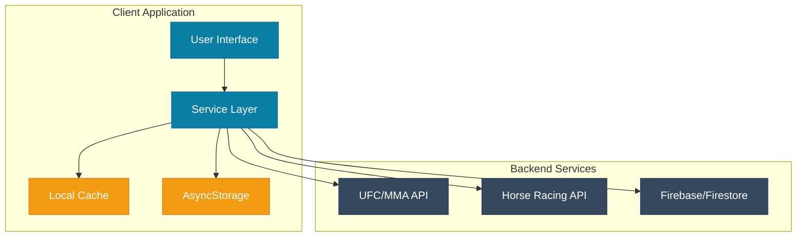
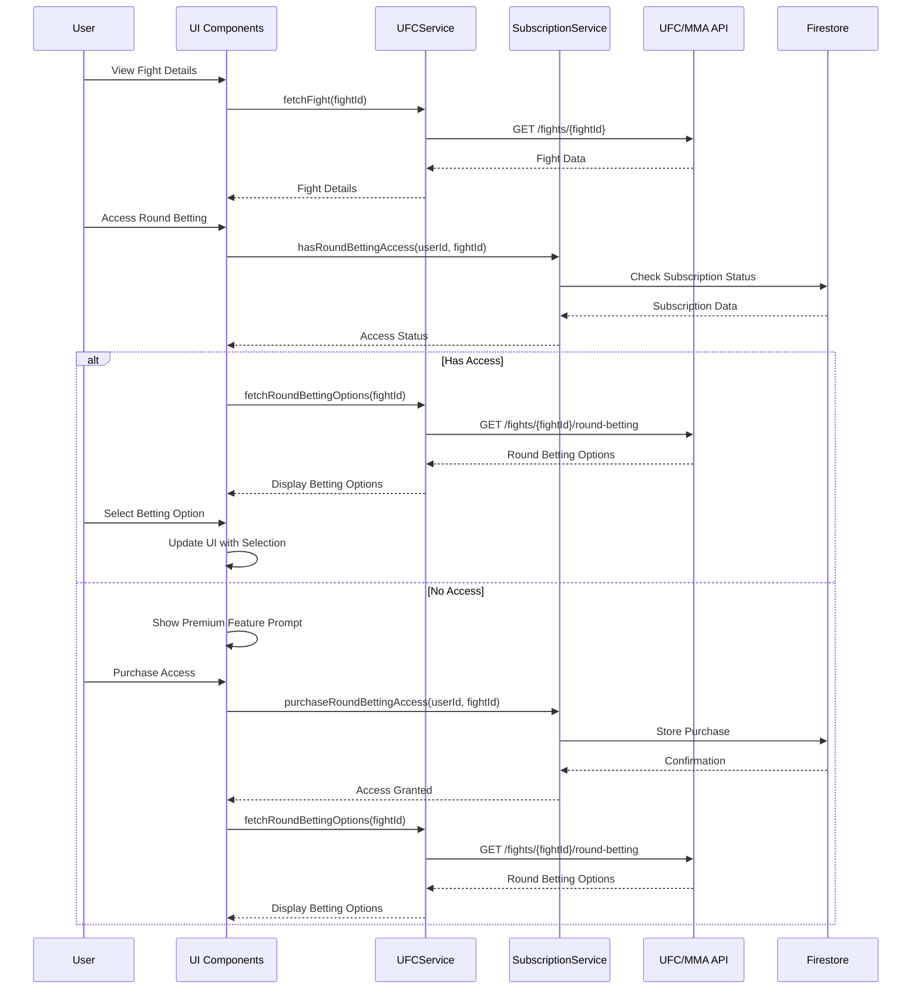
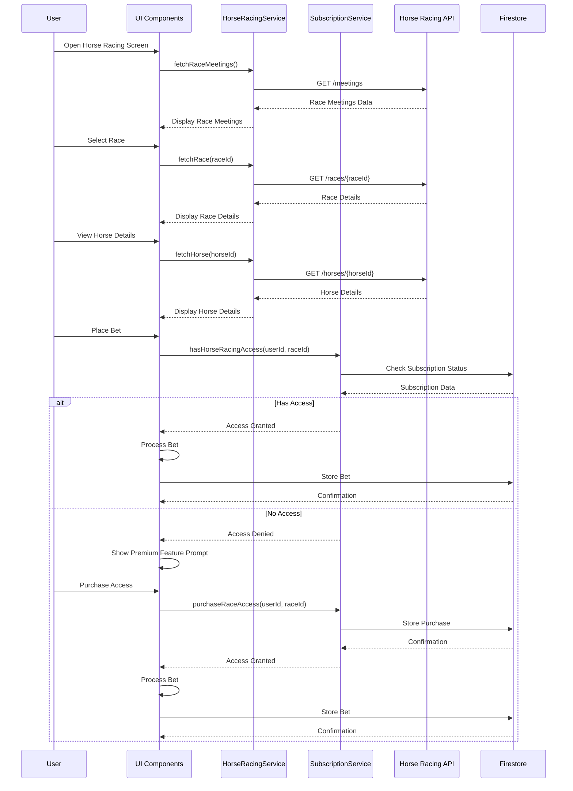
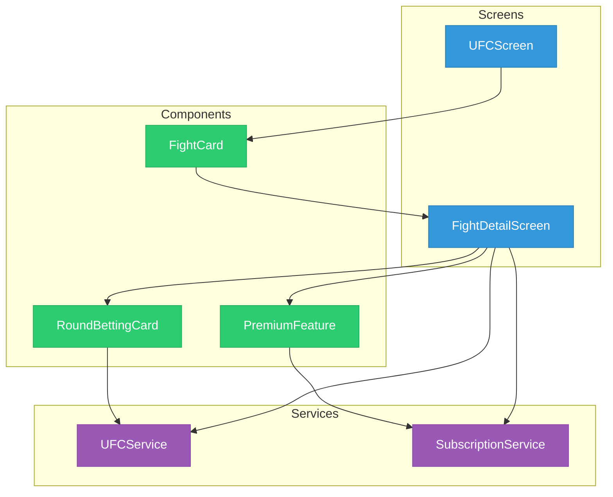
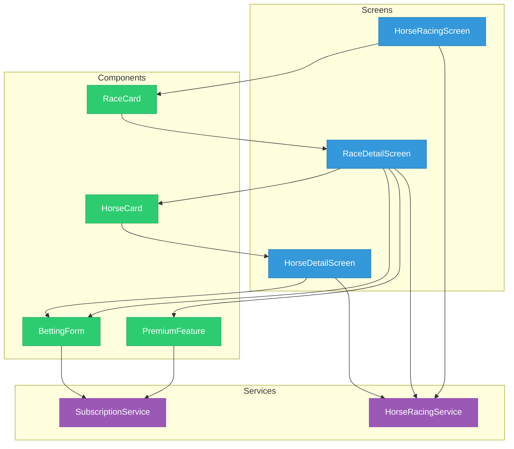
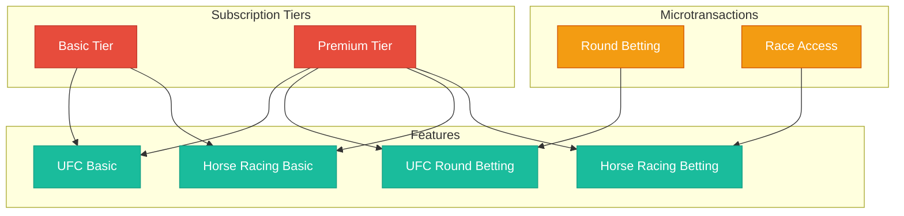
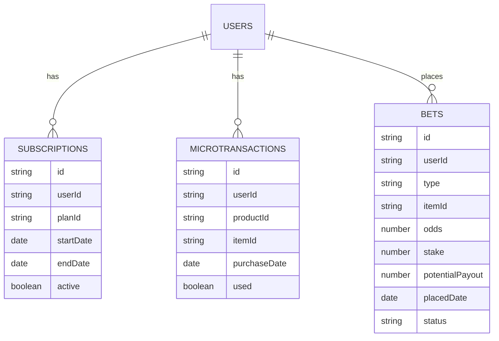
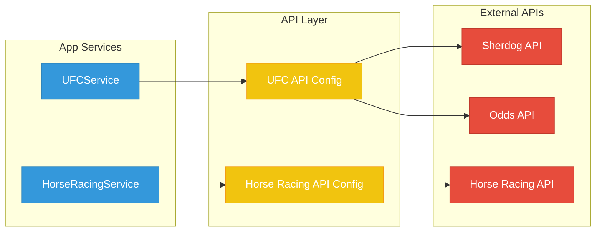

# MMA Round Betting and Horse Racing Architecture

This document provides architectural diagrams for the MMA round betting and horse racing features in the AI Sports Edge app.

## System Architecture

## MMA Round Betting Data Flow

## Horse Racing Data Flow

## Component Architecture

### MMA Round Betting Components

### Horse Racing Components

## Subscription Model

## Database Schema

### Firestore Collections

## API Integration

These architectural diagrams provide a visual representation of the system components, data flow, and relationships for the MMA round betting and horse racing features. They can be used as a reference during implementation to ensure that all components are properly integrated and that the data flows correctly through the system.